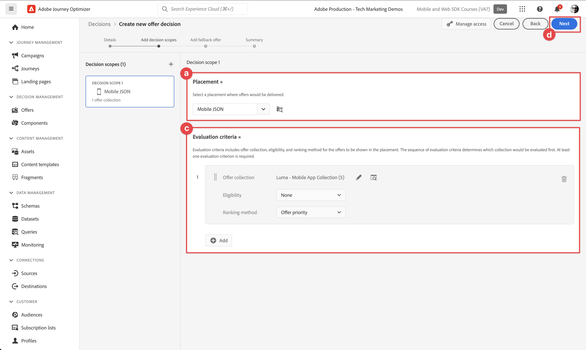

# Adobe Journey Optimizer offers

Learn how to show offers from Adobe Journey Optimizer Decision Management in your mobile apps with Platform Mobile SDK.

Journey Optimizer Decision Management helps you to deliver the best offer and experience to your customers across all touch points  at the right time. Once designed, target your audiences with personalized offers.

Decision management makes personalization easy with a central library of marketing offers and a decision engine that applies rules and constraints to rich, real-time profiles created by Adobe Experience Platform to help you send your customers the right offer at the right time. See [About Decision Management](https://experienceleague.adobe.com/docs/journey-optimizer/using/offer-decisioning/get-started-decision/starting-offer-decisioning.html?lang=en) for more information. 


>[!NOTE]
>
>This lesson is optional and only applies to Adobe Journey Optimizers users looking to use the Decision Management functionality to display offers in a mobile app.


## Prerequisites

* Successfully built and run app with SDKs installed and configured.
* Access to Adobe Journey Optimizer - Decision Management with the proper permissions to manage offers and decisions as described here [here](https://experienceleague.adobe.com/docs/journey-optimizer/using/access-control/privacy/high-low-permissions.html?lang=en#decisions-permissions).


## Learning objectives

In this lesson, you will:

* Update your Edge configuration for Decision Management.
* Update your tag property with the Journey Optimizer - Decisioning extension.
* Update your schema to capture propositon events.
* Validate setup in Assurance.
* Create a simple A/B test in Target.
* Update your app to include the Optimize extension.
* Implement offers from Decision Management in your app.


## Update Edge configuration

You need to update you Experience Edge configuration to ensure data send from your mobile app to the Edge Network is forwarded to Adobe Journey Optimizer - Decision Management.

1. In the Data Collection UI, select **[!UICONTROL Datastreams]**, and select your datastream, for example **[!UICONTROL Luma Mobile App]**.
1. Select  for **[!UICONTROL Experience Platform]** and select  **[!UICONTROL Edit]** from the context menu.
1. In the **[!UICONTROL Datastreams]** >  >  **[!UICONTROL Adobe Experience Platform]** screen, ensure **[!UICONTROL Offer Decisioning]**, **[!UICONTROL Edge Segmentation]**, **[!UICONTROL Personalization Destinations]**, and **[!UICONTROL Adobe Journey Optimizer]** are selected. See [Adobe Experience Platform settings](https://experienceleague.adobe.com/docs/experience-platform/datastreams/configure.html?lang=en#aep) for more information.
1. Select **[!UICONTROL Save]** to save your datastream configuration.

   


## Install Adobe Journey Optimizer - Decisioning tags extension

1. Navigate to **[!UICONTROL Tags]** and find your mobile tag property and open the property.
1. Select **[!UICONTROL Extensions]**.
1. Select **[!UICONTROL Catalog]**.
1. Search for the **[!UICONTROL Adobe Journey Optimizer - Decisioning]** extension.
1. Install the extension. The extension does not require additional configuration.

    


## Update your schema

1. Navigate to Data Collection UI and select **[!UICONTROL Schemas]** from the left rail.
1. Select **[!UICONTROL Browse]** from the top bar.
1. Select your schema to open it.
1. In the schema editor, click on   **[!UICONTROL Add]** next to Field groups.
1. In the **[!UICONTROL Add fields groups]** dialog,  search for `proposition`, select **[!UICONTROL Experience Event - Proposition Interactions]** and select **[!UICONTROL Add field groups]**.
   
1. Select **[!UICONTROL Save]** to save the changes to your schema.


## Validate setup in Assurance

To validate your setup in Assurance:

1. Go to the Assurance UI.
1. Select **[!UICONTROL Configure]** in left rail and select  next to **[!UICONTROL Validate Setup]** underneath **[!UICONTROL ADOBE JOURNEY OPTIMIZER DECISIONING]**.
1. Select **[!UICONTROL Save]**.
1. Select **[!UICONTROL Validate Setup]** in the left rail. Both datastream setup is validated and the SDK setup in your application.
   


## Create offers

1. In the Journey Optimizer UI, select    **[!UICONTROL Offers]** from **[!UICONTROL DECISION MANAGEMENT]** in the left rail.
1. In the **[!UICONTROL Offers]** screen, select **[!UICONTROL Browse]** to see the list of offers.
1. Select **[!UICONTROL Create offer]**.
1. In the **[!UICONTROL New offer]** modal, select **[!UICONTROL Personalized offer]** and click **[!UICONTROL Next]**.
1. In the **[!UICONTROL Details]** step of **[!UICONTROL Create new personalized offer]** screen:
   1. Enter a **[!UICONTROL Name]** for the offer, for example `Luma - Juno Jacket`, and enter a **[!UICONTROL Start date and time]** and an **[!UICONTROL End date and time]**. These dates determine whether the offer is taken into account when requesting a next best offer.
   1. Select **[!UICONTROL Next]**.
      

1. In the **[!UICONTROL Add representations]** step of the **[!UICONTROL Create new personalized offer]** screen:
   1. Select  **[!UICONTROL Mobile]** from **[!UICONTROL Channel]** list, and select **[!UICONTROL Mobile JSON]** from **[!UICONTROL Placement]** list.
   1. Select **[!UICONTROL Custom]** for **[!UICONTROL Content]**.
   1. Select **[!UICONTROL Add content]** button. In the **[!UICONTROL Add personalization]** modal:
      1. Enter the following JSON:
   
            ```json
            { 
                "title": "Juno Jacket",
                "text": "On colder-than-comfortable mornings, you'll love warming up in the Juno All-Ways Performanc Jacket, designed to compete with wind and chill. Built-in Cocona&trade; technology aids evaporation, while a special zip placket and stand-up collar keep your neck protected.", 
                "image": "https://luma.enablementadobe.com/content/dam/luma/en/products/women/tops/jackets/wj06-purple_main.jpg" 
            }  
            ```

      1. Select **[!UICONTROL Save]**.
         
   1. Select **[!UICONTROL Next]**.
       

1. In the **[!UICONTROL Add constraints]** step of the **[!UICONTROL Create new personalized offer]** screen
   1. Set **[!UICONTROL Priority]** to `10`.
   1. Toggle **[!UICONTROL Include capping]** off.
   1. Select **[!UICONTROL Next]**.
      

1. In the **[!UICONTROL Review]** step of **[!UICONTROL Create new personalized]** offer:
   1. Review the offer, then select **[!UICONTROL Finish]**.
   1. In the **[!UICONTROL Save offer]** modal, select **[!UICONTROL Save and approve]**.

1. Repeat step 3 - 8 to create four more offers with different name and content. All other configuration values, like for example Start date and time or Priority is similar to the first offer you created.

    | Offer name | Offer content |
    |---|---|
    | Luma - Affirm Water Bottle | `{ "title": "Affirm Water Bottle", "text": "You'll stay hydrated with ease with the Affirm Water Bottle by your side or in hand. Measurements on the outside help you keep track of how much you're drinking, while the screw-top lid prevents spills. A metal carabiner clip allows you to attach it to the outside of a backpack or bag for easy access.", "image": "https://luma.enablementadobe.com/content/dam/luma/en/products/gear/fitness-equipment/ug06-lb-0.jpg" }` |
    | Luma - Desiree Fitness Tee | `{ "title": "Desiree Fitness Tee", "text": "When you're too far to turn back, thank yourself for choosing the Desiree Fitness Tee. Its ultra-lightweight, ultra-breathable fabric wicks sweat away from your body and helps keeps you cool for the distance.", "image": "https://luma.enablementadobe.com/content/dam/luma/en/products/women/tops/tees/ws05-yellow_main.jpg" }` |
    | Luma - Adrienne Trek Jacket | `{ "title": "Adrienne Trek Jacket", "text": "You're ready for a cross-country jog or a coffee on the patio in the Adrienne Trek Jacket. Its style is unique with stand collar and drawstrings, and it fits like a jacket should.", "image": "https://luma.enablementadobe.com/content/dam/luma/en/products/women/tops/jackets/wj08-gray_main.jpg" }` |
    | Luma - Aero Daily Fitness Tee | `{ "title": "Adrienne Trek Jacket", "text": "You're ready for a cross-country jog or a coffee on the patio in the Adrienne Trek Jacket. Its style is unique with stand collar and drawstrings, and it fits like a jacket should.", "image": "https://luma.enablementadobe.com/content/dam/luma/en/products/women/tops/jackets/wj08-gray_main.jpg" }` |

    {style="table-layout:fixed"}

1. As a final step you need to create a fallback offer, which is an offer that can always be returned back in case the profile does not qualify for any of the personalized offers.
   1. Select Create offer.
   1. In the **[!UICONTROL Details]** step of **[!UICONTROL Create new personalized offer]** screen:
   1. Enter a **[!UICONTROL Name]** for the offer, for example `Luma - Fallback Offer`, and enter a **[!UICONTROL Start date and time]** and an **[!UICONTROL End date and time]**.
   1. Select **[!UICONTROL Next]**.

1. In the **[!UICONTROL Add representations]** step of the **[!UICONTROL Create new personalized offer]** screen:
   1. Select  **[!UICONTROL Mobile]** from **[!UICONTROL Channel]** list, and select **[!UICONTROL Mobile JSON]** from **[!UICONTROL Placement]** list.
   1. Select **[!UICONTROL Custom]** for **[!UICONTROL Content]**.
   1. Select **[!UICONTROL Add content]** button. In the **[!UICONTROL Add personalization]** modal:
      1. Enter the following JSON:
   
            ```json
            {  
                "title": "Luma",
                "text": "Your store for sports wear and equipment.", 
                "image": "https://luma.enablementadobe.com/content/dam/luma/en/logos/Luma_Logo.png" 
            }  
            ```

      1. Select **[!UICONTROL Save]**.
   1. Select **[!UICONTROL Next]**.


1. In the **[!UICONTROL Review]** step of **[!UICONTROL Create new personalized]** offer:
   1. Review the offer, then select **[!UICONTROL Finish]**.
   1. In the **[!UICONTROL Save offer]** modal, select **[!UICONTROL Save and approve]**.

You should now have the following list of offers.


## Create a collection

To present an offer to your mobile app user, you need to define an offer collection, consisting of one or more of the offers you just created.

1. In the Journey Optimizer UI, select Offers from the left rail.
1. Select Collections from the top bar.
1. Select  Create collection.
1. In the New collection modal, enter a Name for your collection, for example Luma - Mobile App Collection, select Create static collection, and click Next.
1. In the Luma - Mobile App Collection screen, select the offers you want to include in the collection. For this tutorial, just pick the five offers you just created.
   
1. Select Save.


## Create a decision

The final step is to define a decision, which is the combination of one or more decision scopes and your fallback offer. 

A decision scope is a combination of a specific placement (for example HTML in an email, or JSON in a mobile app) and one or more evaluation criteria. 

An evaluation criterium is the combination of 

* offer collection,
* eligibility rules: for example is the offer only available for a specific audience,
* ranking method: when multiple offers are available to pick from, which method do we use to rank them (for example by offer priority, using a formula, or an AI model).

See [Key steps to create and manage offers](https://experienceleague.adobe.com/docs/journey-optimizer/using/offer-decisioning/get-started-decision/key-steps.html?lang=en) if you want to better understand how plamenents, rules, rankings, offers, representations, collections, decisions, etc. interact. This tutorial is focused on using the the output of a decision rather than on the flexibility in defining a decision.

1. In the Journey Optimizer UI, select Offers from the left rail.
1. Select Decisions from the top bar.
1. Select  Create decision.
1. In the Details step of the Create a new offer decision:
   1. Enter a Name for the  Luma Mobile App Decision, for example Luma - Mobile App Decision, enter Start date and time and End date and time.
   1. Select Next.

1. In the Add decision scopes step of the Create a new offer decision screen:
   1. Select Mobile JSON from Placement list.
   1. In the Evaluation Criteria tile, select  Add.
      1. In the Add Offer Collection modal, select your offer collection. For example Luma - Mobile App Collection.
      1. Select Add.
          
   1. Ensure None is selected for Eligibility, and Offer priority is selected for Ranking method. 
   1. Select Next.
      . 
1. In the Add a fallback step of the Create a new offer decision screen:
   1. Select your fallback offer, for example Luma - Fallback offer.
   1. Select Next
1. In the Summary step of the Create a new offer decision screen:
   1. Select Finish.
   1. In the Save offer decision modal, select Save and activate.
   1. In the Decisions tab, you will see your Decision with status Live.

Your offer decision, consisting of a set of offers for use in a mobile app, is now ready for use. To use the decision in your app, you have to refer in your code to the decision scope.

1. In the Journey Optimizer UI, select Offers.
1. Select Decisions from the top bar.
1. Select your decision, for example Luma - Mobile App Decision.
1. In the Decision scopes tile, select  Copy.
1. From the contextual menu, select Decision scope.
1. Use any text editor to paste the decision scope, so you can use later. The decision scope has the following JSON format.

    ```json
    {
        "xdm:activityId":"xcore:offer-activity:177cdaa5e1fd589d",
        "xdm:placementId":"xcore:offer-placement:13a3b264ce69bb14"
    }
    ```

