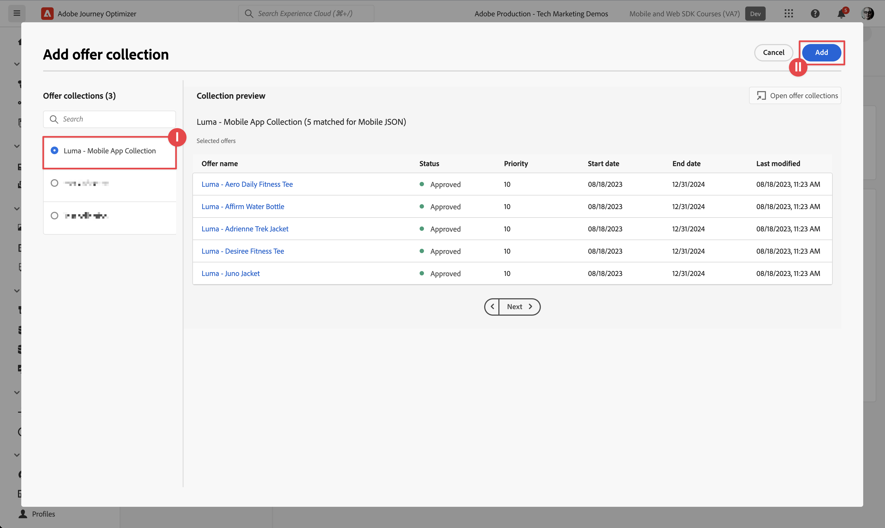
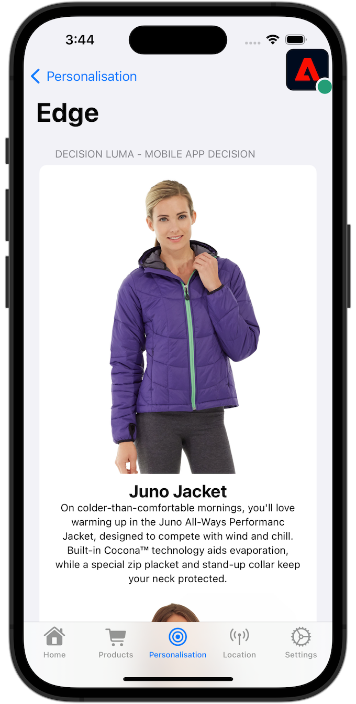

# Journey Optimizer offers

Learn how to show offers from Journey Optimizer Decision Management in your mobile apps with Experience Platform Mobile SDK.

Journey Optimizer Decision Management helps you to deliver the best offer and experience to your customers across all touchpoints  at the right time. Once designed, target your audience with personalized offers.

Decision management makes personalization easy with a central library of marketing offers and a decision engine that applies rules and constraints to rich, real-time profiles created by Adobe Experience Platform. As a result, it enables you to send your customers the right offer at the right time. See [About Decision Management](https://experienceleague.adobe.com/docs/journey-optimizer/using/offer-decisioning/get-started-decision/starting-offer-decisioning.html?lang=en) for more information. 


>[!NOTE]
>
>This lesson is optional and only applies to Journey Optimizer users looking to use the Decision Management functionality to display offers in a mobile app.


## Prerequisites

* Successfully built and run app with SDKs installed and configured.
* Set up the app for Adobe Experience Platform.
* Access to Journey Optimizer - Decision Management with the proper permissions to manage offers and decisions as described [here](https://experienceleague.adobe.com/docs/journey-optimizer/using/access-control/privacy/high-low-permissions.html?lang=en#decisions-permissions).


## Learning objectives

In this lesson, you will

* Update your Edge configuration for Decision Management.
* Update your tag property with the Journey Optimizer - Decisioning extension.
* Update your schema to capture proposition events.
* Validate setup in Assurance.
* Create an offer decision, based on offers in Journey Optimizer - Decision Management.
* Update your app to register the Optimizer extension.
* Implement offers from Decision Management in your app.


## Setup

>[!TIP]
>
>If you have set up your environment already as part of the [Setup A/B tests with Target](target.md) tutorial, you can skip [Install Adobe Journey Optimizer - Decisioning tags extension](#install-adobe-journey-optimizer---decisioning-tags-extension) and [Update your schema](#update-your-schema).

### Update datastream configuration

To ensure data send from your mobile app to the Edge Network is forwarded to Journey Optimizer - Decision Management, update your Experience Edge configuration .

1. In the Data Collection UI, select **[!UICONTROL Datastreams]**, and select your datastream, for example **[!UICONTROL Luma Mobile App]**.
1. Select  for **[!UICONTROL Experience Platform]** and select  **[!UICONTROL Edit]** from the context menu.
1. In the **[!UICONTROL Datastreams]** >  >  **[!UICONTROL Adobe Experience Platform]** screen, ensure **[!UICONTROL Offer Decisioning]**, **[!UICONTROL Edge Segmentation]**, **[!UICONTROL Personalization Destinations]**, and **[!UICONTROL Adobe Journey Optimizer]** are selected. See [Adobe Experience Platform settings](https://experienceleague.adobe.com/docs/experience-platform/datastreams/configure.html?lang=en#aep) for more information.
1. To save your datastream configuration, select **[!UICONTROL Save]** .

   


### Install Journey Optimizer - Decisioning tags extension

1. Navigate to **[!UICONTROL Tags]** and find your mobile tag property and open the property.
1. Select **[!UICONTROL Extensions]**.
1. Select **[!UICONTROL Catalog]**.
1. Search for the **[!UICONTROL Adobe Journey Optimizer - Decisioning]** extension.
1. Install the extension. The extension does not require additional configuration.

    


### Update your schema

1. Navigate to Data Collection interface and select **[!UICONTROL Schemas]** from the left rail.
1. Select **[!UICONTROL Browse]** from the top bar.
1. Select your schema to open it.
1. In the schema editor, select  **[!UICONTROL Add]** next to Field groups.
1. In the **[!UICONTROL Add fields groups]** dialog,  search for `proposition`, select **[!UICONTROL Experience Event - Proposition Interactions]** and select **[!UICONTROL Add field groups]**. This field group collects the experience event data relevant to offers: what offer is presented, as part of which collection, decision, and other parameters (see later in this lesson). But also what is happening with the offer: is it displayed, interacted with, dismissed, and so forth.
   
1. Select **[!UICONTROL Save]** to save the changes to your schema.


## Validate setup in Assurance

To validate your setup in Assurance:

1. Go to the Assurance UI.
1. Select **[!UICONTROL Configure]** in left rail and select  next to **[!UICONTROL Validate Setup]** underneath **[!UICONTROL ADOBE JOURNEY OPTIMIZER DECISIONING]**.
1. Select **[!UICONTROL Save]**.
1. Select **[!UICONTROL Validate Setup]** in the left rail. Both datastream setup and the SDK setup in your application are validated.
   


## Create offers

1. In the Journey Optimizer UI, select   **[!UICONTROL Offers]** from **[!UICONTROL DECISION MANAGEMENT]** in the left rail.
1. In the **[!UICONTROL Offers]** screen, select **[!UICONTROL Browse]** to see the list of offers.
1. Select **[!UICONTROL Create offer]**.
1. In the **[!UICONTROL New offer]** dialog, select **[!UICONTROL Personalized offer]** and click **[!UICONTROL Next]**.
1. In the **[!UICONTROL Details]** step of **[!UICONTROL Create new personalized offer]**:
   1. Enter a **[!UICONTROL Name]** for the offer, for example `Luma - Juno Jacket`, and enter a **[!UICONTROL Start date and time]** and an **[!UICONTROL End date and time]**. Outside of these dates, the offer won't be selected by the Decisioning engine.
   1. Select **[!UICONTROL Next]**.
      

1. In the **[!UICONTROL Add representations]** step of **[!UICONTROL Create new personalized offer]**:
   1. Select  **[!UICONTROL Mobile]** from **[!UICONTROL Channel]** list, and select **[!UICONTROL Mobile JSON]** from the **[!UICONTROL Placement]** list.
   1. Select **[!UICONTROL Custom]** for **[!UICONTROL Content]**.
   1. Select **[!UICONTROL Add content]**. In the **[!UICONTROL Add personalization]** dialog:
      1. Enter the following JSON:
   
            ```json
            { 
                "title": "Juno Jacket",
                "text": "On colder-than-comfortable mornings, you'll love warming up in the Juno All-Ways Performanc Jacket, designed to compete with wind and chill. Built-in Cocona&trade; technology aids evaporation, while a special zip placket and stand-up collar keep your neck protected.", 
                "image": "https://luma.enablementadobe.com/content/dam/luma/en/products/women/tops/jackets/wj06-purple_main.jpg" 
            }  
            ```

      1. Select **[!UICONTROL Save]**.
         
   1. Select **[!UICONTROL Next]**.
       

1. In the **[!UICONTROL Add constraints]** step of the **[!UICONTROL Create new personalized offer]**:
   1. Set **[!UICONTROL Priority]** to `10`.
   1. Toggle **[!UICONTROL Include capping]** off.
   1. Select **[!UICONTROL Next]**.
      

1. In the **[!UICONTROL Review]** step of **[!UICONTROL Create new personalized]** offer:
   1. Review the offer, then select **[!UICONTROL Finish]**.
   1. In the **[!UICONTROL Save offer]** dialog, select **[!UICONTROL Save and approve]**.

1. Repeat steps 3 - 8 to create four more offers with different names and content. All other configuration values, for example Start date and time or Priority, are similar to the first offer you created. You can quickly create duplicate and edit offers.

   1. In Journey Optimizer UI, select  **[!UICONTROL Offers]** from the left rail, then select Offers from the top bar.
   1. Select the row of the offer that you created.
   1. In the right pane, select  **[!UICONTROL More actions]** and from the context menu select  **[!UICONTROL Duplicate]**.

      Use the table below to define the four other offers.

       | Offer name | Offer content in JSON |
       |---|---|
       | Luma - Affirm Water Bottle | `{ "title": "Affirm Water Bottle", "text": "You'll stay hydrated with ease with the Affirm Water Bottle by your side or in hand. Measurements on the outside help you keep track of how much you're drinking, while the screw-top lid prevents spills. A metal carabiner clip allows you to attach it to the outside of a backpack or bag for easy access.", "image": "https://luma.enablementadobe.com/content/dam/luma/en/products/gear/fitness-equipment/ug06-lb-0.jpg" }` |
       | Luma - Desiree Fitness Tee | `{ "title": "Desiree Fitness Tee", "text": "When you're too far to turn back, thank yourself for choosing the Desiree Fitness Tee. Its ultra-lightweight, ultra-breathable fabric wicks sweat away from your body and helps keeps you cool for the distance.", "image": "https://luma.enablementadobe.com/content/dam/luma/en/products/women/tops/tees/ws05-yellow_main.jpg" }` |
       | Luma - Adrienne Trek Jacket | `{ "title": "Adrienne Trek Jacket", "text": "You're ready for a cross-country jog or a coffee on the patio in the Adrienne Trek Jacket. Its style is unique with stand collar and drawstrings, and it fits like a jacket should.", "image": "https://luma.enablementadobe.com/content/dam/luma/en/products/women/tops/jackets/wj08-gray_main.jpg" }` |
       | Luma - Aero Daily Fitness Tee | `{ "title": "Adrienne Trek Jacket", "text": "You're ready for a cross-country jog or a coffee on the patio in the Adrienne Trek Jacket. Its style is unique with stand collar and drawstrings, and it fits like a jacket should.", "image": "https://luma.enablementadobe.com/content/dam/luma/en/products/women/tops/jackets/wj08-gray_main.jpg" }` |

       {style="table-layout:fixed"}

1. As a final step you must create a fallback offer, which is an offer sent to customers if they are not eligible for other offers.
   1. Select **[!UICONTROL Create offer]**.
   1. In the **[!UICONTROL Details]** step of **[!UICONTROL Create new personalized offer]**:
   1. Enter a **[!UICONTROL Name]** for the offer, for example `Luma - Fallback Offer`, and enter a **[!UICONTROL Start date and time]** and an **[!UICONTROL End date and time]**.
   1. Select **[!UICONTROL Next]**.

1. In the **[!UICONTROL Add representations]** step of the **[!UICONTROL Create new personalized offer]** screen:
   1. Select  **[!UICONTROL Mobile]** from **[!UICONTROL Channel]** list, and select **[!UICONTROL Mobile JSON]** from **[!UICONTROL Placement]** list.
   1. Select **[!UICONTROL Custom]** for **[!UICONTROL Content]**.
   1. Select **[!UICONTROL Add content]**. In the **[!UICONTROL Add personalization]** dialog:
      1. Enter the following JSON:
   
            ```json
            {  
                "title": "Luma",
                "text": "Your store for sports wear and equipment.", 
                "image": "https://luma.enablementadobe.com/content/dam/luma/en/logos/Luma_Logo.png" 
            }  
            ```

      1. Select **[!UICONTROL Save]**.
   1. Select **[!UICONTROL Next]**.


1. In the **[!UICONTROL Review]** step of **[!UICONTROL Create new personalized]** offer:
   1. Review the offer, then select **[!UICONTROL Finish]**.
   1. In the **[!UICONTROL Save offer]** dialog, select **[!UICONTROL Save and approve]**.

You should now have the following list of offers.


## Create a collection

To present an offer to your mobile app user, you must define an offer collection, consisting of one or more of the offers you created.

1. In the Journey Optimizer UI, select **[!UICONTROL Offers]** from the left rail.
1. Select **[!UICONTROL Collections]** from the top bar.
1. Select  **[!UICONTROL Create collection]**.
1. In the **[!UICONTROL New collection]** dialog, enter a **[!UICONTROL Name]** for your collection, for example `Luma - Mobile App Collection`, select **[!UICONTROL Create static collection]**, and click **[!UICONTROL Next]**.
1. In **[!UICONTROL Luma - Mobile App Collection]**, select the offers you want to include in the collection. For this tutorial, pick the five offers you created. You can easily filter the list using the search field, for example by typing **[!UICONTROL Luma]**.
1. Select **[!UICONTROL Save]**.

    


## Create a decision

The final step is to define a decision, which is the combination of one or more decision scopes and your fallback offer. 

A decision scope is a combination of a specific placement (for example HTML in an email, or JSON in a mobile app) and one or more evaluation criteria. 

An evaluation criterium is the combination of 

* an offer collection,
* eligibility rules: for example, is the offer only available for a specific audience,
* a ranking method: when multiple offers are available to pick from, which method do you use to rank them (for example by offer priority, using a formula, or an AI model).

See [Key steps to create and manage offers](https://experienceleague.adobe.com/docs/journey-optimizer/using/offer-decisioning/get-started-decision/key-steps.html?lang=en) if you want to better understand how placements, rules, rankings, offers, representations, collections, decisions, and so on, interact and relate to each other. This lesson is solely focused on using the output of a decision rather than on the flexibility in defining decisions within Journey Optimizer - Decision Management.

1. In the Journey Optimizer UI, select **[!UICONTROL Offers]** from the left rail.
1. Select **[!UICONTROL Decisions]** from the top bar.
1. Select  **[!UICONTROL Create decision]**.
1. In the **[!UICONTROL Details]** step of **[!UICONTROL Create a new offer decision]**:
   1. Enter a **[!UICONTROL Name]** for the decision, for example `Luma - Mobile App Decision`, enter **[!UICONTROL Start date and time]** and **[!UICONTROL End date and time]**.
   1. Select **[!UICONTROL Next]**.

1. In the **[!UICONTROL Add decision scopes]** step of **[!UICONTROL Create a new offer decision]**:
   1. Select **[!UICONTROL  Mobile JSON]** from **[!UICONTROL Placement]** list.
   1. In the **[!UICONTROL Evaluation Criteria]** tile, select  **[!UICONTROL Add]**.
      1. In the **[!UICONTROL Add Offer Collection]** dialog, select your offer collection. For example, **[!UICONTROL Luma - Mobile App Collection]**.
      1. Select **[!UICONTROL Add]**.
          
   1. Ensure that **[!UICONTROL None]** is selected for **[!UICONTROL Eligibility]**, and **[!UICONTROL Offer priority]** is selected as the **[!UICONTROL Ranking method]**. 
   1. Select **[!UICONTROL Next]**.
      . 
1. In the **[!UICONTROL Add fallback offer]** step of **[!UICONTROL Create a new offer decision]**:
   1. Select your fallback offer, for example the **[!UICONTROL Luma - Fallback offer]**.
   1. Select **[!UICONTROL Next]**.
1. In the **[!UICONTROL Summary]** step of **[!UICONTROL Create a new offer decision]**:
   1. Select **[!UICONTROL Finish]**.
   1. In the **[!UICONTROL Save offer decision]** dialog, select **[!UICONTROL Save and activate]**.
   1. In the **[!UICONTROL Decisions]** tab, you see your decision with status **[!UICONTROL Live]**.

Your offer decision, consisting of a set of offers, is now ready for use. To use the decision in your app, you have to refer in your code to the decision scope.

1. In the Journey Optimizer UI, select **[!UICONTROL Offers]**.
1. Select **[!UICONTROL Decisions]** from the top bar.
1. Select your decision, for example **[!UICONTROL Luma - Mobile App Decision]**.
1. In the **[!UICONTROL Decision scopes]** tile, select  **[!UICONTROL Copy]**.
1. From the contextual menu, select **[!UICONTROL Decision scope]**.
    
1. Use any text editor to paste the decision scope for later use. The decision scope has the following JSON format.

    ```json
    {
        "xdm:activityId":"xcore:offer-activity:xxxxxxxxxxxxxxx",
        "xdm:placementId":"xcore:offer-placement:xxxxxxxxxxxxxxx"
    }
    ```

## Implement offers in your app

As discussed in previous lessons, installing a mobile tag extension only provides the configuration. Next you must install and register the Optimize SDK. If these steps aren't clear, review the [Install SDKs](install-sdks.md) section.

>[!NOTE]
>
>If you completed the [Install SDKs](install-sdks.md) section, then the SDK is already installed and you can skip this step.
>

1. In Xcode, ensure that [AEP Optimize](https://github.com/adobe/aepsdk-messaging-ios.git) is added to the list of packages in Package Dependencies. See [Swift Package Manager](install-sdks.md#swift-package-manager).
1. Navigate to **[!UICONTROL Luma]** > **[!UICONTROL Luma]** > **[!UICONTROL AppDelegate]** in the Xcode Project navigator.
1. Ensure `AEPOptimize` is part of your list of imports.

    `import AEPOptimize`

1. Ensure `Optimize.self` is part of the array of extensions that you are registering.

    ```swift
    let extensions = [
        AEPIdentity.Identity.self,
        Lifecycle.self,
        Signal.self,
        Edge.self,
        AEPEdgeIdentity.Identity.self,
        Consent.self,
        UserProfile.self,
        Places.self,
        Messaging.self,
        Optimize.self,
        Assurance.self
    ]
    ```

1. Navigate to **[!UICONTROL Luma]** > **[!UICONTROL Luma]** > **[!UICONTROL Utils]** > **[!UICONTROL MobileSDK]** in the Xcode Project navigator. Find the `func updatePropositionOD(ecid: String, activityId: String, placementId: String, itemCount: Int) async` function. Add the following code:

   ```swift
   // set up the XDM dictionary, define decision scope and call update proposition API
   Task {  
      let ecid = ["ECID" : ["id" : ecid, "primary" : true] as [String : Any]]
      let identityMap = ["identityMap" : ecid]
      let xdmData = ["xdm" : identityMap]
      let decisionScope = DecisionScope(activityId: activityId, placementId: placementId, itemCount: UInt(itemCount))
      Optimize.clearCachedPropositions()
      Optimize.updatePropositions(for: [decisionScope], withXdm: xdmData)
   }
   ```

   This function:
   
   * sets up an XDM dictionary `xdmData`, containing the ECID to identify the profile for which you have to present the offers. 
   * defines `decisionScope`, an object that is based on the decision you have defined in the Journey Optimizer - Decision Management interface and is defined using the copied decision scope from [Create a decision](#create-a-decision).  The Luma app uses a configuration file (`decisions.json`) that retrieves the scope parameters, based on the following JSON format:

       ```swift
       "scopes": [
           {
               "name": "name of the scope",
               "activityId": "xcore:offer-activity:xxxxxxxxxxxxxxx",
               "placementId": "xcore:offer-placement:xxxxxxxxxxxxxxx",
               "itemCount": 2
           }
       ]
       ```

      However, you can use any kind of implementation to ensure the Optimize APIs do get the proper parameters (`activityId`, `placementId` and, `itemCount`), to construct a valid [`DecisionScope`](https://developer.adobe.com/client-sdks/documentation/adobe-journey-optimizer-decisioning/api-reference/#decisionscope) object for your implementation.
   * calls two APIs: [`Optimize.clearCachePropositions`](https://support.apple.com/en-ie/guide/mac-help/mchlp1015/mac)  and [`Optimize.updatePropositions`](https://developer.adobe.com/client-sdks/documentation/adobe-journey-optimizer-decisioning/api-reference/#updatepropositions).  These functions clear any cached propositions and update the propositions for this profile.

1. Navigate to **[!UICONTROL Luma]** > **[!UICONTROL Luma]** > **[!UICONTROL Views]** > **[!UICONTROL Personalization]** > **[!UICONTROL EdgeOffersView]** in the Xcode Project navigator. Find the `func onPropositionsUpdateOD(activityId: String, placementId: String, itemCount: Int) async` function and inspect the code of this function. The most important part of this function is the [`Optimize.onPropositionsUpdate`](https://developer.adobe.com/client-sdks/documentation/adobe-journey-optimizer-decisioning/api-reference/#onpropositionsupdate) API call, which 
   
    * retrieves the propositions for the current profile based on the decision scope (which you have defined in Journey Optimizer - Decision Management), 
    * retrieves the offer from the proposition,
    * unwraps the content of the offer so it can be displayed properly in the app, and
    * triggers the `displayed()` action on the offer which will send an event back to the Edge Network informing the offer is displayed. 

1. Still in **[!UICONTROL EdgeOffersView]**, add the following code to the `.onFirstAppear` modifier. This code will ensure the callback for updating the offers is registered only once.

    ```swift
    // Invoke callback for offer updates
    Task {
        await self.onPropositionsUpdateOD(activityId: decision.activityId, placementId: decision.placementId, itemCount: decision.itemCount)
    }
    ```

1. Still in **[!UICONTROL EdgeOffersView]**, add the following code to the `.task` modifier. This code will update the offers when the view is refreshed.

    ```swift
    // Clear and update offers
    await self.updatePropositionsOD(ecid: currentEcid, activityId: decision.activityId, placementId: decision.placementId, itemCount: decision.itemCount)
    ```


## Validate using the app

1. Open your app on a device or in the simulator.

1. Go to the **[!UICONTROL Personalisation]** tab.

1. Select **[!UICONTROL Edge Personalisation]**.

1. Scroll to the top, and you see two random offers displayed  from the collection that you have defined in the **[!UICONTROL DECISION LUMA - MOBILE APP DECISION]** tile.

    

   The offers are random, as you have given all offers the same priority and the ranking for the decision is based on priority.


## Validate implementation in Assurance

To validate the offers implementation in Assurance:

1. Go to the Assurance UI.
1. Select **[!UICONTROL Configure]** in left rail and select  next to **[!UICONTROL Review & Simulate]** underneath **[!UICONTROL ADOBE JOURNEY OPTIMIZER DECISIONING]**.
1. Select **[!UICONTROL Save]**.
1. Select **[!UICONTROL Review & Simulate]** in the left rail. Both datastream setup is validated and the SDK setup in your application.
1. Select **[!UICONTROL Requests]** at the top bar. You see your **[!UICONTROL Offers]** requests.
   

1. You can explore **[!UICONTROL Simulate]** and **[!UICONTROL Event List]** tabs for further functionality, checking your setup of Journey Optimizer Decision Management.

## Next steps

You should now have all the tools to start adding more functionality to your Journey Optimizer - Decision Management implementation. For example:

* apply different parameters to your offers (for example, priority, capping)
* collect profile attributes in the app (see [Profile](profile.md)) and use these profile attributes to build audiences. Then use these audiences as part of the eligibility rules in your decision.
* combine more than one decision scopes.

>[!SUCCESS]
>
>You have enabled the app to display offers using the Journey Optimizer - Decisioning extension for the Experience Platform Mobile SDK.<br/>Thank you for investing your time in learning about Adobe Experience Platform Mobile SDK. If you have questions, want to share general feedback, or have suggestions on future content, share them on this [Experience League Community discussion post](https://experienceleaguecommunities.adobe.com/t5/adobe-experience-platform-launch/tutorial-discussion-implement-adobe-experience-cloud-in-mobile/td-p/443796).

Next: **[Perform A/B Tests with Target](target.md)**
