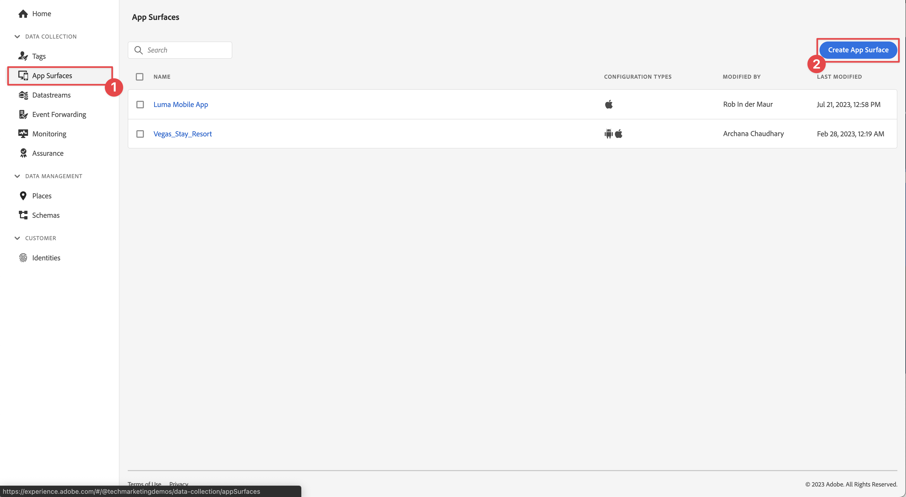
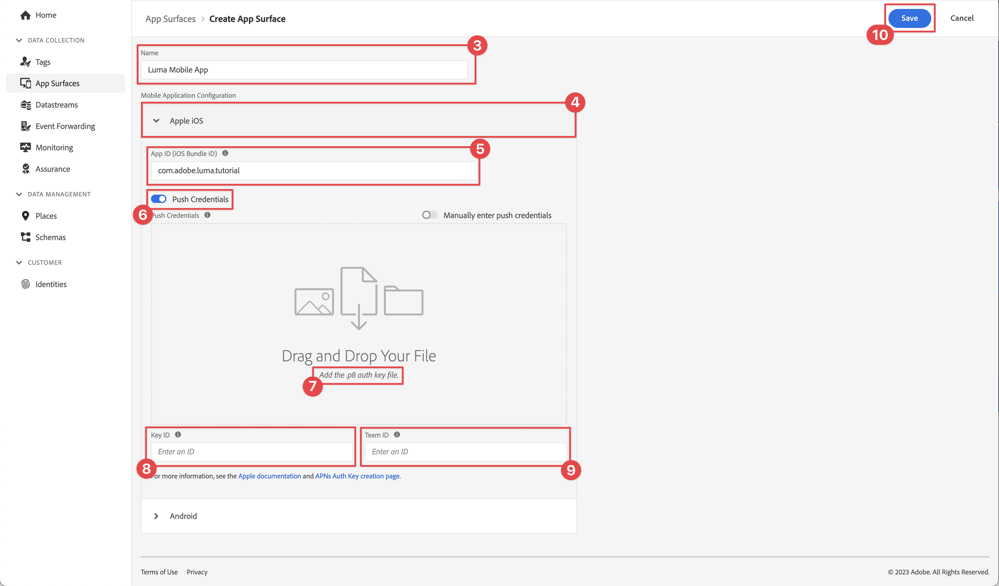

# Adobe Journey Optimizer push messaging

Learn how to create push messages for mobile apps with Platform Mobile SDK and Adobe Journey Optimizer.

Journey Optimizer allows you to create your journeys and send messages to targeted audiences. Before you send push notifications with Journey Optimizer, you must ensure that the proper configurations and integrations are in place. To understand the Push Notifications data flow in Adobe Journey Optimizer, refer to [the documentation](https://experienceleague.adobe.com/docs/journey-optimizer/using/configuration/configuration-message/push-config/push-gs.html).

>[!NOTE]
>
>This lesson is optional and only applies to Adobe Journey Optimizer users looking to send push messages. 


## Prerequisites

* Successfully built and run app with SDKs installed and configured.
* Access to Adobe Journey Optimizer and sufficient permissions as described [here](https://experienceleague.adobe.com/docs/journey-optimizer/using/configuration/configuration-message/push-config/push-configuration.html?lang=en). Also you need sufficient permissions to the following Adobe Journey Optimizer features.
  * Create an app surface. 
  * Create a journey
  * Create a message.
  * Create message presets.
* Paid Apple developer account with sufficient access to create certificates, identifiers, and keys.
* Physical iOS device for testing.

## Learning objectives

In this lesson, you will:

* Register App ID with Apple Push Notification service (APN).
* Create an **[!UICONTROL App Surface]** in AJO.
* Update your **[!UICONTROL schema]** to include push messaging fields.
* Install & configure the **[!UICONTROL Adobe Journey Optimizer]** tag extension.
* Update your app to include the AJO tag extension.
* Validate setup in Assurance.
* Send a test message.


## Register App ID with APN

The following steps are not Adobe Experience Cloud-specific and are designed to guide you through APN configuration.

### Create a private key

1. In the Apple developer portal, navigate to **[!UICONTROL Keys]**.
1. To create a key, select **[!UICONTROL +]**.
   

1. Provide a **[!UICONTROL Key Name]**.
1. Select the **[!UICONTROL APN]** checkbox.
1. Select **[!UICONTROL Continue]**.
   
1. Review configuration and select **[!UICONTROL Register]**.
1. Download the `.p8` private key. It is used in the App Surface configuration.
1. Make note of the [!UICONTROL Key ID]. It is used in the App Surface configuration.
1. Make note of the [!UICONTROL Team ID]. It is used in the App Surface configuration.
   

Additional documentation can be [found here](https://help.apple.com/developer-account/#/devcdfbb56a3).

## Add your app push credentials in Data Collection

1. From the [Data Collection interface](https://experience.adobe.com/data-collection/), select **[!UICONTROL  App Surfaces]** in the left-hand panel.
1. To create a configuration, select **[!UICONTROL Create App Surfaces]**.

1. Enter a **[!UICONTROL Name]** for the configuration, for example `Luma App Tutorial`  .
1. From Mobile Application Configuration, select **[!UICONTROL Apple iOS]**.
1. Enter the mobile app Bundle Id in the App ID (iOS Bundle ID) field. If you are following along with the Luma app that value is `com.adobe.luma.tutorial.swiftui`. 
1. Switch on the **[!UICONTROL Push Credentials]** button to add your credentials.
1. Drag and drop your `.p8` **Apple Push Notification Authentication Key** file.
1. Provide the **[!UICONTROL Key ID]**, a 10-character string assigned during the creation of `p8` auth key. It can be found under **[!UICONTROL Keys]** tab in **Certificates, Identifiers and Profiles** page of the Apple Developer portal pages.
1. Provide the **[!UICONTROL Team ID]**. The Team ID is a value which can be found under the **Membership** tab or at the top of the Apple Developer portal pages.
1. Select **[!UICONTROL Save]**.

   

## Install Adobe Journey Optimizer tags extension

1. Navigate to **[!UICONTROL Tags]** > **[!UICONTROL Extensions]** > **[!UICONTROL Catalog]**, 
1. Open your property, for example **[!UICONTROL Luma Mobile App Tutorial]**.
1. Select **[!UICONTROL Catalog]**.
1. Search for the **[!UICONTROL Adobe Journey Optimizer]** extension.
1. Install the extension.
1. In the **[!UICONTROL Install Extension]** dialog
   1. Select an environment, for example **[!UICONTROL Development]**.
   1. Select the **[!UICONTROL AJO Push Tracking Experience Event Dataset]** dataset from the **[!UICONTROL Event Dataset]** dropdown list.
      
   1. Select **[!UICONTROL Save to Library and Build]**.

>[!NOTE]
>
>If you don't see `AJO Push Tracking Experience Event Dataset` as an option, contact customer care.
>

## Implement the Adobe Journey Optimizer in the app

As discussed in previous lessons, installing a mobile tag extension only provides the configuration. Next you must install and register the messaging SDK. If these steps aren't clear, review the [Install SDKs](install-sdks.md) section.

>[!NOTE]
>
>If you completed the [Install SDKs](install-sdks.md) section, then the SDK is already installed and you can skip to step #7.
>

1. In Xcode, ensure that [AEP Messaging](https://github.com/adobe/aepsdk-messaging-ios.git) is added to the list of packages in Package Dependencies. See [Swift Package Manager](install-sdks.md#swift-package-manager).
1. Navigate to **[!UICONTROL Luma]** > **[!UICONTROL Luma]** > **[!UICONTROL AppDelegate]**.
1. Ensure `AEPMessaging` is part of your list of imports.

    `import AEPMessaging`

1. Ensure `Messaging.self` is part of the array of extensions that you are registering.

    ```swift
    let extensions = [
        AEPIdentity.Identity.self,
        Lifecycle.self,
        Signal.self,
        Edge.self,
        AEPEdgeIdentity.Identity.self,
        Consent.self,
        UserProfile.self,
        Places.self,
        Messaging.self,
        Optimize.self,
        Assurance.self
    ]
    ```

1. Add the `MobileCore.setPushIdentifier` to the `func application(_ application: UIApplication, didRegisterForRemoteNotificationsWithDeviceToken deviceToken: Data)` function.

    ```swift      
    // Send push token to Experience Platform
    MobileCore.setPushIdentifier(deviceToken)
    ```

    This function retrieves the device token unique to the device that the app is installed on and then sets the token for push notification delivery using the configuration you have set up and which relies on Apple's Push Notification Service (APNS).

## Validate

1. Review the [setup instructions](assurance.md) section.
1. Install the app on your physical device or on the simulator.
1. Launch the app using the Assurance generated URL.
1. In the Assurance UI, select **[!UICONTROL Configure]**.
    
1. Select the  button next to **[!UICONTROL Push Debug]**.
1. Select **[!UICONTROL Save]**.
    
1. Select **[!UICONTROL Push Debug]** from the left navigation.
1. Select the **[!UICONTROL Validate Setup]** tab.
1. Select your device from the **[!UICONTROL Client]** list.
1. Confirm that you aren't getting any errors.
    
1. Select the **[!UICONTROL Send Test Push]** tab.
1. (optional) Change the default details for **[!UICONTROL Title]** and **[!UICONTROL Body]**
1. Select  **[!UICONTROL Send Test Push Notification]**.
1. Check the **[!UICONTROL Test Results]**.
1. You should see the push notification in your app.
   
    
   

>[!SUCCESS]
>
>You have now enabled the app for push notification using the Adobe Journey Optimizer extension for the Adobe Experience Platform Mobile SDK.<br/>Thank you for investing your time in learning about Adobe Experience Platform Mobile SDK. If you have questions, want to share general feedback, or have suggestions on future content, share them on this [Experience League Community discussion post](https://experienceleaguecommunities.adobe.com/t5/adobe-experience-platform-launch/tutorial-discussion-implement-adobe-experience-cloud-in-mobile/td-p/443796).

Next: **[Conclusion and next steps](conclusion.md)**
