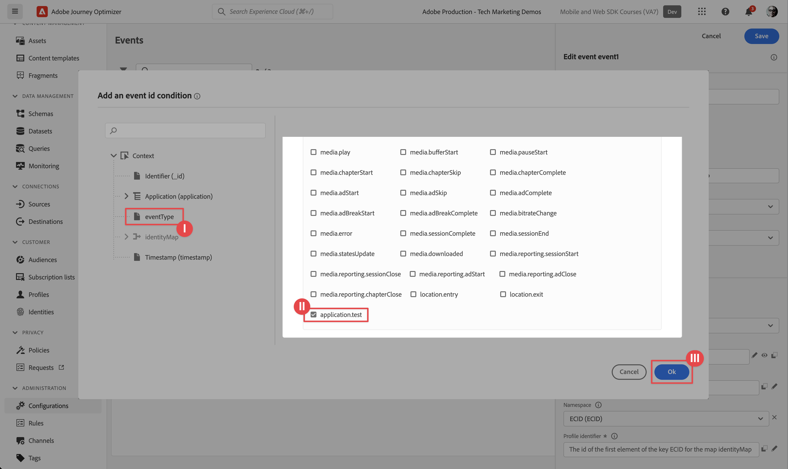

# Adobe Journey Optimizer push messaging

Learn how to create push messages for mobile apps with Platform Mobile SDK and Adobe Journey Optimizer.

Journey Optimizer allows you to create your journeys and send messages to targeted audiences. Before you send push notifications with Journey Optimizer, you must ensure that the proper configurations and integrations are in place. To understand the Push Notifications data flow in Adobe Journey Optimizer, refer to [the documentation](https://experienceleague.adobe.com/docs/journey-optimizer/using/configuration/configuration-message/push-config/push-gs.html).

>[!NOTE]
>
>This lesson is optional and only applies to Adobe Journey Optimizer users looking to send push messages. 


## Prerequisites

* Successfully built and run app with SDKs installed and configured.
* Access to Adobe Journey Optimizer and sufficient permissions as described [here](https://experienceleague.adobe.com/docs/journey-optimizer/using/configuration/configuration-message/push-config/push-configuration.html?lang=en). Also you need sufficient permissions to the following Adobe Journey Optimizer features.
  * Create an app surface. 
  * Create a journey
  * Create a message.
  * Create message presets.
* Paid Apple developer account with sufficient access to create certificates, identifiers, and keys.
* Physical iOS device or simulator for testing.

## Learning objectives

In this lesson, you will:

* Register App ID with Apple Push Notification service (APN).
* Create an **[!UICONTROL App Surface]** in AJO.
* Update your **[!UICONTROL schema]** to include push messaging fields.
* Install & configure the **[!UICONTROL Adobe Journey Optimizer]** tag extension.
* Update your app to include the AJO tag extension.
* Validate setup in Assurance.
* Send a test message.
* Define your own push notification event, journey, and experience in Journey Optimizer.
* Send your own push notification from within the app.


## Register App ID with APN

The following steps are not Adobe Experience Cloud-specific and are designed to guide you through APN configuration.

### Create a private key

1. In the Apple developer portal, navigate to **[!UICONTROL Keys]**.
1. To create a key, select **[!UICONTROL +]**.
   

1. Provide a **[!UICONTROL Key Name]**.
1. Select the **[!UICONTROL APN]** checkbox.
1. Select **[!UICONTROL Continue]**.
   
1. Review configuration and select **[!UICONTROL Register]**.
1. Download the `.p8` private key. It is used in the App Surface configuration.
1. Make note of the [!UICONTROL Key ID]. It is used in the App Surface configuration.
1. Make note of the [!UICONTROL Team ID]. It is used in the App Surface configuration.
   

Additional documentation can be [found here](https://help.apple.com/developer-account/#/devcdfbb56a3).

## Add your app push credentials in Data Collection

1. From the [Data Collection interface](https://experience.adobe.com/data-collection/), select **[!UICONTROL  App Surfaces]** in the left-hand panel.
1. To create a configuration, select **[!UICONTROL Create App Surfaces]**.

1. Enter a **[!UICONTROL Name]** for the configuration, for example `Luma App Tutorial`  .
1. From Mobile Application Configuration, select **[!UICONTROL Apple iOS]**.
1. Enter the mobile app Bundle Id in the App ID (iOS Bundle ID) field. If you are following along with the Luma app that value is `com.adobe.luma.tutorial.swiftui`. 
1. Switch on the **[!UICONTROL Push Credentials]** button to add your credentials.
1. Drag and drop your `.p8` **Apple Push Notification Authentication Key** file.
1. Provide the **[!UICONTROL Key ID]**, a 10-character string assigned during the creation of `p8` auth key. It can be found under **[!UICONTROL Keys]** tab in **Certificates, Identifiers and Profiles** page of the Apple Developer portal pages.
1. Provide the **[!UICONTROL Team ID]**. The Team ID is a value which can be found under the **Membership** tab or at the top of the Apple Developer portal pages.
1. Select **[!UICONTROL Save]**.

   

## Install Adobe Journey Optimizer tags extension

1. Navigate to **[!UICONTROL Tags]** > **[!UICONTROL Extensions]** > **[!UICONTROL Catalog]**, 
1. Open your property, for example **[!UICONTROL Luma Mobile App Tutorial]**.
1. Select **[!UICONTROL Catalog]**.
1. Search for the **[!UICONTROL Adobe Journey Optimizer]** extension.
1. Install the extension.
1. In the **[!UICONTROL Install Extension]** dialog
   1. Select an environment, for example **[!UICONTROL Development]**.
   1. Select the **[!UICONTROL AJO Push Tracking Experience Event Dataset]** dataset from the **[!UICONTROL Event Dataset]** dropdown list.
   1. Select **[!UICONTROL Save to Library and Build]**.
       

>[!NOTE]
>
>If you don't see `AJO Push Tracking Experience Event Dataset` as an option, contact customer care.
>

## Implement Adobe Journey Optimizer in the app

As discussed in previous lessons, installing a mobile tag extension only provides the configuration. Next you must install and register the messaging SDK. If these steps aren't clear, review the [Install SDKs](install-sdks.md) section.

>[!NOTE]
>
>If you completed the [Install SDKs](install-sdks.md) section, then the SDK is already installed and you can skip to step #7.
>

1. In Xcode, ensure that [AEP Messaging](https://github.com/adobe/aepsdk-messaging-ios.git) is added to the list of packages in Package Dependencies. See [Swift Package Manager](install-sdks.md#swift-package-manager).
1. Navigate to **[!UICONTROL Luma]** > **[!UICONTROL Luma]** > **[!UICONTROL AppDelegate]**.
1. Ensure `AEPMessaging` is part of your list of imports.

    `import AEPMessaging`

1. Ensure `Messaging.self` is part of the array of extensions that you are registering.

    ```swift
    let extensions = [
        AEPIdentity.Identity.self,
        Lifecycle.self,
        Signal.self,
        Edge.self,
        AEPEdgeIdentity.Identity.self,
        Consent.self,
        UserProfile.self,
        Places.self,
        Messaging.self,
        Optimize.self,
        Assurance.self
    ]
    ```

1. Add the `MobileCore.setPushIdentifier` to the `func application(_ application: UIApplication, didRegisterForRemoteNotificationsWithDeviceToken deviceToken: Data)` function.

    ```swift      
    // Send push token to Experience Platform
    MobileCore.setPushIdentifier(deviceToken)
    ```

    This function retrieves the device token unique to the device that the app is installed on. Then sets the token for push notification delivery using the configuration that you have set up and which relies on Apple's Push Notification Service (APNS).

## Validate with Assurance

1. Review the [setup instructions](assurance.md) section.
1. Install the app on your physical device or on the simulator.
1. Launch the app using the Assurance generated URL.
1. In the Assurance UI, select **[!UICONTROL Configure]**.
    
1. Select the  button next to **[!UICONTROL Push Debug]**.
1. Select **[!UICONTROL Save]**.
    
1. Select **[!UICONTROL Push Debug]** from the left navigation.
1. Select the **[!UICONTROL Validate Setup]** tab.
1. Select your device from the **[!UICONTROL Client]** list.
1. Confirm that you aren't getting any errors.
    
1. Select the **[!UICONTROL Send Test Push]** tab.
1. (optional) Change the default details for **[!UICONTROL Title]** and **[!UICONTROL Body]**
1. Select  **[!UICONTROL Send Test Push Notification]**.
1. Check the **[!UICONTROL Test Results]**.
1. You should see the push notification in your app.
   
    


## Create your own push notification

To create your own push notification, you must define an event in Journey Optimizer that triggers a journey that takes care of sending a push notification.

### Define an event

1. In the Journey Optimizer UI, select **[!UICONTROL Configurations]** from the left rail.

1. In the **[!UICONTROL Dashboard]** screen, select the **[!UICONTROL Manage]** button in the **[!UICONTROL Events]** tile.

1. In the **[!UICONTROL Events]** screen, select **[!UICONTROL Create Event]**.

1. In the **[!UICONTROL Edit event event1]** pane:

   1. Enter `LumaTestEvent` as the **[!UICONTROL Name]** of the event.
   1. Provide a **[!UICONTROL Description]**, for example `Test event to trigger push notifications in Luma app`.

   1. Select the mobile app experience event schema that you created earlier in [Create an XDM schema](create-schema.md) from the **[!UICONTROL Schema]** list, for example **[!UICONTROL Luma Mobile App Event Schema v.1]**.
   1. Select  next to the **[!UICONTROL Fields]** list.

      

      In the **[!UICONTROL Fields]** dialog, ensure that the following fields are selected (on top of the default fields that are always selected (_id, id, and timestamp)). You can toggle, using the dropdown list, between **[!UICONTROL Selected]**, **[!UICONTROL All]** and **[!UICONTROL Primary]** or use the  field.

      * **[!UICONTROL Application Identified (id)]**, 
      * **[!UICONTROL Event Type (eventType)]**, 
      * **[!UICONTROL Primary (primary)]**. 

      
      
      Then select **[!UICONTROL Ok]**.
    
   1. Select  next to the **[!UICONTROL Event id condition]** field.

      1. In the **[!UICONTROL Add an event id condition]** dialog, drag and drop **[!UICONTROL Application Identifier (id)]** underneath **[!UICONTROL Application (application)]** on to **[!UICONTROL Drag and drop an element here]**.
      1. In the popover, enter your Bundle Identifier from Xcode, for example `com.adobe.luma.tutorial.swiftui` in the field next to **[!UICONTROL equal to]**. 
      1. Click **[!UICONTROL Ok]**.
      1. Click **[!UICONTROL Ok]**.
         

   1. Select **[!UICONTROL ECID (ECID)]** from the **[!UICONTROL Namespace]** list. Automatically the **[!UICONTROL Profile identifier]** field is populated with **[!UICONTROL The id of the first element of the key ECID for the map identityMap]**.
   1. Select **[!UICONTROL Save]**.
       

You just created an event configuration that is based on the mobile app experience events schema you created earlier as part of this tutorial. This event configuration will filter incoming experience events using your mobile app identifier, so you ensure only events initiated from your mobile app will trigger the journey you will build in the next step.

### Create the journey

Your next step is to create the journey that triggers the sending of the push notification when receiving the appropriate event.

1. In the Journey Optimizer UI, select **[!UICONTROL Journeys]** from the left rail.
1. Select **[!UICONTROL Create Journey]**.
1. In the **[!UICONTROL Journey Properties]** panel:
   
   1. Enter a **[!UICONTROL Name]** for the journey, for example `Luma - Test Push Notification Journey`.
   1. Enter a **[!UICONTROL Description]** for the journey, for example `Journey for test push notifications in Luma mobile app`.
   1. Ensure **[!UICONTROL Allow re-entrance]** is selected and set **[!UICONTROL Re-entrance wait period]** to **[!UICONTROL 30]** **[!UICONTROL Seconds]**.
   1. Select **[!UICONTROL Ok]**.
      

1. Back at the journey canvas, from the **[!UICONTROL EVENTS]**, drag and drop your  **[!UICONTROL LumaTestEvent]** on the canvas where it reads **[!UICONTROL Select an entry event or a read audience activity]**.

    * In the Events: **[!UICONTROL LumaTestEvent]** panel, enter a **[!UICONTROL Label]**, for example `Luma Test Event`.

1. From the **[!UICONTROL ACTIONS]** dropdown, drag and drop  **[!UICONTROL Push]** on the  appearing right to your **[!UICONTROL LumaTestEvent]** activity. In the **[!UICONTROL Actions: Push]** pane:
   
    1. Provide a **[!UICONTROL Label]**, for example `Luma Test Push Notification`, provide a **[!UICONTROL Description]**, for example `Test push notification for Luma mobile app`, select **[!UICONTROL Transactional]** from the **[!UICONTROL Category]** list and select **[!UICONTROL Luma]** from the **[!UICONTROL Push surface]**.
    1. Select  **[!UICONTROL Edit content]** to start editing the actual push notification.
       

       In the **[!UICONTROL Push Notification]** editor:

       1. Enter a **[!UICONTROL Title]**, for example `Luma Test Push Notification` and enter a **[!UICONTROL Body]**, for example `Test push notification for Luma mobile app`.
       1. To save and leave the editor, select .
          

    1. To save and finish the push notification definition, select **[!UICONTROL Ok]**.

1. Your journey should look like below. Select **[!UICONTROL Publish]** to publish and activate your journey.
    


## Triggering the push notification

You have all the ingredients in place to send a push notification. What remains is how to trigger this push notification. In essence, it is the same as you have seen before: simply send an experience event with the proper payload.

This time the experience event you are about to send is not constructed building a simple XDM dictionary. You are going to use a struct representing a push notification payload. Defining a dedicated data type is an alternative way on how to implement constructing experience event payloads in your application.

1. Navigate to **[!UICONTROL Luma]** > **[!UICONTROL Luma]** > **[!UICONTROL Model]** > **[!UICONTROL XDM]** > **[!UICONTROL TestPushPayload]** and inspect the code.

   ```swift
   import Foundation

   // MARK: - TestPush
   struct TestPushPayload: Codable {
      let application: Application
      let eventType: String
   }

   // MARK: - Application
   struct Application: Codable {
      let id: String
   }
   ```

   The code is a representation of the following simple payload that you are going to send to trigger your test push notification journey

   ```json
   {
      "eventType": string,
      "application" : [
          "id": string
      ]
   }
   ```

1. Navigate to **[!UICONTROL Luma]** > **[!UICONTROL Luma]** > **[!UICONTROL Utils]** > **[!UICONTROL MobileSDK]** in Xcode Project navigator and add the following code to `func sendTestPushEvent(applicationId: String, eventType: String)`:

    ```swift
    Task {
        let testPushPayload = TestPushPayload(
            application: Application(
                id: applicationId
            ),
            eventType: eventType
        )
        // send the final experience event
        await sendExperienceEvent(
            xdm: testPushPayload.asDictionary() ?? [:]
        )
    }
    ```

    This code creates a `testPushPayload` instance using the parameters provided to the function (`applicationId` and `eventType`) and then calls `sendExperienceEvent` while converting the payload to a dictionary. This code, this time, also takes the asynchronous aspects of calling the Adobe Experience Platform SDK into account by using Swift's concurrency model based on `await` and `async`.

1. Navigate to **[!UICONTROL Luma]** > **[!UICONTROL Luma]** > **[!UICONTROL Views]** > **[!UICONTROL General]** > **[!UICONTROL ConfigView]** in Xcode Project navigator. In the Push Notification Button definition, add the following code to send the test push notification experience event payload to trigger your journey whenever that button is tapped.

    ```swift
    // Setting parameters and calling function to send push notification
    let eventType = "mobileapp.testpush"
    let applicationId = Bundle.main.bundleIdentifier ?? "No bundle id found"
    await MobileSDK.shared.sendTestPushEvent(applicationId: applicationId, eventType: eventType)   
    ```


## Validate using your app

1. Open your app on a device or in the simulator.

1. Go to the **[!UICONTROL Settings]** tab.

1. Tap **[!UICONTROL Push Notification]**. You see the push notification appear in your app.
   


## Implement in your app

You should now have all the tools to start adding push notifications, where relevant and applicable, to the Luma app. For example, welcoming the user when logging into the app, or when approaching a specific geolocation.

>[!SUCCESS]
>
>You have now enabled the app for push notification using Adobe Journey Optimizer and the Adobe Journey Optimizer extension for the Adobe Experience Platform Mobile SDK.<br/>Thank you for investing your time in learning about Adobe Experience Platform Mobile SDK. If you have questions, want to share general feedback, or have suggestions on future content, share them on this [Experience League Community discussion post](https://experienceleaguecommunities.adobe.com/t5/adobe-experience-platform-launch/tutorial-discussion-implement-adobe-experience-cloud-in-mobile/td-p/443796).

Next: **[In-App Messaging with Journey Optimizer](journey-optimizer-inapp.md)**

