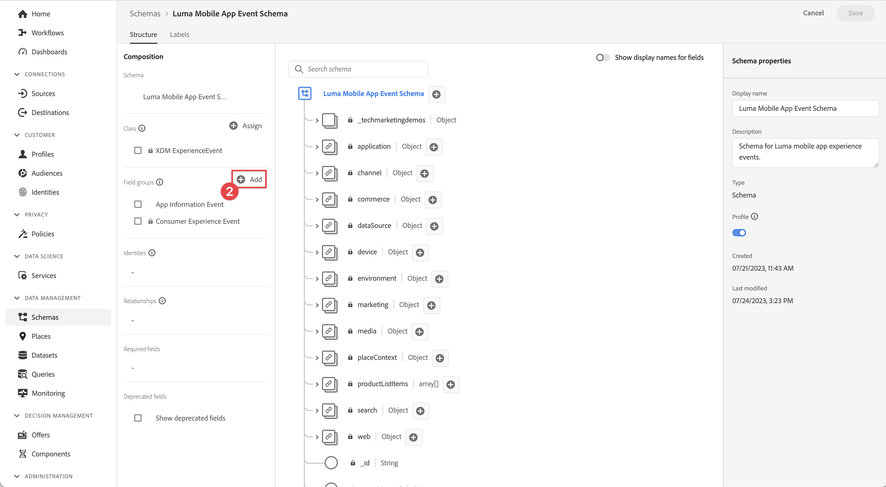
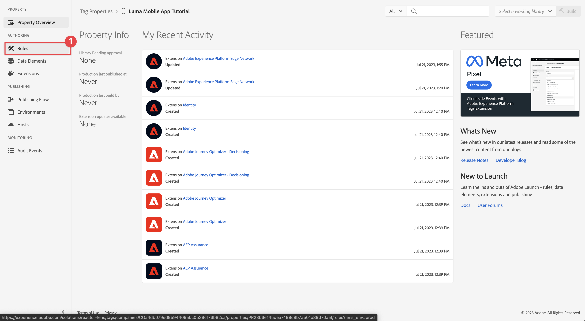

# Collect lifecycle data

Learn how to collect lifecycle data in a mobile app.

The Adobe Experience Platform Mobile SDK Lifecycle extension enables the collection  lifecycle data from your mobile app. The Adobe Experience Platform Edge Network extension sends this lifecycle data to the Platform Edge Network where it is then  forwarded to other applications and services according to your datastream configuration. Learn more about the [Lifecycle extension](https://developer.adobe.com/client-sdks/documentation/lifecycle-for-edge-network/) in the product documentation.


## Prerequisites

* Successfully built and run app with SDKs installed and configured. As part of this lesson, you started lifecycle monitoring already. See [Install SDKs - Update AppDelegate](install-sdks.md#update-appdelegate) to review.
* Registered the Assurance extension as described in the [previous lesson](install-sdks.md).

## Learning objectives

In this lesson, you will:

<!--
* Add lifecycle field group to the schema.
* -->
* Enable accurate lifecycle metrics by correctly starting/pausing as the app moves between foreground and background.
* Send data from the app to Platform Edge Network.
* Validate in Assurance.

<!--
## Add lifecycle field group to schema

The Consumer Experience Event field group you added in the [previous lesson](create-schema.md) already contains the lifecycle fields, so you can skip this step. If you don't use Consumer Experience Event field group in your own app, you can add the lifecycle fields by doing the following:

1. Navigate to the schema interface as described in the [previous lesson](create-schema.md).
1. Open the **Luma Mobile App Event Schema** schema and select **[!UICONTROL Add]** next to Field groups.
    
1. In the search bar, enter "lifecycle".
1. Select the checkbox next to **[!UICONTROL AEP Mobile Lifecycle Details]**.
1. Select **[!UICONTROL Add field groups]**.
    
1. Select **[!UICONTROL Save]**.
    
-->

## Implementation changes

Now you can update your project to register the lifecycle events.

1. Navigate to **[!DNL Luma]** > **[!DNL Luma]** > **[!UICONTROL SceneDelegate]** in the Xcode Project navigator.

1. When launched, if your app is resuming from a background state, iOS might call your `sceneWillEnterForeground:` delegate method and this is where you want to trigger a lifecycle start event. Add this code to `func sceneWillEnterForeground(_ scene: UIScene)`:
 
   ```swift
   // When in foreground start lifecycle data collection
   MobileCore.lifecycleStart(additionalContextData: nil)
   ```

1. When the app enters the background, you want to pause lifecycle data collection from your app's `sceneDidEnterBackground:` delegate method. Add this code to  `func sceneDidEnterBackground(_ scene: UIScene)`:

   ```swift
   // When in background pause lifecycle data collection
   MobileCore.lifecyclePause()
   ```

## Validate with Assurance

1. Review the [setup instructions](assurance.md#connecting-to-a-session) section to connect your simulator or device to Assurance.
1. Send the app to the background. Check for **[!UICONTROL LifecyclePause]** events in the Assurance UI.
1. Bring app to the foreground. Check for **[!UICONTROL LifecycleResume]** events in the Assurance UI.


## Forward data to Platform Edge Network

The previous exercise dispatches the foreground and background events to Adobe Experience Platform Mobile SDK. To forward these events to Platform Edge Network:

1. Select **[!UICONTROL Rules]** in the Tags property.
   
1. Select **[!UICONTROL Initial Build]** as the library to use.
1. Select **[!UICONTROL Create New Rule]**.
   
1. In the **[!UICONTROL Create Rule]** screen, enter `Application Status` for **[!UICONTROL Name]**.
1. Select  **[!UICONTROL Add]** below **[!UICONTROL EVENTS]**.
    
1. In the **[!UICONTROL Event Configuration]** step:
   1. Select **[!UICONTROL Mobile Core]** as the **[!UICONTROL Extension]**.
   1. Select **[!UICONTROL Foreground]** as the **[!UICONTROL Event Type]**.
   1. Select **[!UICONTROL Keep Changes]**.
      
1. Back in the **[!UICONTROL Create Rule]** screen, select  **[!UICONTROL Add]** next to **[!UICONTROL Mobile Core - Foreground]**.
   
1. In the **[!UICONTROL Event Configuration]** step:
   1. Select **[!UICONTROL Mobile Core]** as the **[!UICONTROL Extension]**.
   1. Select **[!UICONTROL Background]** as the **[!UICONTROL Event Type]**.
   1. Select **[!UICONTROL Keep Changes]**.
      
1. Back in the **[!UICONTROL Create Rule]** screen, select  **[!UICONTROL Add]** underneath **[!UICONTROL ACTIONS]**.
   
1. In the **[!UICONTROL Action Configuration]** step:
   1. Select **[!UICONTROL Adobe Experience Edge Network]** as the **[!UICONTROL Extension]**.
   1. Select **[!UICONTROL Forward event to Edge Network]** as the **[!UICONTROL Action Type]**.
   1. Select **[!UICONTROL Keep Changes]**.
      
1. Select **[!UICONTROL Save to Library]**.
   
1. Select **[!UICONTROL Build]** to rebuild the library.
   

Once you have successfully built the property, the events are sent to Platform Edge Network, and the events are forwarded to other applications and services according to your datastream configuration.

You should see **[!UICONTROL Application Close (Background)]** and **[!UICONTROL Application Launch (Foreground)]** events containing XDM data in Assurance.


>[!SUCCESS]
>
>You have now set up your app to send application state (foreground, background) events to the Adobe Experience Platform Edge Network and all services you have defined in your datastream.<br>Thank you for investing your time in learning about Adobe Experience Platform Mobile SDK. If you have questions, want to share general feedback, or have suggestions on future content, share them on this [Experience League Community discussion post](https://experienceleaguecommunities.adobe.com/t5/adobe-experience-platform-launch/tutorial-discussion-implement-adobe-experience-cloud-in-mobile/td-p/443796)

Next: **[Track event data](events.md)**
