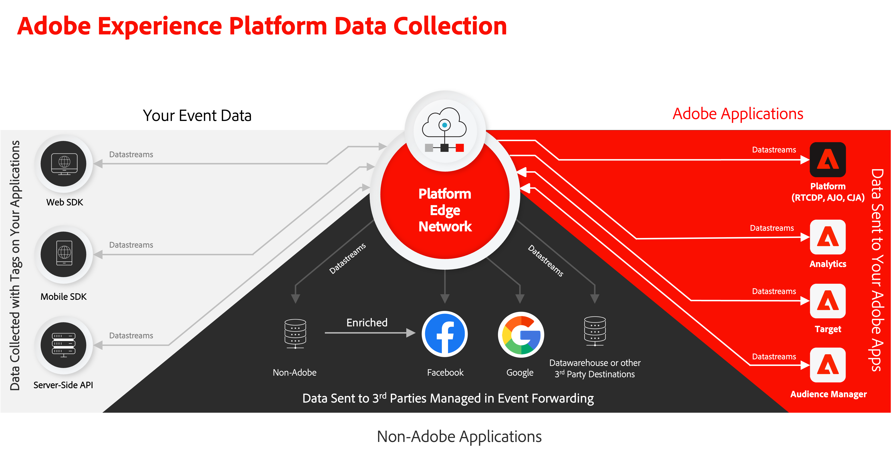

# Implement Adobe Experience Cloud in mobile apps tutorial

Learn how to implement Adobe Experience Cloud applications in your mobile app using Adobe Experience Platform Mobile SDK.

Experience Platform Mobile SDK is a client-side SDK that allows customers of Adobe Experience Cloud to interact with both Adobe applications and third-party services through the Adobe Experience Platform Edge Network. See the [Adobe Experience Platform Mobile SDK documentation](https://developer.adobe.com/client-sdks/documentation/) for more detailed information.

This tutorial guides you through the implementation of the Platform Mobile SDK in a sample retail app called Luma. The [Luma app](https://github.com/Adobe-Marketing-Cloud/Luma-iOS-Mobile-App) has functionality that lets you build a realistic implementation. After completing this tutorial, you should be ready to start implementing all of your marketing solutions through Experience Platform Mobile SDK in your own mobile apps.

The lessons are designed for iOS and written in Swift/SwiftUI, but many of the concepts also apply to Android&trade;.

After completing this tutorial, you will be able to:

* Create a schema using standard and custom field groups.
* Set up a datastream.
* Configure a mobile tag property.
* Set up an Experience Platform dataset (optional).
* Install and implement tag extensions in an app.
* Correctly pass Experience Cloud parameters to a [webview](web-views.md).
* Validate the implementation using [Adobe Experience Platform Assurance](assurance.md).
* Add the following Adobe Experience Cloud applications/extensions:
  * [Adobe Experience Platform Edge (XDM)](events.md)
  * [Lifecycle data collection](lifecycle-data.md)
  * [Consent](consent.md)
  * [Identity](identity.md)
  * [Profile](profile.md)
  * [Places](places.md)
  * [Analytics](analytics.md)
  * [Adobe Experience Platform](platform.md)
  * [Push messaging with Journey Optimizer](journey-optimizer-push.md)
  * [In-app messaging with Journey Optimizer](journey-optimizer-inapp.md)
  * [Offers with Journey Optimizer](journey-optimizer-offers.md)
  * [A/B tests with Target](target.md)

>[!NOTE]
>
>A similar multi-solution tutorial is available for [Web SDK](../tutorial-web-sdk/overview.md).

## Prerequisites

In these lessons, it is assumed that you have an Adobe Id and the required permissions to complete the exercises. If not, you should reach out to your Adobe Administrator to request access.

* In Data Collection, you must have:
  * **[!UICONTROL Platforms]**&mdash;permission item **[!UICONTROL Mobile]**
  * **[!UICONTROL Property Rights]**&mdash;permission items to **[!UICONTROL Develop]**, **[!UICONTROL Approve]**, **[!UICONTROL Publish]**, **[!UICONTROL Manage Extensions]**, and **[!UICONTROL Manage Environments]**.
  * **[!UICONTROL Company Rights]**&mdash;permission items to **[!UICONTROL Manage Properties]** and, if completing the optional push messaging lesson, **[!UICONTROL Manage App Configurations]**
  
    For more information on tag permissions, see [User permissions for tags](https://experienceleague.adobe.com/docs/experience-platform/tags/admin/user-permissions.html?lang=en){target="_blank"} in the product documentation.
* In Experience Platform, you must have:
  * **[!UICONTROL Data Modeling]**&mdash;permission items to manage and view schemas.
  * **[!UICONTROL Identity Management]**&mdash;permission items to manage and view identity namespaces.
  * **[!UICONTROL Data Collection]**&mdash;permission items to manage and view datastreams.

  * If you are the customer of a Platform-based application like Real-Time CDP, Journey Optimizer, or Customer Journey Analytics, you should also have:
    * **[!UICONTROL Data Management]**&mdash;permission items to manage and view datasets to complete the _optional Platform exercises_ (requires a license for a Platform-based application ).
    * A development **sandbox** which you can use for this tutorial.

* For Adobe Analytics, you must know which **report suites** you can use to complete this tutorial.

* For Adobe Target, you must have permissions, properly configured **roles**, **workspaces**, and **properties** as described [here](https://experienceleague.adobe.com/docs/target/using/administer/manage-users/enterprise/property-channel.html?lang=en).

* For Adobe Journey Optimizer, you must have need sufficient permission to configure the **push notification service** and to create an **app surface**, a **journey**, a **message** and **message presets**. For Decision Management, you need the proper permissions to **manage offers** and **decisions** as described [here](https://experienceleague.adobe.com/docs/journey-optimizer/using/access-control/privacy/high-low-permissions.html?lang=en#decisions-permissions).

All Experience Cloud customers should have access to the required features needed to deploy Mobile SDK.

>[!NOTE]
>
>As part of this tutorial, you will create schemas, datasets, identities, etc. If you are going through this tutorial with multiple persons on a single sandbox or you are using a shared account, consider appending or prepending an identification as part of your naming conventions when creating these objects. For example, add ` - <your name or initials>` to the name of the object you are instructed to create.

## Download the Luma app

Two versions of the sample app are available for download. Both version can be downloaded / cloned from [Github](https://git.corp.adobe.com/rmaur/Luma). You will find two folders:

1. [Start](https://git.corp.adobe.com/rmaur/Luma){target="_blank"}: a project without code or with placehoder code for most of the Experience Platform Mobile SDK code you need use to complete the hands-on exercises in this tutorial.
1. [Finish](https://git.corp.adobe.com/Luma){target="_blank"}: a version with the full implementation for reference.

>[!NOTE]
>
>You will use iOS as the platform, [!DNL Swift] as the programming language, [!DNL SwiftUI] as the UI framework and [!DNL Xcode] as the integrated development enviromnent (IDE). However, many of the implementation concepts explained are similar for other development platforms. And many have already successfully completed this tutorial with litte to no previous iOS/Swift(UI) experience. You do not need to be an expert to complete the lessons, but you get more out of the lessons if you can comfortably read and understand code.

Let's get started!

>[!SUCCESS]
>
>Thank you for investing your time in learning about Adobe Experience Platform Mobile SDK. If you have questions, want to share general feedback, or have suggestions on future content, share them on this [Experience League Community discussion post](https://experienceleaguecommunities.adobe.com/t5/adobe-experience-platform-launch/tutorial-discussion-implement-adobe-experience-cloud-in-mobile/td-p/443796).

Next: **[Create an XDM schema](create-schema.md)**
