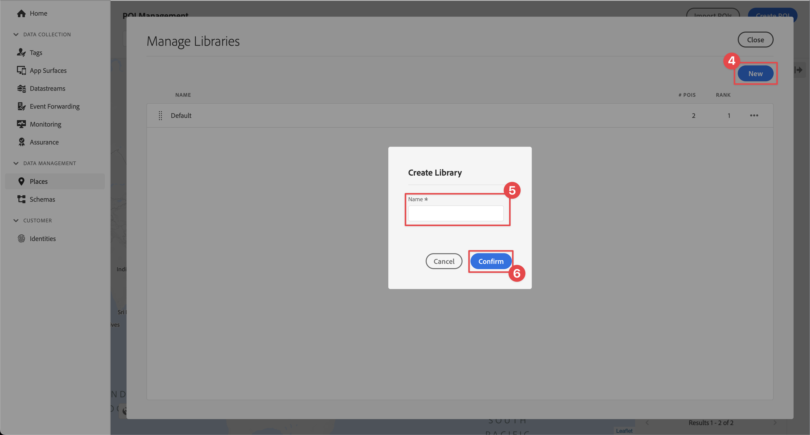
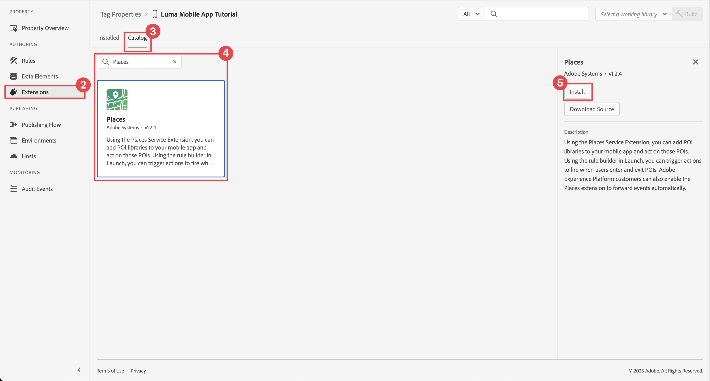
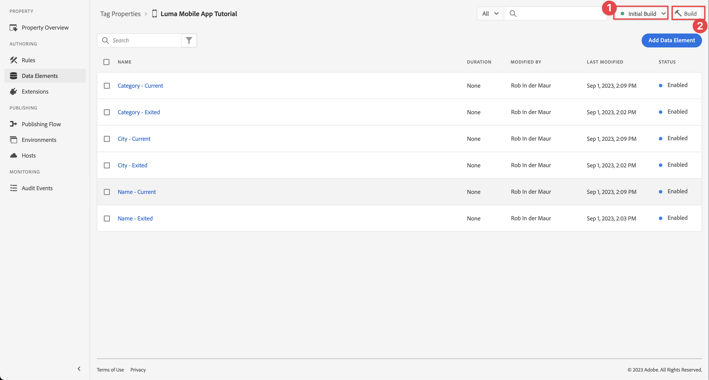
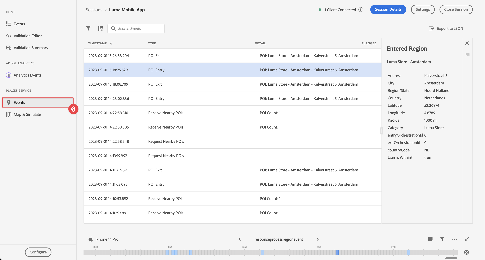

# Places

Learn how to use geo-location service in your app.

The Adobe Experience Platform Data Collection Places Service is a geo-location service that enables mobile apps with location awareness to understand the location context. The service is using rich and easy-to-use SDK interfaces accompanied by a flexible database of points of interests (POIs).

## Prerequisites

* All package dependencies are in place in the Xcode project.
* Registered extensions in AppDelegate.
* Configured MobileCore to use your development appId.
* Imported SDKs.
* Successfully built and run the app with the above changes.

## Learning objectives

In this lesson, you will

* Understand how to define points of interest in the Places service.
* Update your tag property with the Places extension.
* Update your schema to capture geolocation events.
* Validate setup in Assurance.
* Update your app to include the Places extension.
* Implement geo-location tracking from the Places service in your app.


## Prerequisites

* Successfully built and run app with the proper SDKs installed and configured.


## Learning objectives

In this lesson, you will

* Update your Edge configuration for Decision Management.
* Update your tag property with the Journey Optimizer - Decisioning extension.
* Update your schema to capture proposition events.
* Validate setup in Assurance.
* Create an offer decision, based on offers in Journey Optimizer - Decision Management.
* Update your app to include the Optimizer extension.
* Implement offers from Decision Management in your app.


## Setup

For the Places service to work within your app and within the Mobile SDK, you have to do some setup.

### Define Places

You define some points of interest in the Places service.

1. In the Data Collection UI, select **[!UICONTROL Places]**.
1. Select .
1. From the context menu, select **[!UICONTROL Manage Libraries]**.
    
1. In the **[!UICONTROL Manage Libraries]** dialog, select **[!UICONTROL New]**.
1. In the **[!UICONTROL Create Library]** dialog enter a **[!UICONTROL Name]**, for example `Luma`.
1. Select **[!UICONTROL Confirm]**.
   
1. To close the **[!UICONTROL Manage Libraries]** dialog, select **[!UICONTROL Close]**.
1. Back in **[!UICONTROL POI Management]**, select **[!UICONTROL Import POIs]**.
1. Select **[!UICONTROL Start]** in t**[!UICONTROL he Import Places]** dialog.
1. Select **[!UICONTROL Luma]** from the list of libraries,
1. Select **[!UICONTROL Next]**.
    
1. Download the [Luma POIs ZIP file](assets/luma_pois.csv.zip) and extract it to a location on your computer.
1. In the **[!UICONTROL Import Places]** dialog, drag and drop the extracted `luma_pois.csv` file on to **[!UICONTROL Choose CSV File - Drag and Drop your File]**. You should see **[!UICONTROL Validation Success]** - **[!UICONTROL Successfully validated the CSV file]**.
1. Select **[!UICONTROL Begin Import]**. You should see **[!UICONTROL Success]** - **[!UICONTROL Successfully added 6 new POIs]**.
1. Select **[!UICONTROL Done]**.
1. In **[!UICONTROL POI Management]**, you should see that six new Luma stores are added to the list. You can toggle between  list and  map view.
   . 


### Install Places extension

1. Navigate to **[!UICONTROL Tags]** and find your mobile tag property and open the property.
1. Select **[!UICONTROL Extensions]**.
1. Select **[!UICONTROL Catalog]**.
1. Search for the **[!UICONTROL Adobe Journey Optimizer - Decisioning]** extension.
1. Install the extension. The extension does not require additional configuration.

    

1. In the **[!UICONTROL Install Extension]** dialog:
   1. Select **[!UICONTROL Luma]** from the **[!UICONTROL Select a Library]** list.
   1. Ensure you have picked your working library, for example **[!UICONTROL Initial Build]**.
   1. Select **[!UICONTROL Save to Library and Build]** from **[!UICONTROL Save to Library]**.
      . 

1. Your library is rebuild.


### Verify your schema

Verify whether your schema, as defined in [Create schema](create-schema.md), incorporates the necessary field groups and classes to collect POI and geolocation data.

1. Navigate to Data Collection UI and select **[!UICONTROL Schemas]** from the left rail.
1. Select **[!UICONTROL Browse]** from the top bar.
1. Select your schema to open it.
1. In the schema editor, select **[!UICONTROL Consumer Experience Event]**.
1. You see a **[!UICONTROL placeContext]** object with object and fields to capture POI interaction and geolocation data.
   . 


### Update your tag

The Places extension provides functionality to monitor geolocation events and allows you to trigger actions based on these events. You can use this functionality to minimize the API coding you have to implement in the app.

**Data Elements**

You first create several data elements.

1. Go to your tag property in the Data Collection UI.
1. Select **[!UICONTROL Data Elements]** from the left rail.
1. Select **[!UICONTROL Add Data Element]**.
1. In the **[!UICONTROL Create Data Element]** screen, enter a name, for example `Name - Entered`.
1. Select **[!UICONTROL Places]** from the **[!UICONTROL Extension]** list.
1. Select **[!UICONTROL Name]** from the **[!UICONTROL Data Element Type]** list.
1. Select **[!UICONTROL Current POI ]**underneath **[!UICONTROL TARGET]**.
1. Select **[!UICONTROL Save to Library]**.
    

1. Repeat steps 4 - 8 using the information from the table below, to create additional data elements.
   
   | Name | Extension | Data Element Type | TARGET |
   |---|---|---|---|
   | `Name - Exited` | Places | Name | Last Exited POI |
   | `Category - Current` | Places | Category | Current POI |
   | `Category - Exited` | Places | Category | Last Exited POI |
   | `City - Current` | Places | City | Current POI |
   | `City - Exited` | Places | City | Last Exited POI |

   You should have the following list of Data Elements.

   

**Rules** 

Now you are going to define rules to work with these data elements. 

1. Select **[!UICONTROL Rules]** from the left rail.
1. Select **[!UICONTROL Add Rule]**.
1. In the **[!UICONTROL Create Rule]** screen, enter a name for the rule, for example `POI - Entry`.
1. Select  underneath **[!UICONTROL EVENTS]**.
   1. Select **[!UICONTROL Places]** from the **[!UICONTROL Extension]** list and select **[!UICONTROL Enter POI]** from the **[!UICONTROL Event Type]** list.
   1. Select **[!UICONTROL Keep Changes]**.
      . 
1. Select  underneath **[!UICONTROL ACTIONS]**.
   1. Select **[!UICONTROL Mobile Core]** from **[!UICONTROL Extension]** list, select **[!UICONTROL Attach Data]** from **[!UICONTROL Action Type]** list. This action attaches payload data.
   1. In the **[!UICONTROL JSON Payload]**, paste the following payload:

        ```json
        {
            "xdm": {
                "eventType": "location.entry",
                "placeContext": {
                    "geo": {
                        "city": "{%%City - Current%%}"
                    },
                    "POIinteraction": {
                        "poiDetail": {
                            "name": "{%%Name - Current%%}",
                            "category": "{%%Category - Current%%}"
                        },
                        "poiEntries": {
                            "value": 1
                        }
                    }
                }
            }
        }
        ```

       The `{%% ... %%}` values can also be easily inserted by selecting the  next to the dialog and picking a data element from the dialog.

   1. Select **[!UICONTROL Keep Changes]**.
        

1. Select  next to the **[!UICONTROL Mobile Core - Attach Data]** action.
   1. Select **[!UICONTROL Adobe Experience Platform Edge Network]** from the **[!UICONTROL Extension]** list and select **[!UICONTROL Forward event to Edge Network]**. This action ensures that the event and additional payload data is forwarded to the Edge Network.
   1. Select **[!UICONTROL Keep Changes]**.

1. To save the rule, select **[!UICONTROL Save to Library]**.

    

Let's create another rule

1. In the **[!UICONTROL Create Rule]** screen, enter a name for the rule, for example `POI - Exit`.
1. Select  underneath **[!UICONTROL EVENTS]**.
   1. Select **[!UICONTROL Places]** from the **[!UICONTROL Extension]** list and select **[!UICONTROL Enter POI]** from the **[!UICONTROL Event Type]** list.
   1. Select **[!UICONTROL Keep Changes]**. 
1. Select  underneath **[!UICONTROL ACTIONS]**.
   1. Select **[!UICONTROL Mobile Core]** from **[!UICONTROL Extension]** list, select **[!UICONTROL Attach Data]** from **[!UICONTROL Action Type]** list.
   1. In the **[!UICONTROL JSON Payload]**, paste the following payload:

        ```json
        {
            "xdm": {
                "eventType": "location.exit",
                "placeContext": {
                    "geo": {
                        "city": "{%%City - Exited%%}"
                    },
                    "POIinteraction": {
                        "poiExits": {
                            "value": 1
                        },
                        "poiDetail": {
                            "name": "{%%Name - Exited%%}",
                            "category": "{%%Category - Exited%%}"
                        }
                    }
                }
            }
        }
        ```

   1. Select **[!UICONTROL Keep Changes]**.

1. Select  next to the **[!UICONTROL Mobile Core - Attach Data]** action.
   1. Select **[!UICONTROL Adobe Experience Platform Edge Network]** from the **[!UICONTROL Extension]** list and select **[!UICONTROL Forward event to Edge Network]**.
   1. Select **[!UICONTROL Keep Changes]**.


To ensure all changes in your tag are published

 1. Select **[!UICONTROL Initial Build]** as the library to build.
 1. Select **[!UICONTROL Build]**.
    

   


## Validate setup in Assurance

To validate your setup in Assurance:

1. Go to the Assurance UI.
1. If not already available in the left rail. select **[!UICONTROL Configure]** in left rail and select  next to **[!UICONTROL Events]** and **[!UICONTROL Map & Simulate]** underneath **[!UICONTROL PLACES SERVICE]**.
1. Select **[!UICONTROL Save]**.
1. Select **[!UICONTROL Map & Simulate]** in the left rail.
1. Select one of the POI's defined in the Places service and from the popup select  **[!UICONTROL Simulate Entry Event]**.
   
1. Select **[!UICONTROL Events]** from the left rail, and you should see the events that you simulated.
   


## Implement places in your app

As discussed in previous lessons, installing a mobile tag extension only provides the configuration. Next you must install and register the Places SDK. If these steps aren't clear, review the [Install SDKs](install-sdks.md) section.

>[!NOTE]
>
>If you completed the [Install SDKs](install-sdks.md) section, then the Places SDK is already installed and you can skip this step.
>

1. In Xcode, ensure that [AEP Places](https://github.com/adobe/aepsdk-places-ios) is added to the list of packages in Package Dependencies. See [Swift Package Manager](install-sdks.md#swift-package-manager).
1. Navigate to **[!UICONTROL Luma]** > **[!UICONTROL Luma]** > **[!UICONTROL AppDelegate]** in the Xcode Project navigator.
1. Ensure `AEPPlaces` is part of your list of imports.

    `import AEPPlaces`

1. Ensure `Places.self` is part of the array of extensions that you are registering.

    ```swift
    let extensions = [
        AEPIdentity.Identity.self,
        Lifecycle.self,
        Signal.self,
        Edge.self,
        AEPEdgeIdentity.Identity.self,
        Consent.self,
        UserProfile.self,
        Places.self,
        Messaging.self,
        Optimize.self,
        Assurance.self
    ]
    ```

1. Navigate to Luma > Luma > Utils > MobileSDK in the Xcode Project navigator and find the func processRegionEvent(regionEvent: PlacesRegionEvent, forRegion region: CLRegion) async function. This function is a wrapper around the [`Places.processRegionEvent`](https://developer.adobe.com/client-sdks/documentation/places/api-reference/#processregionevent) API.
1. Navigate to Luma > Luma > Views > Location > GeofenceSheet in Xcode's Project navigator. 
   
   1. For the Entry button, enter the following code

    ```swift
    Task {
        await MobileSDK.shared.processRegionEvent(regionEvent: .entry, forRegion: region)
    }
    ```  

   1. For the Exit button, enter the following code

    ```swift
    Task {
        await MobileSDK.shared.processRegionEvent(regionEvent: .exit, forRegion: region)
    }
    ```  

It is beyond the topic of this tutorial to explain details about the location manager implementation within iOS.


## Validate using your app

1. Open your app on a device or in the simulator.

1. Go to the **[!UICONTROL Location]** tab.

1. Move the map around to ensure the blue circle in the middle is on top of one of your POI's, for example London.

1. Tap the blue  repeatedly until you see the category and name at the bottom right.
   
1. Tap the label of the POI, which opens up the Nearby POI sheet. 
   
   

1. Press the Entry or Exit buttons to simulate geolocation events from the app.

   

1. You should see the events in the Assurance UI.


## Next steps

You should now have all the tools to start adding more functionality to your geolocation functionality in the app. As you have forwarded the events to the Edge Network and through your datastream to Experience Platform, you should see the experience events appearing for the profile used in the app. Those experience events can be used to trigger journeys in Journey Optimizer (see [push notification](journey-optimizer-inapp.md) and [in-app messaging](journey-optimizer-push.md) with Journey Optimizer). For example, the usual example of sending your app user a push notification when someone entering in the geofence of a physical store.

You have seen an implementation of functionality for your app, mostly driven by the Places service and data elements and rules you defined in your Tag property. Alternatively, you can implement the same functionality directly in your app using the [`Edge.sendEvent`](https://developer.adobe.com/client-sdks/documentation/edge-network/api-reference/#sendevent) API (see [Events](events.md) for more information) with an XDM payload containing a populated placeContext object.

>[!SUCCESS]
>
>You have now enabled the app for geolocation services using the Places extension in the Experience Platform Mobile SDK.<br/>Thank you for investing your time in learning about Adobe Experience Platform Mobile SDK. If you have questions, want to share general feedback, or have suggestions on future content, share them on this [Experience League Community discussion post](https://experienceleaguecommunities.adobe.com/t5/adobe-experience-platform-launch/tutorial-discussion-implement-adobe-experience-cloud-in-mobile/td-p/443796).

Next: **[Map data to Adobe Analytics](analytics.md)**
