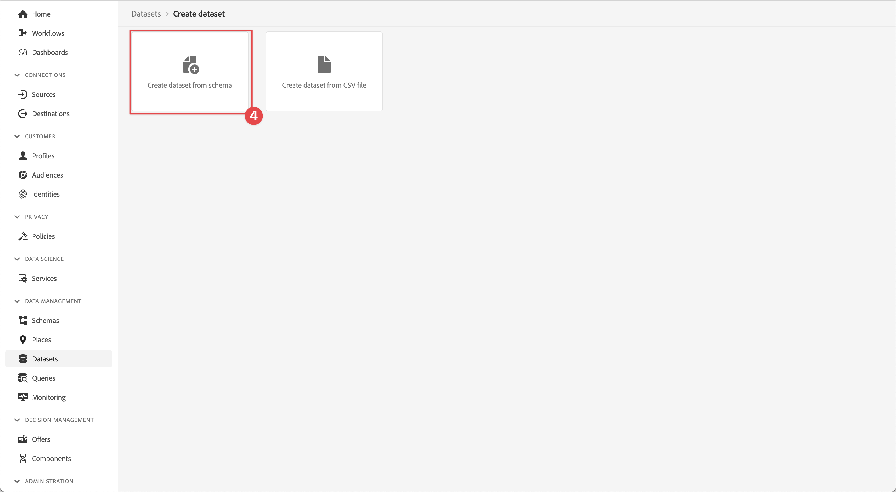
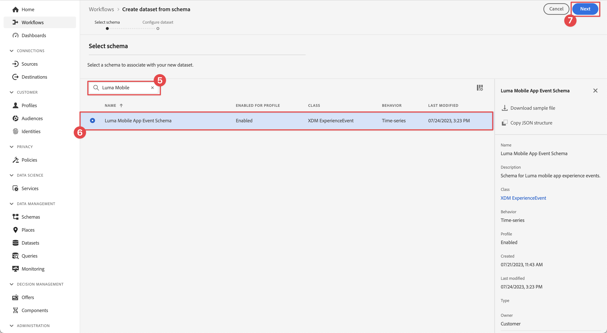
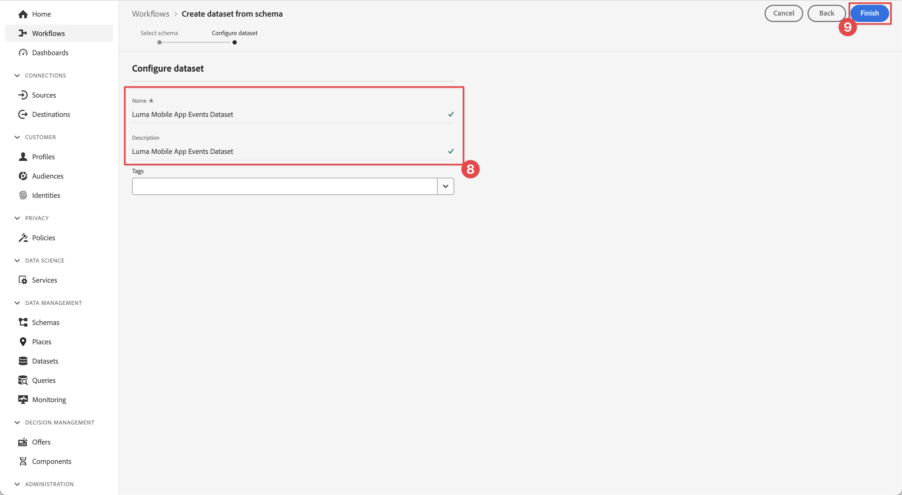
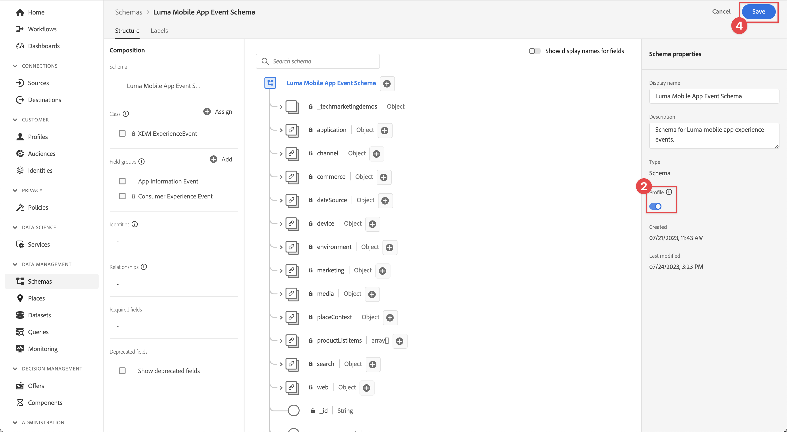

# Send data to Adobe Experience Platform

Learn how to send data to Adobe Experience Platform.

This optional lesson is relevant to all customers of Real-Time Customer Data Platform (Real-Time CDP), Journey Optimizer, and Customer Journey Analytics. Experience Platform, the foundation of Experience Cloud products, is an open system that transforms all your data (Adobe and non-Adobe) into robust customer profiles. These customer profiles update in real time and uses AI-driven insights to help you to deliver the right experiences across every channel.

The [event](events.md), [lifecycle](lifecycle-data.md), and [identity](identity.md) data which you collected and sent to Platform Edge Network in earlier lessons is forwarded to the services configured in your datastream, including Adobe Experience Platform.

## Prerequisites

Your organization must be provisioned and permissions granted for Adobe Experience Platform.

If you don't have access, you can [skip this lesson](install-sdks.md).

## Learning objectives

In this lesson, you will:

* Create an Experience Platform dataset.
* Validate data in the dataset.
* Enable your schema and dataset for Real-Time Customer Profile.
* Validate data in Real-Time Customer Profile.
* Validate data in the identity graph.

## Create a dataset

All data that is successfully ingested into Adobe Experience Platform is persisted within the data lake as datasets. A dataset is a storage and management construct for a collection of data (typically a table) that contains a schema (columns) and fields (rows). Datasets also contain metadata that describes various aspects of the data they store. See the [documentation](https://experienceleague.adobe.com/docs/experience-platform/catalog/datasets/overview.html) for information.

1. Navigate to the Experience Platform interface by selecting it from the Apps  menu in the top right.

1. Select **[!UICONTROL Datasets]** from the left navigation menu.

1. Select  **[!UICONTROL Create dataset]**.

1. Select **[!UICONTROL Create dataset from schema]**.

1. Search for your schema

1. Select your schema.

1. Select **[!UICONTROL Next]**.
   

1. Provide a **[!UICONTROL Name]** and **[!UICONTROL Description]**.

1. Select **[!UICONTROL Finish]**.
   

## Update the datastream

Once you have created your dataset, be sure to [update your datastream](create-datastream.md) to add Adobe Experience Platform. This update ensures data flows into Platform. 

## Validate data in the dataset

Now that you have created a dataset and updated your datastream to send data to Experience Platform, all XDM data send to Platform Edge Network is forwarded to Platform and land in the dataset.

Open the app and navigate to screens where you are tracking events. You can also trigger lifecycle metrics.

Open your dataset in the Platform interface. You should see the data arriving in batches to the dataset

You should also be able to see example records and fields using the **[!UICONTROL Preview dataset]** feature:

A more robust tool for validating data is Platform's [query service](https://experienceleague.adobe.com/docs/platform-learn/tutorials/queries/explore-data.html).

## Enable Real-Time Customer Profile

Experience Platform's Real-Time Customer Profile allows you to build a holistic view of each individual customer that combines data from multiple channels, including online, offline, CRM, and third-party data. Profile allows you to consolidate your disparate customer data into a unified view offering an actionable, timestamped account of every customer interaction.

### Enable the schema

1. Open your schema
1. Enable **[!UICONTROL Profile]**
1. Select **[!UICONTROL Data for this schema will contain a primary identity in the identityMap field.]** in the modal dialog
1. **[!UICONTROL Save]** the schema

    

### Enable the dataset

1. Open your dataset
1. Enable **[!UICONTROL Profile]**

    

### Validate data in Profile

Open the app and navigate to screens where you are tracking events. Log in to the Luma app and make a purchase.

Use Assurance to find one of the identities passed in the identityMap (Email, lumaCrmId, or ECID), for example the CRM Id.

In the Platform interface, 

1. Navigate to **[!UICONTROL Profiles]** > **[!UICONTROL Browse]**, 
1. Specify the identity details you just grabbed, for example `Luma CRM ID` for **[!UICONTROL Identity namespace]** and the value you copied for **[!UICONTROL Identity value]**. Then select **[!UICONTROL View]**.
1. To view details, select the profile .

On the **[!UICONTROL Detail]** screen, you can see basic info about the user, including the **[!UICONTROL **linked identities**]**:

On the **[!UICONTROL Events]**, you can see the events collected from your mobile app implementation for this user:

From the profile detail screen:

1. To view the identity graph, click the link or navigate to **[!UICONTROL Identities]** > **[!UICONTROL Identity Graph]** 
1. To look up the identity value, specify `Luma CRM ID` as the **[!UICONTROL Identity namespace]** and the copied value as the **[!UICONTROL Identity value]**. Then select **[!UICONTROL View]**.
   
   This visualization shows you all of the identities that are linked together in a profile and their origin. Here is an example of an identity graph constructed of data collected from completing both this Mobile SDK tutorial (Data Source 2) and the [Web SDK tutorial](https://experienceleague.adobe.com/docs/platform-learn/implement-web-sdk/overview.html) (Data Source 1):

   

There is a lot more that marketers and analytics can do with data captured in Experience Platform, including analyzing it in Customer Journey Analytics and building segments in Real-Time Customer Data Platform. You are off to a good start!

>[!SUCCESS]
>
>You have now set up your app to send data not only to the Edge Network but also to Adobe Experience Platform. Thank you for investing your time in learning about Adobe Experience Platform Mobile SDK. If you have questions, want to share general feedback, or have suggestions on future content, share them on this [Experience League Community discussion post](https://experienceleaguecommunities.adobe.com/t5/adobe-experience-platform-launch/tutorial-discussion-implement-adobe-experience-cloud-in-mobile/td-p/443796).

Next: **[Push messaging with Journey Optimizer](journey-optimizer-push.md)**
