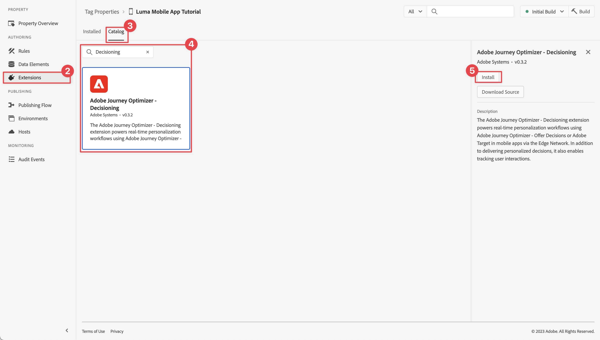
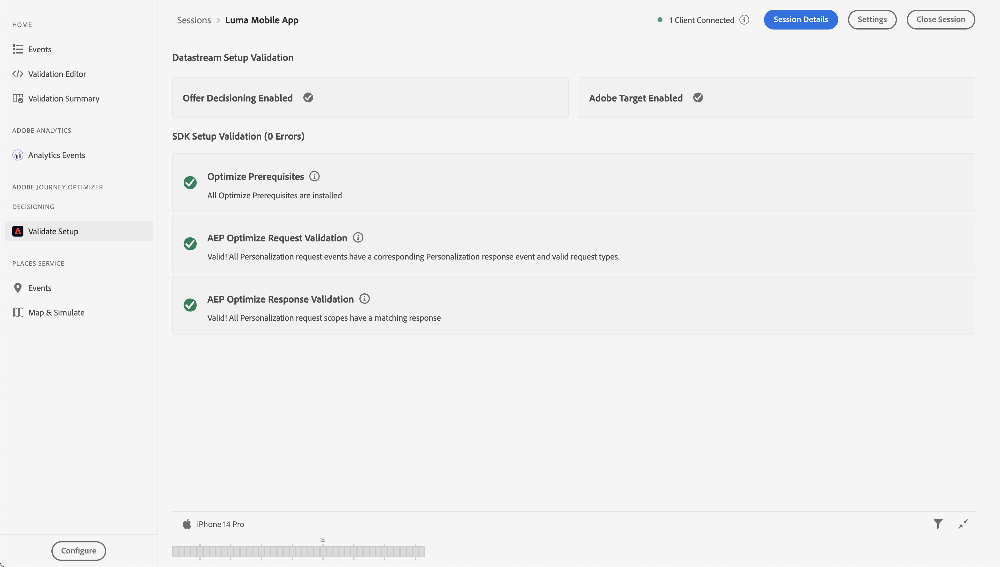

# Perform A/B Tests with Target

Learn how to perform A/B test in your mobile apps with Platform Mobile SDK and Adobe Target.

Target provides everything you need to tailor and personalize your customers' experiences. Target helps you maximize revenue on your web and mobile sites, apps, social media, and other digital channels. The focus in this tutorial is on the A/B test functionality of Target. See [A/B Test overview](https://experienceleague.adobe.com/docs/target/using/activities/abtest/test-ab.html?lang=en) for more information. 

Before you perform A/B tests with Target Premium, you must ensure that the proper configurations and integrations are in place.

>[!NOTE]
>
>This lesson is optional and only applies to Adobe Target Premium users looking to perform A/B tests 


## Prerequisites

* Successfully built and run app with SDKs installed and configured.
* Access to Adobe Target Premium with permissions, properly configured roles, workspaces and properties as described [here](https://experienceleague.adobe.com/docs/target/using/administer/manage-users/enterprise/property-channel.html?lang=en).
  You should be able to use Target Standard as well, but the tutorial uses a number of advanced concepts (for example Target properties) which are uniqe to Target Premium.


## Learning objectives

In this lesson, you will:

* Update your Edge configuration for Target integration.
* Update your tag property with the Journey Optimizer - Decisioning extension.
* Update your schema to capture propositon events.
* Validate setup in Assurance.
* Create a simple A/B test in Target.
* Update your app to include the Optimize extension.
* Implement the A/B test in your app.
* Validate implementation in Assurance

## Update Edge configuration

You need to update you Experience Edge configuration to ensure data send from your mobile app to the Edge Network is forwarded to Adobe Target.

1. In the Data Collection UI, select **[!UICONTROL Datastreams]**, and select your datastream, for example **[!UICONTROL Luma Mobile App]**.
1. Select **[!UICONTROL Add Service]** and select **[!UICONTROL Adobe Target]** from the **[!UICONTROL Service]** list.
1. Enter the Target **[!UICONTROL Property Token]** value you want to use for this integration. 

   You can find your properties in the Target UI, in **[!UICONTROL Administration]** > **[!UICONTROL Properties]**. Select  to reveal the property token for the property you want to use. The property token has a format like `"at_property": "xxxxxxxx-xxxx-xxxxx-xxxx-xxxxxxxxxxxx"`; you only need to enter the value `xxxxxxxx-xxxx-xxxxx-xxxx-xxxxxxxxxxxx`.

1. Select **[!UICONTROL Save]**.

    


## Install Adobe Journey Optimizer - Decisioning tags extension

1. Navigate to **[!UICONTROL Tags]** and find your mobile tag property and open the property.
1. Select **[!UICONTROL Extensions]**.
1. Select **[!UICONTROL Catalog]**.
1. Search for the **[!UICONTROL Adobe Journey Optimizer - Decisioning]** extension.
1. Install the extension. The extension does not require additional configuration.

    


## Update your schema

1. Navigate to Data Collection UI and select Schemas from the left rail.
1. Select Browse from the top bar.
1. Select your schema to open it.
1. In the schema editor, click on + Add next to Field groups.
1. In the Add fields group, search for proposition, select Experience Event - Proposition Interactions and select add field groups.
   
1. Select Save to save the changes to your schema.


## Validate setup in Assurance

To validate your setup in Assurance:

1. Go to the Assurance UI.
1. Select **[!UICONTROL Configure]** in left rail and select  next to **[!UICONTROL Validate Setup]** underneath **[!UICONTROL ADOBE JOURNEY OPTIMIZER DECISIONING]**.
1. Select **[!UICONTROL Save]**.
1. Select **[!UICONTROL Validate Setup]** in the left rail. Both datastream setup is validated and the SDK setup in your application.
    

## Create an A/B Test

1. In the Target UI, select **[!UICONTROL Activities]** from the top bar.
1. Select **[!UICONTROL Create Activity]** and **[!UICONTROL A/B Test]** from the context menu.
1. In the **[!UICONTROL Create A/B Test Activity]** modal, select **[!UICONTROL Mobile]** as the **[!UICONTROL Type]**, select a workspace from the **[!UICONTROL Choose Workspace]** list and select your property from the **[!UICONTROL Choose property]** list.
1. Select **[!UICONTROL Create]**.
   

1. In the **[!UICONTROL Untitled Activity]** screen, at the **[!UICONTROL Experiences]** step:

   1. Enter `luma-mobileapp-abtest` in **[!UICONTROL Select Location]** underneath L**[!UICONTROL OCATION 1]**.
   1. Select  next to **[!UICONTROL Default Content]** and select **[!UICONTROL Create JSON Offer]** from the context menu.
   1. Copy the following JSON into **[!UICONTROL Enter a valid JSON object]**.

        ```json
        { 
            "title": "Luma Anaolog Watch",
            "text": "Designed to stand up to your active lifestyle, this women's Luma Analog Watch features a tasteful brushed chrome finish and a stainless steel, water-resistant construction for lasting durability.", 
            "image": "https://luma.enablementadobe.com/content/dam/luma/en/products/gear/watches/Luma_Analog_Watch.jpg" 
        }
        ```

   1. Select **[!UICONTROL + Add Experience]**.
   
       

   1. Repeat step b and c for  experience Experience B, but instead use the following JSON:

        ```json
        { 
            "title": "Aim Analog Watch",
            "text": "The flexible, rubberized strap is contoured to conform to the shape of your wrist for a comfortable all-day fit. The face features three illuminated hands, a digital read-out of the current time, and stopwatch functions.", 
            "image": "https://luma.enablementadobe.com/content/dam/luma/en/products/gear/watches/Aim_Watch.jpg" 
        }

        ```

   1. Select **[!UICONTROL Next]**.
      
      

1. In the **[!UICONTROL Targeting]** step, review the setup of your A/B test. By default, both offers are allocated equally across all visitors. Select **[!UICONTROL Next]** to continue.

   

1. In the **[!UICONTROL Goals & Settings]** step:

    1. Rename your Untitled Activity, for example to to `Luma Mobile SDK Tutorial - A/B Test Example`.
    1. Enter an **[!UICONTROL Objective]** for your A/B test, for example `A/B Test for Luma mobile app tutorial`.
    1. Select **[!UICONTROL Conversion]**, **[!UICONTROL Clicked on mbox]** in the **[!UICONTROL Goal Metric]** > **[!UICONTROL MY PRIMARY GOAL]** tile and enter your location (mbox) name, for example `luma-mobileapp-abtest`.
    1. Select **[!UICONTROL Save & Close]**.

       

1. Back in the **[!UICONTROL All Activities]** screen:

    1. Select  at your activity.
    1. Select  **[!UICONTROL Activate]** to activate your A/B test.

    


## Implement Target in your app

As discussed in previous lessons, installing a mobile tag extension only provides the configuration. Next you must install and register the Optimize SDK. If these steps aren't clear, review the [Install SDKs](install-sdks.md) section.

>[!NOTE]
>
>If you completed the [Install SDKs](install-sdks.md) section, then the SDK is already installed and you can skip to step #7.
>

1. In Xcode, ensure that [AEP Optimize](https://github.com/adobe/aepsdk-messaging-ios.git) is added to the list of packages in Package Dependencies. See [Swift Package Manager](install-sdks.md#swift-package-manager).
1. Navigate to **[!UICONTROL Luma]** > **[!UICONTROL Luma]** > **[!UICONTROL AppDelegate]**.
1. Ensure `AEPMessaging` is part of your list of imports.

    `import AEPOptimize`

1. Ensure `Optimize.self` is part of the array of extensions that you are registering.

    ```swift
    let extensions = [
        AEPIdentity.Identity.self,
        Lifecycle.self,
        Signal.self,
        Edge.self,
        AEPEdgeIdentity.Identity.self,
        Consent.self,
        UserProfile.self,
        Places.self,
        Messaging.self,
        Optimize.self,
        Assurance.self
    ]
    ```

1. Navigate to **[!UICONTROL Luma]** > **[!UICONTROL Luma]** > **[!UICONTROL Utils]** > **[!UICONTROL MobileSDK]** in Xcode Project navigator. Find the ` func updatePropositionAT(ecid: String, location: String) async` function. Inspect the code which sets up an XDM dictionary `xdmData`, containing the ECID to identify the profile for which we have to present the A/B test, and the `decisionScope`, an array of locations on where to present the A/B test. Then the functions call two Optimize API's: [`Optimizer.clearCachePropositions`](https://support.apple.com/en-ie/guide/mac-help/mchlp1015/mac)  and [`Optimizer.updatePropositions`](https://developer.adobe.com/client-sdks/documentation/adobe-journey-optimizer-decisioning/api-reference/#updatepropositions).  These functions clear any cached propositions and update the propositions for this profile.

1. Navigate to **[!UICONTROL Luma]** > **[!UICONTROL Luma]** > **[!UICONTROL Views]** > **[!UICONTROL Personalization]** > **[!UICONTROL TargetOffersView]** in Xcode Project navigator. Find the `func getPropositionAT(location: String) async` function and inspect the code of this function. The most important part of this function is the  [`Optimizer.getPropositions`](https://developer.adobe.com/client-sdks/documentation/adobe-journey-optimizer-decisioning/api-reference/#getpropositions) API call, which retrieves the propositions for the current profile based on the decision scope (which is the location you have defined in the A/B Test) and unwraps the result in content that can be displayed properly in the app.

1. Still in TargetOffersView, find the func updatePropositions(location: String) async function and add the following code:

    ```swift
        Task {
            await self.updatePropositionAT(
                ecid: currentEcid,
                location: location
            )
        }
        try? await Task.sleep(seconds: 2.0)
        Task {
            await self.getPropositionAT(
                location: location
            )
        }
    ```

    This code ensures we proper update the propositions and then retrieve the results using the functions described in step 5 and 6.


## Validate using the app

1. Open your app on a device or in the simulator.

1. Go to the **[!UICONTROL Personalisation]** tab.

1. Select **[!UICONTROL Edge Personalisation]**.

1. Scroll down to the bottom, and you see one of the two offers that you have defined in your A/B test displayed in the **[!UICONTROL TARGET]** tile.

    


## Validate implementation in Assurance

To validate the A/B test in Assurance:

1. Go to the Assurance UI.
1. Select **[!UICONTROL Configure]** in left rail and select  next to **[!UICONTROL Review & Simuate]** underneath **[!UICONTROL ADOBE JOURNEY OPTIMIZER DECISIONING]**.
1. Select **[!UICONTROL Save]**.
1. Select **[!UICONTROL Review & Simulate]** in the left rail. Both datastream setup is validated and the SDK setup in your application.
1. Select **[!UICONTROL Requests]** at the top bar. You will see your Target requests.
   

1. You can explore Simulate and Event List tabs for further functionality checking your setup for Target offers.

## Implement in your app

You should now have all the tools to start adding more A/B tests or other Target activities, where relevant and applicable, to the Luma app.

>[!SUCCESS]
>
>You have now enabled the app for A/B tests and used an A/B test using Adobe Target and the Adobe Journey Optimizer - Decisioning extension for the Adobe Experience Platform Mobile SDK.<br/>Thank you for investing your time in learning about Adobe Experience Platform Mobile SDK. If you have questions, want to share general feedback, or have suggestions on future content, share them on this [Experience League Community discussion post](https://experienceleaguecommunities.adobe.com/t5/adobe-experience-platform-launch/tutorial-discussion-implement-adobe-experience-cloud-in-mobile/td-p/443796).

Next: **[Conclusion and next steps](conclusion.md)**
