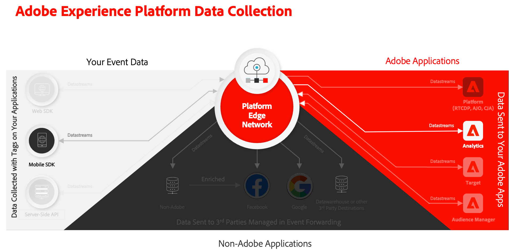
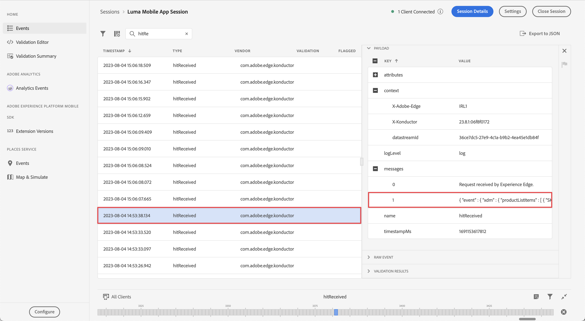
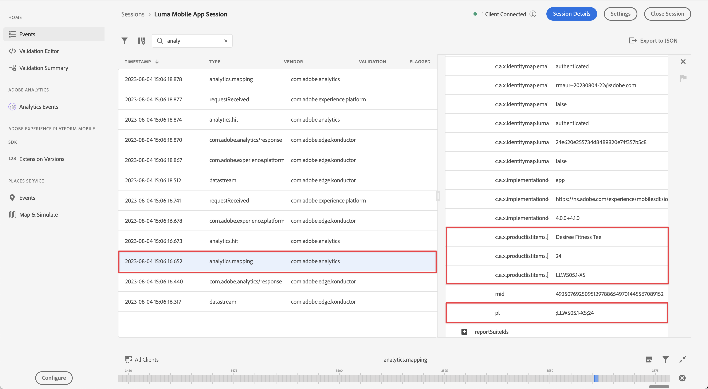
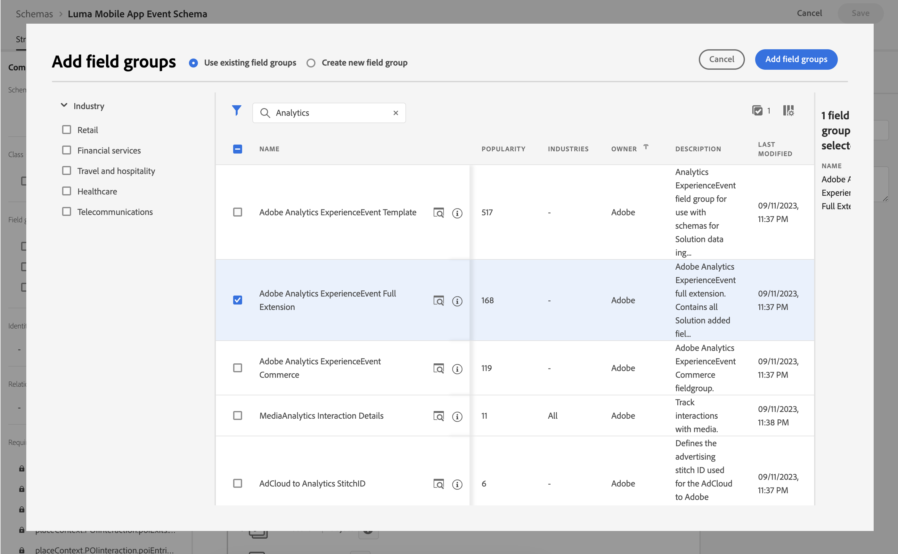

# Collect and map Analytics data

Learn how to map mobile data to Adobe Analytics. 

The [event](events.md) data which you collected and sent to Platform Edge Network in earlier lessons is forwarded to the services configured in your datastream, including Adobe Analytics. You map the data to the correct variables in your report suite.



## Prerequisites

* Understanding of ExperienceEvent tracking.
* Successfully sending XDM data in your sample app.
* An Adobe Analytics report suite that you can use for this lesson.

## Learning objectives

In this lesson, you will:

* Configure your datastream with the Adobe Analytics service.
* Understand automatic mapping of Analytics variables.
* Set up processing rules to map XDM data to Analytics variables.

## Add Adobe Analytics datastream service

To send your XDM data from the Edge Network to Adobe Analytics, you configure the Adobe Analytics service to the datastream you set up as part of [Create a datastream](create-datastream.md).

1. In the Data Collection UI, select **[!UICONTROL Datastreams]** and your datastream. 
   
1. Then select  **[!UICONTROL Add Service]**.

1. Add **[!UICONTROL Adobe Analytics]** from the [!UICONTROL Service] list, 

1. Enter the name of the report suite from Adobe Analytics that you want to use in **[!UICONTROL Report Suite ID]**.

1. Enable the service by switching **[!UICONTROL Enabled]** on.

1. Select **[!UICONTROL Save]**.

   


## Automatic mapping

Many of the standard XDM fields are automatically mapped to Analytics variables. See the full list [here](https://experienceleague.adobe.com/docs/analytics/implementation/aep-edge/variable-mapping.html?lang=en).

### Example #1 - s.products

A good example is the [products variable](https://experienceleague.adobe.com/docs/analytics/implementation/vars/page-vars/products.html?lang=en) which can't be populated using processing rules. With an XDM implementation, you pass all the necessary data in `productListItems` and `s.products` are automatically populated via Analytics mapping.

This object:

```swift
"productListItems": [
    [
      "name":  "Yoga Mat",
      "SKU": "5829",
      "priceTotal": "49.99",
      "quantity": 1
    ],
    [
      "name":  "Water Bottle",
      "SKU": "9841",
      "priceTotal": "30.00",
      "quantity": 3
    ]
]
```

results in:

```
s.products = ";Yoga Mat;1;49.99,;Water Bottle,3,30.00"
```

>[!NOTE]
>
>Currently `productListItems[N].SKU` is ignored by automatic mapping.


### Example #2 - scAdd

If you look closely, all events have two fields `value` (required) and `id` (optional). The `value` field is used to increment the event count. The `id` field is used for serialization.

This object:

```swift
"commerce" : {
  "productListAdds" : {
    "value" : 1
  }
}
```

results in:

```
s.events = "scAdd"
```

This object:

```swift
"commerce" : {
  "productListAdds" : {
    "value" : 1,
    "id": "321435"
  }
}
```

results in:

```
s.events = "scAdd:321435"
```

## Validate with Assurance

Using the [Assurance](assurance.md) you can confirm that you're sending an experience event, the XDM data is correct and the Analytics mapping is happening as expected.

1. Review the [setup instructions](assurance.md#connecting-to-a-session) section to connect your simulator or device to Assurance.

1. Send a **[!UICONTROL productListAdds]** event (add a product to your basket).

1. View the ExperienceEvent hit.

    

1. Review the XDM portion of the JSON.

    ```json
    "xdm" : {
      "productListItems" : [ {
        "SKU" : "LLWS05.1-XS",
        "name" : "Desiree Fitness Tee",
        "priceTotal" : 24
      } ],
    "timestamp" : "2023-08-04T12:53:37.662Z",
    "eventType" : "commerce.productListAdds",
    "commerce" : {
      "productListAdds" : {
        "value" : 1
      }
    }
    // ...
    ```

1. Review the **[!UICONTROL analytics.mapping]** event.

    

Note the following in the Analytics mapping:

* **[!UICONTROL events]** are populated with `scAdd` based on `commerce.productListAdds`.
* **[!UICONTROL pl]** (products variable) are populated with a concatenated value based on `productListItems`.
* There is other interesting information in this event including all the context data.


## Mapping with Context Data

XDM data forwarded to Analytics gets converted into [context data](https://experienceleague.adobe.com/docs/mobile-services/ios/getting-started-ios/proc-rules.html?lang=en) including both standard and custom fields.

The context data key is constructed following this syntax:

```
a.x.[xdm path]
```

For example:

```
// Standard Field
a.x.commerce.saveforlaters.value

// Custom Field
a.x._techmarketingdemos.appinformation.appstatedetails.screenname
```

>[!NOTE]
>
>Custom fields are placed under your Experience Cloud Org identifier.
>
>`_techmarketingdemos` is replaced with your Organization's unique value.


To map this XDM context data to your Analytics data in your report suite, you can: 

### Use a field group

* Add the **[!UICONTROL Adobe Analytics ExperienceEvent Full Extension]** field group to your schema.

  

* Build XDM payloads in your app, conforming to the Adobe Analytics ExperienceEvent Full Extension field group, similar to what you have done in the [Track Event Data](events.md) lesson, or 
* Build rules in your Tags property that use rule actions to attach or modify data to the Adobe Analytics ExperienceEvent Full Extension field group. See for more details [Attach data to SDK events](https://developer.adobe.com/client-sdks/documentation/user-guides/attach-data/) or [Modify data in SDK events](https://developer.adobe.com/client-sdks/documentation/user-guides/attach-data/).


### Use processing rules

Here is what a processing rule using this data might look like:

* You **[!UICONTROL Overwrite value of]** (1) **[!UICONTROL App Screen Name (eVar2)]** (2) with the value of **[!UICONTROL a.x._techmarketingdemo.appinformation.appstatedetails.screenname]** (3) if **[!UICONTROL a.x._techmarketingdemo.appinformation.appstatedetails.screenname]** (4) **[!UICONTROL is set]** (5).

* You **[!UICONTROL Set event]** (6) **[!UICONTROL Add to Wishlist (Event 3)]** (7) to **[!UICONTROL a.x.commerce.saveForLaters.value(Context)]** (8) if **[!UICONTROL a.x.commerce.saveForLaters.value(Context)]** (9) **[!UICONTROL is set]** (10).


>[!IMPORTANT]
>
>
>Some of the automatically mapped variables may not be available for use in processing rules.
>
>
>The first time you map to a processing rule, the interface does not show you the context data variables from the XDM object. To fix that select any value, Save, and come back to edit. All XDM variables should now appear.


Additional information about processing rules and context data can be found [here](https://experienceleague.adobe.com/docs/analytics-learn/tutorials/implementation/implementation-basics/map-contextdata-variables-into-props-and-evars-with-processing-rules.html?lang=en).

>[!TIP]
>
>Unlike previous mobile app implementations, there is no distinction between a page / screen views and other events. Instead you can increment the **[!UICONTROL Page View]** metric by setting the **[!UICONTROL Page Name]** dimension in a processing rule. Since you are collecting the custom `screenName` field in the tutorial, it is highly recommended to map screen name to **[!UICONTROL Page Name]** in a processing rule.


>[!SUCCESS]
>
>You have set up your app to map your Experience Edge XDM objects to Adobe Analytics variables enabling the Adobe Analytics service in your datastream and using processing rules where applicable.<br/> Thank you for investing your time in learning about Adobe Experience Platform Mobile SDK. If you have questions, want to share general feedback, or have suggestions on future content,  share them on this [Experience League Community discussion post](https://experienceleaguecommunities.adobe.com:443/t5/adobe-experience-platform-data/tutorial-discussion-implement-adobe-experience-cloud-in-mobile/td-p/443796).

Next: **[Send data to Experience Platform](platform.md)**
