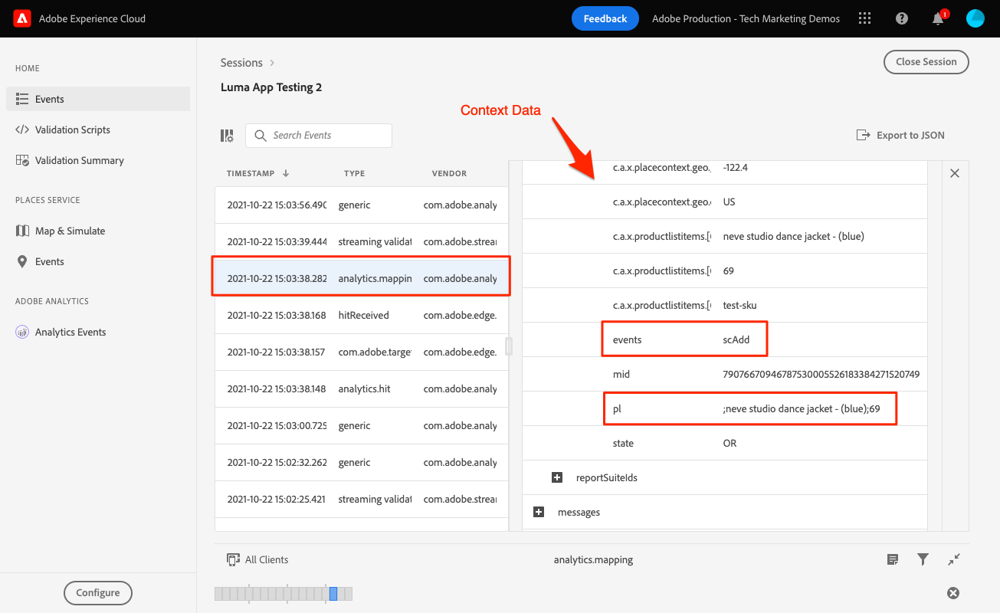
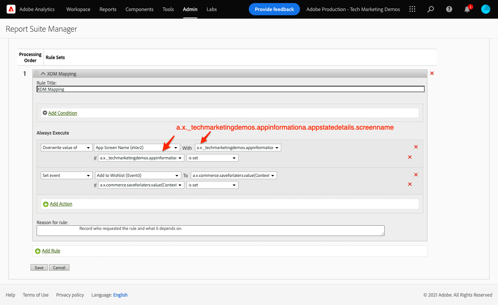

# Analytics mapping

Learn how to map mobile data to Adobe Analytics.

>[!INFO]
>
> This tutorial will be replaced with a new tutorial using a new sample mobile app in late November 2023


The [event](events.md) data which you collected and sent to Platform Edge Network in earlier lessons is forwarded to the services configured in your datastream, including Adobe Analytics. You just need to map the data to the correct variables in your report suite.

## Prerequisites

* Understanding of ExperienceEvent tracking.
* Successfully sending XDM data in your sample app.
* Datastream configured to Adobe Analytics

## Learning objectives

In this lesson, you will:

* Understand automatic mapping of Analytics variables.
* Set up processing rules to map XDM data to Analytics variables.

## Automatic mapping

Many of the standard XDM fields are automatically mapped to Analytics variables. See the full list [here](https://experienceleague.adobe.com/docs/experience-platform/edge/data-collection/adobe-analytics/automatically-mapped-vars.html?lang=en).

### Example #1 - s.products

A good example is the [products variable](https://experienceleague.adobe.com/docs/analytics/implementation/vars/page-vars/products.html?lang=en) which can't be populated using processing rules. With an XDM implementation, you pass all the necessary data in productListItems and s.products are automatically populated via Analytics mapping.

This object:

```swift
"productListItems": [
    [
      "name":  "Yoga Mat",
      "SKU": "5829",
      "priceTotal": "49.99",
      "quantity": 1
    ],
    [
      "name":  "Water Bottle",
      "SKU": "9841",
      "priceTotal": "30.00",
      "quantity": 3
    ]
]
```

Would result in the following:

```
s.products = ";Yoga Mat;1;49.99,;Water Bottle,3,30.00"
```

>[!NOTE]
>
>Currently `productListItems[N].SKU` is ignored by automatic mapping.

### Example #2 - scAdd

If you look closely, all events have two fields `value` (required) and `id` (optional). The `value` field is used to increment the event count. The `id` field is used for serialization.

This object:

```swift
"commerce" : {
  "productListAdds" : {
    "value" : 1
  }
}
```

Would result in the following:

```
s.events = "scAdd"
```

This object:

```swift
"commerce" : {
  "productListAdds" : {
    "value" : 1,
    "id": "321435"
  }
}
```

Would result in the following:

```
s.events = "scAdd:321435"
```

## Validate with Assurance

Using the [Assurance QA tool](assurance.md) you can confirm that you're sending an ExperienceEvent, the XDM data is correct and the Analytics mapping is happening as expected. For example:

1. Send a productListAdds event.

    ```swift
    var xdmData: [String: Any] = [
      "eventType": "commerce.productListAdds",
      "commerce": [
        "productListAdds": [
          "value": 1
        ]
      ],
      "productListItems": [
        [
          "name": "neve studio dance jacket - (blue)",
          "SKU": "test-sku",
          "priceTotal": 69
        ]
      ]
    ]
    let addToCartEvent = ExperienceEvent(xdm: xdmData)
    Edge.sendEvent(experienceEvent: addToCartEvent)
    ```

1. View the ExperienceEvent hit.

    

1. Review the XDM portion of the JSON.

    ```json
      "xdm" : {
        "productListItems" : [ {
          "priceTotal" : 69,
          "SKU" : "test-sku",
          "name" : "neve studio dance jacket - (blue)"
        } ],
        "timestamp" : "2021-10-22T22:03:37Z",
        "commerce" : {
          "productListAdds" : {
            "value" : 1
          }
        },
        "eventType" : "commerce.productListAdds",
        //...
      }
    ```

1. Review the `analytics.mapping` event.

    

Note the following in the Analytics mapping:

* 'events' was populated with 'scAdd' based on `commerce.productListAdds`.
* 'pl' (products variable) was populated with a concatenated value based on `productListItems`.
* There is other interesting information in this event including all the context data.


## Mapping with Context Data

XDM data forwarded to Analytics gets converted into [context data](https://experienceleague.adobe.com/docs/mobile-services/ios/getting-started-ios/proc-rules.html?lang=en) including both standard and custom fields.

The context data key is constructed following this syntax:

```
a.x.[xdm path]
```

For example:

```
//Standard Field
a.x.commerce.saveforlaters.value

//Custom Field
a.x._techmarketingdemos.appinformationa.appstatedetails.screenname
```

>[!NOTE]
>
>Custom fields are placed under your Experience Cloud Org identifier.
>
>"_techmarketingdemos" is replaced with your Org's unique value.

Here is what a processing rule using this data might look like:



>[!IMPORTANT]
>
>
>Some of the automatically mapped variables may not be available for use in processing rules.
>
>
>The first time you map to a processing rule the UI does not show you the context data variables from the XDM object. To fix that select any value, Save, and come back to edit. All XDM variables should now appear.


Addition information about processing rules and context data can be found [here](https://experienceleague.adobe.com/docs/analytics-learn/tutorials/implementation/implementation-basics/map-contextdata-variables-into-props-and-evars-with-processing-rules.html?lang=en).

>[!TIP]
>
>Unlike previous mobile app implementations, there is no distinction between a page/screen views and other event. Instead you can increment the **[!UICONTROL Page View]** metric by setting the **[!UICONTROL Page Name]** dimension in a processing rule. Since you are collecting the custom `screenName` field in the tutorial, it is highly recommended to map this to **[!UICONTROL Page Name]** in a processing rule.


Next: **[Experience Platform](platform.md)**

>[!NOTE]
>
>Thank you for investing your time in learning about Adobe Experience Platform Mobile SDK. If you have questions, want to share general feedback, or have suggestions on future content, share them on this [Experience League Community discussion post](https://experienceleaguecommunities.adobe.com/t5/adobe-experience-platform-data/tutorial-discussion-implement-adobe-experience-cloud-in-mobile/td-p/443796)