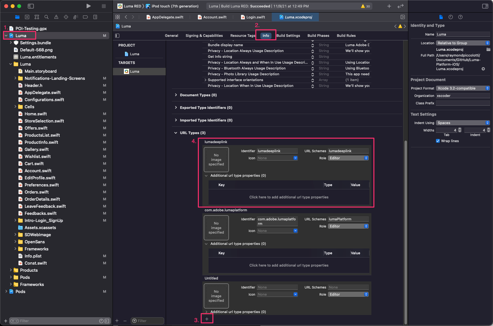
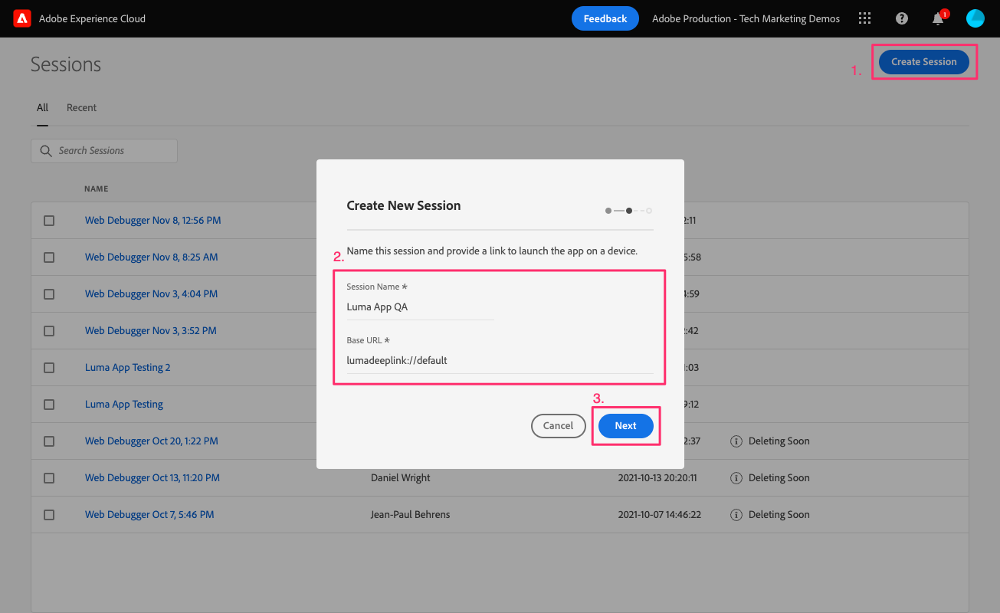
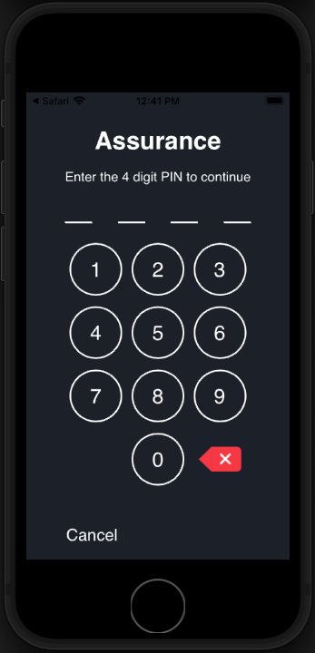
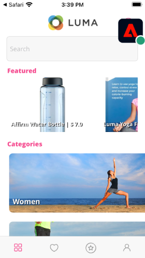
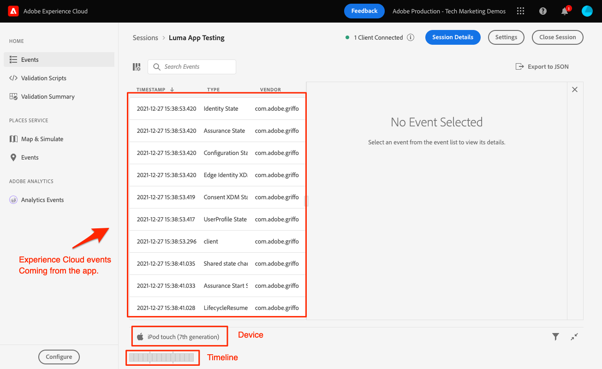

# Assurance

Learn how to set up Adobe Experience Platform Assurance in a mobile app.

Assurance, formally known as Project Griffon, is designed to help you inspect, proof, simulate, and validate how you collect data or serve experiences in your mobile app.

Assurance helps you inspect raw SDK events generated by the Adobe Experience Platform Mobile SDK. All events collected by the SDK are available for inspection. SDK events are loaded in a list view, sorted by time. Each event has a detailed view that provides further detail. Additional views to browse SDK configuration, data elements, Shared States, and SDK extension versions are also provided. Learn more about the [Assurance](https://experienceleague.adobe.com/docs/experience-platform/assurance/home.html) in the product documentation.


## Prerequisites

* Successfully built and run the sample app with SDKs installed and configured.

## Learning objectives

In this lesson, you will:

* Confirm that your organization has access (and request it if you don't).
* Set up your Base URL.
* Add required iOS specific code.
* Connect to a session.

## Confirm access

Confirm that your organization has access to Assurance by completing the following steps:

1. Visit [https://experience.adobe.com/#/assurance](https://experience.adobe.com/griffon){target="_blank"}
1. Log in using your Adobe ID credentials for the Experience Cloud.
1. If you are brought to the **[!UICONTROL Sessions]** screen, then you have access. If you are brought to the beta access page, select **[!UICONTROL Register]**.

## Implement

In addition to the general [SDK installation](install-sdks.md) you completed in the earlier lesson, iOS also requires the following addition. Add the following code to the `AppDelegate.swift` file:

```swift
func application(_ app: UIApplication, open url: URL, options: [UIApplication.OpenURLOptionsKey: Any] = [:]) -> Bool {
    Assurance.startSession(url: url)
    return true
}
```

The sample Luma provided for this tutorial uses iOS 12.0. If you're following along with your own scene-based application using iOS 13 and later, use the `UISceneDelegate's scene(_:openURLContexts:)` method as follows:

```swift
func scene(_ scene: UIScene, openURLContexts URLContexts: Set<UIOpenURLContext>) {
    // Called when the app in background is opened with a deep link.
    if let deepLinkURL = URLContexts.first?.url {
        Assurance.startSession(url: deepLinkURL)
    }
}
```

More information can be found [here](https://developer.adobe.com/client-sdks/documentation/platform-assurance-sdk/api-reference/){target="_blank"}.

## Set up a base URL

1. Open XCode and select the project name.
1. Navigate to the **Info** tab.
1. Scroll down to **URL Types** and select the **+** button to add a new one.
1. Set **Identifier** and **URL Schemes** to "lumadeeplink".
1. Build and run the app.



To learn more about URL Schemes in iOS, please review [Apple's documentation](https://developer.apple.com/documentation/xcode/defining-a-custom-url-scheme-for-your-app){target="_blank"}.

Assurance works by opening a URL, either via browser or QR code, that URL begins with the base URL which opens the app and contains additional parameters. Those unique parameters are used to connect the session.

## Connecting to a session

1. Navigate to the [Assurance UI](https://experience.adobe.com/griffon){target="_blank"}.
1. Select **[!UICONTROL Create Session]**.
1. Provide **[!UICONTROL Session Name]** such as `Luma App QA` and the **[!UICONTROL Base URL]** `lumadeeplink://default`
1. Select **[!UICONTROL Next]**.
    
1. **[!UICONTROL Scan QR Code]** if you're using a physical device. If you're using the simulator, then **[!UICONTROL Copy Link]** and open it with Safari in the simulator.
    
1. When the app loads you are presented with a modal asking you to enter your PIN from the previous step.
    
1. If the connection was successful, you will see events in the Assurance web UI and a floating Assurance icon in the app.
    * Assurance icon floating.
        
    * Experience Cloud events coming through in the web UI.
        

If you run into any challenges, please review the [technical](https://developer.adobe.com/client-sdks/documentation/platform-assurance-sdk/){target="_blank"} and [general documentation](https://experienceleague.adobe.com/docs/experience-platform/assurance/home.html){target="_blank"}.

Next: **[Consent](consent.md)**

>[!NOTE]
>
>Thank you for investing your time in learning about Adobe Experience Platform Mobile SDK. If you have questions, want to share general feedback, or have suggestions on future content, please share them on this [Experience League Community discussion post](https://experienceleaguecommunities.adobe.com/t5/adobe-experience-platform-launch/tutorial-discussion-implement-adobe-experience-cloud-in-mobile/td-p/443796)
