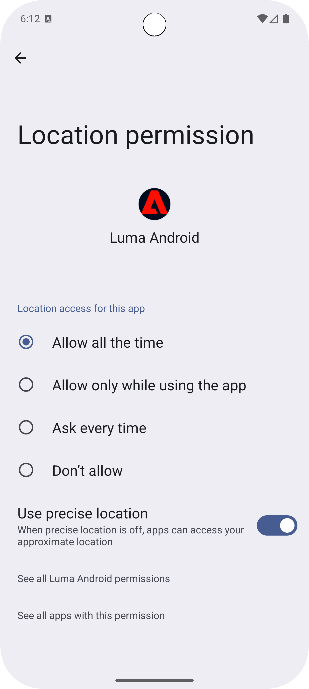

# Set up Assurance

Learn how to set up Adobe Experience Platform Assurance in a mobile app.

Assurance, formally known as Project Griffon, is designed to help you inspect, proof, simulate, and validate how you collect data or serve experiences in your mobile app.

Assurance helps you inspect raw SDK events generated by the Adobe Experience Platform Mobile SDK. All events collected by the SDK are available for inspection. SDK events are loaded in a list view, sorted by time. Each event has a detailed view that provides further detail. Additional views to browse SDK configuration, data elements, Shared States, and SDK extension versions are also provided. Learn more about the [Assurance](https://experienceleague.adobe.com/docs/experience-platform/assurance/home.html) in the product documentation.


## Prerequisites

* Successfully set up the app with SDKs installed and configured.

## Learning objectives

In this lesson, you will:

* Confirm that your organization has access (and request it if you don't).
* Set up your base URL.
* Add required iOS specific code.
* Connect to a session.

## Confirm access

Confirm that your organization has access to Assurance. You, as user, should be added to profile for Adobe Experience Platform. See [User access](https://experienceleague.adobe.com/docs/experience-platform/assurance/user-access.html?lang=en) in the Assurance guide for more information.

## Implement

>[!BEGINTABS]

>[!TAB iOS]

In addition to the general [SDK installation](install-sdks.md), you completed in the earlier lesson, iOS also requires the following addition to start the Assurance session for your app. 

1. Navigate to **[!DNL Luma]** > **[!DNL Luma]** > **[!UICONTROL SceneDelegate]** in your Xcode's Project navigator.
 
1. Add the following code to `func scene(_ scene: UIScene, openURLContexts URLContexts: Set<UIOpenURLContext>`:

   ```swift
   // Called when the app in background is opened with a deep link.
   if let deepLinkURL = URLContexts.first?.url {
       // Start the Assurance session
       Assurance.startSession(url: deepLinkURL)
   }
   ```

    This code starts an assurance session when the app is in the background and opened using a deep link.

>[!TAB Android]

In addition to the general [SDK installation](install-sdks.md), you completed in the earlier lesson, Android also requires the following addition to start the Assurance session for your app. 

1. Naviagte to **[!UICONTROL app]** > **[!UICONTROL kotlin+java]** > **[!UICONTROL com.adobe.luma.tutorial.android]** > **[!UICONTROL LumaApplication]**.
 
1. Add the following code to `fun handleDeeplink(deeplink: String?)`:

   ```kotlin
   // Called when the app in background is opened with a deep link.
   if (deeplink.isNullOrEmpty()) {
      Log.w("Luma", "Deeplink is null or empty")
      return
   }

   Log.i("Luma", "Handling deeplink: $deeplink")
   Assurance.startSession(deeplink)
   ```

    This code starts an assurance session when the app is in the background and opened using a deep link.

>[!ENDTABS]


See [Assurance API reference](https://developer.adobe.com/client-sdks/documentation/platform-assurance-sdk/api-reference/){target="_blank"} for more information.


## Define bundle identifier

You need to provide a unique bundle identifier for your app.

>[!BEGINTABS]

>[!TAB iOS]

1. Open the project in Xcode.
1. Select **[!DNL Luma]** in the Project navigator.
1. Select the **[!DNL Luma]** target.
1. Select the **Signing & Capabilities** tab.
1. Define a **[!UICONTROL Bundle Identifier]**. 
 
Ensure you use a _unique_ bundle identifier and replace the `com.adobe.luma.tutorial.swiftui` bundle identifier, as each bundle identifier needs to be unique. Typically, you use a reverse-DNS format for bundle ID strings, like `com.organization.brand.uniqueidentifier`. The Finished version of this tutorial, for example, uses `com.adobe.luma.tutorial.swiftui`.

{zoomable="yes"}

>[!TAB Android]

1. Open the project in Android Studio.
1. Select **[!UICONTROL build.gradle.kts (Module:app)]** in the navigator.
1. Ensure you use a _unique_ bundle identifier and replace the `com.adobe.luma.tutorial.android` value for `namespace` in `android`
1. Ensure you use the same _unique_ bundle identifier and replace the `com.adobe.luma.tutorial.android` for `applicationId` in `defaultConfig` in `android`
 
Typically, you use a reverse-DNS format for bundle ID strings, like `com.organization.brand.uniqueidentifier`. The Finished version of this tutorial, for example, uses `com.adobe.luma.tutorial.swiftui`.

{zoomable="yes"}

>[!ENDTABS]


## Set up a base URL

You need to set up a base URL to ensure deep linking works.

>[!BEGINTABS]

>[!TAB iOS]

1. Go to your project in Xcode.
1. Select **[!DNL Luma]** in the Project navigator.
1. Select the **[!DNL Luma]** target.
1. Select the **Info** tab.
1. To add a base URL, scroll down to **URL Types** and select the **+** button.
1. Set **Identifier** to the Bundle Identifier of your choice and set a **URL Schemes** of your choice .

   

Ensure you use a _unique_ bundle identifier and replace the `com.adobe.luma.tutorial.swiftui` bundle identifier, as each bundle identifier must be unique. Typically, you use a reverse-DNS format for bundle ID strings, like `com.organization.brand.uniqueidentifier`. You can use the same bundle identifier that you have used at [Define bundle identifier](#define-bundle-identifier).<br/>Similarly, use a unique URL scheme, and replace the already provided `lumatutorialswiftui` with your unique URL scheme.

To learn more about URL Schemes in iOS, review [Apple's documentation](https://developer.apple.com/documentation/xcode/defining-a-custom-url-scheme-for-your-app){target="_blank"}.

Assurance works by opening a URL, either via browser or QR code. That URL begins with the base URL  which opens the app and contains additional parameters. Those unique parameters are used to connect the session.

>[!TAB Android]

1. Go to your project in Android Studio.
1. Select **[!UICONTROL app]** > **[!UICONTROL manifests]** > **[!UICONTROL AndroidManifest.xml]** in the navigator.
1. Ensure the **[!UICONTROL manifest]** > **[!UICONTROL application]** > **[!UICONTROL activity]** XML element looks like:

   ```xml
   <activity
      android:name=".MainActivity"
      android:exported="true"
      android:theme="@style/Theme.LumaAndroid">
      <intent-filter>
            <action android:name="android.intent.action.MAIN" />
            <category android:name="android.intent.category.LAUNCHER" />
      </intent-filter>
      <intent-filter
            android:label="@string/app_name">
            <action android:name="android.intent.action.VIEW" />
            <category android:name="android.intent.category.DEFAULT" />
            <category android:name="android.intent.category.BROWSABLE" />
            <data android:scheme="lumatutorialandroid"
               android:host="default" />
      </intent-filter>
   </activity>
   ```

Ensure you specify an `android:scheme` (for example. `lumatutorialandroid`) and `android:host` (for example `default`) to define the base URL.

To learn more about deeplinks in Android, see [Create Deep Links to App Content](https://developer.apple.com/documentation/xcode/defining-a-custom-url-scheme-for-your-app){target="_blank"}.

Assurance works by opening a URL, either via browser or QR code. That URL begins with the base URL, which opens the app and contains additional parameters. Those unique parameters are used to connect the session.

>[!ENDTABS]


## Connecting to a session

You now use Assurance to connect to a session.

>[!BEGINTABS]

>[!TAB iOS]

In Xcode: 

1. Build or rebuild and run the app in the simulator or on a physical device from Xcode, using . 

   Optionally, you might want to 'clean' your build, especially when you see unexpected results. To do this, select **[!UICONTROL Clean Build Folder…]** from the Xcode **[!UICONTROL Product]** menu. 

   
1. In the **[!UICONTROL Allow "Luma App" to use your location]** dialog, select **[!UICONTROL Allow While Using App]**.
 
   

1. In the **[!UICONTROL "Luma App" Would Like to Send You Notifications]** dialog, select **[!UICONTROL Allow]**.
 
   

1. Select **[!UICONTROL Continue…]** to allow the app to track your activity.
 
   

1. In the **[!UICONTROL Allow "Luma App" to track your activity across other companies' apps and websites]** dialog, select **[!UICONTROL Allow]**.
 
   


In your browser:

1. Go to the Data Collection UI.
1. Select **[!UICONTROL Assurance]** from the left rail.
1. Select **[!UICONTROL Create New Session]**, and the option **[!UICONTROL Deep link connect]**.
1. Select **[!UICONTROL Start]**.
1. Provide a **[!UICONTROL Session Name]** such as `Luma Mobile App Session` and the **[!UICONTROL Base URL]**, which is the URL Schemes you entered in Xcode, followed by `://` For example: `lumatutorialswiftui://`
1. Select **[!UICONTROL Next]**.
    
1. In the **[!UICONTROL Create New Session]** modal dialog:
   
   If you're using a physical device: 

   * Select **[!UICONTROL Scan QR Code]**. To open the app, use the camera on your physical device to scan the QR code and tap the link.

     

   If you are using a simulator:

   1. Select **[!UICONTROL Copy Link]**.
   1. Copy the deep link using   and use the deep link to open the app with Safari in the simulator.
     
    
1. When the app loads, you are presented with a modal dialog asking you to enter the PIN shown in step 7.
   
   

   Enter the PIN and select **[!UICONTROL Connect]**.


1. If the connection was successful, you see:
    * An Assurance icon floating on top of your app.
      
       
    
    * Experience Cloud updates coming through in the Assurance UI, showing:

      1. Experience Events coming from the app.
      1. Details of a selected event.
      1. The device and timeline.

         

1. Select **[!UICONTROL Continue]** to go the Home screen.

>[!TAB Android]

In Android Studio: 

1. Build or rebuild and run the app in the simulator or on a physical device from Android Studio, using . 

   Optionally, you might want to 'clean' your build, especially when you see unexpected results. To do this, select **[!UICONTROL Clean Project]** from the Android Studio **[!UICONTROL Build]** menu. 

   
1. In the **[!UICONTROL Allow Luma Android to send you notifications]** dialog, select **[!UICONTROL Allow]**.
 
   

1. Select **[!UICONTROL Show permission dialog]**.

   

1. In the **[!UICONTROL Allow Luma Android to access this device's location?]**... 

   

   * Select **[!UICONTROL Precise]**.
   * Select **[!UICONTROL While using the app]**.

1. Back in the introduction app screen, select **[!UICONTROL Open device settings]**.

1. In the **[!UICONTROL Location permission]** screen, select **[!UICONTROL Allow all the time]**. Then select **[!UICONTROL ←]** to return to the introduction app screen.

   

1. Select **[!UICONTROL Continue]** to go to the Home screen.


In your browser:

1. Go to the Data Collection UI.
1. Select **[!UICONTROL Assurance]** from the left rail.
1. Select **[!UICONTROL Create New Session]**, and the option **[!UICONTROL Deep link connect]**.
1. Select **[!UICONTROL Start]**.
1. Provide a **[!UICONTROL Session Name]** such as `Luma Mobile App Session` and the **[!UICONTROL Base URL]**, which is the `android:scheme` and `android:host` you defined in **[!UICONTROL AndroidManifest.xml]** in Android Studio, separated by `://` For example: `lumatutorialandroid://default`
1. Select **[!UICONTROL Next]**.
    

1. In the **[!UICONTROL Create New Session]** modal dialog:
   
   If you're using a physical device: 

   * Select **[!UICONTROL Scan QR Code]**. To open the app, use the camera on your physical device to scan the QR code and tap the link.

     

   If you are using a simulator:

   1. Select **[!UICONTROL Copy Link]**.
   1. Copy the deep link using   and use the deep link to open the app with Chrome in the simulator. 
   
     

      When prompted in Chrome to **Continue to Luma Android**, select **Continue**.
    
1. When the app loads, you are presented with a modal dialog asking you to enter the PIN shown in step 7.
   
   

   Enter the PIN and select **[!UICONTROL Connect]**.


1. If the connection was successful, you see:
    * An Assurance icon floating on top of your app.
      
       
    
    * Experience Cloud updates coming through in the Assurance UI, showing:

      1. Experience Events coming from the app.
      1. Details of a selected event.
      1. The device and timeline.

         

>[!ENDTABS]

If you run into any challenges, review the [technical](https://developer.adobe.com/client-sdks/documentation/platform-assurance-sdk/){target="_blank"} and [general documentation](https://experienceleague.adobe.com/docs/experience-platform/assurance/home.html){target="_blank"}.


## Verify extensions

To verify whether your app is using the most up-to-date extensions:

1. Select **[!UICONTROL Configure]**.

1. Select  for  **[!UICONTROL Extension Versions]**.

1. Select **[!UICONTROL Save]**.

   

1. Select  **[!UICONTROL Extension Versions]** to see an overview of the latest extensions available and the extensions used in your version of the app.

>[!BEGINTABS]

>[!TAB iOS]


To update your extension versions (for example, **[!UICONTROL Messaging]** and **[!UICONTROL Optimize]**) select the package (extension) from **[!UICONTROL Package Dependencies]** (for example, **[!UICONTROL AEPMessaging]**) and from the context menu select **[!UICONTROL Update Package]**. Xcode will update the package dependencies.

>[!TAB Android]


If you see outdated extensions, refer to the [Android Studio documentation](https://developer.android.com/build/agp-upgrade-assistant) how to update your dependency modules for your project.


>[!ENDTABS]

>[!NOTE]
>
>Once you have updated your extensions (packages) in your development environment, close and delete your current session and repeat all steps from [Connecting to a session](#connecting-to-a-session) and [Verify extensions](#verify-extensions) to ensure Assurance properly reports the correct extensions in a new Assurance session.


>[!SUCCESS]
>
>You have now set up your app to use Assurance for the remainder of the tutorial.
>
>Thank you for investing your time in learning about Adobe Experience Platform Mobile SDK. If you have questions, want to share general feedback, or have suggestions on future content, share them on this [Experience League Community discussion post](https://experienceleaguecommunities.adobe.com/t5/adobe-experience-platform-data/tutorial-discussion-implement-adobe-experience-cloud-in-mobile/td-p/443796)


Next: **[Implement Consent](consent.md)**
