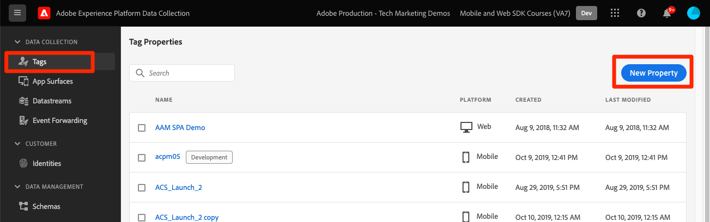
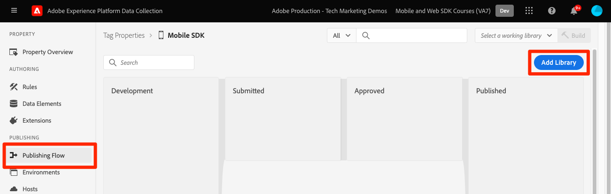
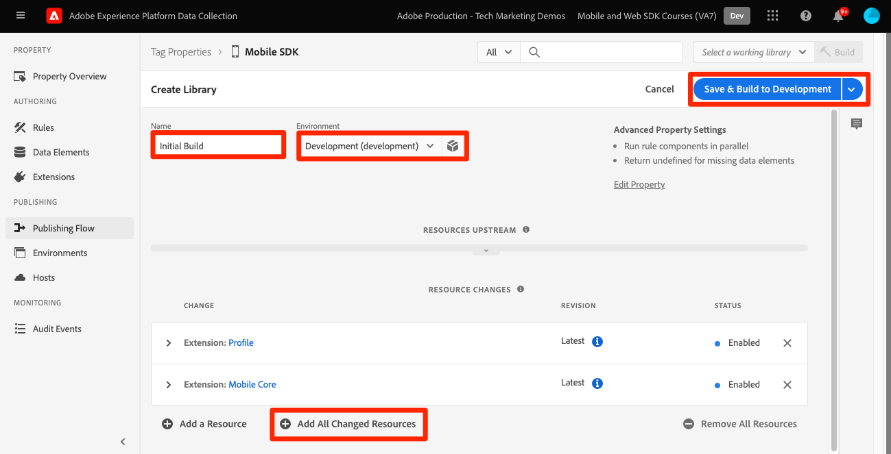
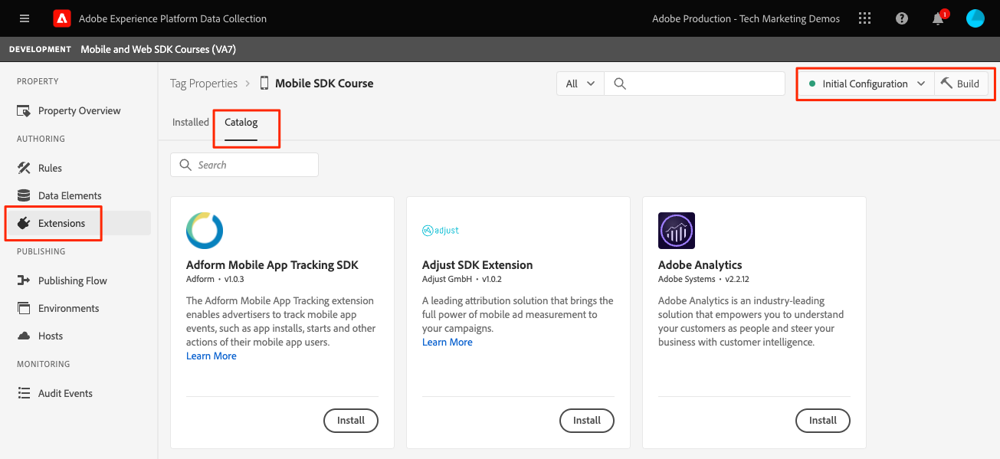
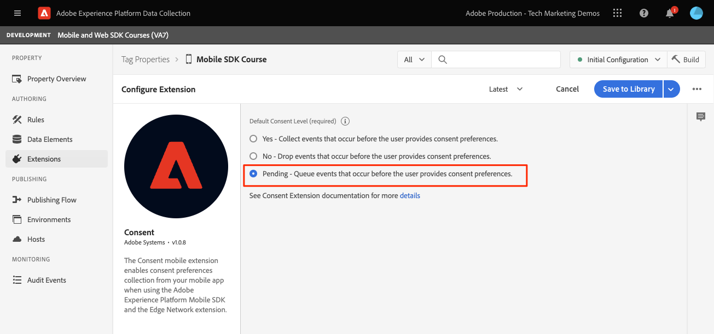
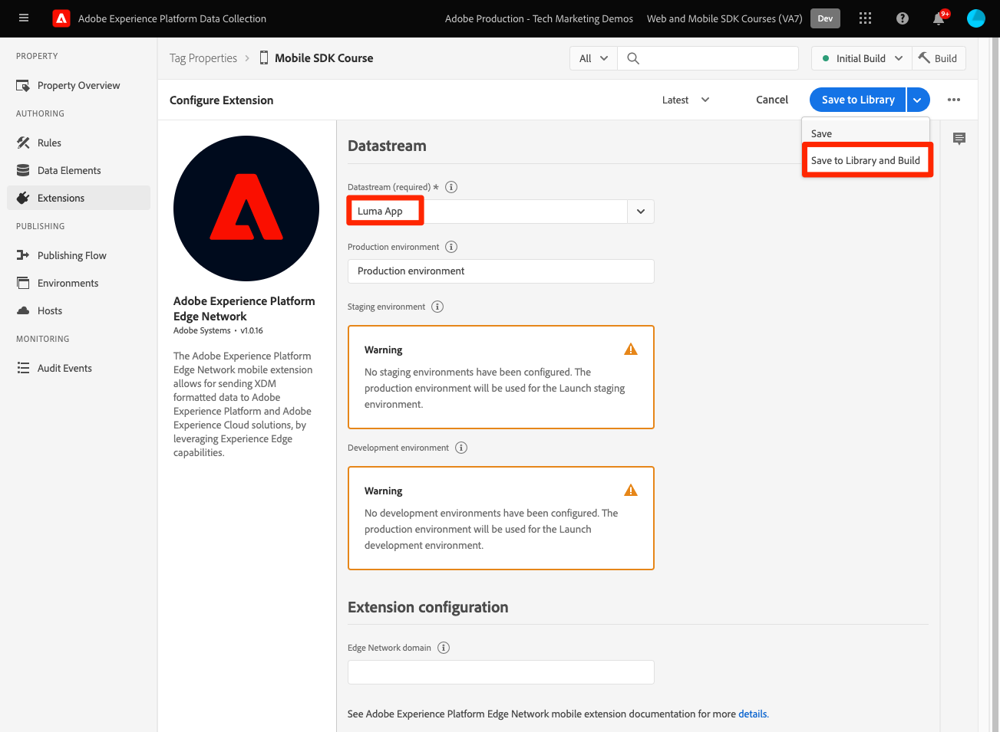
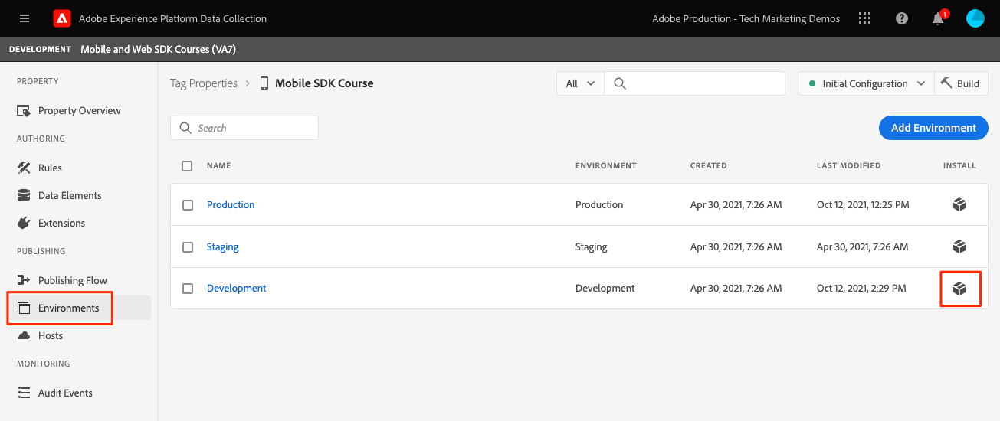
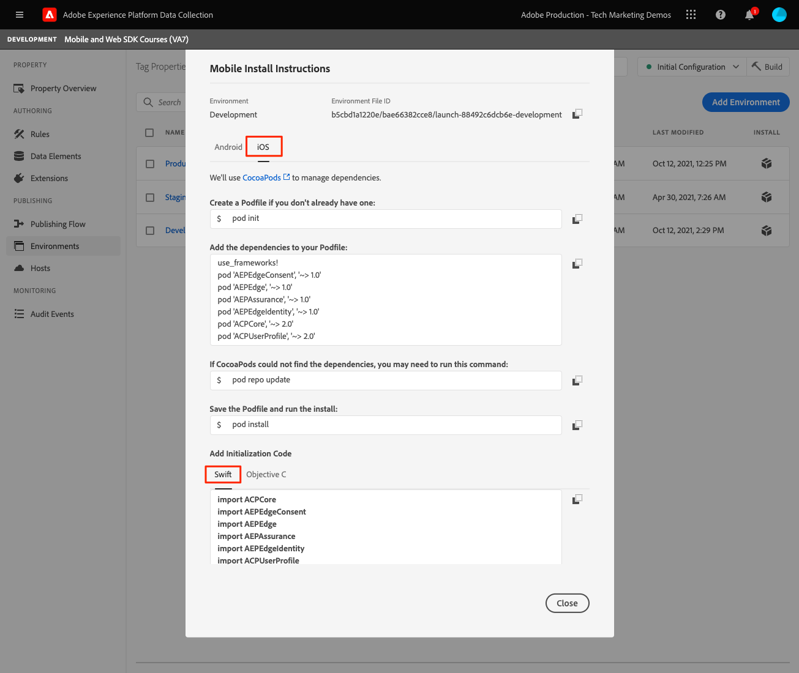

# Configure a tag property

Learn how to configure a tag property in the [!UICONTROL Data Collection] interface.

Tags in Adobe Experience Platform are the next generation of tag management capabilities from Adobe. Tags give customers a simple way to deploy and manage all of the analytics, marketing, and advertising tags necessary to power relevant customer experiences. Learn more about [tags](https://experienceleague.adobe.com/docs/experience-platform/tags/home.html) in the product documentation.

## Prerequisites

In order to complete the lesson, you must have permission to create a tag property. It's also helpful to have a baseline understanding of tags. 

>[!NOTE]
>
> Platform Launch (Client Side) is now [tags](https://experienceleague.adobe.com/docs/experience-platform/tags/home.html?lang=en)

## Learning objectives

In this lesson, you will:

* Install and configure the mobile tag extensions.
* Generate the SDK install instructions.

## Initial setup

1. Create a new mobile tag property:
    1. In the [Data Collection interface](https://experience.adobe.com/data-collection/){target="_blank"}, select **[!UICONTROL Tags]** in the left navigation
    1. Select **[!UICONTROL New Property]**
     .
    1. For the **[!UICONTROL Name]**, enter `Mobile SDK Course`.
    1. For the **[!UICONTROL Platform]**, select **[!UICONTROL Mobile]**.
    1. Select  **[!UICONTROL Save]**. 
     
        

1. Open the new property    
1. Create a library:

    1. Go to **[!UICONTROL Publishing Flow]** in the left navigation.
    1. Select **[!UICONTROL Add Library]**.

        

    1. For the **[!UICONTROL Name]**, enter `Initial Build`.
    1. For the **[!UICONTROL Environment]**, select **[!UICONTROL Development]**.
    1. Select  **[!UICONTROL Add All Changed Resources]**. 
    1. Select **[!UICONTROL Save and Build to Development]**. 

        
        
    1. Finally, set it as your **[!UICONTROL Working Library]**. 
        
1. Select **[!UICONTROL Extensions]**.
    
    The Mobile Core and Profile extensions should be pre-installed.

1. Select **[!UICONTROL Catalog]**.

    

1. Use the [!UICONTROL Search] feature to find an install the following extensions. Neither of these extensions require any configuration:
    * Identity
    * AEP Assurance 

## Extension configuration

1. Install the **Consent** extension.

    For the purposes of this tutorial select **[!UICONTROL Pending]**. Learn more about the Consent extension in [the documentation](https://aep-sdks.gitbook.io/docs/foundation-extensions/consent-for-edge-network).
    
    

1. Install the **Adobe Experience Platform Edge Network** extension. 
    
    In the **[!UICONTROL Edge Configuration]** dropdown, select the datastream you created in the [previous step](create-datastream.md). 
    
1. Select **[!UICONTROL Save to Library and Build]**.

    

## Generate SDK install instructions

1. Select **[!UICONTROL Environments]**.

1. Select the **[!UICONTROL Development]** install icon.

    

1. Select **[!UICONTROL iOS]**.

1. Select **[!UICONTROL Swift]**.

    

1. The install instructions provide you a good starting point for implementation. 

    You can find additional information [here](https://aep-sdks.gitbook.io/docs/getting-started/get-the-sdk).

    * **[!UICONTROL Environment File ID]**: This unique ID points to your development environment, make note of this value. Production/Staging/Development will all have different ID values.
    * **[!UICONTROL Podfile]**: CocoaPods are used to manage SDK versions and downloads. To learn more, please review the [documentation](https://cocoapods.org/).
    * **[!UICONTROL Initialization Code]**:  This block of code shows how to import the required SDKs and register the extensions at launch.

>[!NOTE]
>The install instructions should be considered a starting point and not definitive documentation. The latest SDK versions and code samples can be found in the official [documentation](https://aep-sdks.gitbook.io/docs/).

## Mobile tags architecture

If you are familiar with the web version of tags, formerly Launch, it's important to understand the differences on mobile. 

On the web, a tag property is rendered into JavaScript which is then (usually) hosted in the cloud. That JS file is referenced directly in the website.

In a mobile tag property, rules and configurations are rendered into JSON files which are hosted in the cloud. The JSON files are downloaded and read by the Mobile Core extension in the mobile app. Extensions are separate SDKs that work together. If you add an extension to your tag property, you must also update the app. If you change an extension setting or create a rule, those changes are reflected in the app once you publish the updated tag library.

Next: **[Install SDKs](install-sdks.md)**