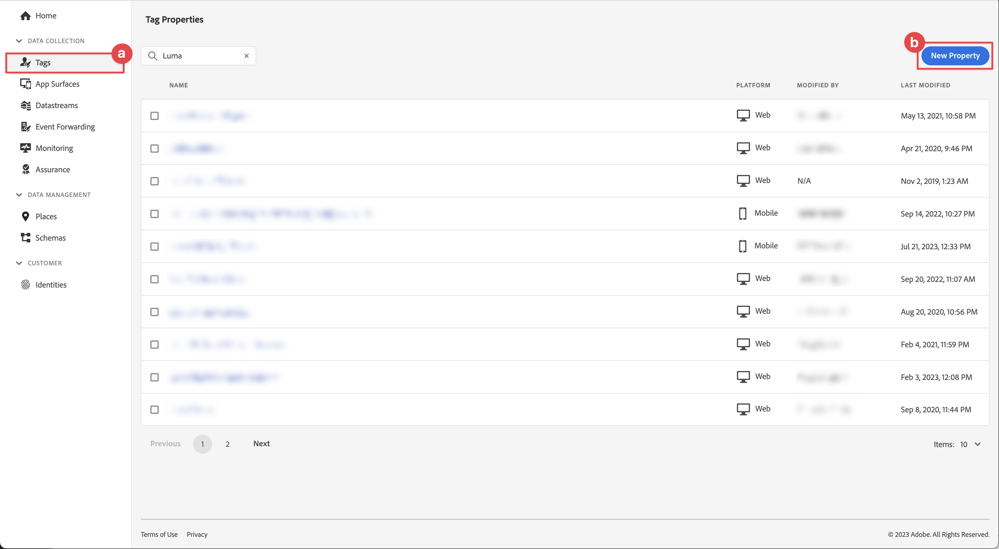
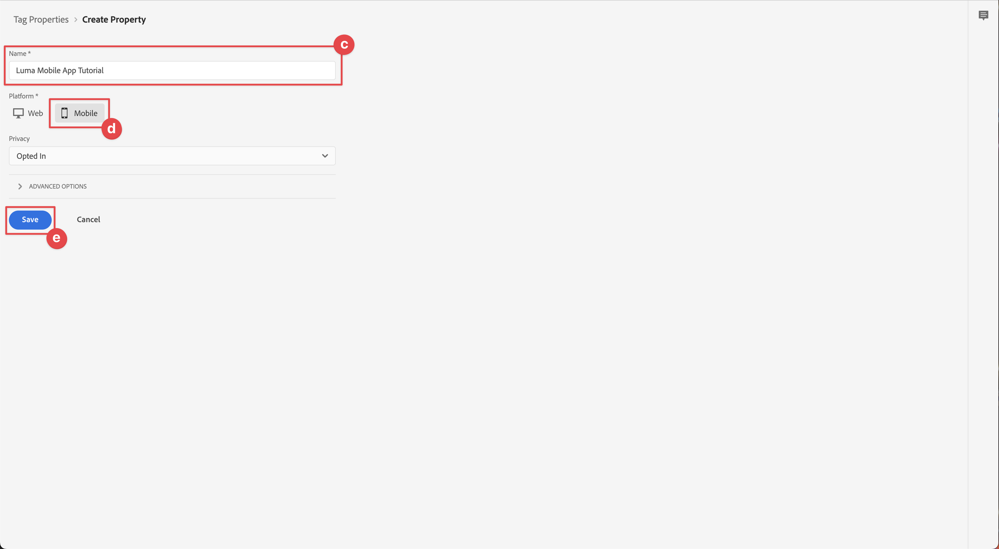
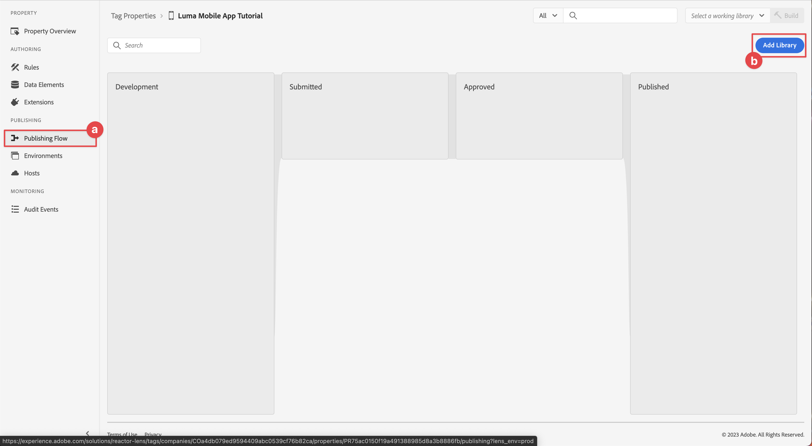
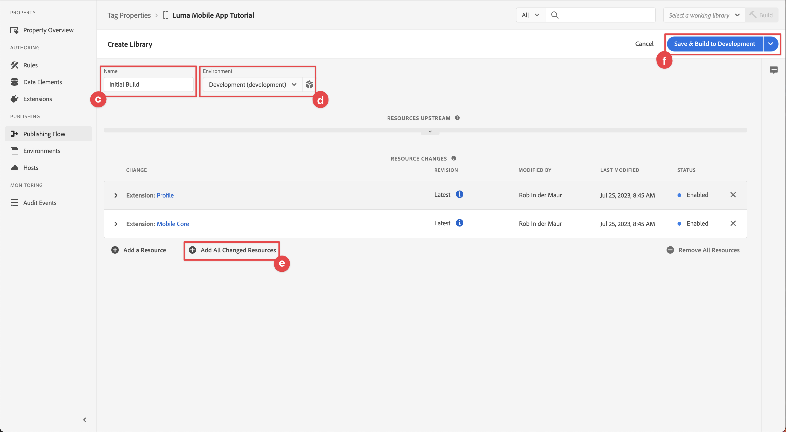
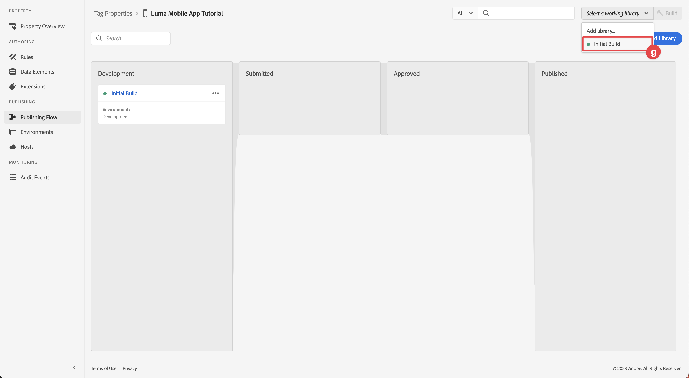
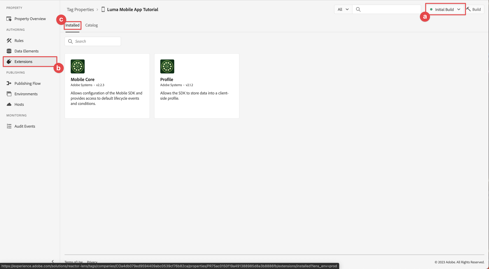
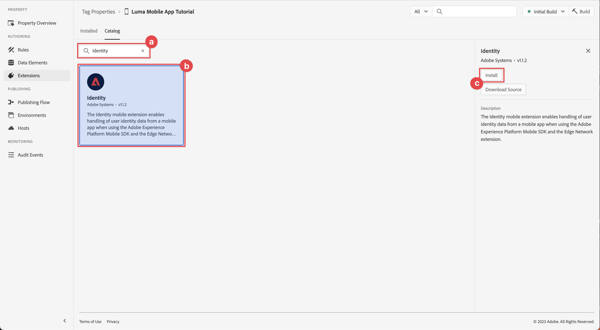
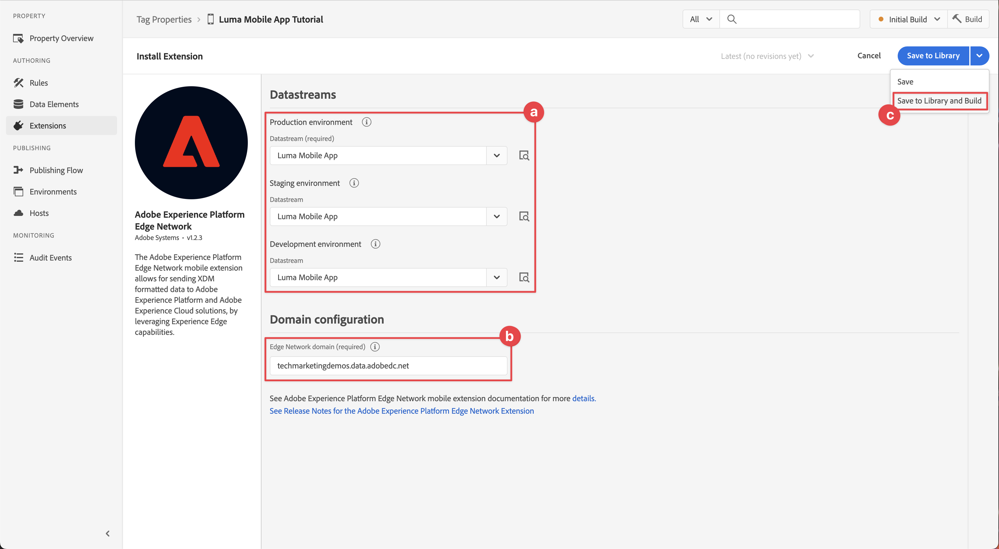

# Configure a tag property

Learn how to configure a tag property in the [!UICONTROL Data Collection] interface.

Tags in Adobe Experience Platform are the next generation of tag management capabilities from Adobe. Tags give customers a simple way to deploy and manage analytics, marketing, and advertising tags necessary to power relevant customer experiences. Learn more about [Tags](https://experienceleague.adobe.com/docs/experience-platform/tags/home.html) in the product documentation.

## Prerequisites

To complete the lesson, you must have permission to create a tag property. It's also helpful to have a baseline understanding of tags. 

>[!NOTE]
>
> Platform Launch (Client Side) is now [Tags](https://experienceleague.adobe.com/docs/experience-platform/tags/home.html?lang=en)

## Learning objectives

In this lesson, you will:

* Install and configure the mobile tag extensions.
* Generate the SDK install instructions.

## Initial setup

1. Create a new mobile tag property in the Data Collection Interface:
    1. Select **[!UICONTROL Tags]** in the left navigation.
    1. Select **[!UICONTROL New Property]**
       .
    1. For the **[!UICONTROL Name]**, enter `Luma Mobile App Tutorial`.
    1. For the **[!UICONTROL Platform]**, select **[!UICONTROL Mobile]**.
    1. Select  **[!UICONTROL Save]**. 
     
        

        >[!NOTE]
        >
        > Default consent settings for the edge-based mobile sdk implementations such as the one you are doing in this lesson come from the [!UICONTROL Consent extension] and not the [!UICONTROL Privacy] setting in the tag property configuration. You add and configure the Consent extension later in this lesson. For more info, see [the documentation](https://developer.adobe.com/client-sdks/edge/consent-for-edge-network/).

1. Open the new property.    
1. Create a library:

    1. Go to **[!UICONTROL Publishing Flow]** in the left navigation.
    1. Select **[!UICONTROL Add Library]**.

        

    1. For the **[!UICONTROL Name]**, enter `Initial Build`.
    1. For the **[!UICONTROL Environment]**, select **[!UICONTROL Development (development)]**.
    1. Select   **[!UICONTROL Add All Changed Resources]**. 
    1. Select **[!UICONTROL Save and Build to Development]**. 

        
        
    1. Finally, select **[!UICONTROL Initial Build]** as your working library from the **[!UICONTROL Select a working library]** menu. 
        
1. Check extensions:

    1. Ensure that **[!UICONTROL Initial Build]** is selected as default library. 
   
    1. Select **[!UICONTROL Extensions]** in the left rail.

    1. Select the **[!UICONTROL Installed]** tab.
    
       The [!UICONTROL Mobile Core] and [!UICONTROL Profile] extensions should be pre-installed.

       

## Extension configuration

1. Ensure you are in **[!UICONTROL Extensions]** within your mobile app property.

1. Select **[!UICONTROL Catalog]**.

    

1. Use the  **[!UICONTROL Search]** field the find the **Identity** extension.

    1. Search for `Identity`.

    2. Select the **[!UICONTROL Identity]** extension.

    3. Select **[!UICONTROL Install]**.

       

    This extension does not require any further configuration.

1. Use the  **[!UICONTROL Search]** field to find and install the **AEP Assurance** extension.
    
   This extension does not require any further configuration.

1. Use the  **[!UICONTROL Search]** field to find and install the **Consent** extension. In the configuration screen:

    1. Select **[!UICONTROL Pending]**. In this tutorial, you manage consent further in the application. Learn more about the Consent extension in [the documentation](https://developer.adobe.com/client-sdks/documentation/consent-for-edge-network/).
    1. Select **[!UICONTROL Save to Library]**.
    
       

1. Use the  **[!UICONTROL Search]** field to find and install the **Adobe Experience Platform Edge Network** extension. 
    
    1. In **[!UICONTROL Datastreams]** select the **[!UICONTROL Datastream]** that you created in the [previous step](create-datastream.md) for each of the environments, for example **[!DNL Luma Mobile App]**.

    1. If not already populated, specify the **[!UICONTROL Edge Network domain]** within **[!UICONTROL Domain Configuration]**. The Edge Network domain is the name of your organization, followed by `data.adobedc.net`, for example `techmarketingdemos.data.adobedc.net`.

    1. From the **[!UICONTROL Save to Library]** menu, select **[!UICONTROL Save to Library and Build]**.

       

Your library is built for the new extensions and configurations. A successful build is indicated by a ● in the **[!UICONTROL Initial Build]** button.

## Generate SDK install instructions

1. Select **[!UICONTROL Environments]** from the left rail.

1. Select the **[!UICONTROL Development]** install icon  .

    

1. In the **[!UICONTROL Mobile Install Instructions]** dialog, select the **[!UICONTROL iOS]** tab.

1. You can copy  the instructions to set up your project using CocoaPods. CocoaPods are used to manage SDK versions and downloads. To learn more, please review the [CocoaPods documentation](https://cocoapods.org/). If you are using Android&trade; as your development platform, Gradle is the tool to manage SDK version, downloads, and dependencies. To learn more, please review the [Gradle documentation](https://gradle.org/)
 
   The install instructions provide you a good starting point for implementation. You can find additional information [here](https://developer.adobe.com/client-sdks/documentation/getting-started/get-the-sdk/).

   >[!INFO]
   >
   >For the remainder of this tutorial, you will **not** use the CocoaPods instructions but instead use a native Swift Package Manager (SPM) based setup.
   >

1. Select the **[!UICONTROL Swift]** tab below **[!UICONTROL Add Initialization Code]**. This block of code shows how to import the required SDKs and register the extensions at launch. This is covered in more detail in [Install SDKs](install-sdks.md).

1. Copy  the **[!UICONTROL Environment File ID]** and store it in a place as you need it later. This unique ID points to your development environment. Each environment (Production, Staging, Development) does have its own unique ID value.

   

>[!NOTE]
>
>The install instructions should be considered a starting point and not definitive documentation. The latest SDK versions and code samples can be found in the official [documentation](https://developer.adobe.com/client-sdks/home/).

## Mobile tags architecture

If you are familiar with the web version of Tags, formerly Launch, it's important to understand the differences on mobile. 

* On the web, a tag property is rendered into JavaScript which is then (usually) hosted in the cloud. That JavaScript file is referenced directly in the website.

* In a mobile tag property, rules and configurations are rendered into JSON files which are hosted in the cloud. The JSON files are downloaded and read by the Mobile Core extension in the mobile app. Extensions are separate SDKs that work together. If you add an extension to your tag property, you must also update the app. If you change an extension setting or create a rule, those changes are reflected in the app once you publish the updated tag library. That flexibility allows you to modify settings (like Adobe Analytics report suite id) or even change your app's behavior (using data elements and rules, as you will see in later lessons) without having to change code in your app and resubmit the app store.

>[!SUCCESS]
>
>You have now a mobile tag property to use in the remainder of this tutorial.
>
>Thank you for investing your time in learning about Adobe Experience Platform Mobile SDK. If you have questions, want to share general feedback, or have suggestions on future content, share them on this [Experience League Community discussion post](https://experienceleaguecommunities.adobe.com/t5/adobe-experience-platform-data/tutorial-discussion-implement-adobe-experience-cloud-in-mobile/td-p/443796)

Next: **[Install SDKs](install-sdks.md)**
