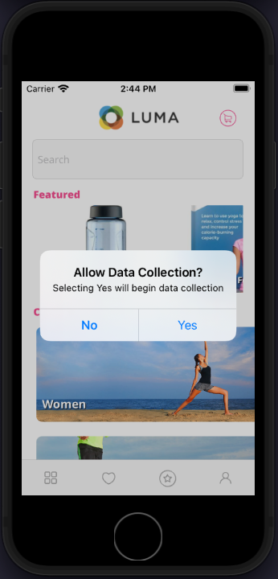
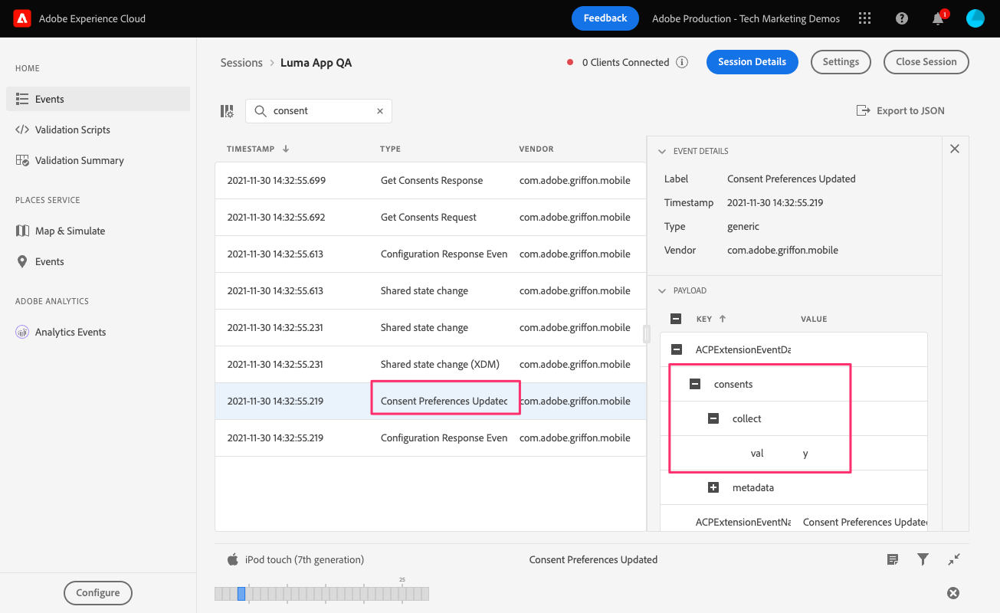

# Consent

Learn how to implement consent in a mobile app.

The Adobe Experience Platform Consent mobile extension enables consent preferences collection from your mobile app when using the Adobe Experience Platform Mobile SDK and the Edge Network extension. Learn more about the [Consent extension](https://developer.adobe.com/client-sdks/documentation/consent-for-edge-network/), in the documentation.

## Prerequisites

* Successfully built and run app with SDKs installed and configured.

## Learning objectives

In this lesson, you will:

* Prompt the user for consent.
* Update the extension based on the user response.
* Learn how to get the current consent state.

## Ask for consent

If you followed the tutorial from the beginning, you'll remember setting the **[!UICONTROL Default Consent Level]** to "Pending". In order to begin collecting data, you must get consent from the user. In this tutorial, get consent by simply asking with an alert, in a real-world app you'd want to consult consent best practices for your region.

1. You only want to ask the user once. One simple way to manage that is by simply using `UserDefaults`.
1. Navigate to `Home.swift`.
1. Add the following code to `viewDidLoad()`.

    ```swift
    let defaults = UserDefaults.standard
    let consentKey = "askForConsentYet"
    let hidePopUp = defaults.bool(forKey: consentKey)
    ```

1. If the user hasn't seen the alert before, then display it and update consent based on their response. Add the following code to `viewDidLoad()`.

    ```swift
    if(hidePopUp == false){
        //Consent Alert
        let alert = UIAlertController(title: "Allow Data Collection?", message: "Selecting Yes will begin data collection", preferredStyle: .alert)
        alert.addAction(UIAlertAction(title: "Yes", style: .default, handler: { action in
            //Update Consent -> "yes"
            let collectConsent = ["collect": ["val": "y"]]
            let currentConsents = ["consents": collectConsent]
            Consent.update(with: currentConsents)
            defaults.set(true, forKey: consentKey)
        }))
        alert.addAction(UIAlertAction(title: "No", style: .cancel, handler: { action in
            //Update Consent -> "no"
            let collectConsent = ["collect": ["val": "n"]]
            let currentConsents = ["consents": collectConsent]
            Consent.update(with: currentConsents)
            defaults.set(true, forKey: consentKey)
        }))
        self.present(alert, animated: true)
    }
    ```


## Get current consent state

The Consent mobile extension will automatically suppress/pend/allow tracking based the current consent value. You can also access the current consent state yourself:

1. Navigate to `Home.swift`.
1. Add the following code to `viewDidLoad()`.

```swift
Consent.getConsents{ consents, error in
    guard error == nil, let consents = consents else { return }
    guard let jsonData = try? JSONSerialization.data(withJSONObject: consents, options: .prettyPrinted) else { return }
    guard let jsonStr = String(data: jsonData, encoding: .utf8) else { return }
    print("Consent getConsents: ",jsonStr)
}
```

In the above example, you are simply printing the consent status to the console. In a real-world scenario, you might use it to modify what menus or options are shown to the user.

## Validate with Assurance

1. Review the [Assurance](assurance.md) lesson.
1. Install the app.
1. Launch the app using the Assurance-generated URL.
1. If you added the above code correctly, you will be prompted to provide consent. Select **Yes**.
    
1. You should see a **[!UICONTROL Consent Preferences Updated]** event in the Assurance UI.
    

Next: **[Collect lifecycle data](lifecycle-data.md)**

>[!NOTE]
>
>Thank you for investing your time in learning about Adobe Experience Platform Mobile SDK. If you have questions, want to share general feedback, or have suggestions on future content, please share them on this [Experience League Community discussion post](https://experienceleaguecommunities.adobe.com/t5/adobe-experience-platform-launch/tutorial-discussion-implement-adobe-experience-cloud-in-mobile/td-p/443796)