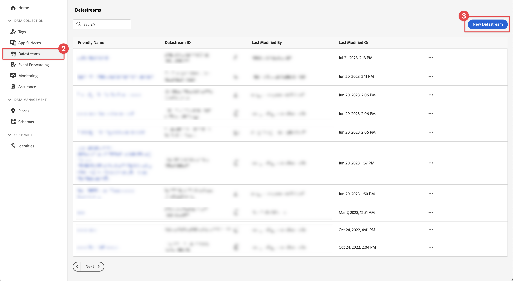

# Create a datastream

Learn how to create a datastream in Experience Platform.

A datastream is a server-side configuration on Platform Edge Network. The datastream ensures that incoming data to the Platform Edge Network is routed to Adobe Experience Cloud applications and services appropriately. For more information, see the [documentation](https://experienceleague.adobe.com/docs/experience-platform/datastreams/overview.html) or this [video](https://experienceleague.adobe.com/docs/platform-learn/data-collection/edge-network/configure-datastreams.html).

## Prerequisites

To create a datastream, your organization must be provisioned for this feature in the Data Collection interface (formerly [!UICONTROL Launch]) and you must have user permissions manage and view datastreams.

## Learning objectives

In this lesson, you will:

* Know when to use a datastream.
* Create a datastream.
* Configure a datastream.

## Create a datastream

Datastreams can be created in the [!UICONTROL Data Collection] interface using the [!UICONTROL Datastream] configuration tool. To create a datastream:

1. Make sure you are in the correct Experience Platform sandbox, as datastreams are defined on a sandbox level.
1. Select **[!UICONTROL Datastreams]** in the left rail.
1. Select **[!UICONTROL New Datastream]**. 

    

1. Provide a **[!UICONTROL Name]**, for example `Luma Mobile App` and a **[!UICONTROL Description]**, for example `Datastream for Luma Mobile App`.

    >[!NOTE]
    >
    >Final reminder: if you are going through this tutorial with multiple persons on a single sandbox or you are using a shared account, consider appending or prepending an identification as part of your naming conventions. For example, instead of `Luma Mobile App Event Dataset`, use `Luma Mobile App Event Dataset - Joe Smith`. See also the note in [Overview](overview.md).

1. Select the schema that you created in the previous lesson from the **Event Schema** list.
1. Select **[!UICONTROL Save]**.

    

## Add services

When you go through the (optional) [Analytics](analytics.md) and [Experience Platform](platform.md) lessons in this tutorial, you add services to your datastream so that data sent to Platform Edge Network is forwarded to these applications.

<!--

### Adobe Analytics

1. Select **[!UICONTROL Add Service]**.

1. Add **[!UICONTROL Adobe Analytics]** from the [!UICONTROL Service] list, 

1. Enter the name of the report site that you want to use in **[!UICONTROL Report Suite ID]**.

1. Enable the service by switching **[!UICONTROL Enabled]** on.

1. Select **[!UICONTROL Save]**.

   

### Adobe Experience Platform

You might also want to enable the Adobe Experience Platform service. 

>[!IMPORTANT]
>
>You can only enable the Adobe Experience Platform service when having created an event dataset. If you don't already have an event dataset created, follow the instructions [here](platform.md).

1. Click  **[!UICONTROL Add Service]** to add another service.

1. Select **[!UICONTROL Adobe Experience Platform]** from the [!UICONTROL Service] list.

1. Enable the service by switching **[!UICONTROL Enabled]** on.

1. Select the **[!UICONTROL Event Dataset]** that you created as part of the [Create a dataset](platform.md#create-a-dataset) instructions, for example **Luma Mobile App Event Dataset**

1. Select **[!UICONTROL Save]**.

   
1. The final configuration should look something like this.
   
   

-->

>[!NOTE]
>
>Enabling each of the services that your organization uses ensures data collected in the mobile app can be used everywhere. For more information about datastream settings, review the documentation [here](https://experienceleague.adobe.com/docs/experience-platform/datastreams/overview.html).

When implementing Platform Mobile SDK in your own app, you should ultimately create three datastreams to map to your three tag environments (development, stage, and production). If you are using Platform Mobile SDK with Platform-based applications such as Adobe Real-Time Customer Data Platform or Adobe Journey Optimizer, you should be sure to create those datastreams in the appropriate sandboxes.

>[!SUCCESS]
>
>You have now a datastream to use for the remainder of the tutorial.
>
>Thank you for investing your time in learning about Adobe Experience Platform Mobile SDK. If you have questions, want to share general feedback, or have suggestions on future content, share them on this [Experience League Community discussion post](https://experienceleaguecommunities.adobe.com/t5/adobe-experience-platform-data/tutorial-discussion-implement-adobe-experience-cloud-in-mobile/td-p/443796)

Next: **[Configure a tag property](configure-tags.md)**
