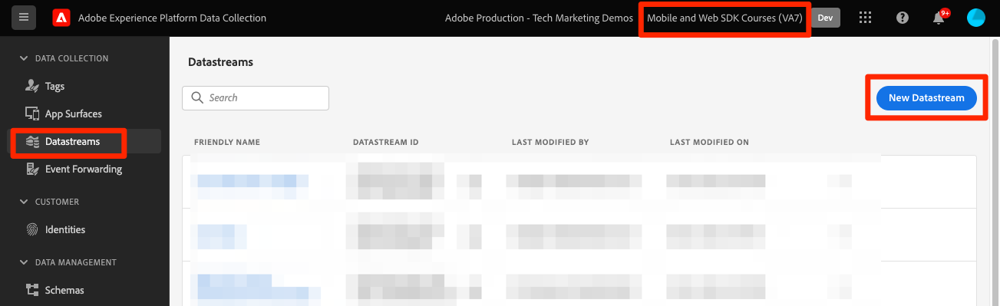
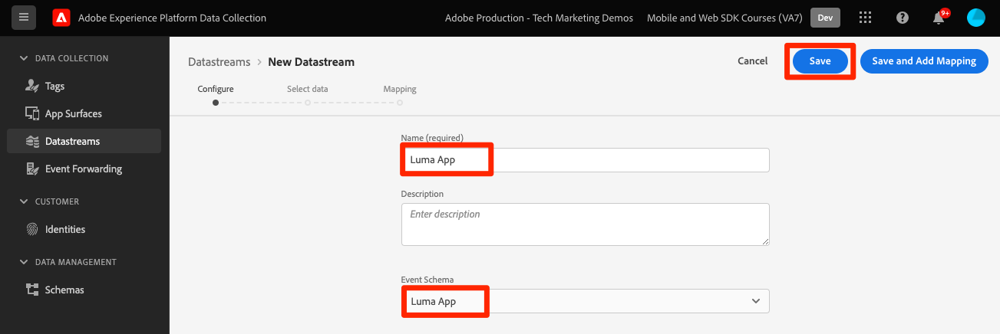
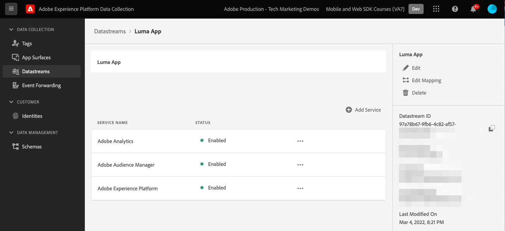

# Create a datastream

Learn how to create a datastream in Experience Platform. 

A datastream is a server-side configuration on Platform Edge Network.  The datastream ensures that incoming data to the Platform Edge Network is routed to Adobe Experience Cloud applications and services appropriately. For more information, see the [documentation](https://experienceleague.adobe.com/docs/experience-platform/edge/fundamentals/datastreams.html) or this [video](https://experienceleague.adobe.com/docs/platform-learn/data-collection/edge-network/configure-datastreams.html).

## Prerequisites

To create a datastream, your organization must be provisioned for this feature in the Data Collection interface (formerly [!UICONTROL Launch]) and you must have user permissions for [!UICONTROL Experience Platform] > [!UICONTROL Data Collection] > **[!UICONTROL Manage Datastreams]** and **[!UICONTROL View Datastreams]**.

## Learning objectives

In this lesson, you will:

* Know when to use a datastream.
* Create a datastream.
* Configure a datastream.

## Create a datastream

Datastreams can be created in the [!UICONTROL Data Collection] interface using the [!UICONTROL Datastream] configuration tool. To create a datastream:

1. Make sure you are in the correct Platform sandbox.
1. Select **[!UICONTROL New Datastream]**. 

    

1. Provide a name, for example `Luma App`.
1. Select the schema you created in the previous lesson.
1. Select **[!UICONTROL Save]**.

    

## Add services

Next you can connect your Experience Cloud services to your datastream. When Platform Mobile SDK sends data to Edge Network, the datastream will send the data to these services:

1. Add **[!UICONTROL Adobe Analytics]** and provide a report suite.

1. Enable **[!UICONTROL Adobe Audience Manager]** (optional).

1. Enable **[!UICONTROL Adobe Experience Platform]** and provide a **[!UICONTROL dataset]** (optional).
   * If you don't already have a dataset created, please follow the instructions [here](platform.md).

1. The final configuration should look something like this.

>[!NOTE]
>
>Enabling each of the services that your organization uses ensures data collected in the mobile app can be used everywhere. Find more information about datastream settings please review the documentation [here](https://experienceleague.adobe.com/docs/experience-platform/edge/fundamentals/datastreams.html#adobe-experience-platform-settings).

When implementing Platform Mobile SDK on your own website, you should create three datastreams to map to your three tag environments (development, stage, and production). If you are using Platform Mobile SDK with Platform-based applications such as Adobe Real-time Customer Data Platform or Adobe Journey Optimizer, you should be sure to create those datastreams in the appropriate Platform sandboxes.

Next: **[Configure tags](configure-tags.md)**

>[!NOTE]
>
>Thank you for investing your time in learning about Adobe Experience Platform Mobile SDK. If you have questions, want to share general feedback, or have suggestions on future content, please share them on this [Experience League Community discussion post](https://experienceleaguecommunities.adobe.com/t5/adobe-experience-platform-launch/tutorial-discussion-implement-adobe-experience-cloud-in-mobile/td-p/443796)
