# Create an XDM schema

Learn how to create an XDM schema for mobile app events.

Standardization and interoperability are key concepts behind Adobe Experience Platform. Experience Data Model (XDM), driven by Adobe, is an effort to standardize customer experience data and define schemas for customer experience management.

## What are XDM schemas?

XDM is a publicly documented specification designed to improve the power of digital experiences. It provides common structures and definitions that allow any application to communicate with Platform services. By adhering to XDM standards, all customer experience data can be incorporated into a common representation that can deliver insights in a faster, more integrated way. You gain valuable insights from customer actions, define customer audiences through segments, and use customer attributes for personalization purposes.

Experience Platform uses schemas to describe the structure of data in a consistent and reusable way. By defining data consistently across systems, it becomes easier to retain meaning and therefore gain value from data.

Before data can be ingested into Platform, a schema must be composed to describe the data's structure and provide constraints to the type of data that can be contained within each field. Schemas consist of a base class and zero or more schema field groups. 

For more information on the schema composition model, including design principles, and best practices, see the [basics of schema composition](https://experienceleague.adobe.com/en/docs/experience-platform/xdm/schema/composition) or the playlist [Model Your Customer Experience Data with XDM](https://experienceleague.adobe.com/en/playlists/experience-platform-model-your-customer-experience-data-with-xdm).

>[!TIP]
>
>If you're familiar with Analytics Solution Design Reference (SDRs), you can think of a schema as a more robust SDR. See [Create and maintain a Solution Design Reference (SDR) Document](https://experienceleague.adobe.com/en/docs/analytics-learn/tutorials/implementation/implementation-basics/creating-and-maintaining-an-sdr) for more information.

## Prerequisites

To complete the lesson, you must have permission to create an Experience Platform schema.

## Learning objectives

In this lesson, you will:

* Create a schema in the Data Collection interface
* Add a standard field group to the schema
* Create and add a custom field group to the schema

## Navigate to schemas

1. Log in to the Adobe Experience Cloud.

1. Make sure you are in the Experience Platform sandbox you are using for this tutorial.

1. Open the app switcher   (at the top right), 

1. Select **[!UICONTROL Data Collection]** from the menu.

    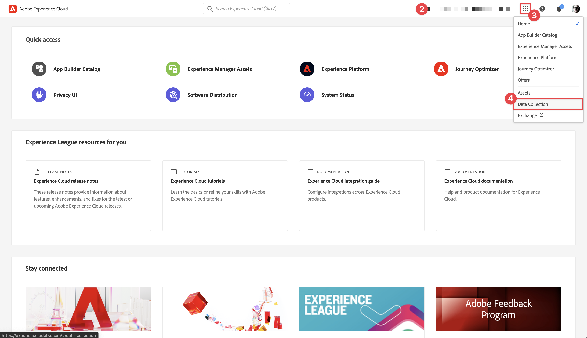{zoomable="yes"}

    >[!NOTE]
    >
    > Customers of Platform-based applications like Real-Time CDP should use a development sandbox for this tutorial. Other customers use the default production sandbox.

1. Select  **[!UICONTROL Schemas]** under **[!UICONTROL Data management]** in the left rail.

    {zoomable="yes"}

You are now on the main schemas page and are presented with a list of any existing schemas. You can also see tabs corresponding to the core building blocks of a schema:

* **Field groups** are reusable components that define one or more fields to capture specific data, such as personal details, hotel preferences, or address. 
* **Classes** define the behavioral aspects of the data that the schema contains. For example: `XDM ExperienceEvent` captures time-series, event data and `XDM Individual Profile` captures attribute data about an individual.
* **Data types** are used as reference field types in classes or field groups in the same way as basic literal fields.

The above descriptions are a high-level overview. For more details, see the [Schema building blocks](https://experienceleague.adobe.com/en/docs/platform-learn/tutorials/schemas/schema-building-blocks) video or read [Basics of schema composition](https://experienceleague.adobe.com/en/docs/experience-platform/xdm/schema/composition) in the product documentation.

In this tutorial, you use the Consumer Experience Event field group and create a custom one to demonstrate the process. 

>[!NOTE]
>
>Adobe continues to add more standard field groups and they should be used whenever possible. These fields are implicitly understood by Experience Platform services and provide greater consistency when used across Platform components. The use of standard field groups provides tangible benefits such as automatic mapping in Analytics and AI features in Platform.

## Luma app schema architecture

In a real-world scenario, the schema design process might look like this:

* Gather business requirements.
* Find prebuilt field groups to cover as many requirements as possible.
* Create custom field groups for any gaps.

For learning purposes, you use prebuilt and custom field groups. 

* **Consumer Experience Event**: Prebuilt field group that has many common fields.
* **App Information**: Custom field group designed to mimic TrackState/TrackAction Analytics concepts.

<!--Later in the tutorial, you can [update the schema](lifecycle-data.md) to include the **[!UICONTROL AEP Mobile Lifecycle Details]** field group.-->

## Create a schema 

1. Select  **[!UICONTROL Create Schema]**.

1. In the **[!UICONTROL Create a schema]** dialog, select **[!UICONTROL Manual]**. Use **[!UICONTROL Select]** to continue.

   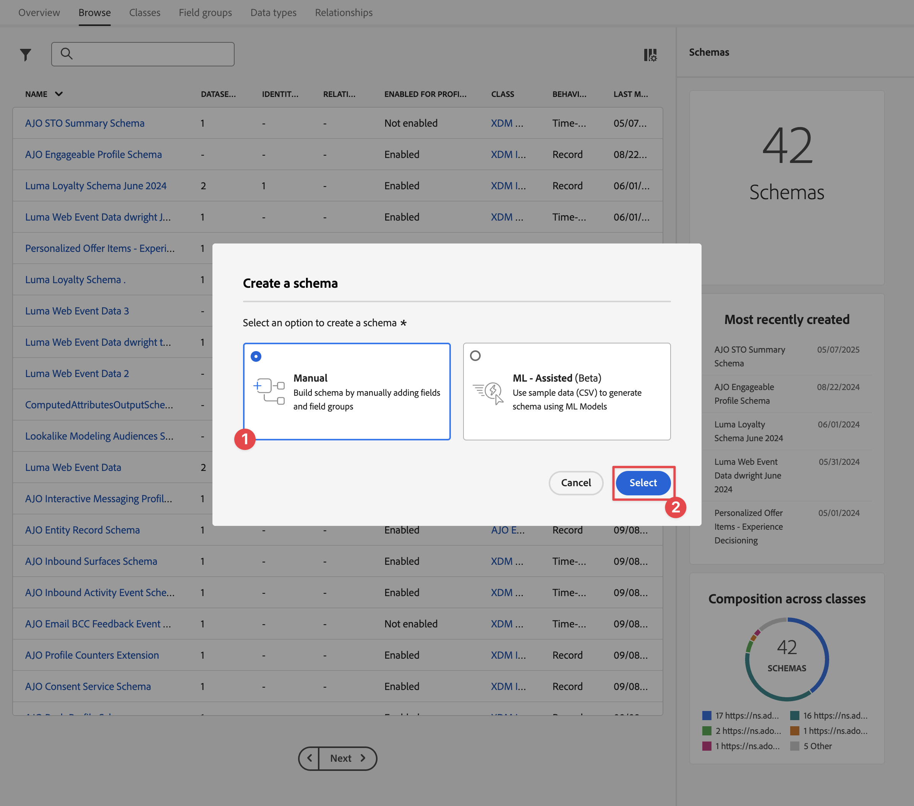{zoomable="yes"}

1. In the **[!UICONTROL Select a class]** step of the **[!UICONTROL Create schema]** wizard, select **[!UICONTROL Experience Event]** underneath **[!UICONTROL Select a base class for this schema]**.

1. Select **[!UICONTROL Next]**.
    
    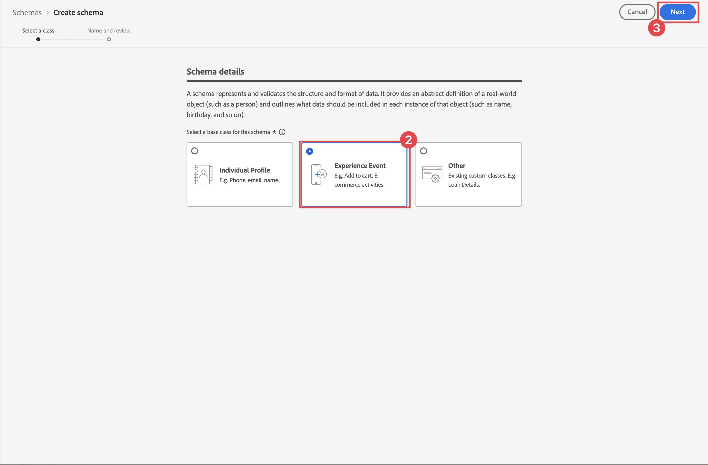{zoomable="yes"}

1. In the **[!UICONTROL Name and review]** step of the **[!UICONTROL Create schema]** wizard, enter a **[!UICONTROL Schema display name]**, for example `Luma Mobile Event Schema` and a [!UICONTROL Description], for example `Schema for Luma mobile app experience events`.

    >[!NOTE]
    >
    >If you are going through this tutorial with multiple persons on a single sandbox or you are using a shared account, consider appending or prepending an identification as part of your naming conventions. For example, instead of `Luma Mobile App Event Schema`, use `Luma Mobile App Event Schema - Joe Smith`. See also the note in [Overview](overview.md).

1. Select **[!UICONTROL Finish]** to finish the wizard.

    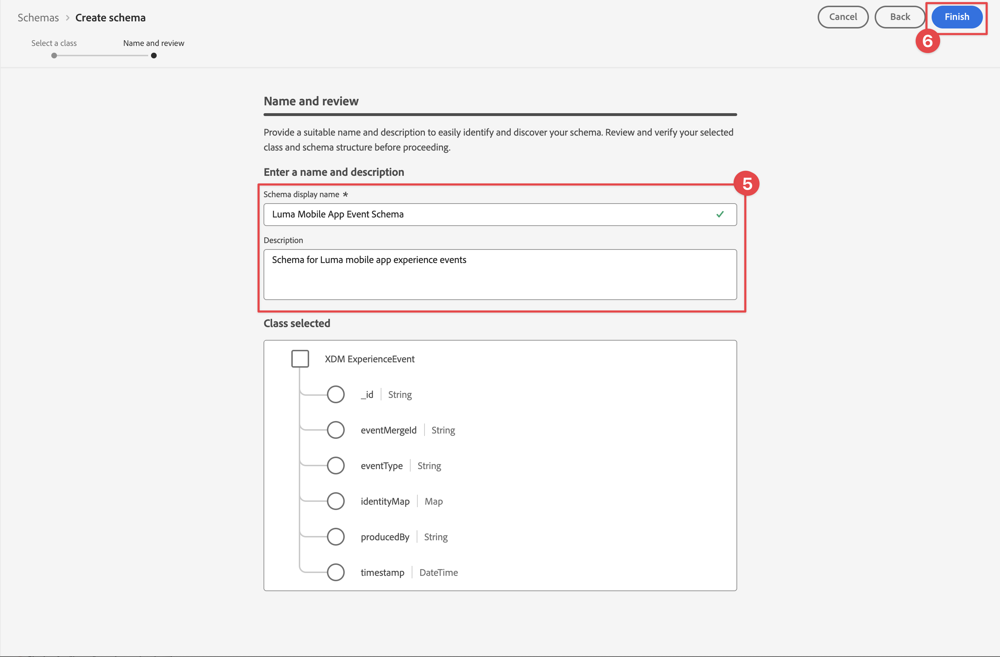{zoomable="yes"}

1. Select  **Add** next to **[!UICONTROL Field groups]**.

   {zoomable="yes"}

1. Search for `Consumer Experience Event`.

1. Select  to preview the fields and/or read the description for more details before selecting a field group.

1. Select **Consumer Experience Event**.

1. Select **[!UICONTROL Add field groups]**.

    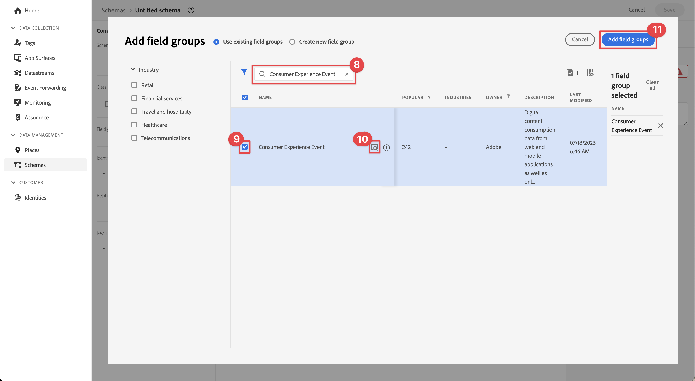{zoomable="yes"}

    You are brought back to the main schema composition screen where you can see all the available fields.

1. Select **[!UICONTROL Save]**.
1. Select  **[!UICONTROL Schemas]** under **[!UICONTROL Data management]** to return to the main **[!UICONTROL Schemas]** interface.

>[!NOTE]
>
>Keep in mind that you do not have to use all the fields in a group. You can also remove fields to help keep the schema concise and understandable. If it's helpful, you can think of a schema as an empty data layer. In your app, you populate the relevant values at the appropriate time.

The [!UICONTROL Consumer Experience Event] field group has a data type called [!UICONTROL Web information], which describes events like page view and link clicks. At the time of writing, there isn't a mobile app parity to this feature, so you are going to create your own. 

## Create a custom data type

You begin by creating a custom data type describing the two events:

* Screen view
* App interaction

1. Select the **[!UICONTROL Data types]** tab.

1. Select **[!UICONTROL Create data type]**.

    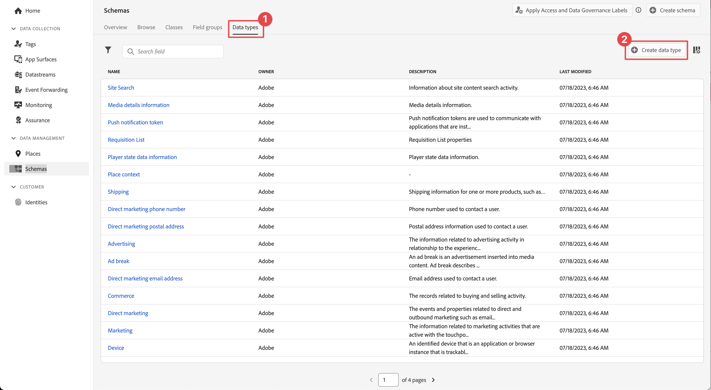{zoomable="yes"}

1. Provide a **[!UICONTROL Display name]** and **[!UICONTROL Description]**, for example `App Information` and `Custom data type describing "Screen Views" & "App Actions"`

    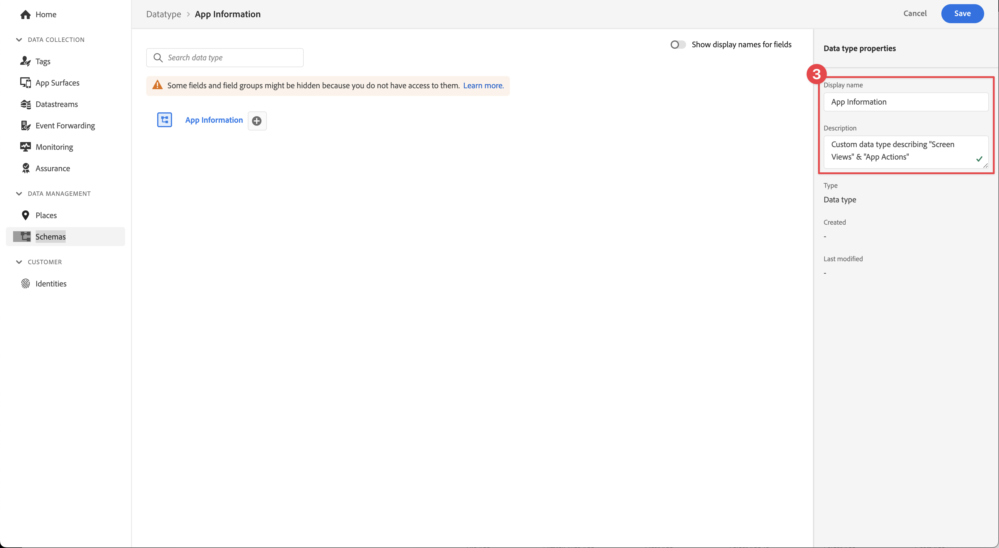{zoomable="yes"}

    >[!TIP]
    >
    > Always use readable, descriptive [!UICONTROL display names] for your custom fields. This practice makes custom fields more accessible to marketers when the fields surface in downstream services like the segment builder.

1. To add a field, select the  button. 
 
    
1. This field is a container object for app interaction, so provide a camel-case **[!UICONTROL Field name]** `appInteraction`, **[!UICONTROL Display name]** `App Interaction`, and select `Object` from the **[!UICONTROL Type]** list.

1. Select **[!UICONTROL Apply]**.

    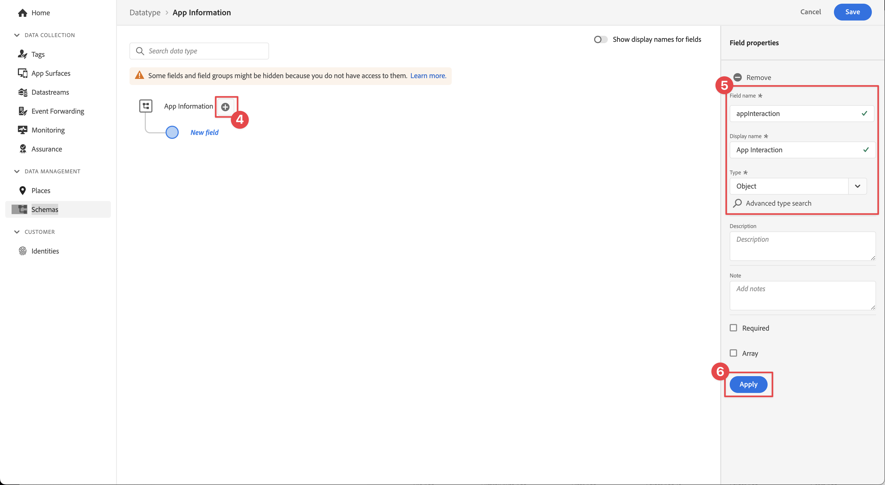{zoomable="yes"}

1. To measure how often an action has occurred, add a field by selecting the  button next to the **[!UICONTROL appInteraction]** object you created. 

1. Give it a camel-case **[!UICONTROL Field name]** `appAction`, **[!UICONTROL Display name]** of `App Action` and **[!UICONTROL Type]** `Measure`. 

    This step would be the equivalent of a success event in Adobe Analytics.

1. Select **[!UICONTROL Apply]**.

    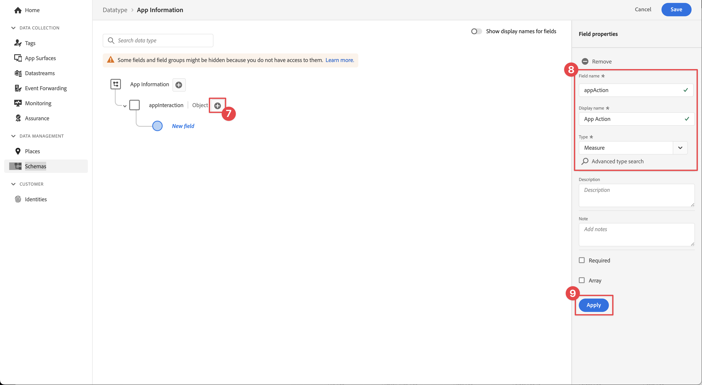{zoomable="yes"}

1. Add a field describing the type of interaction by selecting the  button next to the **[!UICONTROL appInteraction]** object. 

1. Give it a **[!UICONTROL Field name]** `name`, **[!UICONTROL Display name]** of `Name` and **[!UICONTROL Type]** `String`. 

    This step is the equivalent of a dimension in Adobe Analytics. 

    {zoomable="yes"}

1. Scroll to the bottom of the right rail and select **[!UICONTROL Apply]**.

1. To create an `appStateDetails` object containing a **[!UICONTROL Measure]** field called `screenView` and two **[!UICONTROL String]** fields called `screenName` and `screenType`, follow the same steps as you did when creating the **[!UICONTROL appInteraction]** object.

1. Select **[!UICONTROL Save]**.

    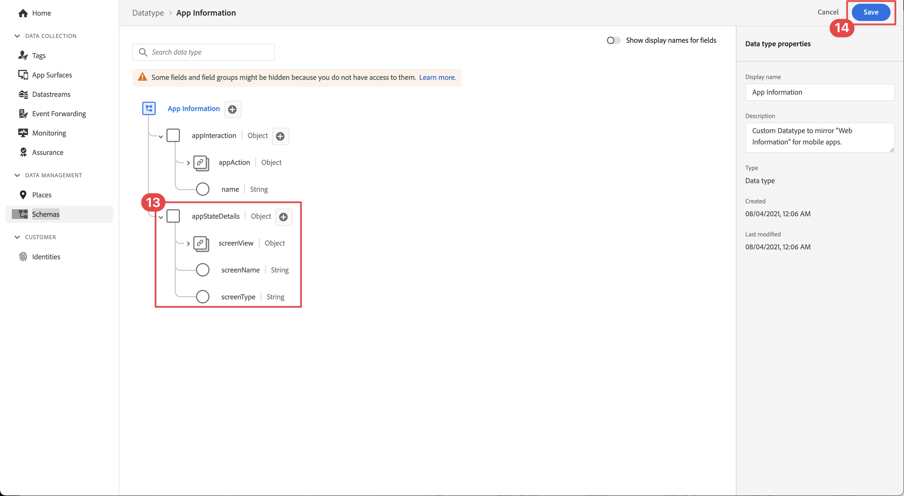{zoomable="yes"}

## Add a custom field group

Now, add a custom field group using your custom data type:

1. Open the schema that you created earlier in this lesson.

1. Select  **[!UICONTROL Add]** next to **[!UICONTROL Field groups]**.

    {zoomable="yes"}

1. Select **[!UICONTROL Create new field group]**.

1. Provide a **[!UICONTROL Display name]** and **[!UICONTROL Description]**, for example, `App Interactions` and `Fields for app interactions`.

1. Select **Add field groups**.

    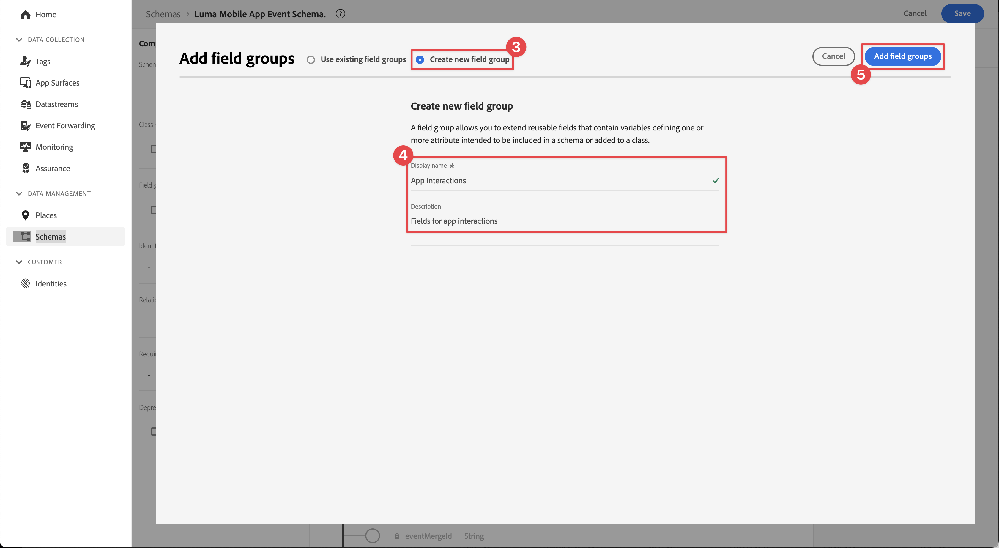{zoomable="yes"}

1. From the main composition screen, select **[!UICONTROL App Interactions**].

1. Add a field to the root of the schema by selecting the  button next to the schema name.

1. In the right rail, provide a **[!UICONTROL Field name]** of `appInformation`, a **[!UICONTROL Display name]** of `App Information`, and a **[!UICONTROL Type]** of `App Information`.

1. Select **[!UICONTROL App Interactions]** from the **[!UICONTROL Field Group]** drop down, to assign the fields to your new field group.

1. Select **[!UICONTROL Apply]**.

1. Select **[!UICONTROL Save]**.

    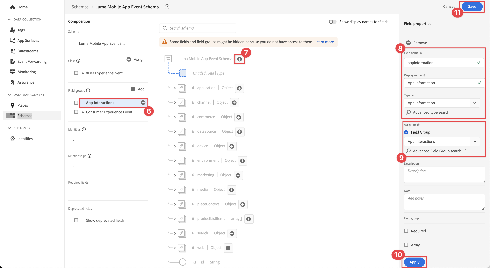{zoomable="yes"}

>[!NOTE]
>
>Custom field groups are always placed under your Experience Cloud Org identifier.

>[!SUCCESS]
>
>You now have a schema to use for the remainder of the tutorial.
>
>Thank you for investing your time in learning about Adobe Experience Platform Mobile SDK. If you have questions, want to share general feedback, or have suggestions on future content, share them on this [Experience League Community discussion post](https://experienceleaguecommunities.adobe.com/t5/adobe-experience-platform-data/tutorial-discussion-implement-adobe-experience-cloud-in-mobile/td-p/443796).

Next: **[Create a [!UICONTROL datastream]](create-datastream.md)**
