# Report and analyze using Customer Journey Analytics

Learn how to report and analyze your mobile app interactions with Customer Journey Analytics.

The mobile app event data, which you collected and sent to Platform Edge Network in earlier lessons is forwarded to the services configured in your datastream. If you followed the [Send data to Experience Platform](platform.md) lesson, that data is now stored in the data lake of Experience Platform as datasets. And that data is then available for Customer Journey Analytics to use for reporting and analysis.

Contrary to Adobe Analytics, Customer Journey Analytics is an application that *uses* data from datasets you have created in Experience Platform and to which your app is sending data. Using the Adobe Experience Platform Mobile SDK, you do not send data to Customer Journey Analytics directly. Instead, Customer Journey Analytics uses the data from the datasets in Experience Platform.

This lesson in the tutorial focuses on reporting and analyzing the data captured from the Luma tutorial app. One of the unique capabilities of Customer Journey Analytics is to combine data from multiple sources (CRM, point-of-sale, loyalty application, call-center) and channels (web, mobile, offline) to provide deep insights into customer journeys. That capability is beyond the scope of this lesson. See [Customer Journey Analytics overview](https://experienceleague.adobe.com/en/docs/analytics-platform/using/cja-overview/cja-overview) for more information.

## Prerequisites

Your organization must be provisioned and permission granted for Customer Journey Analytics. You must have administration access to Customer Journey Analytics.

## Learning objectives

In this lesson, you will:

- Create a connection to define the datasets from Experience Platform you want to use in Customer Journey Analytics.
- Create a data view to prepare the data from the datasets for your reporting and analysis
- Create a project to build reports and visualizations so you can analyze the data from your mobile app.

This order is on purpose. In Customer Journey Analytics, a report in Analysis Workspace depends on a data view. And a data view depends on a connection.

## Create a connection

A connection in Customer Journey Analytics defines the datasets (and the data within these datasets) from Experience Platform that you want to use for reporting and analysis.

1. Navigate to the Customer Journey Analytics interface using the Apps  menu in the top right.

1. Select **[!UICONTROL Connections]** from the top menu bar.

1. Ensure you select the **[!UICONTROL List]** tab in the Connections interface. You see a list of existing connections.

1. Select **[!UICONTROL Create new connection]**.

1. In the **[!UICONTROL Connections]** > **[!UICONTROL Untitled connection]** screen, in **[!UICONTROL Connection settings]**
   
   1. Enter a **[!UICONTROL Connection name]**, for example `Luma App - AEP Mobile SDK Tutorial Connection`.
   2. Enter a **[!UICONTROL Connection description]**, for example `Connection for the Luma app used in the AEP Mobile SDK tutorial`.
   
      In **[!UICONTROL Data settings]**:

   3. Select the sandbox that you have used to collect your mobile app data, for example **[!UICONTROL Mobile and Web SDK Courses]**.
   4. Select **[!UICONTROL less than 1 million]** from the **[!UICONTROL Average number of daily events]**.

   5. Select **[!UICONTROL Add datasets]** to select the datasets from Experience Platform you want to use in Customer Journey Analytics.

      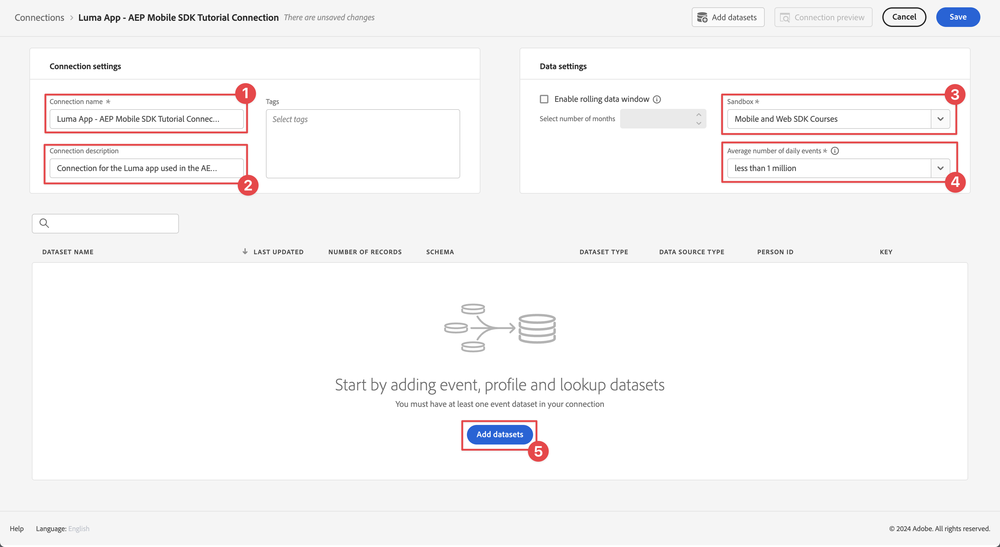

   6. In the **[!UICONTROL Add datasets]** wizard, **[!UICONTROL Select datasets]** step, 
   
      1. select the following datasets:

         - **[!UICONTROL Luma Mobile App Event Dataset]**, the dataset you created as part of the [Create a dataset](platform.md#create-a-dataset) section in the Experience Platform lesson.
         - **[!UICONTROL ODE DecisionEvents - *sandbox name*] decisioning**
         - **[!UICONTROL AJO Push Tracking Event Datasets]**

      1. Select **[!UICONTROL Next]**.

         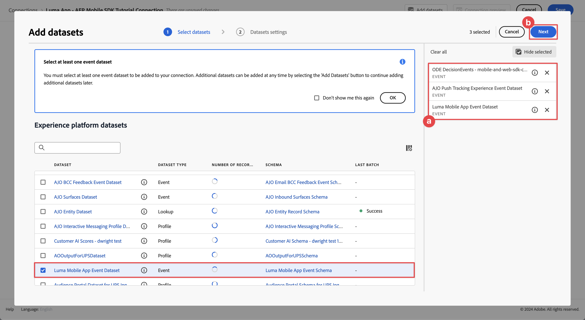

   7. In the **[!UICONTROL Add datasets]** wizard, **[!UICONTROL Datasets settings]** step, you need to define the details for each of the event datasets. 
      1. See the following tables for the proper setup:

         | Dataset | Person ID ① | Timestamp ② | Data source type ③ | Import all new data ④| Backfill all existing data ⑤ |
         |---|---|---|---|---|---|
         | Luma Mobile App Event Dataset | identityMap  | timestamp | Mobile App Data | enable | enable |
         | ODE DecisionEvents - *sandbox name* decisioning | identityMap  | timestamp | Mobile App Data | enable | enable |
         | AJO Push Tracking Experience Event Dataset | identityMap  | timestamp | Mobile App Data | enable | enable |

         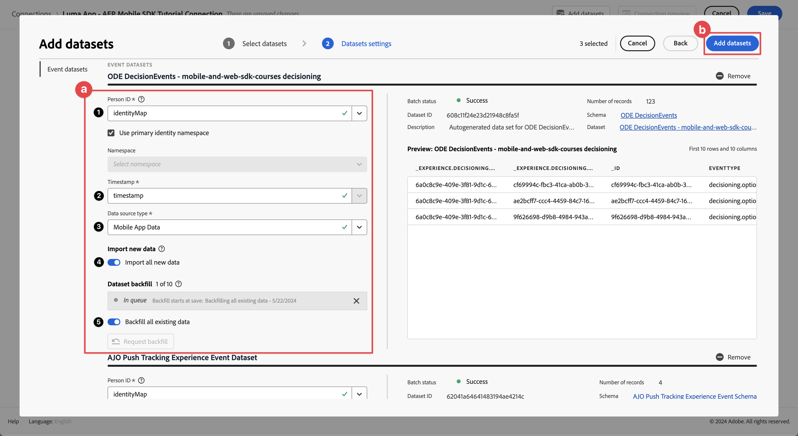

      1. Select **[!UICONTROL Add datasets]**.

1. Back in the **[!UICONTROL Connections]** > **[!UICONTROL Luma App - AEP Mobile SDK Tutorial Connection]**, select **[!UICONTROL Save]** to save your connection.

   

You have now defined your connection and Customer Journey Analytics adds the data from the datasets to its own internal database. This data collection can take some time, depending on the amount of data. For your tutorial app, anticipate a couple of hours for the data to appear in Customer Journey Analytics.

To view the status of your connection:

1. Select **[!UICONTROL Connections]** in the main interface of Customer Journey Analytics.
1. Select the name of your connection, for example **[!UICONTROL Luma App - AEP Mobile SDK Tutorial Connection]**.
   
In the **[!UICONTROL Connections]** > **[!UICONTROL Luma App - AEP Mobile SDK Tutorial Connection]**, you see:
   
1. Information on total records added, records skipped, and records deleted. Ensure you select **[!UICONTROL All datasets]** and select an appropriate time period to view details about your connection. You can use  to open a dialog to select the time period.
1. Information for individual datasets on records added, records skipped, records deleted, and more.

   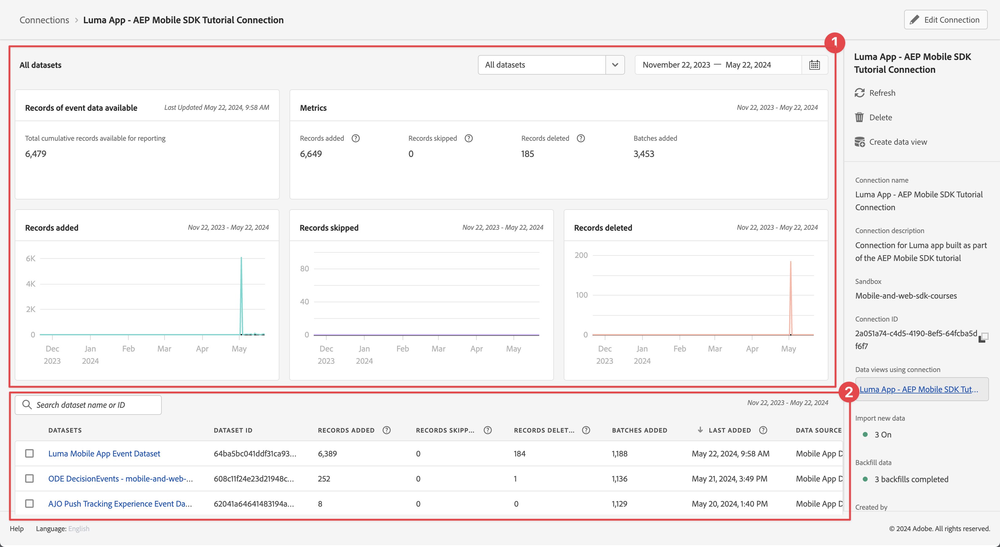

## Create a data view

After the records have been added from the datasets to Customer Journey Analytics, you can create a data view to define which components of the data you want to report on. 

A data view is a container specific to Customer Journey Analytics that lets you determine how to interpret data from a connection. You can configure standard and schema fields, from any of the datasets that you have defined in your connection, as components (dimensions, metrics) in Analysis Workspace.

A data view in Customer Journey Analytics offers enormous flexibility in properly setting up and defining the data from your connection. In this tutorial, you use only the functionality that is required for your reporting and analysis. See [Data views](https://experienceleague.adobe.com/en/docs/analytics-platform/using/cja-dataviews/data-views) for more information.

To create your data view:

1. Navigate to the Customer Journey Analytics interface using the Apps  menu in the top right.

1. Select **[!UICONTROL Data views]** from the top menu bar.
1. Select **[!UICONTROL Create new data view]**.
1. In **[!UICONTROL Data views >]**, ensure that the **[!UICONTROL Configure]** tab is selected.
   
   1. Select your connection from the Settings Connection dropdown list, for example **[!UICONTROL Luma App - AEP Mobile SDK Tutorial Connection]**.
   1. Enter a Name for your data view, for example: `Luma App - AEP Mobile SDK Tutorial Data view`.
   1. Select **[!UICONTROL Save and continue]**.

      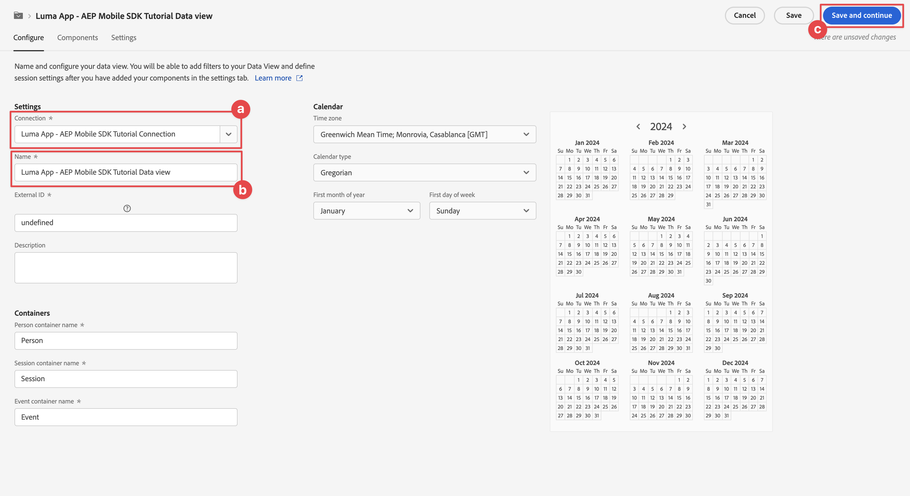

1. In the **[!UICONTROL Components]** tab of the **[!UICONTROL Luma App - AEP Mobile SDK Tutorial Data view]**, you can define the metrics and dimension you want to use when reporting on your mobile app. By default, a number of standard metrics and dimensions (jointly referred to a components) are already configured for your data view. But your data view requires more components.  To add a schema field, from your previously defined schema or out of the box schemas (see [Create a schema](create-schema.md) lesson), as a component (dimension or metric):

   1. Find the schema field:

      - search for the component using the  ***[!UICONTROL Search schema fields]*** search field. For example, `productListAdd`, or

         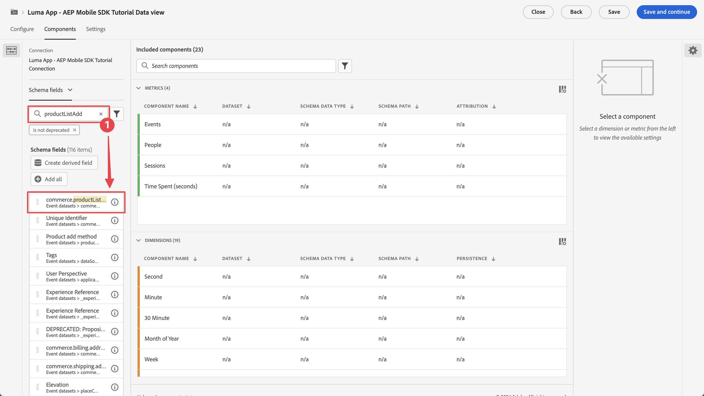

      - traverse down to the schema field within  **[!UICONTROL Event datasets]** .  For example,  **[!UICONTROL Event datasets]**   **[!UICONTROL commerce]**   **[!UICONTROL productListAdds]** 

        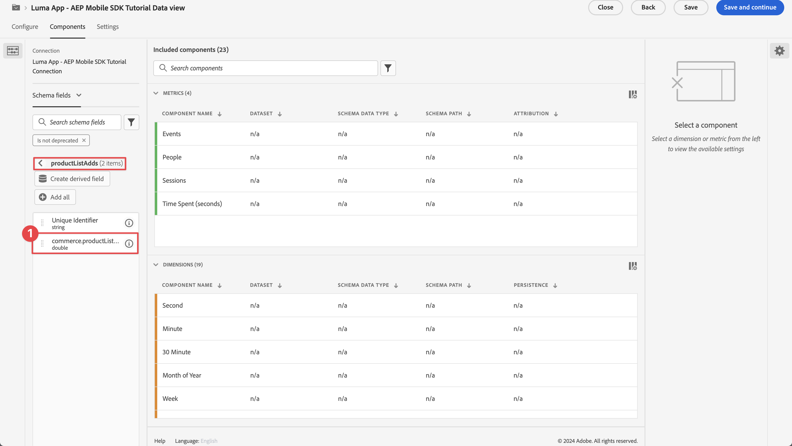

   1. Drag the specific schema field from the Schema fields pane and drop it on the **[!UICONTROL METRICS]** or **[!UICONTROL DIMENSIONS]** list in the [!UICONTROL Included components] pane.

      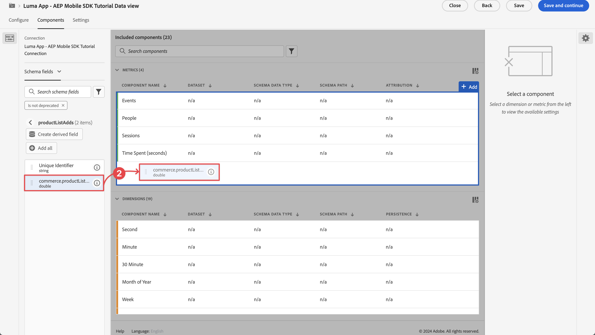

   1. You can configure the settings of a component. Select the component and configure settings in the right pane.  For example, you can rename **[!UICONTROL commerce.productListAdds]** to `Product Add To Lists` using the **[!UICONTROL COMPONENT SETTINGS]** > **[!UICONTROL Component name]** field in the right pane.

      

      Or configure **[!UICONTROL INCLUDE EXCLUDE VALUES]**.

      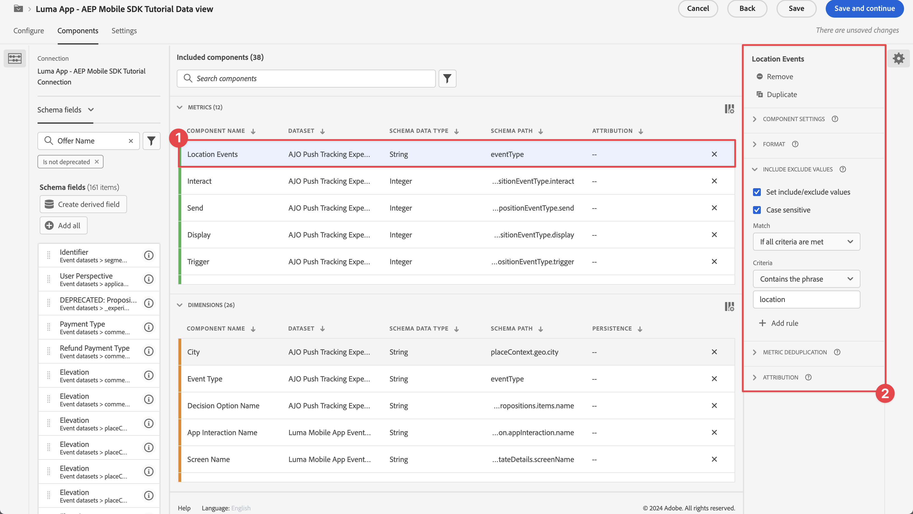

   1. Now that you understand how to add fields to your data view and configure the resulting component, use the tables below for a list of schema fields to add as metric or dimension. Use the **Schema Path** column value from the table below to search for or traverse to the specific schema field. Once dragged and dropped, check the **Component Settings** column value in the table whether specific settings are required for a component, like modifying its **[!UICONTROL Component name]** or defining **[!UICONTROL INCLUDE EXCLUDE VALUES]**. 

      

      **METRICS**

      | Component Name | Dataset | Schema Data Type | Schema Path | Component Settings |
      |---|---|---|---|---|
      | Dismiss | AJO Push Tracking Experience Event Dataset, Luma Mobile App Event Dataset | Integer | _experience.decisioning. propositionEventType.dismiss | Component Name: `Dismiss`  |
      | Unsubscribe | AJO Push Tracking Experience Event Dataset, Luma Mobile App Event Dataset | Integer | _experience.decisioning. propositionEventType.unsubscribe | Component Name: `Unsubscribe` |
      | Trigger | AJO Push Tracking Experience Event Dataset, Luma Mobile App Event Dataset | Integer | _experience.decisioning. propositionEventType.trigger | Component Name: `Trigger` |
      | Display | AJO Push Tracking Experience Event Dataset, Luma Mobile App Event Dataset | Integer | _experience.decisioning. propositionEventType.display | Component Name: `Display` |
      | Send | AJO Push Tracking Experience Event Dataset, Luma Mobile App Event Dataset | Integer | _experience.decisioning. propositionEventType.send | Component Name: `Send` |
      | Interact | AJO Push Tracking Experience Event Dataset, Luma Mobile App Event Dataset | Integer | _experience.decisioning. propositionEventType.interact | Component Name: `Interact` | 
      | Location Events | AJO Push Tracking Experience Event Dataset, Luma Mobile App Event Dataset, ODE DecisionEvents - mobile-and-web-sdk-courses decisioning | String | Event Type | Component Name: `Location Events`  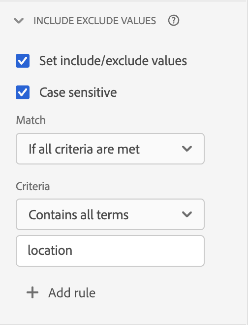 |
      | Product Views | Luma Mobile App Event Dataset | Double | commerce.productViews.value | Component Name: `Product Views` | 
      | Product Add To Lists | Luma Mobile App Event Dataset | Double | commerce.productListAdds.value | Component Name: `Product Add To Lists` | 
      | Purchases | Luma Mobile App Event Dataset | Double | commerce.purchases.value | Component Name: `Purchases` | 
      | Save For Laters | Luma Mobile App Event Dataset | Double | commerce.saveForLaters.value | Component Name: `Save For Laters` | 
      | App Interactions | Luma Mobile App Event Dataset | Double | _techmarketingdemos.appInformation. appInteraction.appAction.value | Component Name: `App Interactions` |
      | Screen Views | Luma Mobile App Event Dataset | Double | _techmarketingdemos.appInformation. appStateDetails.screenView.value | Component Name: `Screen Views` |

      {style="table-layout:auto"}

      Note how the schema field for the Location Events metric is using **[!UICONTROL INCLUDE EXCLUDE VALUES]** to count event types that contain `location`.

      After you have added all schema fields from the table above as a metric component, your data view configuration for **[!UICONTROL METRICS]** should look like:

      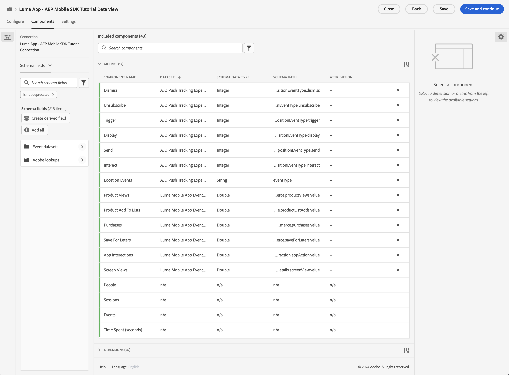

      **DIMENSIONS**

      | Component Name | Dataset | Schema Data Type | Schema Path | Component Settings |
      |---|---|---|---|---|
      | City | AJO Push Tracking Experience Event Dataset, Luma Mobile App Event Dataset | String | placeContext.geo.city | Component Name: `City` |
      | Event Types | AJO Push Tracking Experience Event Dataset, Luma Mobile App Event Dataset, ODE DecisionEvents - mobile-and-web-sdk-courses decisioning | String | eventType | Component Name: `Event Types` |
      | Decision Option Name | AJO Push Tracking Experience Event Dataset, Luma Mobile App Event Dataset, ODE DecisionEvents - mobile-and-web-sdk-courses decisioning | String | _experience.decisioning. propositions.items.name | Component Name: `Decision Option Name` | 
      | App Interaction Name | Luma Mobile App Event Dataset | String | _techmarketingdemos.appInformation. appInteraction.name | Component Name: `App Interaction Name` | 
      | Screen Name | Luma Mobile App Event Dataset | String | _techmarketingdemos.appInformation. appStateDetails.screenName | Component Name: `Screen Name` | 
      | Activity Name | ODE DecisionEvents - mobile-and-web-sdk-courses decisioning | String | _experience.decisioning. propositionDetails.activity.name | Component Name: `Activity Name` | 
      | Offer Name | ODE DecisionEvents - mobile-and-web-sdk-courses decisioning | String | _experience.decisioning. propositionDetails.selections.name | Component Name: `Offer Name` | 

      {style="table-layout:auto"}

      After you have added all schema fields from the table above as a dimension component, your data view configuration for **[!UICONTROL DIMENSIONS]** should look like:

      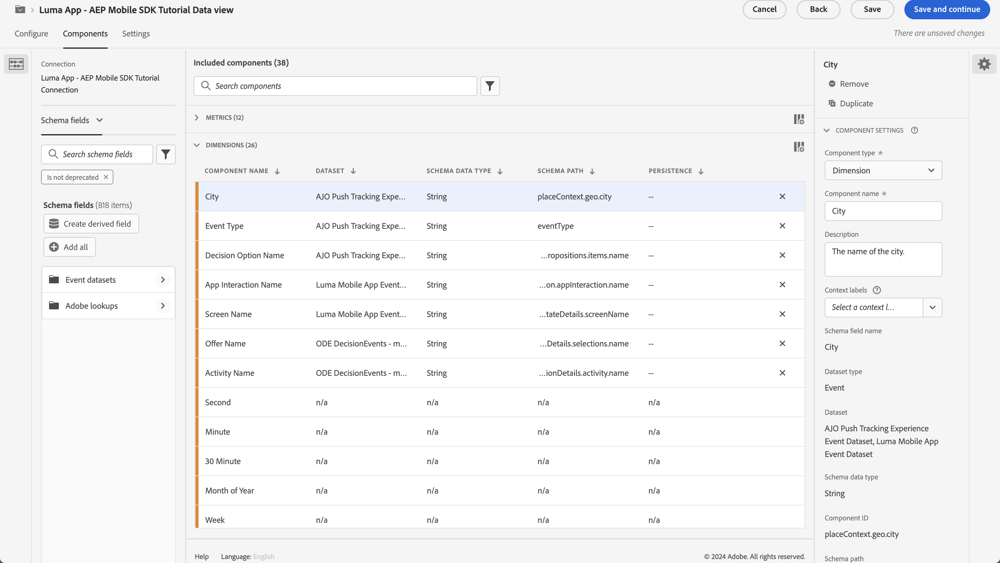

   1. Select **[!UICONTROL Save and continue]**.

1. The **[!UICONTROL Settings]** tab of the **[!UICONTROL Luma App - AEP Mobile SDK Tutorial Data view]** allows you to configure filters and session settings. For this tutorial, no additional configuration is required.

   - Select **[!UICONTROL Save and finish]**.

You have defined your data view and everything is in place to start building your reports and visualizations.

## Create a project

You use Workspace projects in Customer Journey Analytics to build your reports and visualizations. There are many possibilities to build comprehensive reports and engaging visualizations, but all these possibilities are outside the scope of this tutorial. See [Workspace Overview](https://experienceleague.adobe.com/en/docs/customer-journey-analytics-learn/tutorials/analysis-workspace/workspace-projects/analysis-workspace-overview) and [Build a new project](https://experienceleague.adobe.com/en/docs/customer-journey-analytics-learn/tutorials/analysis-workspace/workspace-projects/build-a-new-project) for more information.

In this section of the lesson, you create a project that shows reports and visualizations on:

- App Usage: using the information on screen and app interactions.
- Commerce: using the commerce events, like product view, add to cart and purchase.
- Offers: using the offers displayed events in the app.
- Store Visits: using the (simulated) geofence events from the app.

To create your project:

1. Navigate to the Customer Journey Analytics interface using the Apps  menu in the top right.

1. Select **[!UICONTROL Workspace]** from the top menu bar.

1. Select **[!UICONTROL Create project]**.

   1. Select **[!UICONTROL Blank Workspace project]** from the popup dialog.

      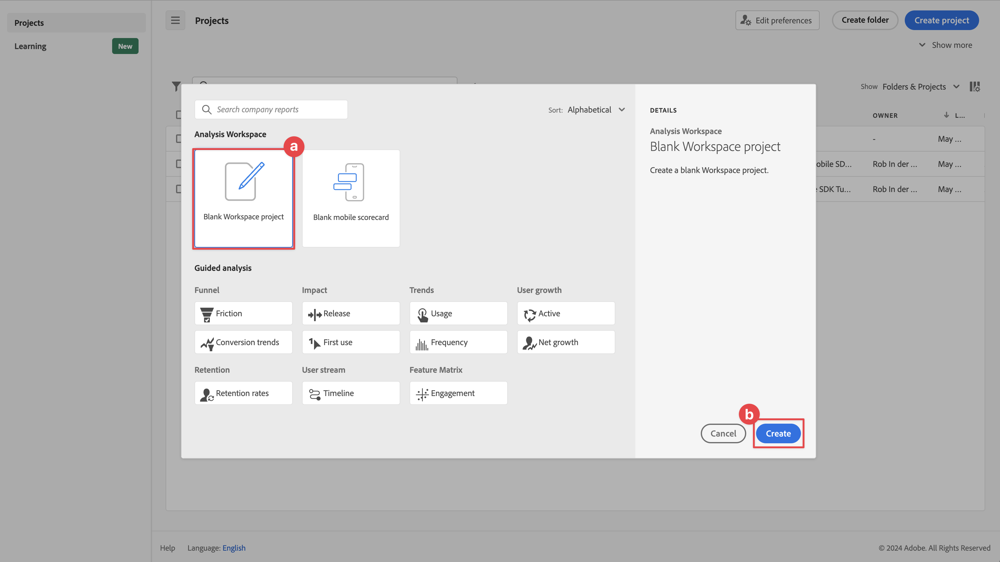

   1. Select **[!UICONTROL Create]**.

1. You are presented with the **[!UICONTROL New project]** interface. In this interface, you build your reports and visualizations.

1. Select the name of the project (**[!UICONTROL New project]**) and provide your own name for the project. For example, `Luma App - AEP Mobile SDK Tutorial Project`.
   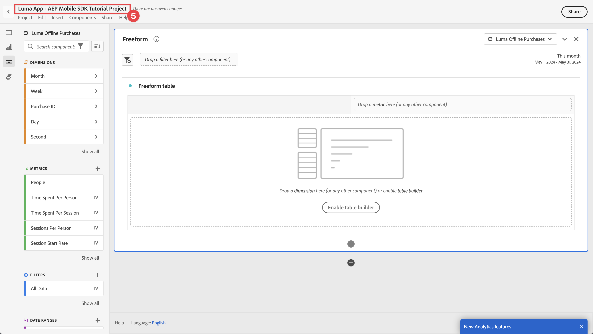

1. To save the project, select **[!UICONTROL Project]** > **[!UICONTROL Save]**.
   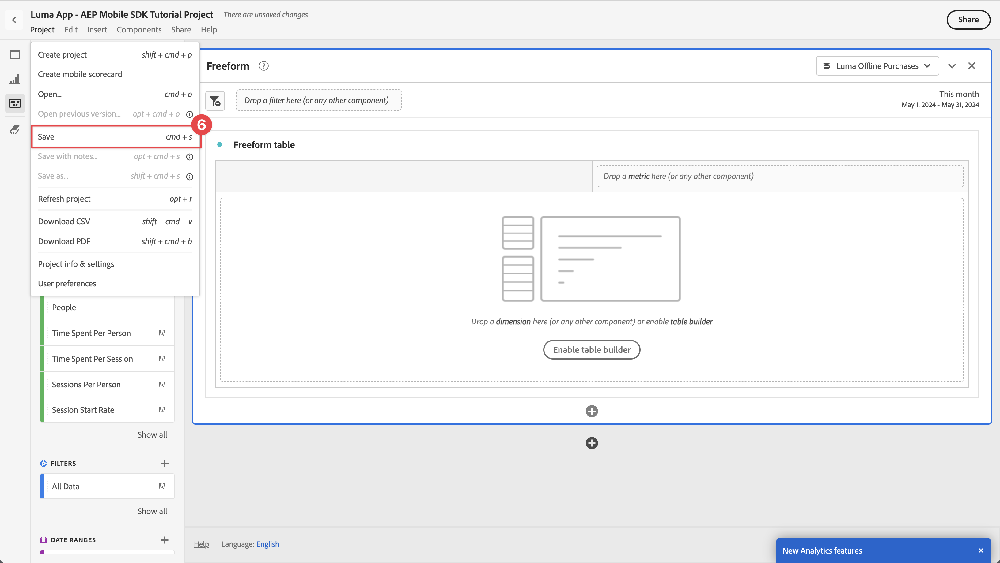

1. In the **[!UICONTROL Save]** dialog, ignore all other fields and select **[!UICONTROL Save]**.
   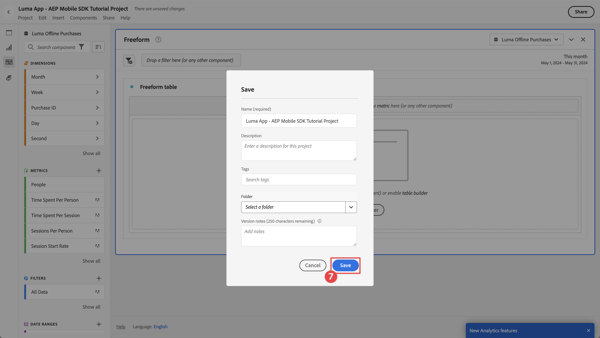

>[!IMPORTANT]
>
>   Remember to save your project regularly, otherwise your changes are lost. You can quickly save your project using **[!UICONTROL ctrl + s]** (Windows) or **[!UICONTROL ⌘ (cmd) + s]** (macOS). 

You have now set up your project. You already have a Freeform panel on your main canvas, containing a Freeform table. You will add components to this table soon, but you first have to ensure that your Freeform panel is using the correct data view and the correct time period.

1. Select your data view from the dropdown list. For example, **[!UICONTROL Luma App - AEP Mobile SDK Tutorial Data view]**. If you cannot see your data view in the list, select **[!UICONTROL Show all]** at the bottom of the dropdown list.
   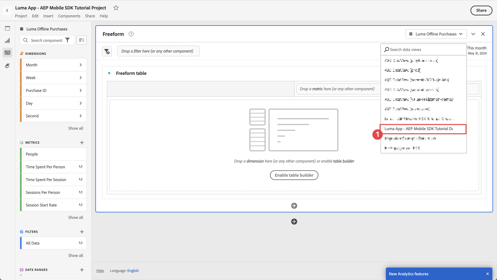

1. To define the appropriate time period for the panel, select the default **[!UICONTROL This month]** and in the popup panel define the start and end date. Or use a **[!UICONTROL Preset]**, like **[!UICONTROL Last 6 full months]** and select **[!UICONTROL Apply]**.
   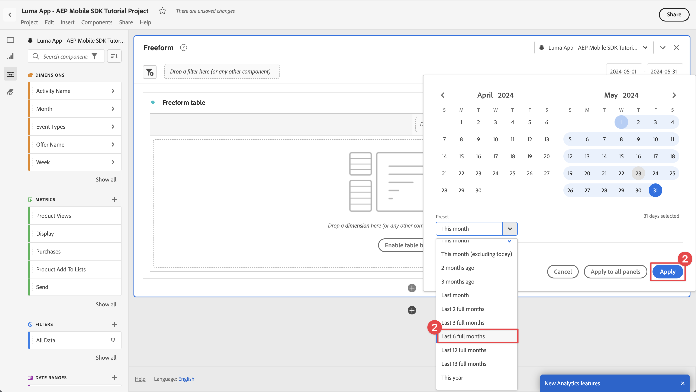

### App Usage

You want to report on how the app is used. You have added the necessary code in the app to register app interactions and which screens are used in the app (see the [Track Events](events.md) lesson) and you now want to report on this data.

#### Screen Names

You first want to report on what screens were viewed in the app.

1. Rename your **[!UICONTROL Freeform]** panel to `App Usage`.
   
1. Rename your **[!UICONTROL Freeform table]** to `Screen Names`.

1. Select **[!UICONTROL Show all]** below the **[!UICONTROL METRICS]** list.

1. Drag and drop the **[!UICONTROL Screen Views]** component on [!UICONTROL _Drop a **metric** here (or any other component_)].
   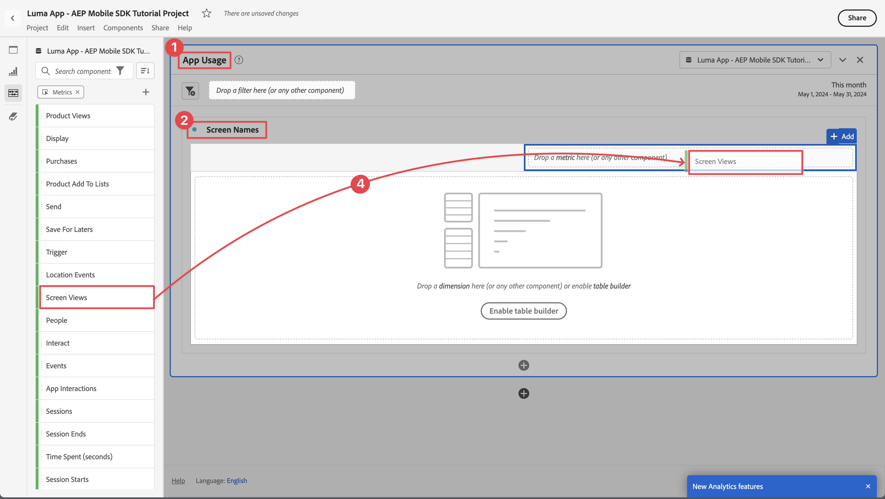
   Your freeform table now shows screen views for the days for your selected time period. However, you want to show screen views for the different screens used in the app.

1. To show the **[!UICONTROL DIMENSIONS]** list of components, select  to remove the  **[!UICONTROL Metrics]** filter from the components rail.
   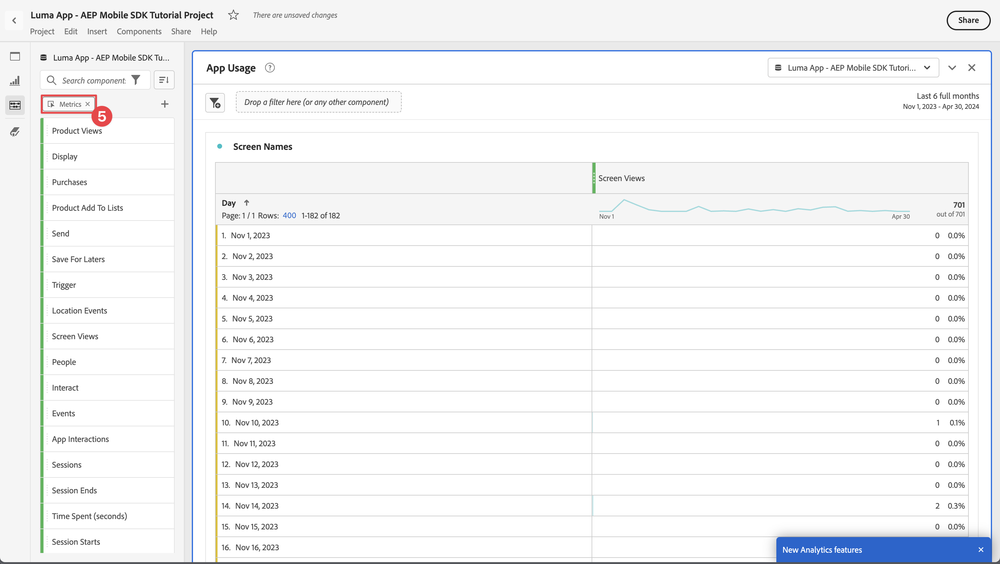

1. Select **[!UICONTROL Show all]** below the **[!UICONTROL DIMENSIONS]** list.

1. Drag and drop the **[!UICONTROL Screen Name]** component on the **[!UICONTROL Day]** header. The operation shows  **[!UICONTROL Replace]** to indicate the replacement of the dimension.
   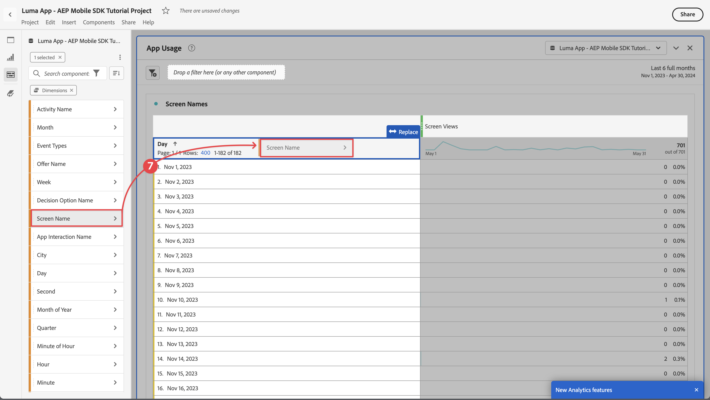

Your first report is ready; showing screen views for the various screen names you defined in the app.

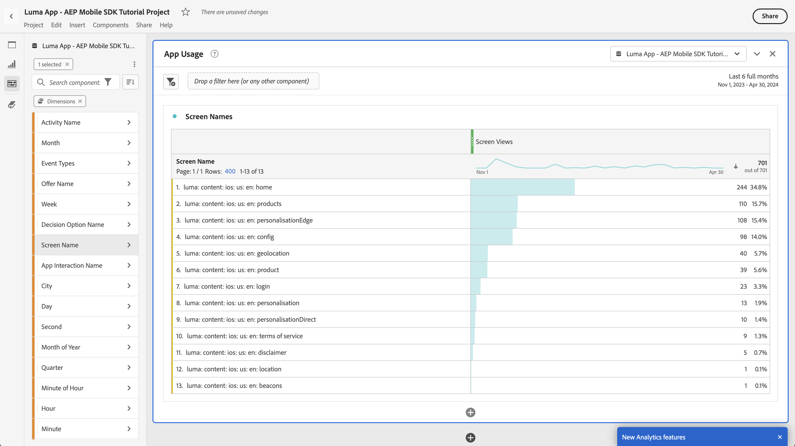

Do not forget to save your project!

#### App Interactions

You also want to report on how users interacted with the app. 

1. Select  and from the popup  to add a new Freeform table.
   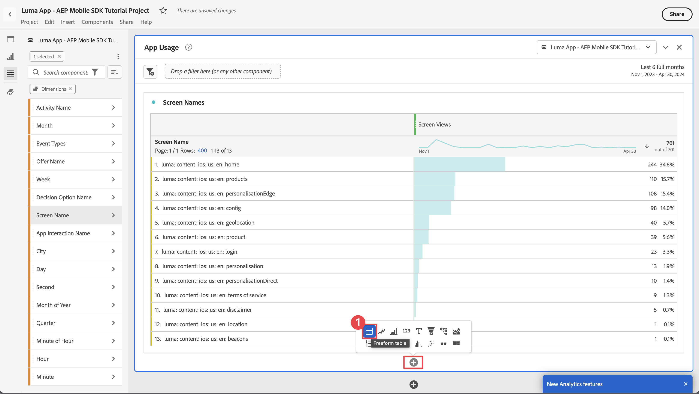

1. Rename **[!UICONTROL Freeform table (2)]** to `App Interactions`.

1. Drag and drop the **[!UICONTROL App Interactions]** metric on [!UICONTROL _Drop a **metric** here (or any other component_)].

1. Drag and drop the **[!UICONTROL App Interaction Name]** dimension on the **[!UICONTROL Day]** header to replace this dimension.

Your second report is now ready, showing app interactions. 
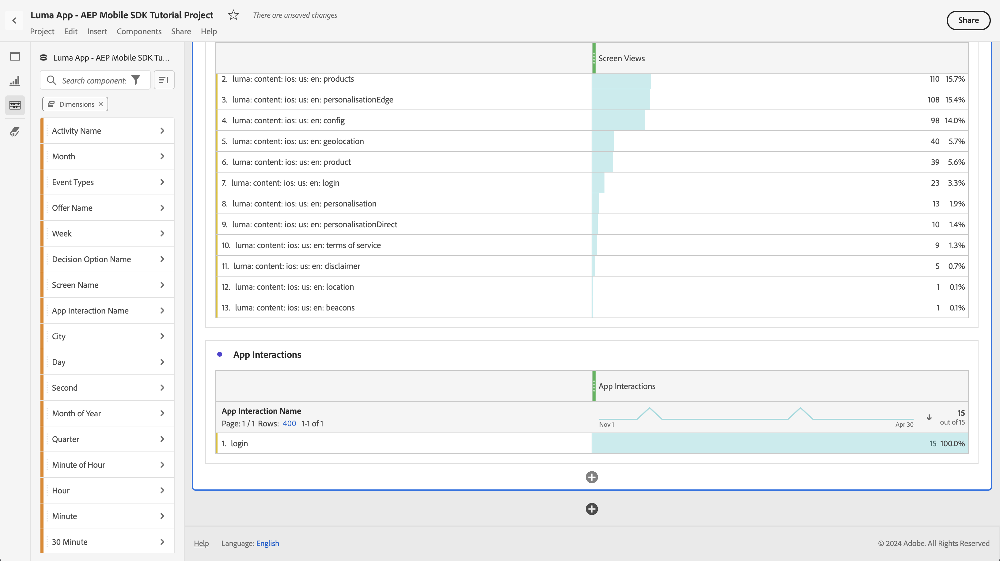

The information is limited mainly because you implemented `MobileSDK.shared.sendAppInteractionEvent(actionName: "<actionName>")` API calls only on the login screen. If you add this API call into more screens of your app, this report becomes more informative.

Do not forget to save your project!

### Commerce

You now want to report, in a separate panel, on commerce events occurring in the app.

#### Commerce Events

1. Select  outside of the current [!UICONTROL App Usage] panel, to create a new panel.
   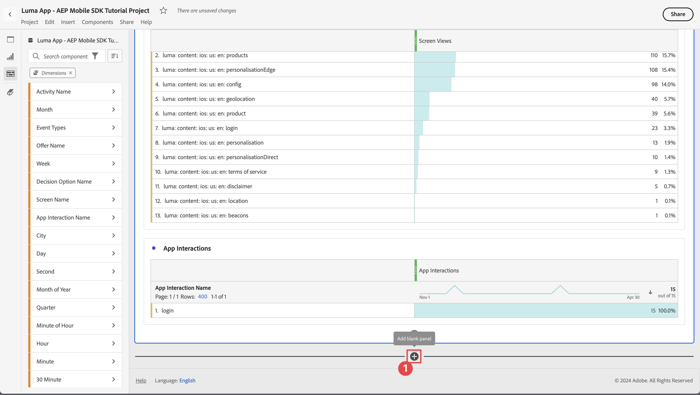

1. Ensure you select the appropriate time period.

1. Select  **[!UICONTROL Freeform table]** to create a new Freeform table.
   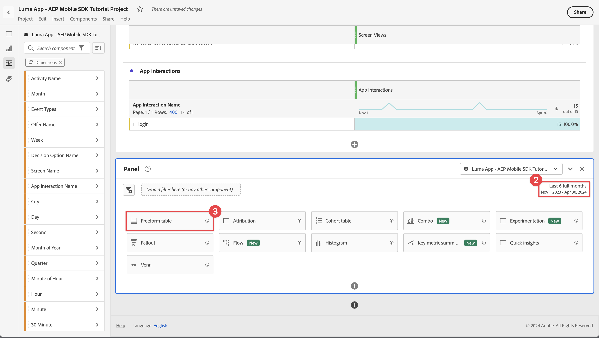

1. Rename **[!UICONTROL Panel]** to `Commerce`.

1. Rename **[!UICONTROL Freeform table]** to `Commerce Events`.

1. Drag and drop **[!UICONTROL Product Views]** metric on to [!UICONTROL _Drop a **metric** here (or any other component_)].

1. Drag and drop the **[!UICONTROL Product Add To Lists]** metric to the right of the **[!UICONTROL Product Views]** column to insert this column in the freeform table. Ensure **[!UICONTROL + Add]** (in blue) is shown when inserting the column.
   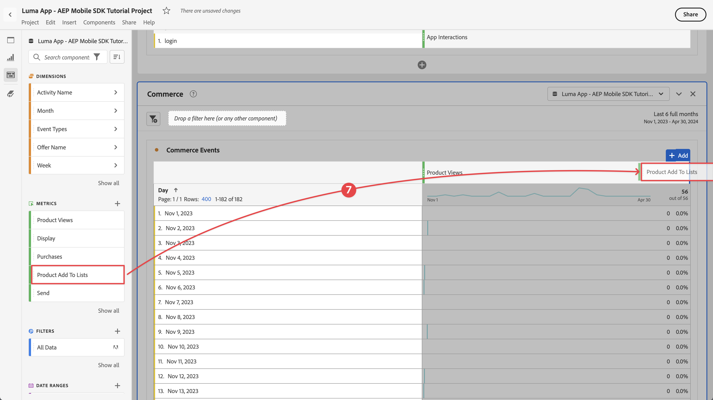

1. Repeat the previous step to add the **[!UICONTROL Save For Laters]** metric and the **[!UICONTROL Purchases]** metric to the freeform table.

1. Drag and drop the **[!UICONTROL Month]** dimension on top of the **[!UICONTROL Day]** dimension to change the reporting from daily to monthly.

Your **[!UICONTROL Commerce Events]** report is now ready, showing how users viewed products, added products to their wish list, saved products for later or even purchased your products.
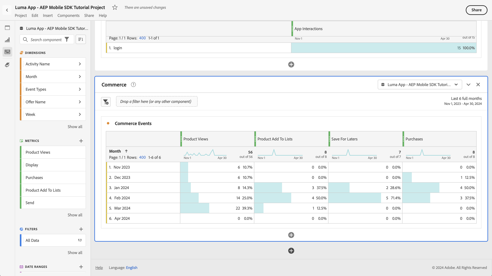

Do not forget to save your project!

#### Fallout

Based on the previous report, you want to visualize the fallout in the commerce funnel: how many users that viewed products did also add products to carts. And how many users that added products to their carts also saved these products for later. And so on.

1. Select  within the **[!UICONTROL Commerce]** panel and from the popup select  (representing the Fallout visualization).

1. Select **[!UICONTROL Product Views]** from the [!UICONTROL *Add touchpoint*] dropdown list.
   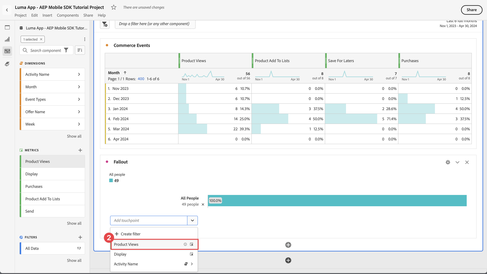 
   Alternatively, you can drag and drop the **[!UICONTROL Products View]** dimension below the **[!UICONTROL All people]** dimension in the **[!UICONTROL Fallout]** visualization.

1. Repeat the above step for **[!UICONTROL Product Add To Lists]** and **[!UICONTROL Purchases]** dimensions. Your **[!UICONTROL Fallout]** visualization now shows a visual representation of the conversion funnel for your products.
   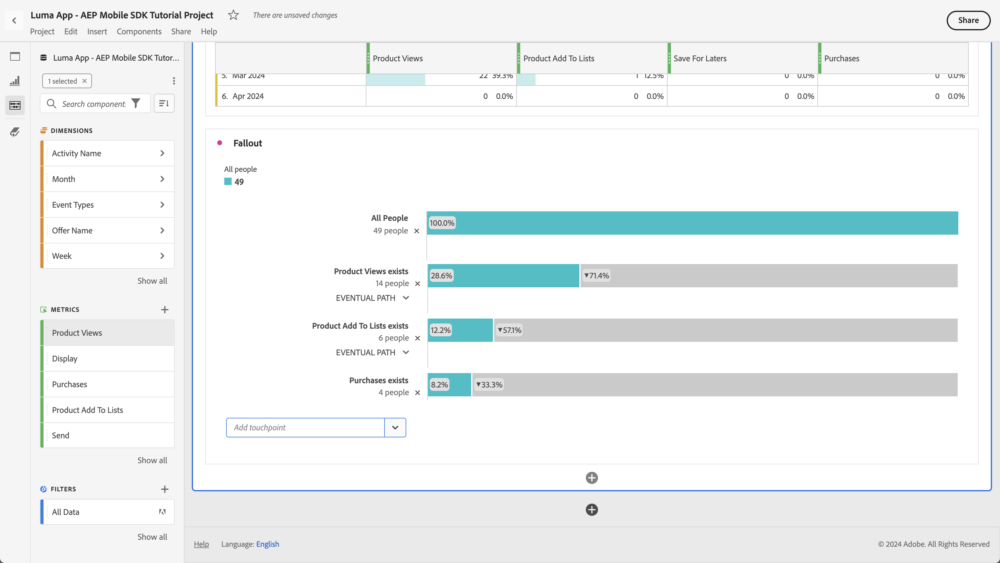

Do not forget to save your project!

### Offers

You want to report on how many offers and what offers are displayed to the users of your app.

#### Monthly Overview

1. Select  outside of the current Commerce panel, to create a new panel.

1. Rename the **[!UICONTROL Panel]** to `Offers`.

1. Ensure you select the appropriate period.

1. Select  Freeform table to create a new freeform table.

1. Rename the **[!UICONTROL Freeform table]** to `Monthly Overview`.

1. Drag and drop the **[!UICONTROL Display]** metric on to [!UICONTROL _Drop a **metric** here (or any other component_)].

1. Drag and drop the **[!UICONTROL Month]** dimension on the **[!UICONTROL Day]** column to replace the dimension.

You now have a report showing the monthly offers displayed to your users in the app.
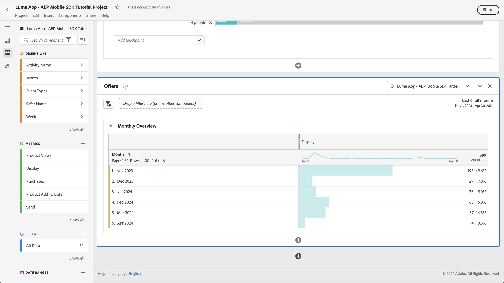

Do not forget to save your project!

#### Offers to People

You also want to have a report showing which offers were shown in what numbers to the users of the app.

1. Select  within the **[!UICONTROL Offers]** panel and from the popup to add a new Freeform table.

1. Rename **[!UICONTROL Freeform table (2)]** to `People`.

1. Drag and drop the **[!UICONTROL People]** metric on to [!UICONTROL _Drop a **metric** here (or any other component_)].

1. Drag and drop the **[!UICONTROL Activity Name]** on the **[!UICONTROL Day]** column to replace the dimension.

1. Right-click on the row, identifying one or more of the offer decisions you defined in the [Create and display offers with Decision Management](journey-optimizer-offers.md) lesson. For example, **[!UICONTROL Luma - Mobile App Decision]**.

1. From the context menu, select **[!UICONTROL Breakdown]** > **[!UICONTROL Dimensions]** > **[!UICONTROL Offer Name]**. This selection will breakdown the Activity Name dimension into Offer Names.
   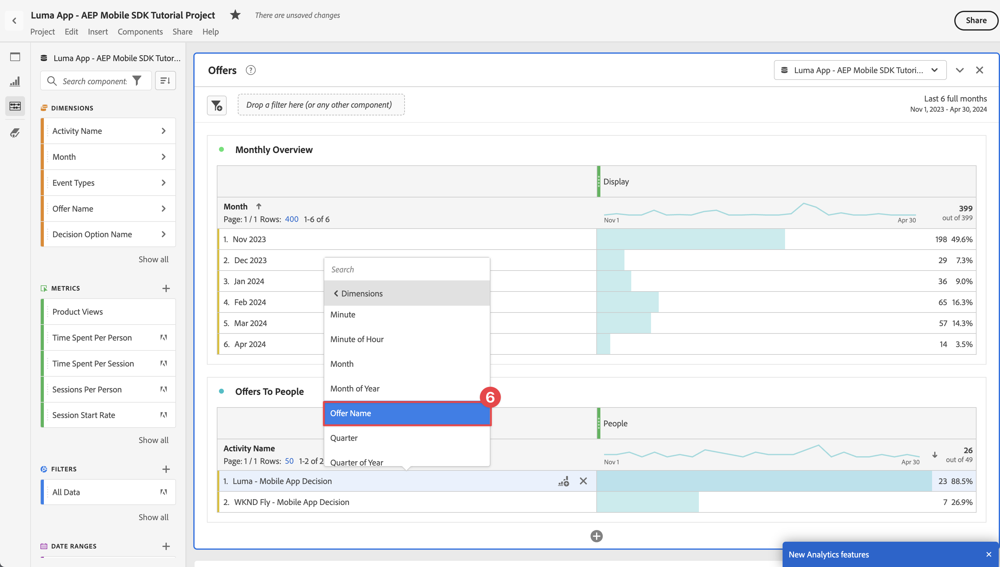

You now have a report showing the individual offers displayed for this offer decision for the selected period to users of your app.
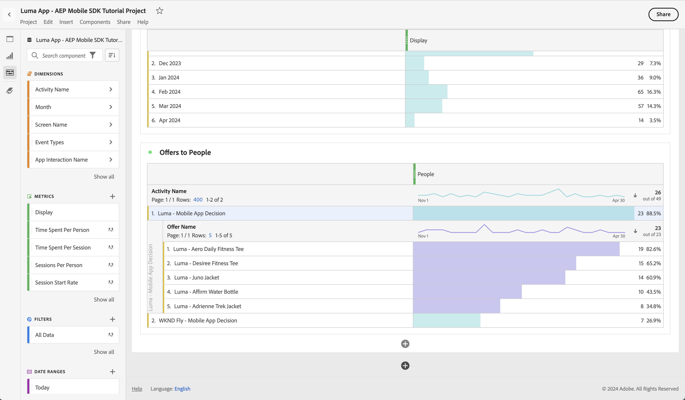

Do not forget to save your project!

### Store Visits

Finally, you want to report on store visits.

1. Select  outside of the current Offers panel, to create a new panel.

1. Rename the **[!UICONTROL Panel]** to `Store Visits`.
   
1. Ensure you select the appropriate period.

1. Select  Freeform table to create a new freeform table.

1. Rename **[!UICONTROL Freeform table ]** to `Store Entries / Exits Across Cities`.

1. Drag and drop the **[!UICONTROL Location Events]** metric on to [!UICONTROL _Drop a **metric** here (or any other component_)]. The report now shows a daily overview of all the location events that occurred in the app. Remember how you specifically configured this dimension as part of your [data view](#create-a-data-view).

1. Drag and drop the **[!UICONTROL City]** dimension on the **[!UICONTROL Day]** column header to replace the dimension. The report now shows the cities for the location events. 

1. To remove geolocation events with no cities associated to it select , and from the **[!UICONTROL Search]** popup, turn off **[!UICONTROL Include "No value"]**, then select **[!UICONTROL Apply]**.

   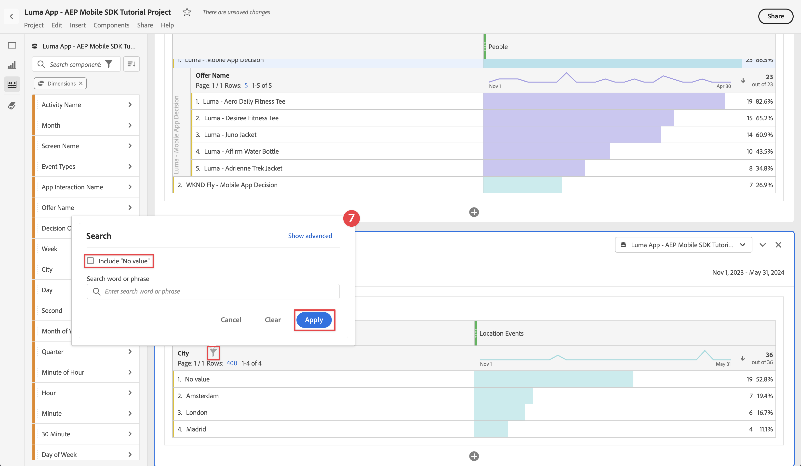

   This action removes the **[!UICONTROL No value]** row from the report.

1. Select all rows in the table, right-click, and from the context menu select Breakdown > Dimension > Event Types.

You now have a report showing users being in and out of the vicinity of your store locations (as you defined these locations in the [Places](places.md) lesson).

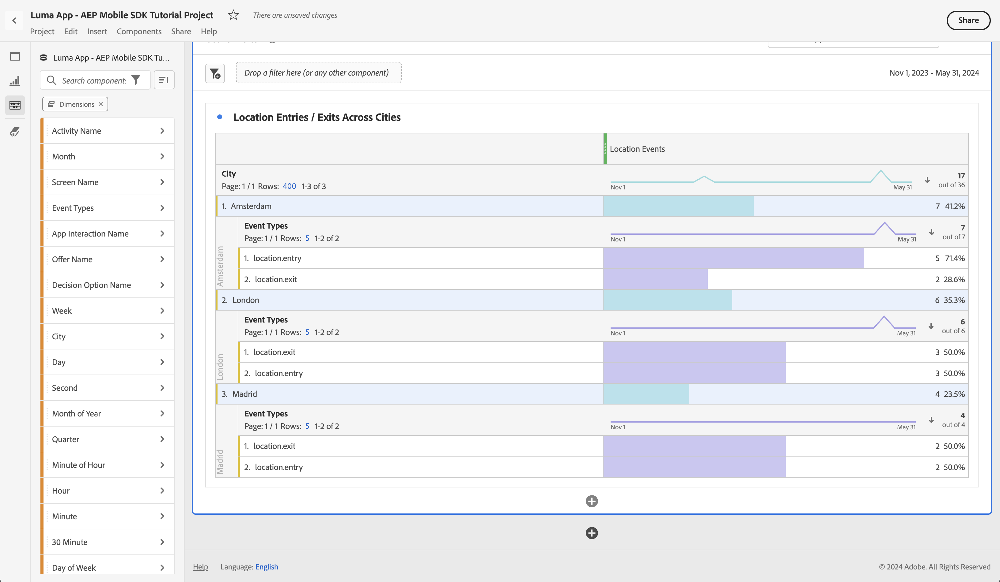

Note that if you really want to report on people physically visiting your store, you can use beacons. But hopefully, you have captured the concept of reporting on geolocation data.

## Next steps

You should now have a basic understanding of how to report and visualize on your mobile app usage, interactions, and more using Customer Journey Analytics.

>[!SUCCESS]
>
>
>Thank you for investing your time in learning about Adobe Experience Platform Mobile SDK. If you have questions, want to share general feedback, or have suggestions on future content, share them on this [Experience League Community discussion post](https://experienceleaguecommunities.adobe.com/t5/adobe-experience-platform-data/tutorial-discussion-implement-adobe-experience-cloud-in-mobile/td-p/443796).

Next: **[Conclusion and next steps](conclusion.md)**

