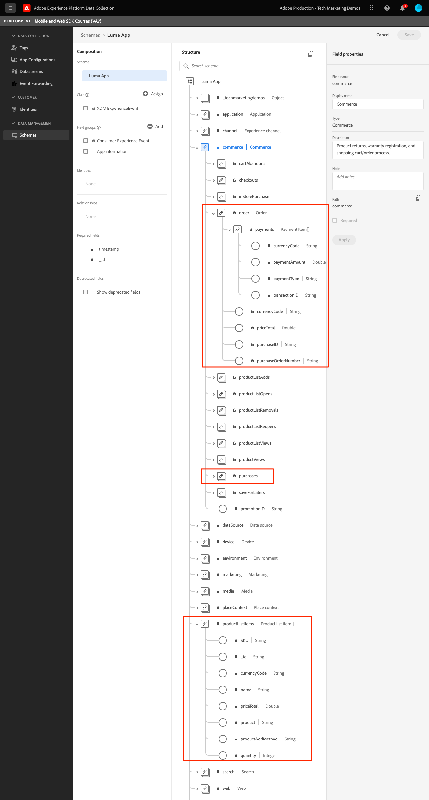

# Events

Learn how to track events in a mobile app.

The Edge Network extension provides an API to send Experience Events to Platform Edge Network. An Experience Event is an object that contains data conforming to the XDM ExperienceEvent schema definition. More simply, they capture what people do in your mobile app. Once data is received by Platform Edge Network, it can be forwarded to applications and services configured in your datastream, such as Adobe Analytics and Experience Platform. Learn more about the [Experience Events](https://developer.adobe.com/client-sdks/documentation/getting-started/track-events/) in the product documentation.

## Prerequisites

* Updated PodFile with required SDKs.
* Registered extensions in AppDelegate.
* Configured MobileCore to use your development AppId.
* Imported SDKs.
* Successfully built and run app with above changes.

## Learning objectives

In this lesson, you will:

* Understand how to structure XDM data based on a schema.
* Send an XDM event based on a standard field group.
* Send an XDM event based on a custom field group.
* Send an XDM purchase event.
* Validate with Assurance.

## Constructing an Experience Event 

The Adobe Experience Platform Edge extension can send events that follow a previously defined XDM schema to Adobe Experience Platform Edge Network. 

The process goes like this...

1. Identify the mobile app interaction you are trying to track.

1. Review your schema and identify the appropriate event.

1. Review your schema and identify any additional fields that should be used to describe the event.

1. Construct & populate the data object.

1. Create & send event.

1. Validate.

Let's look at a couple of examples.

### Example #1 - standard field groups 

Review the following example without trying to implement it in the sample app:

1. In your schema, identify the event you are trying to collect, in this example we are tracking a product view.


1. Begin constructing your object:

    ```swift
    var xdmData: [String: Any] = [
        "eventType": "commerce.productViews",
        "commerce": [
            "productViews": [
            "value": 1
            ]
        ]
    ]
    ```

    * eventType: Describes the event that occurred, use a [known value](https://github.com/adobe/xdm/blob/master/docs/reference/classes/experienceevent.schema.md#xdmeventtype-known-values) when possible.
    * commerce.productViews.value: Provide the numeric value of the event. If it's a Boolean (or "Counter" in Adobe Analytics), the value will always be 1. If it's a numeric or currency event, the value can be > 1.

1. In your schema, identify any additional data associated with the event. In this example, include `productListItems` which is a standard set of fields used with commerce-related events:

    * Notice that `productListItems` is an array so multiple products could be provided.

1. Expand your xdmData object to include supplementary data:

    ```swift
    var xdmData: [String: Any] = [
        "eventType": "commerce.productViews",
            "commerce": [
            "productViews": [
                "value": 1
            ]
        ],
        "productListItems": [
            [
                "name":  productName,
                "SKU": sku,
                "priceTotal": priceString,
                "quantity": 1
            ]
        ]
    ]
    ```

1. Use the data structure to create an `ExperienceEvent`:

    ```swift
    let productViewEvent = ExperienceEvent(xdm: xdmData)
    ```

1. Send the event and data to Platform Edge Network:

    ```swift
    Edge.sendEvent(experienceEvent: productViewEvent)
    ```

### Example #2 - custom field groups 

Review the following example without trying to implement it in the sample app:

1. In your schema, identify the event you are trying to collect. In this example, track an "App Interaction" which consists of an App Action event & name.


1. Begin constructing your object. 

    >[!NOTE]
    >
    >  Standard field groups always begin in the object root. 
    >
    >  Custom fields groups always begin under an object unique to your Experience Cloud Org, "_techmarketingdemos" in this example.

    ```swift
    var xdmData: [String: Any] = [
    "_techmarketingdemos": [
        "appInformation": [
            "appInteraction": [
                "name": actionName,
                "appAction": [
                    "value": 1
                    ]
                ]
            ]
        ]
    ]
    ```

    Or alternatively...

    ```swift
    var xdmData: [String: Any] = [:]
    xdmData["_techmarketingdemos"] = [
        "appInformation": [
            "appInteraction": [
                "name": actionName,
                "appAction": [
                    "value": 1
                ]
            ]
        ]
    ]
    ```

1. Use the data structure to create an `ExperienceEvent`.

    ```swift
    let appInteractionEvent = ExperienceEvent(xdm: xdmData)
    ```

1. Send the event and data to Platform Edge Network.

    ```swift
    Edge.sendEvent(experienceEvent: appInteractionEvent)
    ```

### Adding screen view tracking to Luma app

The above examples have hopefully explained the thought process when constructing an XDM data object. Next we will add screen view tracking in the Luma app.

1. Navigate to `Home.swift`.
1. Add the following code to `viewDidAppear(...)`.

    ```swift
            let stateName = "luma: content: ios: us: en: home"
            var xdmData: [String: Any] = [:]
            //Page View
            xdmData["_techmarketingdemos"] = [
                "appInformation": [
                    "appStateDetails": [
                        "screenType": "App",
                        "screenName": stateName,
                        "screenView": [
                            "value": 1
                        ]
                    ]
                ]
            ]
            let experienceEvent = ExperienceEvent(xdm: xdmData)
            Edge.sendEvent(experienceEvent: experienceEvent)
    ```

1. Repeat for each screen in the app, updating `stateName` as you go.


### Validation

1. Review the [setup instructions](assurance.md) section and connect your simulator or device to Assurance.
1. Perform the action and look for the `hitReceived` event from the `com.adobe.edge.konductor` vendor.
1. Select the event and review the XDM data in the `messages` object.


### Example #3 - purchase 

In this example, assume that the user successfully made the following purchase:
 
* Product #1 - Yoga Mat.
  * $49.99 x1
  * SKU: 5829
* Product #2 - Water Bottle.
  * $10.00 x3
  * SKU: 9841
* Order Total: $79.99
* Unique Order Id: 298234720
* Payment Type: Visa Credit Card
* Unique Payment Transaction Id: 847361

#### Schema

Here are the related schema fields to use:

* eventType: "commerce.purchases"
* commerce.purchases
* commerce.order
* productsListItems
* _techmarketingdemos.appStateDetails (custom)

>[!TIP]
>
>Custom field groups are always placed under your Experience Cloud Org identifier.
>
>"_techmarketingdemos" is replaced with your Org's unique value.




#### Code

Here is how you would construct and send the XDM object in the app.

```swift
let stateName = "luma: content: ios: us: en: orderconfirmation"
let currencyCode = "USD"
let orderTotal = "79.99"
let paymentType = "Visa Credit Card"
let orderId = "298234720"
let paymentTransactionId = "847361"
var xdmData: [String: Any] = [
  "eventType": "commerce.purchases",
  "commerce": [
    "purchases": [
      "value": 1
    ],
    "order": [
      "currencyCode": currencyCode,
      "priceTotal": orderTotal,
      "purchaseID": orderId,
      "purchaseOrderNumber": orderId,
      "payments": [ //Assuming only 1 payment type is used
        [
          "currencyCode": currencyCode,
          "paymentAmount": orderTotal,
          "paymentType": paymentType,
          "transactionID": paymentTransactionId
        ]
      ]
    ]
  ],
  "productListItems": [
      [
          "name":  "Yoga Mat",
          "SKU": "5829",
          "priceTotal": "49.99",
          "quantity": 1
      ],
      [
        "name":  "Water Bottle",
        "SKU": "9841",
        "priceTotal": "30.00",
        "quantity": 3
      ]
  ]
]

//Custom field group
xdmData["_techmarketingdemos"] = [
  "appInformation": [
    "appStateDetails": [
      "screenType": "App",
      "screenName": stateName,
      "screenView": [
        "value": 1
      ]
    ]
  ]
]
let experienceEvent = ExperienceEvent(xdm: xdmData)
Edge.sendEvent(experienceEvent: experienceEvent)
```

>[!NOTE]
>
>For clarity, all the values are hardcoded. In a real-world situation, the values would be populated dynamically.


### Implement in Luma app

You should have all the tools to start adding data collection to the Luma sample app. Below are a list of hypothetical tracking requirements that you can follow. 

* Track each screen view.
  * Schema fields: screenType, screenName, screenView
* Track non-commerce actions.
  * Schema fields: appInteraction.name, appAction
* Commerce actions:
  * Product Page: productViews
  * Add to Cart: productListAdds
  * Remove from Cart: productListRemovals
  * Begin Checkout: checkouts
  * View Cart: productListViews
  * Add to Wishlist: saveForLaters
  * Purchase: purchases, order

>[!TIP]
>
>Review the [fully implemented app](https://github.com/Adobe-Marketing-Cloud/Luma-iOS-Mobile-App) for more examples.

### Validation

1. Review the [setup instructions](assurance.md) section and connect your simulator or device to Assurance.

1. Perform the action and look for the `hitReceived` event from the `com.adobe.edge.konductor` vendor.

1. Select the event and review the XDM data in the `messages` object.


## Send events to Analytics and Platform

Now that you have collected the events and sent them to Platform Edge Network, they will be sent to the applications and services configured in your [datastream](create-datastream.md). In later lessons you will map this data to [Adobe Analytics](analytics.md) and [Adobe Experience Platform](platform.md). 

Next: **[WebViews](web-views.md)**

>[!NOTE]
>
>Thank you for investing your time in learning about Adobe Experience Platform Mobile SDK. If you have questions, want to share general feedback, or have suggestions on future content, please share them on this [Experience League Community discussion post](https://experienceleaguecommunities.adobe.com/t5/adobe-experience-platform-launch/tutorial-discussion-implement-adobe-experience-cloud-in-mobile/td-p/443796)