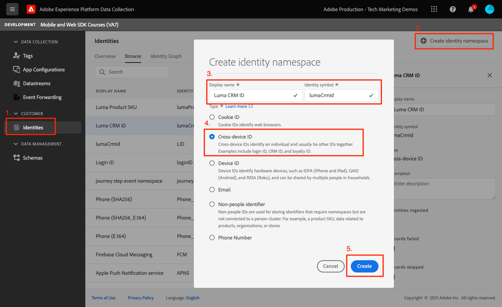
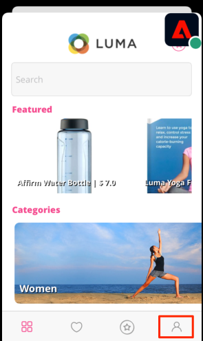
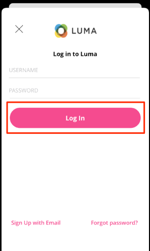
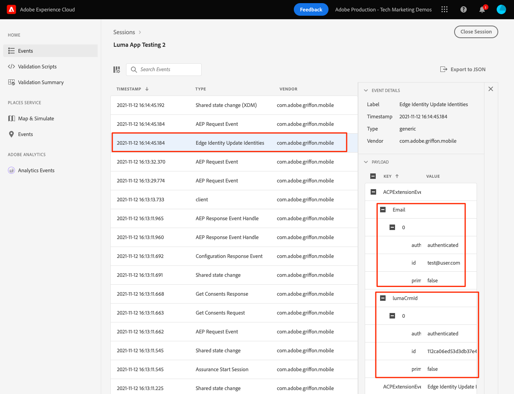
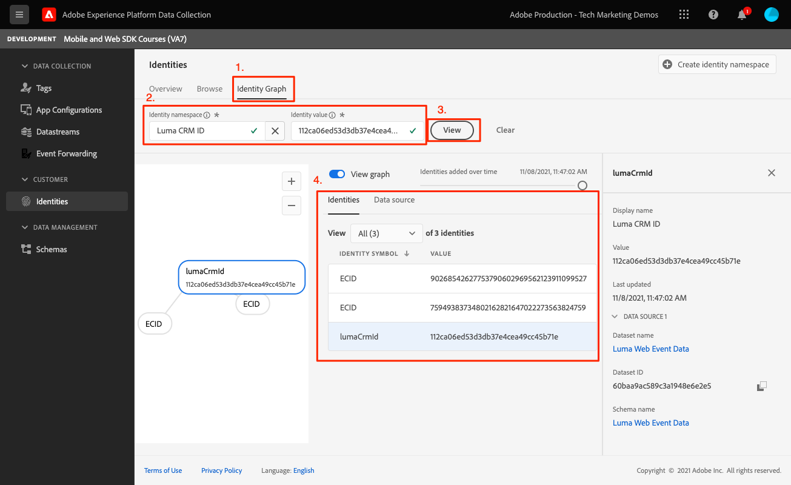

# Identity

Learn how to collect identity data in a mobile app.

Adobe Experience Platform Identity Service helps you to gain a better view of your customers and their behaviors by bridging identities across devices and systems, allowing you to deliver impactful, personal digital experiences in real time. Identity fields and namespaces are the glue that joins different data sources together to build the 360-degree real-time customer profile.

Learn more about the [Identity extension](https://developer.adobe.com/client-sdks/documentation/identity-for-edge-network/) and the [identity service](https://experienceleague.adobe.com/docs/experience-platform/identity/home.html) in the documentation.

## Prerequisites

* Successfully built and run app with SDKs installed and configured.

## Learning objectives

In this lesson, you will:

* Update a standard identity.
* Set up a custom identity.
* Update a custom identity.
* Validate the identity graph.
* Get ECID and other identities.

## Update a standard identity

Begin by updating the user's identity map when they log in. 

1. Navigate to `Login.swift` if the Luma app and find the function called `loginButt`.

    In the Luma sample app, there is no username or password validation. You simply tap the buttons to "log in".

1. Create the `IdentityMap` and `IdentityItem`.

    ```swift
    let identityMap: IdentityMap = IdentityMap()
    let emailIdentity = IdentityItem(id: emailAddress, authenticatedState: AuthenticatedState.authenticated)
    ```

1. Add the `IdentityItem` to the `IdentityMap`

    ```swift
    identityMap.add(item:emailIdentity, withNamespace: "Email")
    ```

1. Call `updateIdentities` to send the data to the Platform Edge Network.

    ```swift
    Identity.updateIdentities(with: identityMap)
    ```

>[!NOTE]
>
>You can send multiple identities in a single updateIdentities call. You can also modify previously sent identities.


## Set up a custom identity namespace

Identity namespaces are components of [Identity Service](https://experienceleague.adobe.com/docs/experience-platform/identity/home.html?lang=en) that serve as indicators of the context to which an identity relates. For example, they distinguish a value of "name@email.com" as an email address or "443522" as a numeric CRM ID.

1. In the Data Collection interface, select **[!UICONTROL Identities]** from the left-rail navigation.
1. Select **[!UICONTROL Create identity namespace]**.
1. Provide a **[!UICONTROL Display name]** of `Luma CRM ID` and an **[!UICONTROL Identity symbol]** value of `lumaCrmId`.
1. Select **[!UICONTROL Cross-device ID]**.
1. Select **[!UICONTROL Create]**.



## Update a custom identity

Now that you've created a custom Identity, start collecting it by modifying the `updateIdentities` code you added in the previous step. Simply creating an IdentityItem and add it to the IdentityMap. Here is what the full code block should look like:

```swift
//Hardcoded identity values
let emailAddress = "testuser@gmail.com"
let crmId = "112ca06ed53d3db37e4cea49cc45b71e"

// Create identity map
let identityMap: IdentityMap = IdentityMap()
// Add email (standard)
let emailIdentity = IdentityItem(id: emailAddress, authenticatedState: AuthenticatedState.authenticated)
identityMap.add(item:emailIdentity, withNamespace: "Email")
// Add lumaCrmId (custom)
let crmIdentity = IdentityItem(id: crmId, authenticatedState: AuthenticatedState.authenticated)
identityMap.add(item: crmIdentity, withNamespace: "lumaCrmId")
// Update
Identity.updateIdentities(with: identityMap)
```

## Remove an identity

You can use `removeIdentity` to remove the identity from the stored client-side IdentityMap. The Identity extension stops sending the identifier to the Edge Network. Using this API does not remove the identifier from the server-side User Profile Graph or Identity Graph.

Add the following `removeIdentity` code to the logout button click in `Account.swift`. 

```swift
// Logout
let logout = UIAlertAction(title: "Logout", style: .destructive, handler: { (action) -> Void in
    isLoggedIn = false;
    ////Hardcoded identity values
    let emailAddress = "testuser@gmail.com"
    let crmId = "112ca06ed53d3db37e4cea49cc45b71e"
    // Adobe Experience Platform - Remove Identity
    Identity.removeIdentity(item: IdentityItem(id: emailAddress), withNamespace: "Email")
    Identity.removeIdentity(item: IdentityItem(id: crmId), withNamespace: "lumaCrmId")
})
```

>[!NOTE]
>In the above examples, `crmId` and `emailAddress` are hardcoded but in a real-world app the values would be dynamic.

## Validate with Assurance

1. Review the [setup instructions](assurance.md) section and connect your simulator or device to Assurance.
1. In the app, select the Account icon from the bottom right.
    
    
1. Select the **Log In** button.
1. You are presented with the option to enter a username & password, both are optional and you can simply select **Log In**.

    
1. Look in the Assurance web UI for the `Edge Identity Update Identities` event from the `com.adobe.griffon.mobile` vendor.
1. Select the event and review the data in the `ACPExtensionEventData` object. You should see the identities you updated.


## Validate with identity graph

Once you complete the steps in the [Experience Platform lesson](platform.md), you will also be able to confirm the identy capture in Platforms identity graph viewer:




Next: **[Profile](profile.md)**

>[!NOTE]
>
>Thank you for investing your time in learning about Adobe Experience Platform Mobile SDK. If you have questions, want to share general feedback, or have suggestions on future content, please share them on this [Experience League Community discussion post](https://experienceleaguecommunities.adobe.com/t5/adobe-experience-platform-launch/tutorial-discussion-implement-adobe-experience-cloud-in-mobile/td-p/443796)