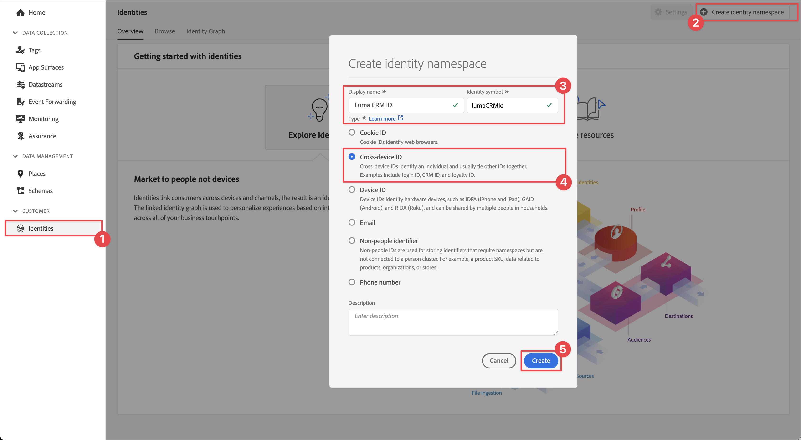
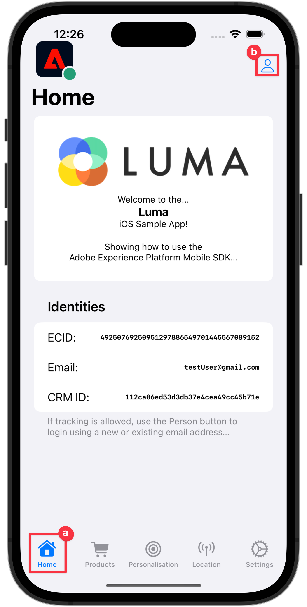
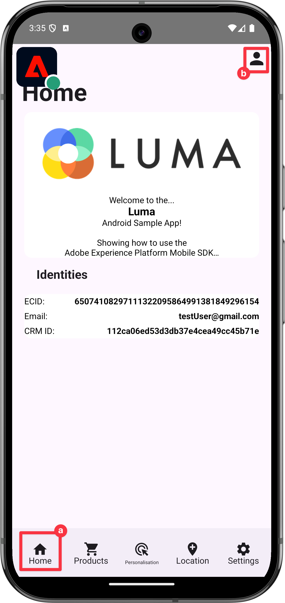
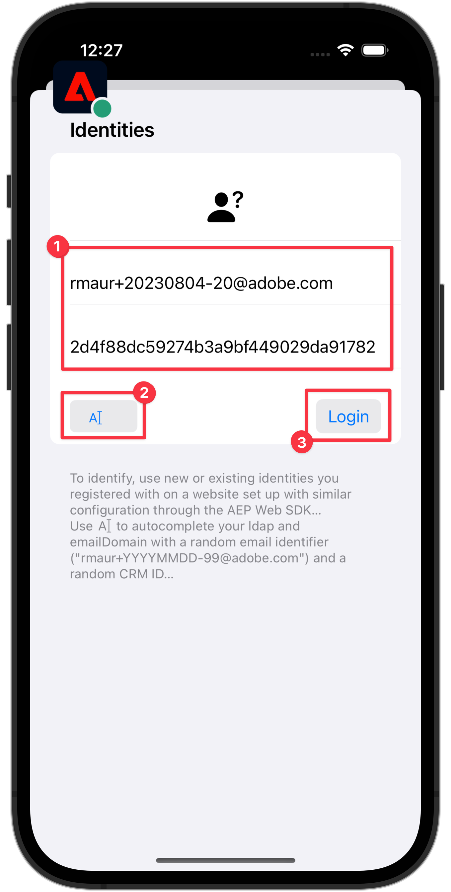
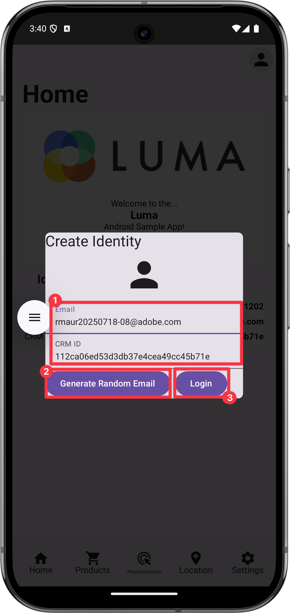
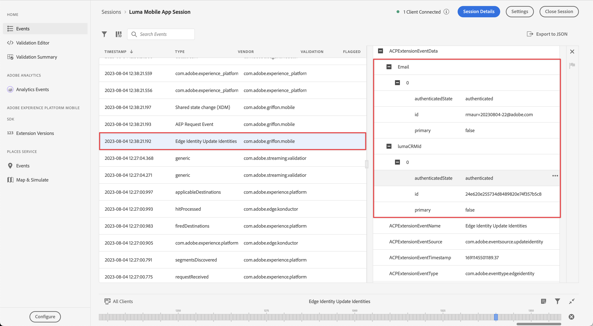
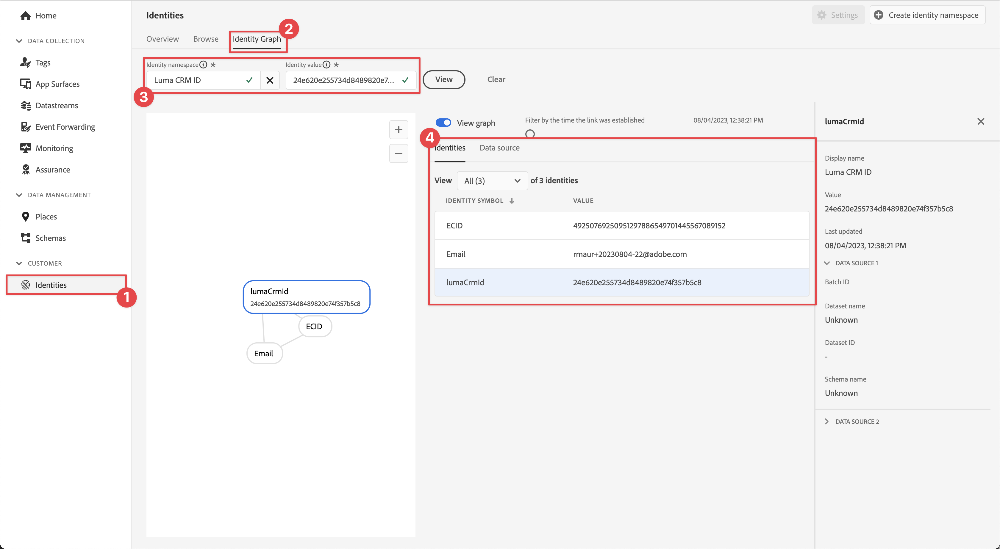

# Collect identity data

Learn how to collect identity data in a mobile app.

Adobe Experience Platform Identity Service helps you to gain a better view of your customers and their behaviors by bridging identities across devices and systems, allowing you to deliver impactful, personal digital experiences in real time. Identity fields and namespaces are the glue that joins different data sources together to build the 360-degree real-time customer profile.

Learn more about the [Identity extension](https://developer.adobe.com/client-sdks/documentation/identity-for-edge-network/) and the [identity service](https://experienceleague.adobe.com/docs/experience-platform/identity/home.html) in the documentation.

## Prerequisites

* Successfully built and run app with SDKs installed and configured.

## Learning objectives

In this lesson, you will:

* Set up a custom identity namespace.
* Update identities.
* Validate the identity graph.
* Get ECID and other identities.


## Set up a custom identity namespace

Identity namespaces are components of [Identity Service](https://experienceleague.adobe.com/docs/experience-platform/identity/home.html?lang=en) that serve as indicators of the context to which an identity relates. For example, they distinguish a value of `name@email.com` as an email address or `443522` as a numeric CRM ID.

>[!NOTE]
>
>The Mobile SDK generates a unique identity in its own namespace, named Experience Cloud ID (ECID) when the app is installed. This ECID is stored in persistent memory on the mobile device and is sent with every hit. The ECID is removed when the user uninstalls the app or when the user sets the Mobile SDK global privacy status to opt-out. In the sample Luma app, you should remove and reinstall the app to create a new profile with its own unique ECID.


To create a new identity namespace:

1. In the Data Collection interface, select **[!UICONTROL Identities]** from the left-rail navigation.
1. Select **[!UICONTROL Create identity namespace]**.
1. Provide a **[!UICONTROL Display name]** of `Luma CRM ID` and an **[!UICONTROL Identity symbol]** value of `lumaCRMId`.
1. Select **[!UICONTROL Cross-device ID]**.
1. Select **[!UICONTROL Create]**.

   


## Update identities

You want to update both the standard identity (email) and the custom identity (Luma CRM ID) when the user logs into the app.

>[!BEGINTABS]

>[!TAB iOS]

1. Navigate to **[!DNL Luma]** > **[!DNL Luma]** > **[!DNL Utils]** > **[!UICONTROL MobileSDK]** in the Xcode Project navigator and find the `func updateIdentities(emailAddress: String, crmId: String)` function implementation. Add the following  code to the function.

   ```swift
   // Set up identity map, add identities to map and update identities
   let identityMap: IdentityMap = IdentityMap()

   let emailIdentity = IdentityItem(id: emailAddress, authenticatedState: AuthenticatedState.authenticated)
   let crmIdentity = IdentityItem(id: crmId, authenticatedState: AuthenticatedState.authenticated)
   identityMap.add(item:emailIdentity, withNamespace: "Email")
   identityMap.add(item: crmIdentity, withNamespace: "lumaCRMId")

   Identity.updateIdentities(with: identityMap)
   ```

    This code:

    1. Creates an empty `IdentityMap` object.

       ```swift
       let identityMap: IdentityMap = IdentityMap()
       ```

    1. Sets up `IdentityItem` objects for email and CRM ID.
   
       ```swift
       let emailIdentity = IdentityItem(id: emailAddress, authenticatedState: AuthenticatedState.authenticated)
       let crmIdentity = IdentityItem(id: crmId, authenticatedState: AuthenticatedState.authenticated)
       ```

    1. Adds these `IdentityItem` objects to the `IdentityMap` object.

       ```swift
       identityMap.add(item:emailIdentity, withNamespace: "Email")
       identityMap.add(item: crmIdentity, withNamespace: "lumaCRMId")
       ```    

    1. Sends the `IdentityItem` object as part of the `Identity.updateIdentities` API call to the Edge Network.

       ```swift
       Identity.updateIdentities(with: identityMap) 
     
       ```   

1. Navigate to **[!DNL Luma]** > **[!DNL Luma]** > **[!DNL Views]** > **[!DNL General]** > **[!UICONTROL LoginSheet]** in the Xcode Project navigator and find the code to execute when selecting the **[!UICONTROL Login]** button. Add the following code:

   ```swift
   // Update identities
   MobileSDK.shared.updateIdentities(emailAddress: currentEmailId, crmId: currentCRMId)                             
   ```


>[!TAB Android]

1. Navigate to **[!DNL app]** > **[!DNL kotlin+java]** > **[!DNL com.adobe.luma.tutorial.android]** > **[!UICONTROL models]** > **[!UICONTROL MobileSDK]** in the Android Studio navigator and find the `fun updateIdentities(emailAddress: String, crmId: String) ` function implementation. Add the following  code to the function.

   ```kotlin
   // Set up identity map, add identities to map and update identities
   val identityMap = IdentityMap()

   val emailIdentity = IdentityItem(emailAddress, AuthenticatedState.AUTHENTICATED, true)
   val crmIdentity = IdentityItem(crmId, AuthenticatedState.AUTHENTICATED, true)
   identityMap.addItem(emailIdentity, "Email")
   identityMap.addItem(crmIdentity, "lumaCRMId")

   Identity.updateIdentities(identityMap)
   ```

    This code:

    1. Creates an empty `IdentityMap` object.

       ```kotlin
       val identityMap = IdentityMap()
       ```

    1. Sets up `IdentityItem` objects for email and CRM ID.
   
       ```kotlin
       val emailIdentity = IdentityItem(emailAddress, AuthenticatedState.AUTHENTICATED, true)
       val crmIdentity = IdentityItem(crmId, AuthenticatedState.AUTHENTICATED, true)
       ```

    1. Adds these `IdentityItem` objects to the `IdentityMap` object.

       ```kotlin
       identityMap.addItem(emailIdentity, "Email")
       identityMap.addItem(crmIdentity, "lumaCRMId")
       ```    

    1. Sends the `IdentityItem` object as part of the `Identity.updateIdentities` API call to the Edge Network.

       ```kotlin
       Identity.updateIdentities(identityMap)
       ```   

1.Navigate to **[!DNL app]** > **[!DNL kotlin+java]** > **[!DNL com.adobe.luma.tutorial.android]** > **[!UICONTROL views]** > **[!UICONTROL LoginSheet.kt]** in the Android Studio navigator and find the code to execute when selecting the **[!UICONTROL Login]** button. Add the following code:

   ```kotlin
   // Update identities
   MobileSDK.shared.updateIdentities(
      MobileSDK.shared.currentEmailId.value,
      MobileSDK.shared.currentCRMId.value
   )                             
   ```


>[!ENDTABS]


>[!NOTE]
>
>You can send multiple identities in a single `updateIdentities` call. You can also modify previously sent identities.


## Remove an identity

You can use the [`Identity.removeIdentity`](https://developer.adobe.com/client-sdks/documentation/identity-for-edge-network/api-reference/#removeidentity) API to remove the identity from the stored client-side identity map. The Identity extension stops sending the identifier to the Edge Network. Using this API does not remove the identifier from the server-side identity graph. See [View identity graphs](https://experienceleague.adobe.com/docs/platform-learn/tutorials/identities/view-identity-graphs.html?lang=en) for more information on identity graphs.


>[!BEGINTABS]

>[!TAB iOS]

1. Navigate to **[!DNL Luma]** > **[!DNL Luma]** > **[!DNL Utils]** > **[!UICONTROL MobileSDK]** in the Xcode Project navigator and add the following code to the `func removeIdentities(emailAddress: String, crmId: String)` function: 

   ```swift
   // Remove identities and reset email and CRM Id to their defaults
   Identity.removeIdentity(item: IdentityItem(id: emailAddress), withNamespace: "Email")
   Identity.removeIdentity(item: IdentityItem(id: crmId), withNamespace: "lumaCRMId")
   currentEmailId = "testUser@gmail.com"
   currentCRMId = "112ca06ed53d3db37e4cea49cc45b71e"
   ```

1. Navigate to **[!DNL Luma]** > **[!DNL Luma]** > **[!DNL Views]** > **[!DNL General]** > **[!UICONTROL LoginSheet]** in the Xcode Project navigator and find the code to execute when selecting the **[!UICONTROL Logout]** button. Add the following code:

   ```swift
   // Remove identities
   MobileSDK.shared.removeIdentities(emailAddress: currentEmailId, crmId: currentCRMId)                  
   ```

>[!TAB Android]

1. Navigate to **[!DNL app]** > **[!DNL kotlin+java]** > **[!DNL com.adobe.luma.tutorial.android]** > **[!UICONTROL models]** > **[!UICONTROL MobileSDK]** in the Android Studio navigator and add the following code to the `fun removeIdentities(emailAddress: String, crmId: String)` function: 

   ```kotlin
   // Remove identities and reset email and CRM Id to their defaults
   Identity.removeIdentity(IdentityItem(emailAddress), "Email")
   Identity.removeIdentity(IdentityItem(crmId), "lumaCRMId")
   currentEmailId.value = "testUser@gmail.com"
   currentCRMId.value = "112ca06ed53d3db37e4cea49cc45b71e"
   ```

1.Navigate to **[!DNL app]** > **[!DNL kotlin+java]** > **[!DNL com.adobe.luma.tutorial.android]** > **[!UICONTROL views]** > **[!UICONTROL LoginSheet.kt]** in the Android Studio navigator and find the code to execute when selecting the **[!UICONTROL Logout]** button. Add the following code:

   ```swift
   // Remove identities
   // Remove identities
   MobileSDK.shared.removeIdentities(
         MobileSDK.shared.currentEmailId.value,
         MobileSDK.shared.currentCRMId.value
   )              
   ```


>[!ENDTABS]

## Validate with Assurance

1. Review the [setup instructions](assurance.md#connecting-to-a-session) section to connect your simulator or device to Assurance.
1. In the Luma app
   1. Select the **[!UICONTROL Home]** tab and move the Assurance icon to the left. 
   1. Select the  icon from the top right.

      >[!BEGINTABS]

      >[!TAB iOS]
   
      

      >[!TAB Android]

      

      >[!ENDTABS]
      
   1. Provide an email address and a CRM Id, or
   1. Select  (iOS) or **[!UICONTROL Generate Random Email]** (Android) to randomly generate an **[!UICONTROL Email]** and **[!UICONTROL CRM ID]**.
   1. Select **[!UICONTROL Login]**.

      >[!BEGINTABS]

      >[!TAB iOS]

      

      >[!TAB Android]

      


      >[!ENDTABS]
    

1. Look in the Assurance web interface for the **[!UICONTROL Edge Identity Update Identities]** event from the **[!UICONTROL com.adobe.griffon.mobile]** vendor.
1. Select the event and review the data in the **[!UICONTROL ACPExtensionEventData]** object. You should see the identities you updated.


## Validate with identity graph

Once you complete the steps in the [Experience Platform lesson](platform.md), you are able to confirm the identity capture in Platforms identity graph viewer:

1. Select **[!UICONTROL Identities]** in the Data Collection UI.
1. Select **[!UICONTROL Identity Graph]** from the top bar.
1. Enter `Luma CRM ID` as the **[!UICONTROL Identity namespace]** and your CRM Id (for example `24e620e255734d8489820e74f357b5c8`) as the **[!UICONTROL Identity value]**.
1. You see the **[!UICONTROL Identities]** listed.

   

>[!INFO]
>
>There is no code in the app to reset the ECID, which means you can only reset the ECID (and effectively create a new profile with a new ECID) through an uninstall and a reinstall of the application. To implement the reset of identifiers, see the [`Identity.resetIdentities`](https://developer.adobe.com/client-sdks/documentation/mobile-core/identity/api-reference/#resetidentities) and [`MobileCore.resetIdentities`](https://developer.adobe.com/client-sdks/documentation/mobile-core/api-reference/#resetidentities) API calls. Be aware though, when using a push notification identifier (see [Sending push notifications](journey-optimizer-push.md)), that identifier becomes another 'sticky' profile identifier on the device.


>[!SUCCESS]
>
>You have now set up your app to update identities in the Edge Network and (when set up) with Adobe Experience Platform.
>
>Thank you for investing your time in learning about Adobe Experience Platform Mobile SDK. If you have questions, want to share general feedback, or have suggestions on future content, share them on this [Experience League Community discussion post](https://experienceleaguecommunities.adobe.com/t5/adobe-experience-platform-data/tutorial-discussion-implement-adobe-experience-cloud-in-mobile/td-p/443796)

Next: **[Collect profile data](profile.md)**
