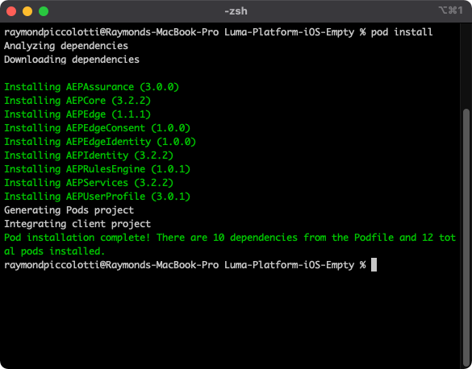
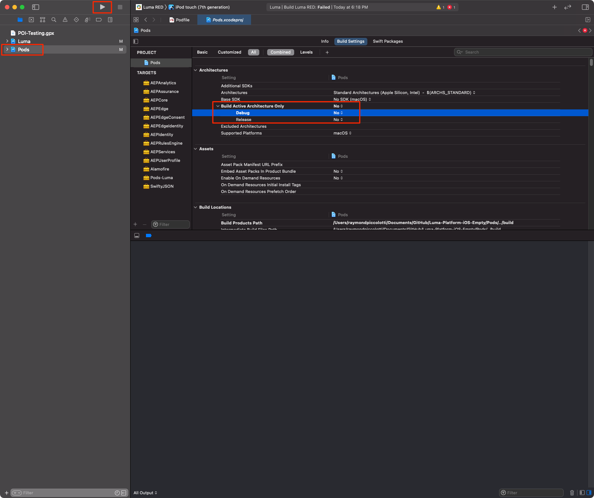

# Install Adobe Experience Platform Mobile SDKs

Learn how to implement the Adobe Experience Platform Mobile SDK in a mobile app.

>[!INFO]
>
> This tutorial will be replaced with a new tutorial using a new sample mobile app in late November 2023

## Prerequisites

* Successfully built tag library with the extensions described in the [previous lesson](configure-tags.md).
* Development Environment File ID from the [Mobile Install Instructions](configure-tags.md#generate-sdk-install-instructions).
* Downloaded, empty [sample app](https://github.com/Adobe-Marketing-Cloud/Luma-iOS-Mobile-App){target="_blank"}.
* Experience with [XCode](https://developer.apple.com/xcode/){target="_blank"}.
* Basic [command-line](https://en.wikipedia.org/wiki/Command-line_interface){target="_blank"} knowledge.

## Learning objectives

In this lesson, you will:

* Update your CocoaPod file.
* Import the required SDKs.
* Register the extensions.

>[!NOTE]
>
>In a mobile app implementation, the terms "extensions" and "SDKs" are nearly interchangeable.


## Update PodFile

>[!NOTE]
>
> If you aren't familiar with CocoaPods, please review the official [getting started guide](https://guides.cocoapods.org/using/getting-started.html).
    
Install is usually a simple sudo command:

```console
sudo gem install cocoapods
```

Once you have CocoaPods installed, open the Podfile.


Update the file to include the following pods:

```swift
pod 'AEPCore', '~> 3'
pod 'AEPEdge', '~> 1'
pod 'AEPUserProfile', '~> 3'
pod 'AEPAssurance', '~> 3'
pod 'AEPServices', '~> 3'
pod 'AEPEdgeConsent', '~> 1'
pod 'AEPLifecycle', '~>3'
pod 'AEPMessaging', '~>1'
pod 'AEPEdgeIdentity', '~>1'
pod 'AEPSignal', '~>3'
```

>[!NOTE]
>
> `AEPMessaging` is only required if you plan to implement push messaging using Adobe Journey Optimizer. Please read the tutorial on [implementing push messaging with Adobe Journey Optimizer](journey-optimizer-push.md) for more information.

After saving the changes to your Podfile, navigate to the folder with your project and run the `pod install` command to install your changes.


        
>[!NOTE]
>
> If you get the "No Podfile found in the project directory." error, your terminal is in the wrong folder. Navigate to the folder with the Podfile you updated and try again.

If you want to upgrade to the latest version, run the `pod update` command.

>[!INFO]
>
>If you are not able to use CocoaPods in your own apps, you can learn about other [supported implementations](https://github.com/adobe/aepsdk-core-ios#binaries) in the GitHub project.

## Build CocoaPods

To build CocoaPods, open `Luma.xcworkspace`, and select **Product**, followed by **Clean Build Folder**.

>[!NOTE]
>
> You may need to set **Build Active Architecture Only** to **No**. To do this, select the Pods project from the project navigator, select **Build Settings**, and set the **Build Active Architecture** to **No**.

You can now build and run the project.



>[!NOTE]
>
>The Luma project was built with Xcode v12.5 on an M1 chipset and runs on the iOS simulator. If you are using a different setup, you may need to change your build settings to reflect your architecture.
>
>If your build was not successful, try reverting the **Build Active Architecture** > **Debug** setting back to **Yes**.
>
>Simulator configuration "iPod touch (7th generation)" was used while authoring this tutorial.

## Import extensions

In each of the `.swift` files, add the following imports. Start by adding to `AppDelegate.swift`.

```swift
import AEPUserProfile
import AEPAssurance
import AEPEdge
import AEPCore
import AEPEdgeIdentity
import AEPEdgeConsent
import AEPLifecycle
import AEPMessaging //Optional, used for AJO push messaging
import AEPSignal
import AEPServices
```

## Update AppDelegate

In the `AppDelegate.swift` file, add the following code to `didFinishLaunchingWithOptions`. Replace currentAppId with the Development Environment File ID value that you retrieved from tags in the [previous lesson](configure-tags.md).

```swift
let currentAppId = "b5cbd1a1220e/bae66382cce8/launch-88492c6dcb6e-development"

let extensions = [Edge.self, Assurance.self, Lifecycle.self, UserProfile.self, Consent.self, AEPEdgeIdentity.Identity.self, Messaging.self]

MobileCore.setLogLevel(.trace)

MobileCore.registerExtensions(extensions, {
    MobileCore.configureWith(appId: currentAppId)
})
```

`Messaging.self` is only required if you plan to implement push messaging via Adobe Journey Optimizer as described [here](journey-optimizer-push.md).

The above code does the following:

* Registers the required extensions.
* Configures MobileCore and other extensions to use your tag property configuration.
* Enables debug logging. More details and options can be found in the [Mobile SDK documentation](https://developer.adobe.com/client-sdks/documentation/getting-started/enable-debug-logging/).

>[!IMPORTANT]
>In a production app, you must switch AppId based on the current environment (dev/stag/prod).
>

Next: **[Set up Assurance](assurance.md)**

>[!NOTE]
>
>Thank you for investing your time in learning about Adobe Experience Platform Mobile SDK. If you have questions, want to share general feedback, or have suggestions on future content, share them on this [Experience League Community discussion post](https://experienceleaguecommunities.adobe.com/t5/adobe-experience-platform-data/tutorial-discussion-implement-adobe-experience-cloud-in-mobile/td-p/443796)