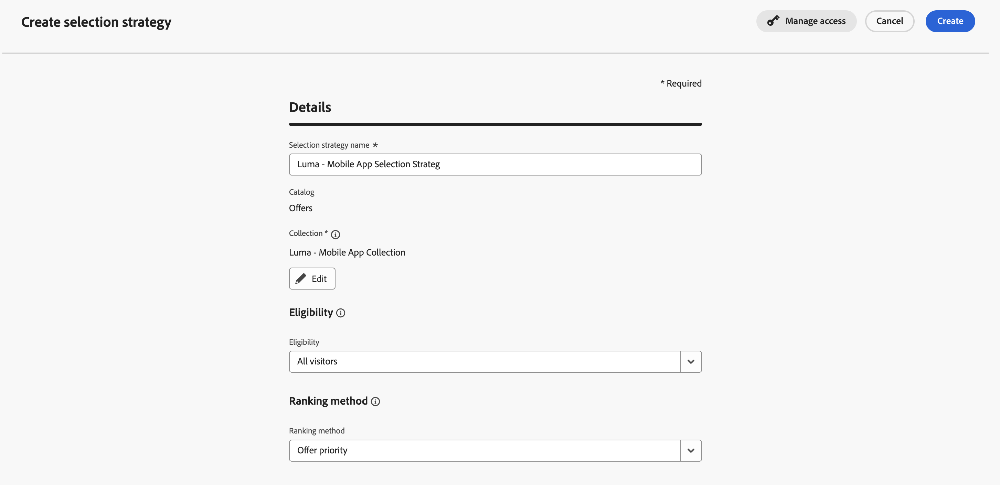
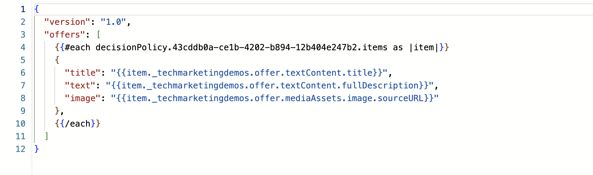
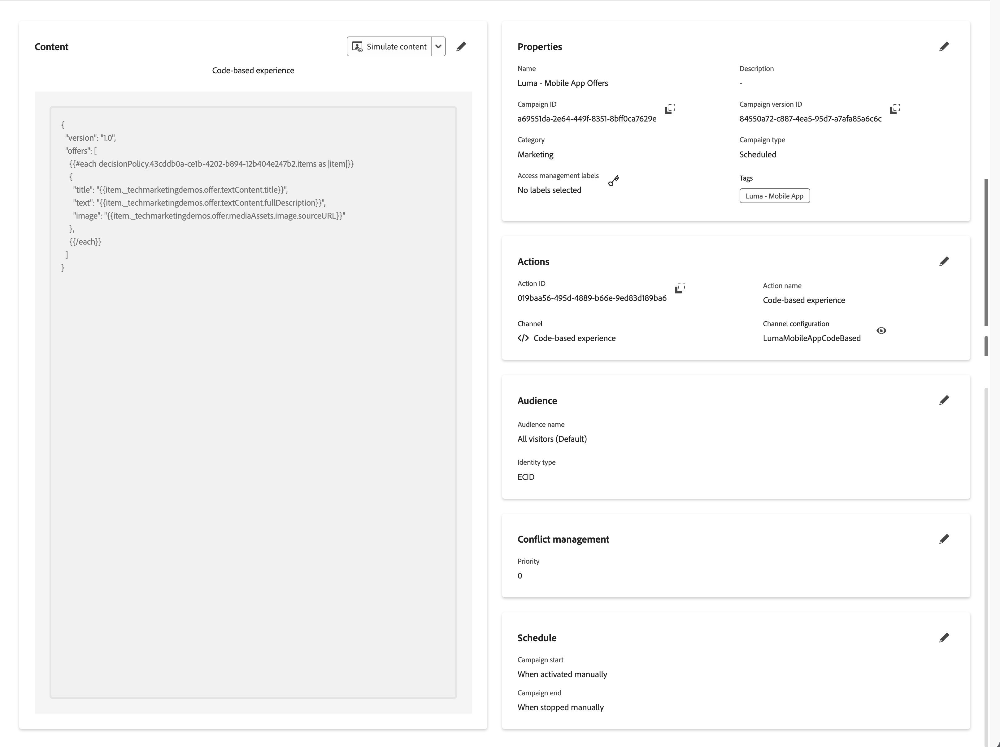

# Create and display offers with Decisioning

Learn how to show offers from Journey Optimizer Decisioning in your mobile apps with Experience Platform Mobile SDK.

Journey Optimizer Decisioning is the next generation of offer management and successor of [Decision Management](./journey-optimizer-offers.md). The Decisioning feature empowers you to deliver personalized marketing offers by combining a centralized catalog of decision items with a powerful decision engine. Whether you're tailoring content for individual audiences or optimizing strategies with AI-powered rankings, Decisioning provides the tools to make data-driven decisions at scale. Dive into the key concepts such as decision items, rules, and policies, and explore how these elements work together to select and prioritize the best content for your campaigns. From managing collections and placements to leveraging Adobe Experience Platform data, this comprehensive guide helps you unlock smarter personalization and drive impactful customer experiences.

{zoomable="yes"}

Decisioning simplifies personalization by offering a centralized catalog of marketing offers known as 'decision items' and a sophisticated decision engine. This engine leverages rules and ranking criteria to select and present the most relevant decision items to each individual. These decision items are seamlessly integrated into messages and experiences across Adobe Journey Optimizer channels: code-based experience, email, SMS, push notifications, and more. 

In this lesson, the focus is on the use of the code-based experience channel to deliver offers in the mobile app. And not on explaining in depth all capabilities of the Decisioning solution. Refer to the [Decisioning](https://experienceleague.adobe.com/en/docs/journey-optimizer/using/decisioning/experience-decisioning/experience-decisioning-landing-page) documentation for more information. 


>[!NOTE]
>
>This lesson is optional and only applies to Journey Optimizer users looking to use the Decision Management functionality to display offers in a mobile app.


## Prerequisites

* Successfully built and run app with SDKs installed and configured.
* Set up the app for Adobe Experience Platform.
* Access to Journey Optimizer - Decisioning with the [proper permissions to manage offers and decisions](https://experienceleague.adobe.com/en/docs/journey-optimizer/using/access-control/high-low-permissions).


## Learning objectives

In this lesson, you will

* Update your Edge configuration for Decisioning.
* Create a schema to represent offers.
* Validate setup in Assurance.
* Configure a code-based experience channel configuration.
* 
* Create a code-based experience campaign, based on offers in Journey Optimizer - Decision Management.
* Implement offers from Decisioning in your app.


## Setup

>[!TIP]
>
>If you have set up your environment already as part of the [Setup A/B tests with Target](target.md) lesson, you might already have performed some of the steps in this setup section.

### Update datastream configuration

To ensure data sent from your mobile app to Platform Edge Network is forwarded to Journey Optimizer - Decision Management, update your datastream.

1. In the Data Collection UI, select **[!UICONTROL Datastreams]**, and select your datastream, for example **[!DNL Luma Mobile App]**.
1. Select  for **[!UICONTROL Experience Platform]** and select  **[!UICONTROL Edit]** from the context menu.
1. In the **[!UICONTROL Datastreams]** >  >  **[!UICONTROL Adobe Experience Platform]** screen, ensure **[!UICONTROL Offer Decisioning]**, **[!UICONTROL Edge Segmentation]**, and **[!UICONTROL Adobe Journey Optimizer]** are enabled. 
   * If you plan to only do the Decisioning lesson and not the Decision management lesson, you do not need to enable **[!UICONTROL Offer Decisioning]**.
   * If you do the Target lesson, select **[!UICONTROL Personalization Destinations]**, too. See [Adobe Experience Platform settings](https://experienceleague.adobe.com/en/docs/experience-platform/datastreams/configure) for more information.
1. To save your datastream configuration, select **[!UICONTROL Save]** .

   {zoomable="yes"}


### Define your schema

1. Navigate to the Data Collection interface and select **[!UICONTROL Schemas]** from the left rail.
1. Select **[!UICONTROL Browse]** from the top bar.
1. Open the **[!UICONTROL Personalized Offer Items - Experience Decisioning]** schema. This schema is the dedicated schema to configure your offer items, their attributes and metadata.
1. Add additional field groups to your schema that represent how you want to use offers in Decisioning. Refer to [Create schema](./create-schema.md) to understand how you can create schemas. For this lesson, two field groups are created as part of the sandbox configuration: **[!UICONTROL Offer]** and **[!UICONTROL Offer Metadata]**. You can see the full structure of the schema below. All **[!UICONTROL mediaAssets]** fields, like **[!UICONTROL image]** or **[!UICONTROL imageLowRes]** are of type **[!UICONTROL DesignAssets]**. All other fields are either of type **[!UICONTROL Object]** or **[!UICONTROL String]**.
   
   {zoomable="yes"}

   You can define your **[!UICONTROL Personalized Offer Items - Experience Decisioning]** schema any way you want. The above is just an example that is used for the remainder of this lesson.

1. Ensure you select **[!UICONTROL Save]** to save any changes you make to the **[!UICONTROL Personalized Offer Items - Experience Decisioning]** schema.


### Install Journey Optimizer tags extension

For your app to work with Journey Optimizer, you must update your tag property.

1. Navigate to **[!UICONTROL Tags]** > **[!UICONTROL Extensions]** > **[!UICONTROL Catalog]**. 
1. Open your property, for example **[!DNL Luma Mobile App Tutorial]**.
1. Select **[!UICONTROL Catalog]**.
1. Search for the **[!UICONTROL Adobe Journey Optimizer]** extension.
1. Install the extension.

When *only* using offers based on Decisioning in your app, in **[!UICONTROL Install Extension]** or **[!UICONTROL Configure Extension]**, you do not need to configure anything. If you already have followed the [Push notifications](journey-optimizer-push.md) lesson in the tutorial, you see that for the **[!UICONTROL Development]** environment, the **[!UICONTROL AJO Push Tracking Experience Event Dataset]** dataset is selected from the **[!UICONTROL Event Dataset]** list.


### Implement Journey Optimizer in the app

As discussed in previous lessons, installing a mobile tag extension only provides the configuration. Next you must install and register the Messaging SDK. If these steps aren't clear, review the [Install SDKs](install-sdks.md) section.

>[!NOTE]
>
>If you completed the [Install SDKs](install-sdks.md) section, then the SDK is already installed and you can skip this step.
>

>[!BEGINTABS]

>[!TAB iOS]

1. In Xcode, ensure that [AEP Messaging](https://github.com/adobe/aepsdk-messaging-ios) is added to the list of packages in Package Dependencies. See [Swift Package Manager](install-sdks.md#swift-package-manager).
1. Navigate to **[!DNL Luma]** > **[!DNL Luma]** > **[!UICONTROL AppDelegate]** in the Xcode Project navigator.
1. Ensure `AEPMessaging` is part of your list of imports.

    `import AEPMessaging`

1. Ensure `Messaging.self` is part of the array of extensions that you are registering.

    ```swift
    let extensions = [
        AEPIdentity.Identity.self,
        Lifecycle.self,
        Signal.self,
        Edge.self,
        AEPEdgeIdentity.Identity.self,
        Consent.self,
        UserProfile.self,
        Places.self,
        Messaging.self,
        Optimize.self,
        Assurance.self
    ]
    ```

>[!TAB Android]

1. In Android Studio, ensure that [aepsdk-messaging-android](https://github.com/adobe/aepsdk-messaging-android) is part of the dependencies in **[!UICONTROL build.gradle.kts]** in **[!UICONTROL Android]**  > **[!UICONTROL Gradle Scripts]**. See [Gradle](install-sdks.md#gradle).
1. Navigate to **[!UICONTROL Android]**  **[!DNL app]** > **[!DNL kotlin+java]** > **[!UICONTROL com.adobe.luma.tutorial.android]** > **[!UICONTROL LumaApplication]** in the Android Studio project navigator.
1. Ensure `com.adobe.marketing.mobile.Messaging` is part of your list of imports.

    `import import com.adobe.marketing.mobile.Messaging`

1. Ensure `Messaging.EXTENSION` is part of the array of extensions that you are registering.

    ```kotlin
    val extensions = listOf(
        Identity.EXTENSION,
        Lifecycle.EXTENSION,
        Signal.EXTENSION,
        Edge.EXTENSION,
        Consent.EXTENSION,
        UserProfile.EXTENSION,
        Places.EXTENSION,
        Messaging.EXTENSION,
        Optimize.EXTENSION,
        Assurance.EXTENSION
    )
    ```

>[!ENDTABS]

## Validate setup in Assurance

You do not need to validate the setup for Decisioning in Assurance. Decisioning does not use a specific Experience Platform Data Collection Tag extension, nor does Decisioning require an additional package for your app. Decisioning relies on the Messaging extension in your app, which you already should have added as part of the [Install Adobe Experience Platform Mobile SDKs](./install-sdks.md) and [Create and send in-app messagesless](./journey-optimizer-inapp.md) lessons in this tutorial.


## Create code-based experience channel configuration

To display offers in the screens of your app, you need to configure a dedicated code-based experience channel. This code-based experience channel defines the surface (the location) where you render your offers.

To create a code-based experience channel.

1. In the Journey Optimizer UI, select  **[!UICONTROL Channels]** from **[!UICONTROL Administration]** in the left rail.
1. Select **[!UICONTROL Channel configurations]** from **[!UICONTROL General Settings]**.
1. Select **[!UICONTROL Create channel configuration]**.
1. In **[!UICONTROL Channel configuration details]**:

   

   1. Enter a **[!UICONTROL Name]**. For example: `LumaMobileAppCodeBased`.
   1. Enter a **[!UICONTROL Description]**. For example: `Code-based experience for Luma app used in Mobile SDK tutorial`.
   1. Select **[!UICONTROL Code-based experience]** from the **[!UICONTROL Select channel]** drop-down menu.
   1. Select one or more marketing actions from the **[!UICONTROL Select one or multiple marketing actions]**. For example **[!UICONTROL Onsite Personalization]**.
   1. Select the platforms for which you want to configure the code-based experience. For this tutorial, select **[!UICONTROL iOS]** or **[!UICONTROL Android]** or both.
      * For **[!UICONTROL iOS]**:
        1. Enter of select **[!UICONTROL App id]**. For example: `com.adobe.luma.tutorial.swiftui`.
        1. Enter of select a location for **[!UICONTROL Location or path inside the app]**. For example: `offersLocation`.
        1. Enter a **[!UICONTROL Preview URL]**. For example: `lumatutorialswiftui://`.
      * For **[!UICONTROL Android]**:
        1. Enter of select **[!UICONTROL App id]**. For example: `com.adobe.luma.tutorial.android`.
        1. Enter of select a location for **[!UICONTROL Location or path inside the app]**. For example: `offersLocation`.
        1. Enter a **[!UICONTROL Preview URL]**. For example: `lumatutorialandroid://default`.
      * **[!UICONTROL Content]**
        * Select **[!UICONTROL JSON]** for the **[!UICONTROL Format]**. 
1. Select **[!UICONTROL Submit]** to submit your code-based experience.


## Create offers

In this section you create offers for Decisioning. 

1. In the Journey Optimizer UI, select  **[!UICONTROL Catalogs]** from **[!UICONTROL Decisioning]** in the left rail.
1. Select **[!UICONTROL Offers]** from **[!UICONTROL Catalogs]** to see the list of **[!UICONTROL Offers]**.
1. Select **[!UICONTROL Create item]**.

   1. In the ➊ **[!UICONTROL Attributes]** step of creating an offer (decision item):

      {zoomable="yes"}

      * In the **[!UICONTROL Standard attributes]** section:
        1. Enter an **[!UICONTROL Offer name]**. For example: `Luma - Desiree Fitness Tee`.
        2. Enter a **[!UICONTROL Start date]** or select one using . For example: `7/1/2026, 12:00 AM`. 
        3. Enter a **[!UICONTROL End date]** or select one using . For example: `12/31/2026, 12:00 AM`.
        4. Enter a **[!UICONTROL Priority]**. For example: `10`.
        5. Select one or more appropriate tags from the **[!UICONTROL Tags]** drop-down menu. For example: **[!UICONTROL Luma - Mobile App]**.
      * In the **[!UICONTROL Custom attributes]** section, enter values for the offer content and metadata. What data you can enter and how you can enter that data is entirely determined by how you havwve defined your [schema](#define-your-schema) for offers. In this tutorial, you want to provide a title, text and an image for each offer.
        1. In the **[!UICONTROL Offer]** container, within the **[!UICONTROL Media Assets]** subcontainer:
           1. Select **[!UICONTROL Add from URL]** for **[!UICONTROL Image]** and enter an appropriate value for E**[!UICONTROL nter source URL]**. For example: `https://newluma.enablementadobe.com/images/ws05-yellow_main.jpg`.
           1. Select **[!UICONTROL Add from URL]** for **[!UICONTROL Image (high resolution)]** and enter an appropriate value for **[!UICONTROL Enter source URL]**. For example: `https://newluma.enablementadobe.com/images/ws05-yellow_main.jpg`.
        1. In the **[!UICONTROL Offer]** container, within the **[!UICONTROL Text]** subcontainer:
           1. Enter a value for **[!UICONTROL Full description]**. For example: `When you're too far to turn back, thank yourself for choosing the Desiree Fitness Tee. Its ultra-lightweight, ultra-breathable fabric wicks sweat away from your body and helps keeps you cool for the distance`.
           1. Enter a value for **[!UICONTROL Title]**. For example: **[!UICONTROL Desiree Fitness Tee]**.
      1. Select **[!UICONTROL Next]**.
   1. In the ➋ **[!UICONTROL Elgibility]** step of the creation of an offer (decision item):

      {zoomable="yes"}

      1. In **[!UICONTROL Eligibility]**, ensure **[!UICONTROL All visitors]** is selected.
      1. You do not need to create a capping in the **[!UICONTROL Capping]** section.
      1. Select **[!UICONTROL Next]**.
   1. In the ➌ Review step op the creation of an offer (decision item):
      
      {zoomable="yes"}

      1. Review the offer. You can use  to change **[!UICONTROL Standard attributes]**, **[!UICONTROL Customer attributes]**, or **[!UICONTROL Profile constraints]**.
      1. Select **[!UICONTROL Save]**.

1. Repeat step 3 for the following additional offers:

   | Name | Title | Full description | Image and Image (high resolution) |
   |---|---|---|---|
   | `Luma - Affirm Water Bottle` | `Affirm Water Bottle` | `You'll stay hydrated with ease with the Affirm Water Bottle by your side or in hand. Measurements on the outside help you keep track of how much you're drinking, while the screw-top lid prevents spills. A metal carabiner clip allows you to attach it to the outside of a backpack or bag for easy access.` | `https://newluma.enablementadobe.com/images/ug06-lb-0.jpg` |
   | `Luma - Aero Daily Fitness Tee` | `Aero Daily Fitness Tee` | `Need an everyday action tee that helps keep you dry? The Aero Daily Fitness Tee is made of 100% polyester wicking knit that funnels moisture away from your skin. Don't be fooled by its classic style; this tee hides premium performance technology beneath its unassuming look.` | `https://newluma.enablementadobe.com/images/ms01-black_main.jpg` |
   | `Luma - Adrienne Trek Jacket` | `Adrienne Trek Jacket` | `You're ready for a cross-country jog or a coffee on the patio in the Adrienne Trek Jacket. Its style is unique with stand collar and drawstrings, and it fits like a jacket should.` | `https://newluma.enablementadobe.com/images/wj08-gray_main.jpg` |
   | `Luma - Juno Jacket` | `Juno Jacket` | `On colder-than-comfortable mornings, you'll love warming up in the Juno All-Ways Performanc Jacket, designed to compete with wind and chill. Built-in Cocona&trade; technology aids evaporation, while a special zip placket and stand-up collar keep your neck protected.` | `https://newluma.enablementadobe.com/images/wj06-purple_main.jpg` | 

   All other values, like **[!UICONTROL Start date]**, **[!UICONTROL End date]**, **[!UICONTROL Priority]**, **[!UICONTROL Capping]**, **[!UICONTROL Eligibility]**, and more should be the same across all offers.

You should now have the following list of offers:

{zoomable="yes"}


## Create a collection

To present an offer to your mobile app user, you must create an offer collection, consisting of one or more of the offers you created. You use rules to select which offers belong to a collection. 

1. In the Journey Optimizer UI, select  **[!UICONTROL Catalogs]** from **[!UICONTROL Decisioning]** in the left rail.
1. Select **[!UICONTROL Collections]** from **[!UICONTROL Catalogs]** to see the list of **[!UICONTROL Collections]**.
1. Select **[!UICONTROL Create collection]**.

   ![Create a decisioning collection]
1. In the **[!UICONTROL Details]** section:
   1. Enter a **[!UICONTROL Name]** for the collection. For example: `Luma - Mobile App Collection`.
   1. Enter a **[!UICONTROL Description]** for the collection. For example:  `Collection of Luma mobile app offers`.
1. In the **[!UICONTROL Collection rules]** section, underneath **[!UICONTROL NUMBER OF ITEMS]**:
   1. Select C**[!UICONTROL lick to create a decision item…]**
   1. Use **[!UICONTROL Select attribute]** to select an attribute. 
      1. In the **[!UICONTROL Select an attribute]** dialog select a **[!UICONTROL Decision attribute]**. For example **[!UICONTROL Offer name]**.
      1. Select **[!UICONTROL Save]**.
   1. Use the **[!UICONTROL Equals]** drop-down menu to select a condition. For example **[!UICONTROL Starts with]**.
   1. In the textfield enter the value for the condition. For example: `Luma -`. Thi value will select all offers which name starts with `Luma -` to be part of the collection. You can create any kind of rule and also combine rules, using  Add rule.
1. Select **[!UICONTROL Create]** to create the collection.


    {zoomable="yes"}

## Create a selection strategy

A selection strategy is reusable, and consists of a collection associated with an eligibility constraint and a ranking method to determine the offers to be shown when selected in a decision policy. The decision policy is covered in the [Create a campaign](#create-a-campaign) section.

In our implementation, the selection strategy is kept as simple as possible. 

1. In the Journey Optimizer UI, select  **[!UICONTROL Strategy setup]** from **[!UICONTROL Decisioning]** in the left rail.
1. Select **[!UICONTROL Selection strategies]**.
1. Select **[!UICONTROL Create selection strategy]**. In the **[!UICONTROL Create selection strategy]** dialog:
   1. Enter a **[!UICONTROL Selection strategy name]**. For example: `Luma - Mobile App Selection Strategy`.
   1. Use **[!UICONTROL Select collection]** to select the collection for the selection strategy. 
      1. In the **[!UICONTROL Collection]** dialog select a collection. For example: **[!UICONTROL Luma - Mobile App Collection]**.
      1. Select **[!UICONTROL Save]**.
   1. Ensure **[!UICONTROL All visitors]** is selected for **[!UICONTROL Eligibility]**.
   1. Ensure **[!UICONTROL Offer priority]** is selected for **[!UICONTROL Ranking method]**.
1. Select **[!UICONTROL Create]** to create the selection strategy.

   


## Create a campaign

You now create a campaign that uses both your offer collection and your code-based experience configuration channel. Campaigns are coordinated marketing actions that deliver content to a specific audience across one or more channels. 

As part of the campaign you also create a decision policy. Decision policies are containers for your offers that leverage the Decisioning engine to dynamically return the best content to deliver for each audience member. Their goal is to select the best offers for each profile, while the campaign/journey authoring allows you to indicate how the selected decision items should be presented, including which item attributes to be included in the message.

1. In the Journey Optimizer UI, select  **[!UICONTROL Campaigns]** from **[!UICONTROL Journey management]** in the left rail.
1. Select **[!UICONTROL Create campaign]**.
1. In the **[!UICONTROL Create your campaign]** dialog, select **[!UICONTROL Scheduled - Marketing]** as the type of campaign you want to create.
1. Select **[!UICONTROL Confirm]**.
1. In the **[!UICONTROL Properties]** tab in the **[!UICONTROL Campaign - *timestamp*]** screen:
   1. Enter a **[!UICONTROL Name]** for the campaign. For example: `Luma - Mobile App Offers`.
   1. Optionally, enter a **[!UICONTROL Description]**.
1. Select **[!UICONTROL Actions]**. 
   1. In the **[!UICONTROL Actions]** section:
      1. Select  **[!UICONTROL Add action]**. From the drop-down menu, select  **[!UICONTROL Code-based experience]**.
      1. In the **[!UICONTROL Code-based experience]** action configuration section, select your code-based experience channel configuration **[!UICONTROL LumaMobileAppCodeBased]** from the **[!UICONTROL Code-based experience channel configuration]** drop-down menu.
   1. Leave all other settings for **[!UICONTROL Optimization]**, **[!UICONTROL Languages]** and **[!UICONTROL Conflict management]** unchanged.
1. Select **[!UICONTROL Content]**.
   1. In the **[!UICONTROL Code-based experience]** screen, select  **[!UICONTROL Edit code]**.
   1. In the **[!UICONTROL Code-based experience | Channel configuration : LumaMobileAppCodeBased]** screen:
      1. In the editor, type the following JSON:

         ```json
         {
            "version": "1.0",
            "offers": [
            ]
         }
         ```

      1. Select  **[!UICONTROL Decision policy]** from the second left rail.
         1. Select  **[!UICONTROL Add decision policy]**.
         1. In the **[!UICONTROL Create decision policy]** dialog wizard, in the ➊ **[!UICONTROL Details]** step:
            1. Enter a **[!UICONTROL Name]** for the decision policy. For example: `Luma - Mobile App Decision Policy`.
            1. Select or enter `2` for the **[!UICONTROL Number of items]**. This entry assures two offers are returned.
            1. Select **[!UICONTROL Next]**.
         1. In the **[!UICONTROL Create decision policy]** dialog wizard, in the ➋ **[!UICONTROL Strategies]** step:
            1. In the **[!UICONTROL Strategy sequence]**, select  **[!UICONTROL Add]** to add a strategy sequence. You use [the selection strategy that you created earlier](#create-a-selection-strategy).
            1. From the context menu, select **[!UICONTROL Selection strategy]**.
               1. In the **[!UICONTROL Add a selection strategy]** dialog, select **[!UICONTROL Luma - Mobile App Selection Strategy]**.
               1. Select **[!UICONTROL Save]**.
            1. Select **[!UICONTROL Next]**.
         1. In the **[!UICONTROL Create decision policy]** dialog wizard, in the ➋ **[!UICONTROL Review]** step, review your decision policy.
            1. Select **[!UICONTROL Create]** to create the decision policy.
      1. Now a decision policy is available, you can use the **[!UICONTROL Luma - Mobile App Decision Policy]** rail to insert proper elements into the JSON editor.
         1. In the JSON editor, add a newline between `[` and `]`.
         1. From the **[!UICONTROL Luma - Mobile App Decision Policy]** rail:
            1. Select  **[!UICONTROL Insert policy]** to insert the decision policy as JSON in the editor.
            1. Position the cursor in the editor on a line before the closing <code>\{\{\/each\}\}</code>.
            1. Select **[!UICONTROL _tenant-name_]** (for example: _techamarketingdemos) **[!UICONTROL >]** **[!UICONTROL Offer]** **[!UICONTROL >]** **[!UICONTROL Text content]** **[!UICONTROL >]** **[!UICONTROL Title]** and then **[!UICONTROL +]**. This adds the title of the offer to the JSON as a `title` element.
            1. Select **[!UICONTROL _tenant-name_]** **[!UICONTROL >]** **[!UICONTROL Offer]** **[!UICONTROL >]** **[!UICONTROL Text content]** **[!UICONTROL >]** **[!UICONTROL Full description]** and then **[!UICONTROL +]**. This adds the description of the offer to the JSON as a `text` element.
            1. Select **[!UICONTROL _tenant-name_]** > **[!UICONTROL Offer]** **[!UICONTROL >]** **[!UICONTROL Media assets]** **[!UICONTROL >]** **[!UICONTROL Image]** **[!UICONTROL >]** **[!UICONTROL sourceURL]** and then **[!UICONTROL +]**. This adds the source URL for the high resolution image of the offer to the JSON as an `image` element.
   
            Your final JSON should look similar to below, with updated values for the decision policy identifier and tenant names.

            

            Ensure your `title`, `text`, and `image` JSON elements are wrapped as an object, using `{ }`. And that you do insert a `,` after <code>}</code> and before <code>\{\{\/each\}\}</code> in the JSON.

      1. Use  **[!UICONTROL Validate]** to validate the JSON. 
      1. Select **[!UICONTROL Save and close]**.
1. Select **[!UICONTROL Review]** to activate.
1. The **[!UICONTROL Review to activate (Luma - Mobile App Offers)]** screen provides an overview of your campaign. 
   
   
  
1. If you do not see any warnings or errors, select **[!UICONTROL Activate]** to activate the campaign. In the confirmation dialog, select **[!UICONTROL Activate]** once more. 
1. In the list of campaigns, you should see the campaign changing status from  **[!UICONTROL Activating]** to   **[!UICONTROL Processing]** to  **[!UICONTROL Live]**. 

Now your code-based experience campaign is live and you can update the mobile app to use the code-based experience campaign to render offers on the location or suface defined in the code-based experience channel configuration.


## Implement offers in your app

As discussed in previous lessons, installing a mobile tag extension only provides the configuration. Next you must ensure the Messaging extension is configured for your app. If these steps aren't clear, review the [Install SDKs](install-sdks.md) section.


>[!BEGINTABS]

>[!TAB iOS]

1. In Xcode, ensure that [AEP Messaing](https://github.com/adobe/aepsdk-messaging-ios) is added to the list of packages in Package Dependencies. See [Swift Package Manager](install-sdks.md#swift-package-manager).
1. Navigate to **[!DNL Luma]** > **[!DNL Luma]** > **[!UICONTROL AppDelegate]** in the Xcode Project navigator.
1. Ensure `AEPMessaging` is part of your list of imports.

   ```swift
   import AEPMessaging
   ```
   
1. Ensure `Messaging.self` is part of the array of extensions that you are registering.

    ```swift
    let extensions = [
        AEPIdentity.Identity.self,
        Lifecycle.self,
        Signal.self,
        Edge.self,
        AEPEdgeIdentity.Identity.self,
        Consent.self,
        UserProfile.self,
        Places.self,
        Messaging.self,
        Optimize.self,
        Assurance.self
    ]
    ```

1. Navigate to **[!DNL Luma]** > **[!DNL Luma]** > **[!DNL Model]** > **[!DNL Data]** > **[!UICONTROL general]** in the Xcode Project navigator. Ensure `showDecisioning` is set to `true` and `showPersonalization` is set to `false` in the `config` section. 
   
   ```json
   ...
   "showPersonalisation": false,
   "showDecisioning": true,
   ...
   ```

   These settings ensure Decisioning is used for offers in the **[!UICONTROL Personalisation]** tab of the app.


1. Navigate to **[!DNL Luma]** > **[!DNL Luma]** > **[!DNL Model]** > **[!DNL Data]** > **[!UICONTROL general]** in the Xcode Project navigator. Ensure a `decisioning` section with a `surface` element is configured, identifying the location or surface you have configured for your code-based experience channel. For example: `offersLocation`.

   ```json
   "decisioning": {
      "surface": "offersLocation"
   },
   ```

1. Navigate to **[!DNL Luma]** > **[!DNL Luma]** > **[!DNL Utils]** > **[!UICONTROL MobileSDK]** in the Xcode Project navigator. Find the `func updatePropositionsForSurface()` function. Add the following code:

   ```swift
   // get the propositions for the surfaces configured.
   Logger.aepMobileSDK.info("MobileSDK - updatePropositionsForSurfaces: Updating \(surfaces.count) surface(s)")
   for surface in surfaces {
      Logger.aepMobileSDK.info("MobileSDK - updatePropositionsForSurfaces: Surface URI: \(surface.uri)")
   }
        
   // Call the Messaging extension API to fetch propositions
   Messaging.updatePropositionsForSurfaces(surfaces)
        
   Logger.aepMobileSDK.info("MobileSDK - updatePropositionsForSurfaces: Update triggered successfully")
   ```

   This function:

   * gets the propositions for the surfaces.

   In this implementation, only one surface is configured and used. The code requires updates to handle multiple configured surfaces.


1. Navigate to **[!DNL Luma]** > **[!DNL Luma]** > **[!DNL Views]** > **[!UICONTROL Personalization]** > **[!UICONTROL EdgeDecisioningOffersView]** in the Xcode Project navigator. Find the `func fetchPropositions() async` function and inspect the code of this function. The most important part of this function is the `Messaging.getPropositionsForSurfaces([surface]) { propositionsDict, error in` API call, which 
   
    * retrieves the propositions for the current profile based on the surface, 
    * retrieves the offer from the proposition,
    * unwraps the content of the offer (using the `parseCodeBasedContent` function) so it can be displayed properly in the app.

1. Still in **[!DNL EdgeDecisioningOffersView]**, see how in the .`task` modifier:

   1. Propositions are updated using `self.updatePropositionsForSurface()`.
   1. A brief wait is implemented for Edge network to respond and cache propositions.
   1. The cached propositions are fetched using `await self.fetchPropositions`.


>[!TAB Android]

1. In Android Studio, ensure that [aepsdk-optimize-android](https://github.com/adobe/aepsdk-optimize-android) is part of the dependencies in **[!UICONTROL build.gradle.kts (Module :app)]** in **[!UICONTROL Android]**  > **[!UICONTROL Gradle Scripts]**. See [Gradle](install-sdks.md#gradle).
1. Navigate to **[!UICONTROL Android]**  > **[!DNL app]** > **[!DNL kotlin+java]** > **[!UICONTROL com.adobe.luma.tutorial.android]** > **[!UICONTROL MainActivity]** in the Android Studio navigator.
1. Ensure `Optimize` is part of your list of imports.

   ```kotlin
   import com.adobe.marketing.mobile.optimize.Optimize
   ```
   
1. Ensure `Optimize.EXTENSION` is part of the array of extensions that you are registering.

   ```kotlin
   val extensions = listOf(
      Identity.EXTENSION,
      Lifecycle.EXTENSION,
      Signal.EXTENSION,
      Edge.EXTENSION,
      Consent.EXTENSION,
      UserProfile.EXTENSION,
      Places.EXTENSION,
      Messaging.EXTENSION,
      Optimize.EXTENSION,
      Assurance.EXTENSION
   )
   ```

1. Navigate to **[!UICONTROL Android]**  > **[!DNL app]** > **[!DNL assets]** > **[!DNL data]** > **[!UICONTROL general.json]** in the project navigator.  Ensure `showDecisioning` is set to `true` and `showPersonalization` is set to `false` in the `config` section. 
   
   ```json
   ...
   "showPersonalisation": false,
   "showDecisioning": true,
   ...
   ```

   These settings ensure Decisioning is used for offers in the **[!UICONTROL Personalisation]** tab of the app.

1. Navigate to **[!UICONTROL Android]**  > **[!DNL app]** > **[!DNL assets]** > **[!DNL data]** > **[!UICONTROL general.json]** in the project navigator. Ensure a `decisioning` section with a `surface` element is configured, identifying the location or surface you have configured for your code-based experience channel. For example: `offersLocation`.

   ```json
   "decisioning": {
      "surface": "offersLocation"
   },
   ```

1. Navigate to **[!UICONTROL Android]**  > **[!DNL app]** > **[!DNL kotlin+java]** > **[!DNL com.adobe.luma.tutorial.android]** > **[!UICONTROL models]** > **[!UICONTROL MobileSDK]** in the Android Studio navigator. Find the `suspend fun updatePropositionsForSurfaces(surfaces: List<Surface>)` function. Add the following code:

   ```kotlin
   // get the propositions for the surfaces configured
   withContext(Dispatchers.IO) {
      Log.i("MobileSDK", "updatePropositionsForSurfaces: Updating ${surfaces.size} surface(s)")
      surfaces.forEach { surface ->
         Log.i("MobileSDK", "updatePropositionsForSurfaces: Surface URI: ${surface.uri}")
      }
           
      Messaging.updatePropositionsForSurfaces(surfaces)
      Log.i("MobileSDK", "updatePropositionsForSurfaces: Update triggered successfully")
   }
   ```

   This function:

   * gets the propositions for the surfaces.

   In this implementation, only one surface is configured and used. The code requires updates to handle multiple configured surfaces.

1. Navigate to **[!UICONTROL Android]**  > **[!DNL app]** > **[!DNL kotlin+java]** > **[!DNL com.adobe.luma.tutorial.android]** > **[!UICONTROL views]** > **[!UICONTROL EdgeDecisioningOffersView.kt]** in the project navigator. Find the `suspend fun fetchPropositionsForSurface(surface: Surface): DecisioningResult = withContext(Dispatchers.IO)` function and inspect the code of this function. The most important part of this function is the `Messaging.getPropositionsForSurfaces(listOf(surface)) { propositionsMap -> propositionsMap[surface]?.let { propositions ->` API call, which 
   
    * retrieves the propositions for the current profile based on the surface, 
    * retrieves the offer from the proposition,
    * unwraps the content of the offer (using the `parseCodeBasedContent` function) so it can be displayed properly in the app.

1. Still in **[!DNL EdgeDecisioningOffersView.kt]**, see how in the `LaunchedEffect` function:

   1. Propositions are updated using `MobileSDK.shared.updatePropositionsForSurfaces(listOf(surface))`.
   1. A brief delay is implemented for Edge network to respond and cache propositions.
   1. The cached propositions are fetched using `fetchPropositionsForSurface(surface)`.

>[!ENDTABS]

## Validate using the app

>[!BEGINTABS]

>[!TAB iOS]

1. Rebuild and run the app in the simulator or on a physical device from Xcode, using .

1. Go to the **[!DNL Personalization]** tab.

1. Scroll to the top, and you see two random offers displayed  from the collection that you have defined in the **[!DNL DECISION LUMA - MOBILE APP DECISION]** tile.

    

   The offers are random, as you have given all offers the same priority and the ranking for the decision is based on priority.


>[!TAB Android]

1. Rebuild and run the app in the simulator or on a physical device from Android Studio, using .

1. Go to the **[!DNL Personalization]** tab.

1. Scroll to the top, and you see two random offers displayed in the upper box from the collection that you have defined in the **[!DNL DECISION LUMA - MOBILE APP DECISION]** tile.

    

   The offers are random, as you have given all offers the same priority and the ranking for the decision is based on priority.

>[!ENDTABS]

## Validate implementation in Assurance

To validate the offers implementation in Assurance:

1. Review the [setup instructions](assurance.md#connecting-to-a-session) section to connect your simulator or device to Assurance.
1. Select **[!UICONTROL Configure]** in left rail and select  next to **[!UICONTROL Review & Simulate]** underneath **[!UICONTROL ADOBE JOURNEY OPTIMIZER DECISIONING]**.
1. Select **[!UICONTROL Save]**.
1. Select **[!UICONTROL Review & Simulate]** in the left rail. Both datastream setup is validated and the SDK setup in your application.
1. Select **[!UICONTROL Requests]** at the top bar. You see your **[!UICONTROL Offers]** requests.
   {zoomable="yes"}

1. You can explore **[!UICONTROL Simulate]** and **[!UICONTROL Event List]** tabs for further functionality, checking your setup of Journey Optimizer Decision Management.

## Next steps

You should now have all the tools to start adding more functionality to your Journey Optimizer - Decision Management implementation. For example:

* apply different parameters to your offers (for example, priority, capping)
* collect profile attributes in the app (see [Profile](profile.md)) and use these profile attributes to build audiences. Then use these audiences as part of the eligibility rules in your decision.
* combine more than one decision scope.

>[!SUCCESS]
>
>You have enabled the app to display offers using the Offer Decisioning and Target extension for the Experience Platform Mobile SDK.
>
>Thank you for investing your time in learning about Adobe Experience Platform Mobile SDK. If you have questions, want to share general feedback, or have suggestions on future content, share them on this [Experience League Community discussion post](https://experienceleaguecommunities.adobe.com/t5/adobe-experience-platform-data/tutorial-discussion-implement-adobe-experience-cloud-in-mobile/td-p/443796).

Next: **[Perform A/B tests](target.md)**
