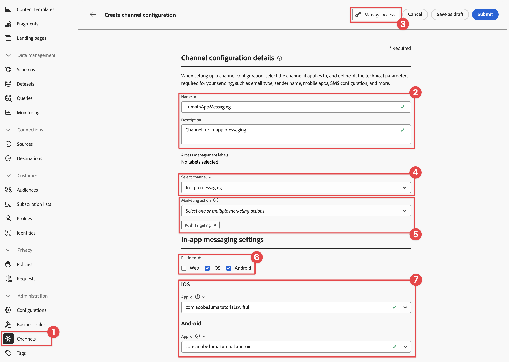
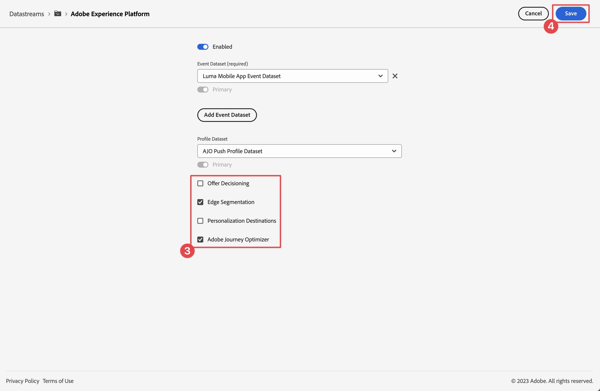
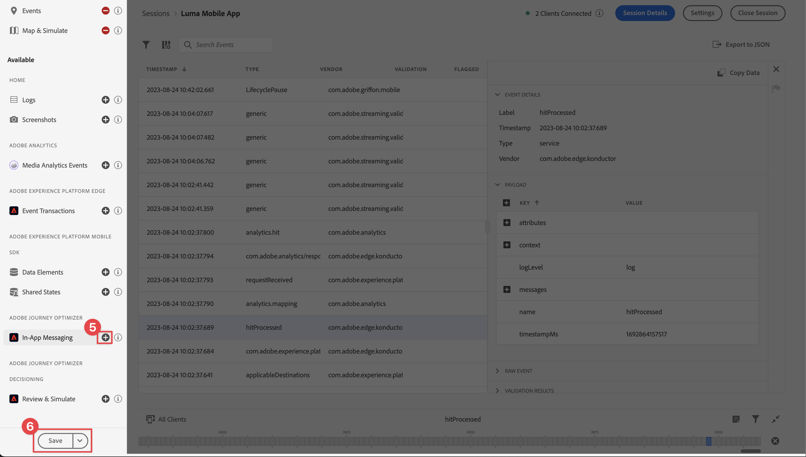
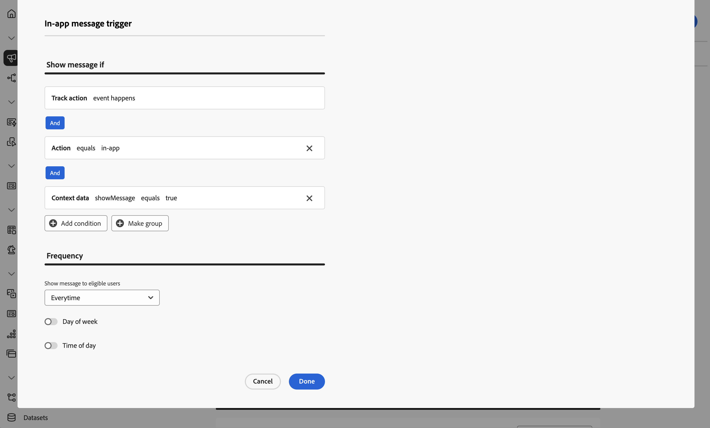
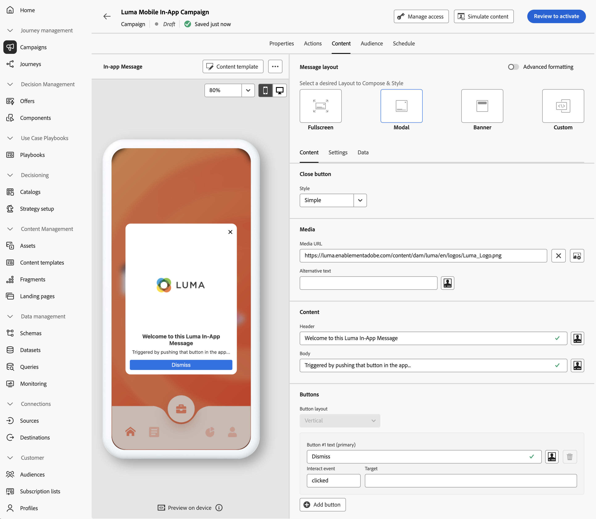
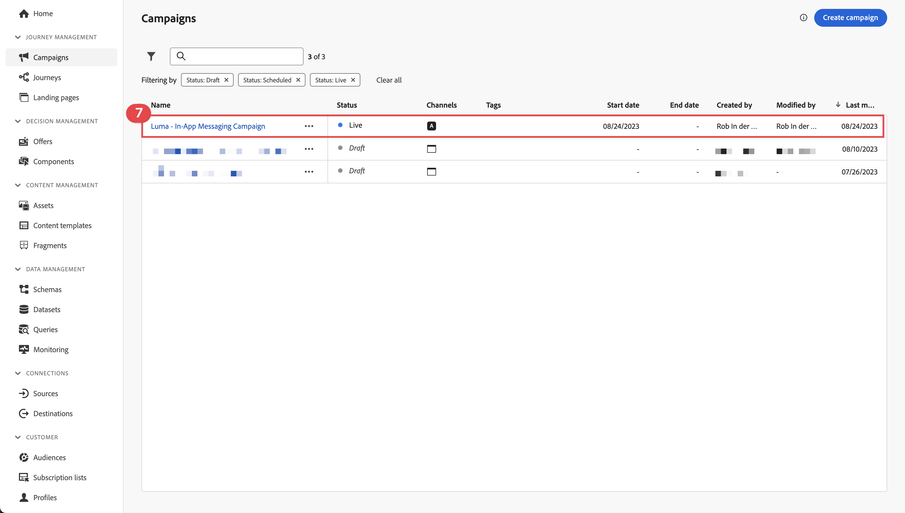
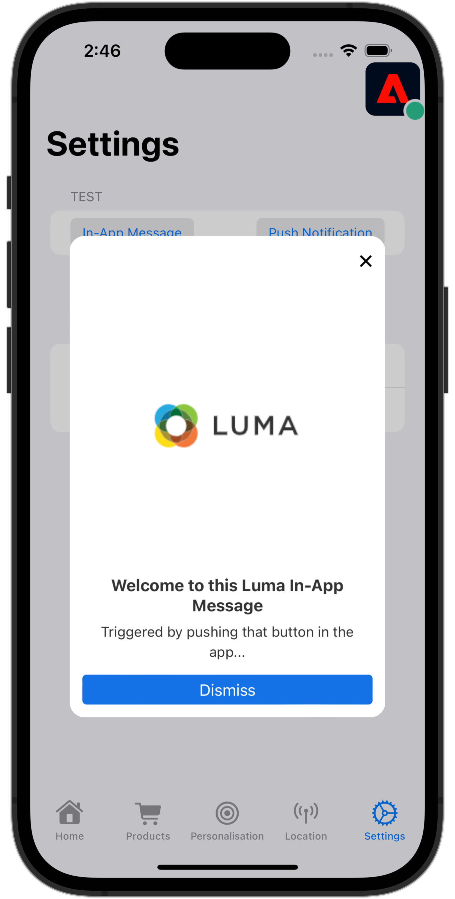

# Create and send in-app messages

Learn how to create in-app messages for mobile apps with Experience Platform Mobile SDK and Journey Optimizer.

Journey Optimizer allows you to create campaigns to send in-app messages to targeted audiences. Campaigns in Journey Optimizer are used to deliver one-time content to a specific audience using various channels. With campaigns, actions are performed simultaneously, either immediately, or based on a specified schedule. When using journeys (see the [Journey Optimizer push notifications](journey-optimizer-push.md) lesson), actions are executed in sequence. 


Before you send in-app messages with Journey Optimizer, you must ensure that the proper configurations and integrations are in place. To understand the in-app messaging data flow in Journey Optimizer, refer to [the documentation](https://experienceleague.adobe.com/docs/journey-optimizer/using/in-app/inapp-configuration.html?lang=en).

>[!NOTE]
>
>This lesson is optional and only applies to Journey Optimizer users looking to send in-app messages. 


## Prerequisites

* Successfully built and run app with SDKs installed and configured.
* Set up the app for Adobe Experience Platform.
* Access to Journey Optimizer and [sufficient permissions for push notifications](https://experienceleague.adobe.com/docs/journey-optimizer/using/push/push-config/push-configuration.html). Also you need sufficient permission to the following Journey Optimizer features.
  * Manage campaigns.
* Physical iOS device or simulator for testing.


## Learning objectives

In this lesson, you will

* Create a channel configuration in Journey Optimizer.
* Install & configure the Journey Optimizer tag extension.
* Update your app to register the Journey Optimizer tag extension.
* Validate setup in Assurance.
* Define your own campaign and in-app message experience in Journey Optimizer.
* Send your own in-app message from within the app.

## Setup

>[!TIP]
>
>If you have setup your environment already as part of the [Journey Optimizer push messaging](journey-optimizer-push.md) lesson, you might already have performed some of the steps in this setup section.


### Create a channel configuration

To begin, you must create a channel configuration to be able to send in App messages notifications from Journey Optimizer.

1. In the Journey Optimizer interface open the **[!UICONTROL Channels]** > **[!UICONTROL General settings]** > **[!UICONTROL Channel configurations]** menu and then select **[!UICONTROL Create channel configuration]**.

1. Enter a name and a description (optional) for the configuration. For example `LumaInAppMessaging` and `Channel for in-app messaging`.

    >[!NOTE]
    >
    > Names must begin with a letter (A-Z). It can only contain alpha-numeric characters. You can also use underscore `_`, dot`.` and hyphen `-` characters.

1. To assign custom or core data usage labels to the configuration, you can select **[!UICONTROL Manage access]**. [Learn more about Object Level Access Control (OLAC)](https://experienceleague.adobe.com/en/docs/journey-optimizer/using/access-control/object-based-access).

1. Select the **In-app messaging** channel.

1. Select **[!UICONTROL Marketing action]**(s) to associate consent policies to the messages using this configuration. All consent policies associated with the marketing action are leveraged in order to respect the preferences of your customers. [Learn more about marketing actions](https://experienceleague.adobe.com/en/docs/journey-optimizer/using/privacy/consent/consent#surface-marketing-actions). For example: Push Targeting.

1. Select the Platform for which you want to define the settings. This allows you to specify the target app for each platform and ensures consistent content delivery across multiple platforms.

    >[!NOTE]
    >
    >For iOS and Android platforms, delivery is based solely on the app ID. If both apps share the same app ID, content will be delivered to both, regardless of the platform selected in the **[!UICONTROL Channel configuration]**.

1. Enter the App ids for the platform you want to support.

   

1. Select **[!UICONTROL Submit]** to save your changes.

### Update datastream configuration

To ensure data send from your mobile app to the Edge Network is forwarded to Journey Optimizer, update your Experience Edge configuration.


1. In the Data Collection UI, select **[!UICONTROL Datastreams]**, and select your datastream, for example **[!DNL Luma Mobile App]**.
1. Select  for **[!UICONTROL Experience Platform]** and select  **[!UICONTROL Edit]** from the context menu.
1. In the **[!UICONTROL Datastreams]** >  >  **[!UICONTROL Adobe Experience Platform]** screen, ensure **[!UICONTROL Adobe Journey Optimizer]** is selected. See [Adobe Experience Platform settings](https://experienceleague.adobe.com/docs/experience-platform/datastreams/configure.html?lang=en#aep) for more information.
1. To save your datastream configuration, select **[!UICONTROL Save]**.


   


### Install Journey Optimizer tags extension

For your app to work with Journey Optimizer, you must update your tag property.

1. Navigate to **[!UICONTROL Tags]** > **[!UICONTROL Extensions]** > **[!UICONTROL Catalog]**. 
1. Open your property, for example **[!DNL Luma Mobile App Tutorial]**.
1. Select **[!UICONTROL Catalog]**.
1. Search for the **[!UICONTROL Adobe Journey Optimizer]** extension.
1. Install the extension.

When *only* using in-app messages in your app, in **[!UICONTROL Install Extension]** or **[!UICONTROL Configure Extension]**, you do not need to configure anything. However, if you already have followed the [Push notifications](journey-optimizer-push.md) lesson in the tutorial, you will see that for the **[!UICONTROL Development]** environment, the **[!UICONTROL AJO Push Tracking Experience Event Dataset]** dataset is selected from the **[!UICONTROL Event Dataset]** list.


### Implement Journey Optimizer in the app

As discussed in previous lessons, installing a mobile tag extension only provides the configuration. Next you must install and register the Messaging SDK. If these steps aren't clear, review the [Install SDKs](install-sdks.md) section.

>[!NOTE]
>
>If you completed the [Install SDKs](install-sdks.md) section, then the SDK is already installed and you can skip this step.
>

>[!BEGINTABS]

>[!TAB iOS]

1. In Xcode, ensure that [AEP Messaging](https://github.com/adobe/aepsdk-messaging-ios) is added to the list of packages in Package Dependencies. See [Swift Package Manager](install-sdks.md#swift-package-manager).
1. Navigate to **[!DNL Luma]** > **[!DNL Luma]** > **[!UICONTROL AppDelegate]** in the Xcode Project navigator.
1. Ensure `AEPMessaging` is part of your list of imports.

    `import AEPMessaging`

1. Ensure `Messaging.self` is part of the array of extensions that you are registering.

    ```swift
    let extensions = [
        AEPIdentity.Identity.self,
        Lifecycle.self,
        Signal.self,
        Edge.self,
        AEPEdgeIdentity.Identity.self,
        Consent.self,
        UserProfile.self,
        Places.self,
        Messaging.self,
        Optimize.self,
        Assurance.self
    ]
    ```

>[!TAB Android]


1. In Xcode, ensure that [AEP Messaging](https://github.com/adobe/aepsdk-messaging-ios) is added to the list of packages in Package Dependencies. See [Swift Package Manager](install-sdks.md#swift-package-manager).
1. Navigate to **[!DNL app]** > **[!DNL kotlin+java]** > **[!UICONTROL com.adobe.luma.tutorial.android]** > **[!UICONTROL LumaApplication]** in the Android Studio project navigator.
1. Ensure `com.adobe.marketing.mobile.Messaging` is part of your list of imports.

    `import import com.adobe.marketing.mobile.Messaging`

1. Ensure `Messaging.self` is part of the array of extensions that you are registering.

    ```kotlin
    val extensions = listOf(
        Identity.EXTENSION,
        Lifecycle.EXTENSION,
        Signal.EXTENSION,
        Edge.EXTENSION,
        Consent.EXTENSION,
        UserProfile.EXTENSION,
        Places.EXTENSION,
        Messaging.EXTENSION,
        Optimize.EXTENSION,
        Assurance.EXTENSION
    )
    ```

>[!ENDTABS]

## Validate setup with Assurance

1. Review the [setup instructions](assurance.md#connecting-to-a-session) section to connect your simulator or device to Assurance.
1. In the Assurance UI, select **[!UICONTROL Configure]**.
    
1. Select the  button next to **[!UICONTROL In-App Messaging]**.
1. Select **[!UICONTROL Save]**.
    
1. Select **[!UICONTROL In-App Messaging]** from the left navigation.
1. Select the **[!UICONTROL Validation]** tab. Confirm that you aren't getting any errors.
   
   


## Create your own in-app message

To create your own in-app message, you must define a campaign in Journey Optimizer that triggers an in-app message based on events that occur. These events can be:

* data sent to Adobe Experience Platform,
* core tracking events, like action, or state or collection of PII data, through the Mobile Core generic APIs,
* application lifecycle events, such as launch, install, upgrade, close, or crash,
* geolocation events, like entering or exiting a point of interest.

In this tutorial, you are going to use the Mobile Core generic and extension-independent APIs (see [Mobile Core generic APIs](https://developer.adobe.com/client-sdks/documentation/mobile-core/#mobile-core-generic-apis)) to facilitate the event tracking of user screens, actions, and PII data. Events generated by these APIs are published to the SDK event hub and are available for use by extensions. The SDK event hub provides the core data structure tied to all Mobile Platform SDK extensions, maintaining a list of registered extensions and internal modules, a list of registered event listeners, and a shared state database.

The SDK event hub publishes and receives event data from registered extensions to simplify integrations with Adobe and third-party solutions. For instance, when the Optimize extension is installed, all requests and interactions with the Journey Optimizer - Decision Management offer engine are handled by the event hub. 

1. In the Journey Optimizer UI, select **[!UICONTROL Campaigns]** from the left rail.
1. Select **[!UICONTROL Create Campaign]**.
1. In the **[!UICONTROL Create your campaign]** dialog, select  **[!UICONTROL Scheduled - Marketing]** and select **[!UICONTROL Confirm]**.
1. In the **[!UICONTROL Campaign - *YYYY-MM-DD HH:MM:SS UTC+XX:XX*]** screen:

   1. In the **[!UICONTROL Properties]** tab:

      1. Enter a name for the campaign For example, `Luma Mobile In-App Campaign`.
      1. Optionally, add a description.


   1. Select the **[!UICONTROL Action]** tab.

      1. Underneath **[!UICONTROL Show message if]**, select  **[!UICONTROL Add action]**. From the drop-down menu select **[!UICONTROL In-app message]**.
      1. From the **[!UICONTROL In-app message configuration]** drop-down menu, select your configuration. For example **[!UICONTROL LumaInAppMessaging]**.
      1. Select  **[!UICONTROL Edit triggers]**.
      1. In the **[!UICONTROL In-app message trigger]** dialog:
         
         1. Select **[!UICONTROL Application launch]** and select **[!UICONTROL Track action]** from the dropdown menu.
         1. Select  **[!UICONTROL Add condition]**.
         1. Select **[!UICONTROL Action]** and **[!UICONTROL equals]** from the drop-down menus.
         1. Enter `in-app`.
         1. Select  **[!UICONTROL Add condition]**.
         1. Select **[!UICONTROL Context data]** from the drop-down menu, and enter `showMessage`.
         1. Select **[!UICONTROL equals]** from the drop-down menu, and enter `true`.
            
            
         1. Select **[!UICONTROL Done]**.

   1. Back in the main campaign definition screen, select the **[!UICONTROL Content]** tab.

      1. Enable **[!UICONTROL Advanced formatting]**.
      1. Select **[!UICONTROL Modal]** as the **[!UICONTROL Messaging layout]**. In the **[!UICONTROL Switch layout]** dialog, select **[!UICONTROL Change layout]**.
      1. In the **[!UICONTROL Content]** tab.
         1. Enter `https://luma.enablementadobe.com/content/dam/luma/en/logos/Luma_Logo.png` for the **[!UICONTROL Media URL]**.
         1. Enter a **[!UICONTROL Header]**, for example `Welcome to this Luma In-App Message` and enter a **[!UICONTROL Body]**, for example `Triggered by pushing that button in the app...`.

         

      1. Select **[!UICONTROL Settings]** tab.
         1. Select **[!UICONTROL Customize size]** in **[!UICONTROL Message]**.
         1. Disable **[!UICONTROL Fit to content]**.
         1. Set **[!UICONTROL Height]** to **[!UICONTROL 75%]**.

         

1. Select **[!UICONTROL Review to activate]**. To optionally edit any of the configurations for **[!UICONTROL Content]**, **[!UICONTROL Properties]**, **[!UICONTROL Actions]**, or more,  select .
1. In the **[!UICONTROL Review to activate (*campaign name*)]** screen, select **[!UICONTROL Activate]**.
1. After a while, you see your **_campaign name_** with status **[!UICONTROL Live]** in the **[!UICONTROL Campaigns]** list.
   


## Trigger the in-app message

You have all the ingredients in place to send an in-app message. What remains is how to trigger this in-app message in your app.

>[!BEGINTABS]

>[!TAB iOS]

1. Go to **[!DNL Luma]** > **[!DNL Luma]** > **[!DNL Utils]** > **[!UICONTROL MobileSDK]** in the Xcode Project navigator. Find the `func sendTrackAction(action: String, data: [String: Any]?)` function, and add the following code, which calls the [`MobileCore.track`](https://developer.adobe.com/client-sdks/documentation/mobile-core/api-reference/#trackaction) function, based on the parameters `action` and `data`.

    
    ```swift
    // Send trackAction event
    MobileCore.track(action: action, data: data)
    ```  

1. Go to **[!DNL Luma]** > **[!DNL Luma]** > **[!DNL Views]** > **[!DNL General]** > **[!UICONTROL ConfigView]** in the Xcode Project Navigator. Find the code for the In-App Message button and add the following code:

    ```swift
    // Setting parameters and calling function to send in-app message
    Task {
        MobileSDK.shared.sendTrackAction(action: "in-app", data: ["showMessage": "true"])
    }
    ```

>[!TAB Android]

1. Go to **[!DNL app]** > **[!DNL kotlin+java]** > **[!DNL com.adobe.luma.tutorial.android]** > **[!DNL models]** > **[!UICONTROL MobileSDK]** in the Android Studio navigator. Find the `fun sendTrackAction(action: String, data: Map<String, String>?)` function, and add the following code, which calls the [`MobileCore.track`](https://developer.adobe.com/client-sdks/documentation/mobile-core/api-reference/#trackaction) function, based on the parameters `action` and `data`.

    
    ```kotlin
    // Send trackAction event
    MobileCore.track(action, data)
    ```  

1. Go to **[!DNL app]** > **[!DNL kotlin+java]** > **[!DNL com.adobe.luma.tutorial.androi]** > **[!DNL views]** > **[!UICONTROL ConfigView.kt]** in the Android Studio navigator. Find the code for the `onInAppMessageClick` handler button and add the following code:

    ```kotlin
    // Setting parameters and calling function to send in-app message
    MobileSDK.shared.sendTrackAction(
        "in-app",
        mapOf("showMessage" to "true")
    )
    ```

>[!ENDTABS]

## Validate using your app

You can validate the in-app messages from within the app itself.

>[!BEGINTABS]

>[!TAB iOS]

1. Rebuild and run the app in the simulator or on a physical device from Xcode, using .

1. Go to the **[!UICONTROL Settings]** tab.

1. Tap **[!UICONTROL In-App Message]**. You see the in-app message appear in your app.

   


>[!TAB Android]

1. Rebuild and run the app in the simulator or on a physical device from Android Studio, using .

1. Go to the **[!UICONTROL Settings]** tab.

1. Tap **[!UICONTROL In-App Message]**. You see the in-app message appear in your app.

   


>[!ENDTABS]


## Validate implementation in Assurance

You can validate your in-app messages in the Assurance UI.
 
1. Review the [setup instructions](assurance.md#connecting-to-a-session) section to connect your simulator or device to Assurance.
1. Select **[!UICONTROL In-App Messaging]**.
1. Select **[!UICONTROL Event List]**.
1. Select a **[!UICONTROL Display message]** entry.
1. Inspect the raw event, especially the `html`, which contains the complete layout and content of the in-app message.
    
   

## Next steps

You should now have all the tools to start adding in-app messages, where relevant and applicable. For example, promoting products based on specific interactions you are tracking in your app.

>[!SUCCESS]
>
>You have enabled the app for in-app messaging and added an in-app messaging campaign using Journey Optimizer and the Journey Optimizer extension for the Experience Platform Mobile SDK.
>
>Thank you for investing your time in learning about Adobe Experience Platform Mobile SDK. If you have questions, want to share general feedback, or have suggestions on future content, share them on this [Experience League Community discussion post](https://experienceleaguecommunities.adobe.com/t5/adobe-experience-platform-data/tutorial-discussion-implement-adobe-experience-cloud-in-mobile/td-p/443796).

Next: **[Create and display offers](journey-optimizer-offers.md)**
