# Create and send push notifications

Learn how to create push notifications for mobile apps with Experience Platform Mobile SDK and Journey Optimizer.

Journey Optimizer allows you to create journeys and send messages to targeted audiences. Before you send push notifications with Journey Optimizer, you must ensure that the proper configurations and integrations are in place. To understand the Push Notifications data flow in  Journey Optimizer, refer to the [documentation](https://experienceleague.adobe.com/en/docs/journey-optimizer/using/channels/push/push-config/push-gs).

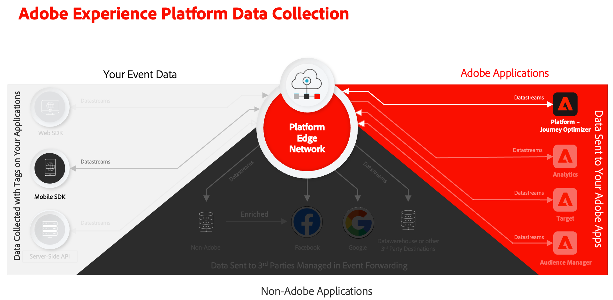{zoomable="yes"}

>[!NOTE]
>
>This lesson is optional and only applies to Journey Optimizer users looking to send push notifications. 


## Prerequisites

* Successfully built and run the app with SDKs installed and configured.
* Set up the app for Adobe Experience Platform.
* Access to Journey Optimizer and [sufficient permissions](https://experienceleague.adobe.com/en/docs/journey-optimizer/using/channels/push/push-config/push-configuration). Also you need sufficient permission to the following Journey Optimizer features.
  * Create a push credential. 
  * Create a push channel configuration. 
  * Create a journey.
  * Create a message.
  * Create message presets.
* For iOS, a **paid Apple developer account** with sufficient access to create certificates, identifiers, and keys.
* For Android, a Google developer account with sufficient access to create certificates and keys.
* Physical iOS or Android device or simulator for testing.

## Learning objectives

In this lesson, you will

* Register App ID with the Apple Push Notification service (APNs).
* Create a channel configuration in Journey Optimizer.
* Update your schema to include push messaging fields.
* Install and configure the Journey Optimizer tag extension.
* Update your app to register the Journey Optimizer tag extension.
* Validate setup in Assurance.
* Send a test message from Assurance
* Define your own push notification event, journey, and experience in Journey Optimizer.
* Send your own push notification from within the app.


## Setup

>[!TIP]
>
>If you have set up your environment already as part of the [Journey Optimizer in-app messaging](journey-optimizer-inapp.md) lesson, you might already have performed some of the steps in this setup section.

### Create push credentials

For push notifications, you first have to register your app for push notifications. 

>[!BEGINTABS]

>[!TAB iOS]

The following steps are not Adobe Experience Cloud-specific and are designed to guide you through APNs configuration.

1. In the Apple developer portal, navigate to **[!UICONTROL Keys]**.
1. To create a key, select **[!UICONTROL +]**.
   
   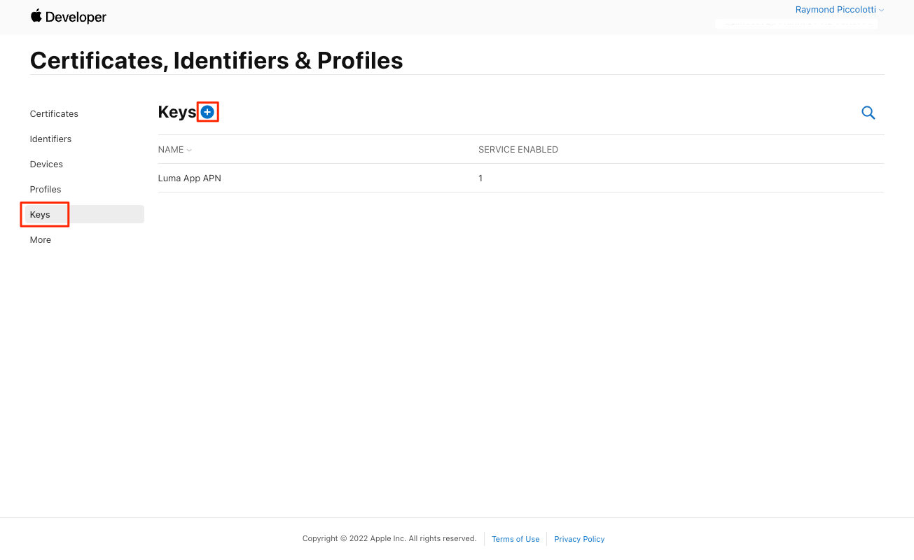{zoomable="yes"}

1. Provide a **[!UICONTROL Key Name]**.
1. Select **[!UICONTROL Apple Push Notification service] (APNs)**, and select **[!UICONTROL Configure]**. 
   1. In the **[!UICONTROL Configure Key]** screen, select **[!UICONTROL Sandbox & Production]** from the **[!UICONTROL Environment]** drop-down menu.
   1. Select **[!UICONTROL Save]**.
1. Select **[!UICONTROL Continue]**.
   
   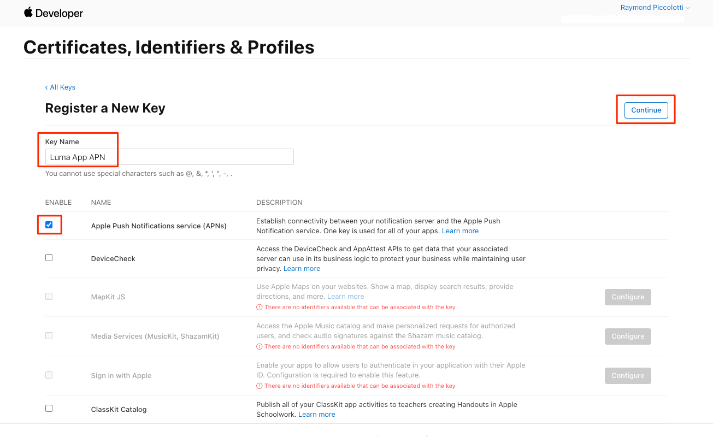{zoomable="yes"}

1. Review the configuration and select **[!UICONTROL Register]**.
1. Download the `.p8` private key. It is used in the next exercise when you configure your Journey Optimizer push credential.
1. Make note of the **[!UICONTROL Key ID]**. It is used in the next exercise when you configure your Journey Optimizer push credential. 
1. Make note of the **[!UICONTROL Team ID]**. It is used in the next exercise when you configure your Journey Optimizer push credential. The Team ID can be found at the upper right on the screen, next to your login name.
   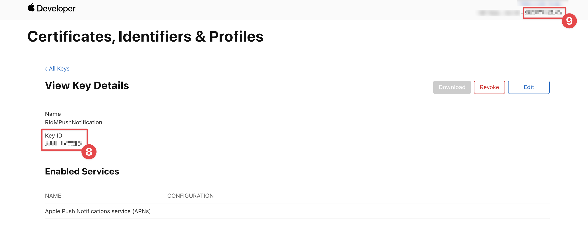{zoomable="yes"}

Additional documentation can be [found here](https://help.apple.com/developer-account/#/devcdfbb56a3).

>[!TAB Android]

The following steps are not Adobe Experience Cloud-specific and are designed to guide you through Firebase configuration.

1. Access the Firebase console.
1. Select **[!UICONTROL Create a Firebase project]**.
   1. Enter a **[!UICONTROL Project name]**.
   1. Select **[!UICONTROL Continue]** in **[!UICONTROL Create a project]** - **[!UICONTROL Let's start with a name for your project]**. For example, `Luma Android App.`
   1. Disable **[!UICONTROL Gemini in Firebase]** and select **[!UICONTROL Continue]** in **[!UICONTROL Create a project]** - **[!UICONTROL AI assistance for your Firebase project]**.
   1. Disable **[!UICONTROL Google Analytics for this project]** and select **[!UICONTROL Continue]** in **[!UICONTROL Create a project]** - **[!UICONTROL Google Analytics for your Firebase project]**.
   1. Select **[!UICONTROL Create Project]**. 
   1. After the project is ready, select **[!UICONTROL Continue]**.
   
1. Back in the Firebase console, ensure that your project is selected at the top. For example, **[!UICONTROL Luma Android App]**.
   
    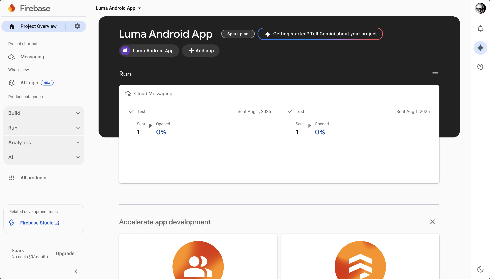{zoomable="yes"}

1. Select  > **[!UICONTROL Project Settings]**.
   
1. In **[!UICONTROL Project settings]**, select **[!UICONTROL Add app]**.
   1. In the **[!UICONTROL Add Firebase to your app]**, select **[!UICONTROL Android]** as the platform.
   1. In the **[!UICONTROL Add Firebase to your Android app:]**
      1. In step 1, **[!UICONTROL Register app]**: 
         1. Enter an Android package name, similar to your app identifier. For example, `com.adobe.luma.tutorial.android`.
         1. Enter an optional **[!UICONTROL App nickname]**.
         1. Select **[!UICONTROL Register app]**.
      1. In step 2, **[!UICONTROL Download and then add config file]**.
         1. Select  **[!UICONTROL Download google-services.json]**. When you build your own version of the Android app, you should replace the current `google-services.json` file in the sample Android Studio project, with the version of the file that is generated by this new app configuration.
    The other steps are taken care of already in the sample app.

    Your screen should look like below:

    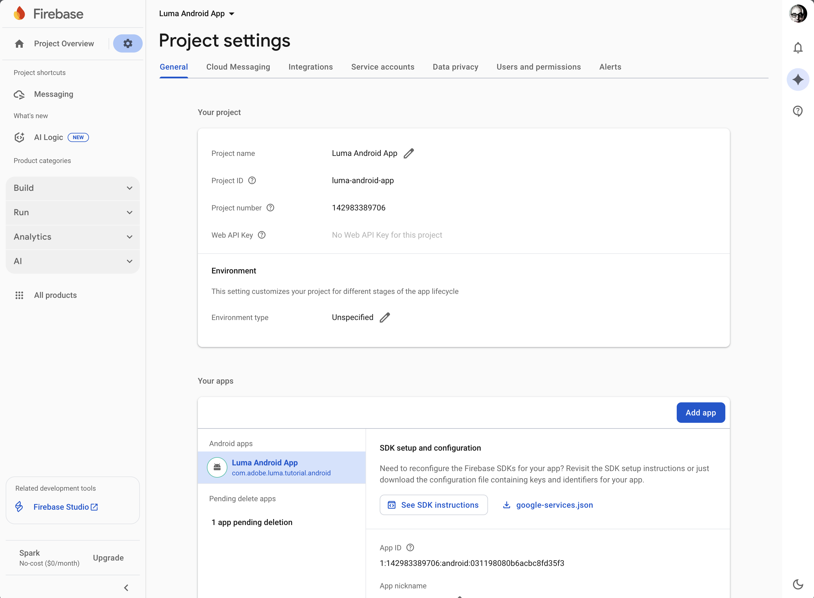{zoomable="yes"}

1. In **[!UICONTROL Project Settings]**, select **[!UICONTROL Service accounts]**.
1. Select **[!UICONTROL Generate new private key]**. A `luma-android-app-firebase-adminsdk-xxxx-xxxxxxxx.json` file is generated. Store this file at a safe place, as you need the file at a later stage.

For more information, see the [Firebase developer documentation](https://firebase.google.com/docs).

>[!ENDTABS]

### Add your app push credentials in Data Collection

Next you need to add your mobile application push credentials to authorize Adobe to send push notifications on your behalf. You can add push credentials either in Data Collection or in Journey Optimizer. In this tutorial, the Data Collection interface is used. The push credentials are then linked to a channel configuration in Journey Optimizer.

1. In Data Collection, select **[!UICONTROL App Surfaces]**.
1. Select **[!UICONTROL Create App Surface]**.
1. In the **[!UICONTROL Create App Surface]** interface:
   1. Enter a **[!UICONTROL Name]**.
   1. Select **[!UICONTROL Apple iOS]** if you want to send push notifications for iOS.
      1. Enter your **[!UICONTROL App ID]**, for example `com.adobe.luma.tutorial.swiftui`.
      1. Select the sandbox (optional).
      1. Enable **[!UICONTROL Push Credentials]**.
      1. Drop the saved `.p8` private key file onto **[!UICONTROL Drag and Drop Your File]**.
      1. Enter the **[!UICONTROL Key ID]**.
      1. Enter the **[!UICONTROL Team ID]**.
   1. Select **[!UICONTROL Android]** if you want to send push notifications for Android.
      1. Enter your **[!UICONTROL App ID]**, for example `com.adobe.luma.tutorial.android`.
      1. Select the sandbox (optional).
      1. Enable **[!UICONTROL Push Credentials]**.
      1. Drop the saved `luma-android-app-firebase-adminsdk-xxxx-xxxxxxxx.json` file onto **[!UICONTROL Drag and Drop Your File]**.

   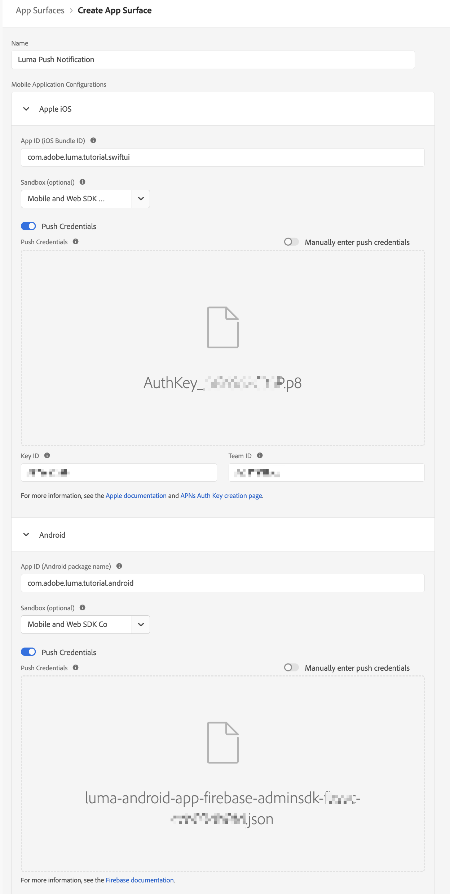{zoomable="yes"}

1. Select **[!UICONTROL Save]**. If all the information is correct, you have created push credentials to associate with a channel configuration. 


### Create a channel configuration for push in Journey Optimizer

Once you have created a push credential configuration, you must create a configuration to be able to send push notifications from Journey Optimizer.

1. In the Journey Optimizer interface, open the **[!UICONTROL Channels]** > **[!UICONTROL General settings]** > **[!UICONTROL Channel configurations]** menu and then select **[!UICONTROL Create channel configuration]**.

    {zoomable="yes"}

1. Enter a name and a description (optional) for the configuration.

    >[!NOTE]
    >
    > Names must begin with a letter (A-Z). It can only contain alpha-numeric characters. You can also use underscore `_`, dot`.` and hyphen `-` characters.


1. To assign custom or core data usage labels to the configuration, you can select **[!UICONTROL Manage access]**. [Learn more about Object Level Access Control (OLAC)](https://experienceleague.adobe.com/en/docs/journey-optimizer/using/access-control/object-based-access).

1. Select the **Push** channel.


1. Select **[!UICONTROL Marketing action(s)]** to associate consent policies with the messages using this configuration. All consent policies associated with the marketing actions are leveraged to respect the preferences of your customers. [Learn more about marketing actions](https://experienceleague.adobe.com/en/docs/journey-optimizer/using/privacy/consent/consent#surface-marketing-actions).

1. Choose your **[!UICONTROL Platform]**. You can configure both **[!UICONTROL iOS]** and **[!UICONTROL Android]** for a channel configuration.

1. Select the appropriate **[!UICONTROL App id]** that you used earlier to define your push credentials. For example, **[!UICONTROL com.adobe.luma.tutorial.swiftui]** for iOS and **[!UICONTROL com.adobe.luma.tutorial.android]** for Android. The green  indicate that valid push credentials are associated with a channel configuration.

   
   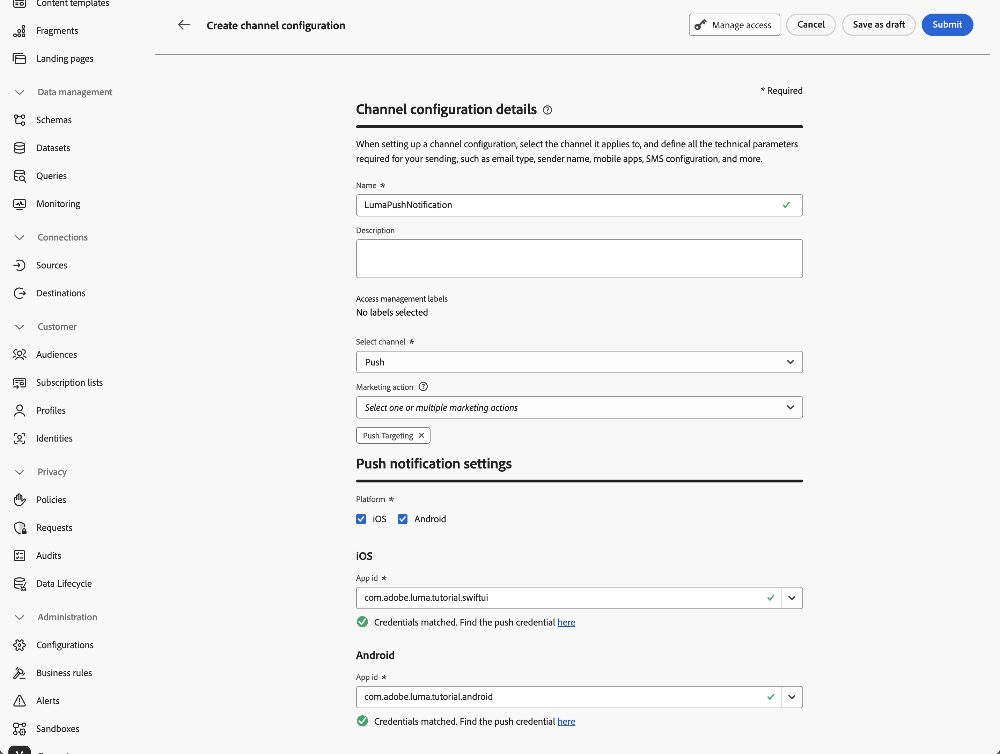{zoomable="yes"}

1. Select **[!UICONTROL Submit]** to save your changes.

    
    

### Update datastream configuration

To ensure data send from your mobile app to the Edge Network is forwarded to Journey Optimizer, update your Experience Edge configuration .

1. In the Data Collection UI, select **[!UICONTROL Datastreams]**, and select your datastream, for example **[!DNL Luma Mobile App]**.
1. Select  for **[!UICONTROL Experience Platform]** and select  **[!UICONTROL Edit]** from the context menu.
1. In the **[!UICONTROL Datastreams]** >  >  **[!UICONTROL Adobe Experience Platform]** screen:

   1. If not already selected, select **[!UICONTROL AJO Push Profile Dataset]** from **[!UICONTROL Profile Dataset]**. This profile dataset is required when using the `MobileCore.setPushIdentifier` API call (see [Register device token for push notifications](#register-device-token-for-push-notifications)). This selection also ensures that the unique identifier for push notifications (a.k.a. push identifier) is stored as part of the profile of the user.

   1. **[!UICONTROL Adobe Journey Optimizer]** is selected. See [Adobe Experience Platform settings](https://experienceleague.adobe.com/en/docs/experience-platform/datastreams/configure) for more information.
   
   1. To save your datastream configuration, select **[!UICONTROL Save]**.

   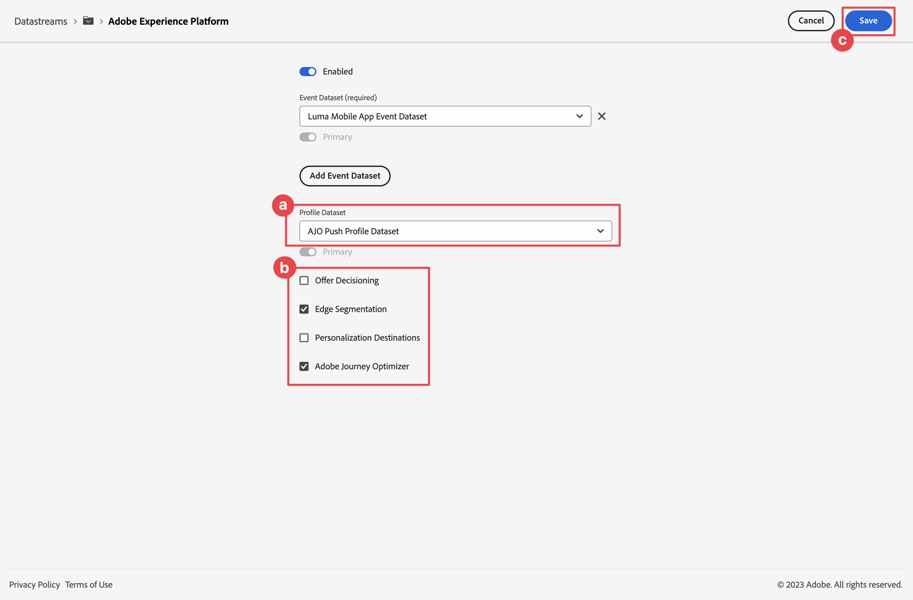{zoomable="yes"}


### Install Journey Optimizer tags extension

For your app to work with Journey Optimizer, you must update your tag property.

1. Navigate to **[!UICONTROL Tags]** > **[!UICONTROL Extensions]** > **[!UICONTROL Catalog]**, 
1. Open your property, for example **[!DNL Luma Mobile App Tutorial]**.
1. Select **[!UICONTROL Catalog]**.
1. Search for the **[!UICONTROL Adobe Journey Optimizer]** extension.
1. Install the extension.
1. In the **[!UICONTROL Install Extension]** dialog
   1. Select an environment, for example **[!UICONTROL Development]**.
   1. Select the **[!UICONTROL AJO Push Tracking Experience Event Dataset]** dataset from the **[!UICONTROL Event Dataset]** list.
   1. Select **[!UICONTROL Save to Library and Build]**.
       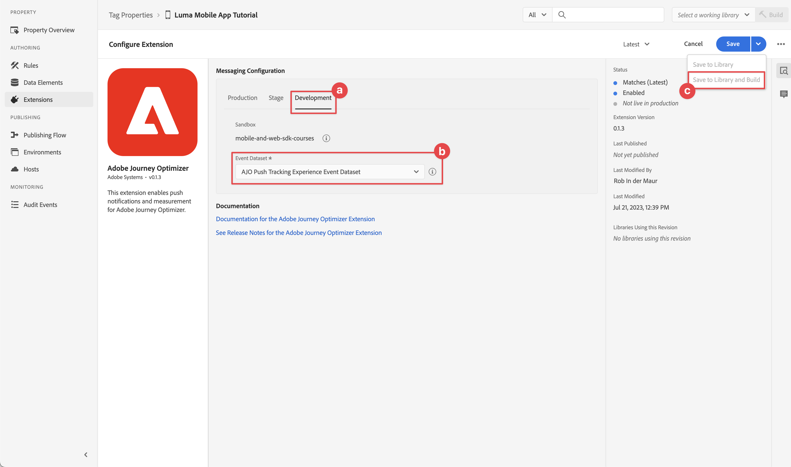{zoomable="yes"}

>[!NOTE]
>
>If you don't see **[!UICONTROL AJO Push Tracking Experience Event Dataset]** as an option, contact customer care.
>

## Validate setup with Assurance

1. Review the [setup instructions](assurance.md#connecting-to-a-session) section to connect your simulator or device to Assurance.
1. In the Assurance UI, select **[!UICONTROL Configure]**.
    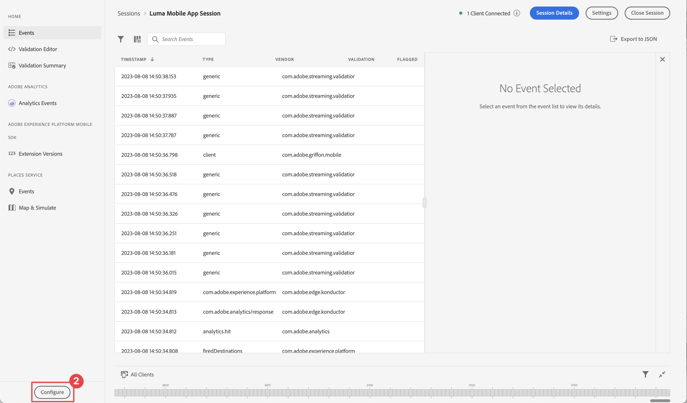{zoomable="yes"}
1. Select  next to **[!UICONTROL Push Debug]**.
1. Select **[!UICONTROL Save]**.
    {zoomable="yes"}
1. Select **[!UICONTROL Push Debug]** from the left navigation.
1. Select the **[!UICONTROL Validate Setup]** tab.
1. Select your device from the **[!UICONTROL Client]** list.
1. Confirm that you aren't getting any errors.
    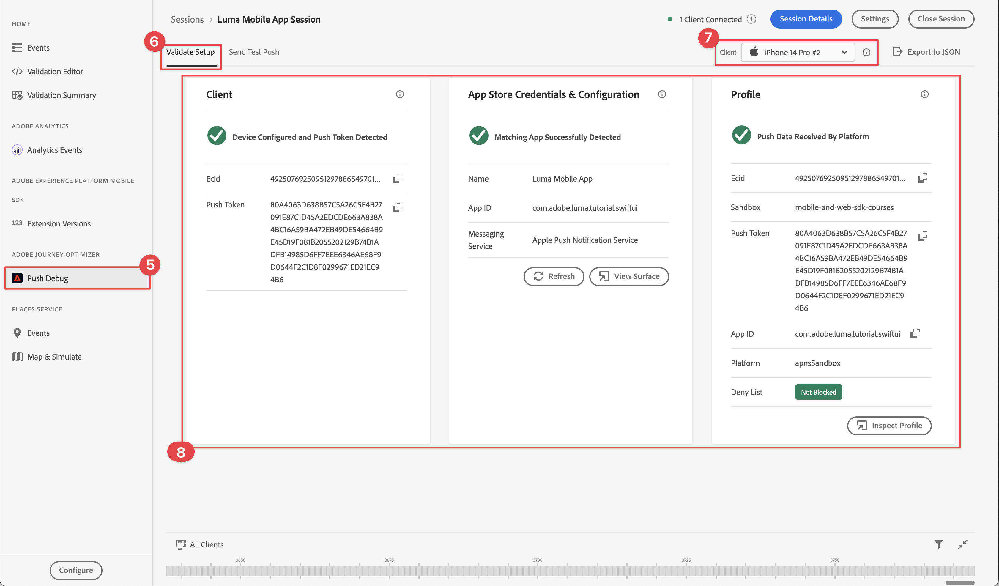{zoomable="yes"}
1. Select the **[!UICONTROL Send Test Push]** tab.
1. (optional) Change the default details for **[!UICONTROL Title]** and **[!UICONTROL Body]** and ensure you provide all parameters that your app expects, like **[!UICONTROL Advanced]** > **[!UICONTROL Notification Channel]** (required for Android, for example `LUMA_CHANNEL_ID`).
1. Select  **[!UICONTROL Send Test Push Notification]**.
1. Check the **[!UICONTROL Test Results]**.

   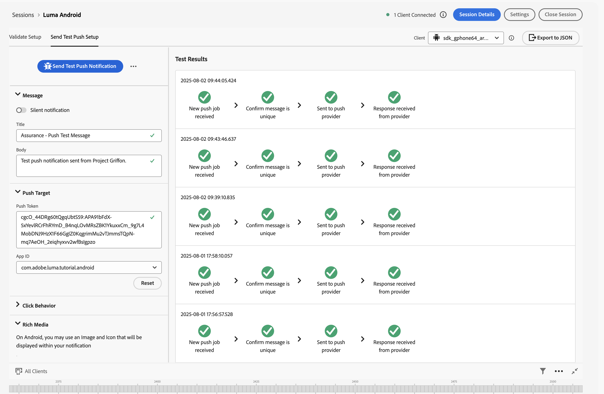{zoomable="yes"}
1. You should see the test push notification appear in your app.
   
>[!BEGINTABS]

>[!TAB iOS]


>[!TAB Android]

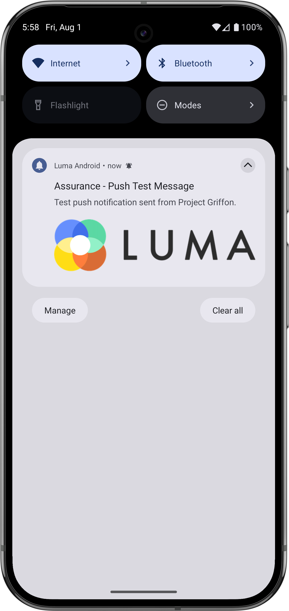

>[!ENDTABS]

## Signing

>[!IMPORTANT]
>
>Signing an iOS app is needed to send push notifications on iOS and **requires a paid Apple developer account**. You don't need to sign an Android app to send push notifications.


To update the signing for your app:

1. Go to your app in Xcode.
1. Select **[!DNL Luma]** in the Project navigator.
1. Select the **[!DNL Luma]** target.
1. Select the **Signing & Capabilities** tab.
1. Configure **[!UICONTROL Automatic manage signing]**, **[!UICONTROL Team]**, and **[!UICONTROL Bundle Identifier]**, or use your specific Apple development provisioning details. 
 
   >[!IMPORTANT]
   >
   >Ensure you use a _unique_ bundle identifier and replace the `com.adobe.luma.tutorial.swiftui` bundle identifier, as each bundle identifier must be unique. Typically, you use a reverse-DNS format for bundle ID strings, like `com.organization.brand.uniqueidentifier`. The Finished version of this tutorial, for example, uses `com.adobe.luma.tutorial.swiftui`.


    {zoomable="yes"}


## Add push notification capabilities to your app

>[!IMPORTANT]
>
>To implement and test push notification in an iOS app, you must have a **paid** Apple developer account.

>[!BEGINTABS]

>[!TAB iOS]

1. In Xcode, select **[!DNL Luma]** from the **[!UICONTROL TARGETS]** list, select the **[!UICONTROL Signing & Capabilities]** tab, select the **[!UICONTROL + Capability]** button, then select **[!UICONTROL Push Notifications]**. This selection enables your app to receive push notifications.

1. Next, you must add a Notification Extension to the app. Go back to the **[!DNL General]** tab and select the **[!UICONTROL +]** icon at the bottom of the **[!UICONTROL TARGETS]** section.

1. You are prompted to select the template for your new target. Select **[!UICONTROL Notification Service Extension]** then select **[!UICONTROL Next]**.

1. In the next window, use `NotificationExtension` as the name of the extension and click the **[!UICONTROL Finish]** button.

You should now have a push notification extension added to your app, similar to the screen below.

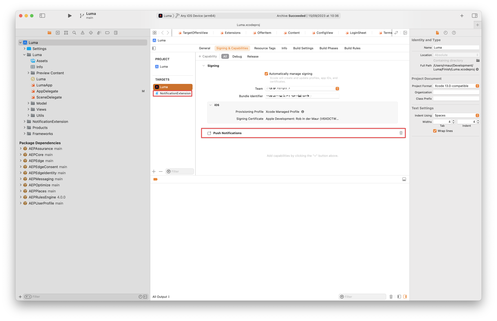{zoomable="yes"}

>[!TAB Android]

The Android Studio project is already set up for push notifications. You do not need to take additional steps to enable the Android version of the Luma app for push notifications. See [About notifications](https://developer.android.com/develop/ui/views/notifications) for more information.

Android push notifications require that you define a notification channel id, both in your app, and when sending a push notification. The channel notification id used in the Android Luma app is `LUMA_CHANNEL ID`.

>[!ENDTABS]


## Implement Journey Optimizer in the app

As discussed in previous lessons, installing a mobile tag extension only provides the configuration. Next you must install and register the Messaging SDK. If these steps aren't clear, review the [Install SDKs](install-sdks.md) section.

>[!NOTE]
>
>If you completed the [Install SDKs](install-sdks.md) section, then the SDK is already installed and you can skip this step.
>
 
>[!BEGINTABS]

>[!TAB iOS]

1. In Xcode, ensure that [AEP Messaging](https://github.com/adobe/aepsdk-messaging-ios) is added to the list of packages in Package Dependencies. See [Swift Package Manager](install-sdks.md#swift-package-manager).
1. Navigate to **[!DNL Luma]** > **[!DNL Luma]** > **[!UICONTROL AppDelegate]** in the Xcode Project navigator.
1. Ensure `AEPMessaging` is part of your list of imports.

    `import AEPMessaging`

1. Ensure `Messaging.self` is part of the array of extensions that you are registering.

    ```swift
    let extensions = [
        AEPIdentity.Identity.self,
        Lifecycle.self,
        Signal.self,
        Edge.self,
        AEPEdgeIdentity.Identity.self,
        Consent.self,
        UserProfile.self,
        Places.self,
        Messaging.self,
        Optimize.self,
        Assurance.self
    ]
    ```

>[!TAB Android]

1. In Android Studio, ensure that [aepsdk-messaing-android](https://github.com/adobe/aepsdk-messaging-android) is part of the dependencies in **[!UICONTROL build.gradle.kts (Module :app)]** in **[!UICONTROL Android]**  **[!UICONTROL Gradle Scripts]**. See [Gradle](install-sdks.md#gradle).
1. Navigate to **[!UICONTROL Android]**  > **[!DNL app]** > **[!DNL kotlin+java]** > **[!UICONTROL com.adobe.luma.tutorial.android]** > **[!UICONTROL LumaApplication]** in the Android Studio project navigator.
1. Ensure `com.adobe.marketing.mobile.Messaging` is part of your list of imports.

    `import import com.adobe.marketing.mobile.Messaging`

1. Ensure `Messaging.EXTENSION` is part of the array of extensions that you are registering.

    ```kotlin
    val extensions = listOf(
        Identity.EXTENSION,
        Lifecycle.EXTENSION,
        Signal.EXTENSION,
        Edge.EXTENSION,
        Consent.EXTENSION,
        UserProfile.EXTENSION,
        Places.EXTENSION,
        Messaging.EXTENSION,
        Optimize.EXTENSION,
        Assurance.EXTENSION
    )
    ```

>[!ENDTABS]


## Register a device token for push notifications

You need to register the device token for push notifications.

>[!BEGINTABS]

>[!TAB iOS]

1. Navigate to **[!DNL Luma]** > **[!DNL Luma]** > **[!UICONTROL AppDelegate]** in the Xcode Project navigator.
1. Add the [`MobileCore.setPushIdentifier`](https://developer.adobe.com/client-sdks/documentation/mobile-core/api-reference/#setpushidentifier) API to the `func application(_ application: UIApplication, didRegisterForRemoteNotificationsWithDeviceToken deviceToken: Data)` function.

    ```swift      
    // Send push token to Mobile SDK
    MobileCore.setPushIdentifier(deviceToken)
    ```

    This function retrieves the device token unique to the device that the app is installed on. Then sets the token for push notification delivery using the configuration that you have set up and which relies on Apple's Push Notification service (APNs).

>[!TAB Android]

1. Navigate to **[!UICONTROL Android]**  > **[!DNL app]** > **[!DNL kotlin+java]** > **[!UICONTROL com.adobe.luma.tutorial.android]** > **[!UICONTROL LumaApplication]** in the Android Studio project navigator.
1. Add the [`MobileCore.setPushIdentifier`](https://developer.adobe.com/client-sdks/documentation/mobile-core/api-reference/#setpushidentifier) API to the `override fun onCreate()` function in `class LumaAplication : Application`, in `FirebaseMessaging.getInstance().token.addOnCompleteListener`.

   ```kotlin      
   // Send push token to Mobile SDK
   MobileCore.setPushIdentifier(token)
   ```

    This function retrieves the device token unique to the device that the app is installed on. Then sets the token for push notification delivery using the configuration that you have set up and which relies on Firebase Cloud Messaging (FCM).

>[!ENDTABS]

>[!IMPORTANT]
>
>**For iOS only**: The `MobileCore.updateConfigurationWith(configDict: ["messaging.useSandbox": true])` determines whether push notifications are using an APNs sandbox or production server for sending push notifications. When testing your app in the simulator or on a device, ensure the `messaging.useSandbox` is set to `true` so you receive push notifications. When deploying your app for production ot test using Apple's Testflight, ensure you set `messaging.useSandbox` to `false` otherwise your production app is not able to receive push notifications.<br/><br/>
>Firebase Cloud Messaging (FCM) does **not** support the concept of sandboxes for push notifications.


## Create your own push notification

To create your own push notification, you must define an event in Journey Optimizer that triggers a journey that takes care of sending a push notification.

### Update your schema

You are going to define a new event type, not available yet as part of the list of events that are defined in your schema. You use this event type later when triggering push notifications.

1. In the Journey Optimizer UI, select **[!UICONTROL Schemas]** from the left rail.
1. Select **[!UICONTROL Browse]** in the tab bar.
1. Select your schema, for example **[!DNL Luma Mobile App Event Schema]** to open it.
1. In the Schema editor:
   1. Select the **[!UICONTROL eventType]** field.
   1. In the **[!UICONTROL Field properties]** pane, scroll down to see the list of possible values for event type. Select **[!UICONTROL Add row]**, and add `application.test` as the **[!UICONTROL VALUE]** and `[!UICONTROL Test event for push notification]` as the `DISPLAY NAME`.
   1. Select **[!UICONTROL Apply]**.
   1. Select **[!UICONTROL Save]**.
   
      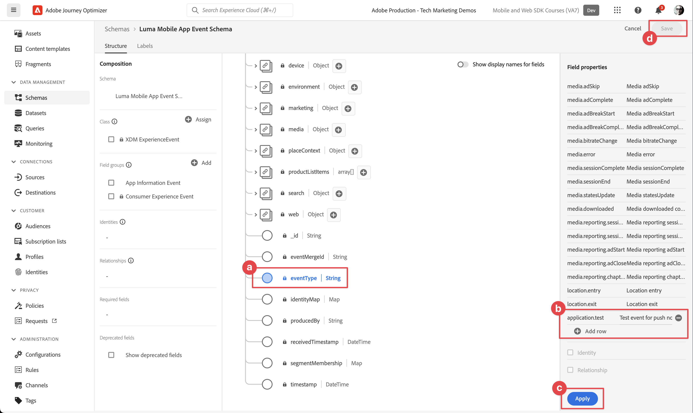{zoomable="yes"}

### Define an event

Events in Journey Optimizer allow you to trigger journeys to send messages, for example push notifications. See [About events](https://experienceleague.adobe.com/en/docs/journey-optimizer/using/configure-journeys/events-journeys/about-events) for more information.

1. In the Journey Optimizer UI, select **[!UICONTROL Configurations]** from the left rail.

1. In the **[!UICONTROL Dashboard]** screen, select the **[!UICONTROL Manage]** button in the **[!UICONTROL Events]** tile.

1. In the **[!UICONTROL Events]** screen, select **[!UICONTROL Create Event]**.

1. In the **[!UICONTROL Edit event event1]** pane:

   1. Enter `LumaTestEvent` as the **[!UICONTROL Name]** of the event.
   1. Provide a **[!UICONTROL Description]**, for example `Test event to trigger push notifications in Luma app`.

   1. Select the mobile app experience event schema that you created earlier in [Create an XDM schema](create-schema.md) from the **[!UICONTROL Schema]** list, for example **[!DNL Luma Mobile App Event Schema v.1]**.
   1. Select  next to the **[!UICONTROL Fields]** list.

      {zoomable="yes"}

      In the **[!UICONTROL Fields]** dialog, ensure that the following fields are selected (on top of the default fields that are always selected (**[!UICONTROL _id]**, **[!UICONTROL id]**, and **[!UICONTROL timestamp]**)). You can toggle, using the dropdown list, between **[!UICONTROL Selected]**, **[!UICONTROL All]** and **[!UICONTROL Primary]** or use the  field.

      * **[!UICONTROL Application Identified (id)]**, 
      * **[!UICONTROL Event Type (eventType)]**, 
      * **[!UICONTROL Primary (primary)]**. 

      {zoomable="yes"}
      
      Then select **[!UICONTROL Ok]**.
    
   1. Select  next to the **[!UICONTROL Event id condition]** field.

      1. In the **[!UICONTROL Add an event id condition]** dialog, drag and drop **[!UICONTROL Event Type (eventType)]** on to **[!UICONTROL Drag and drop an element here]**.
      1. In the popover, scroll to the bottom and select **[!UICONTROL application.test]** (which is the event type you added earlier to the list of event types as part of [Update your schema](#update-your-schema)). Then scroll up to the top and select **[!UICONTROL Ok]**.
      1. Select **[!UICONTROL Ok]** to save the condition.
         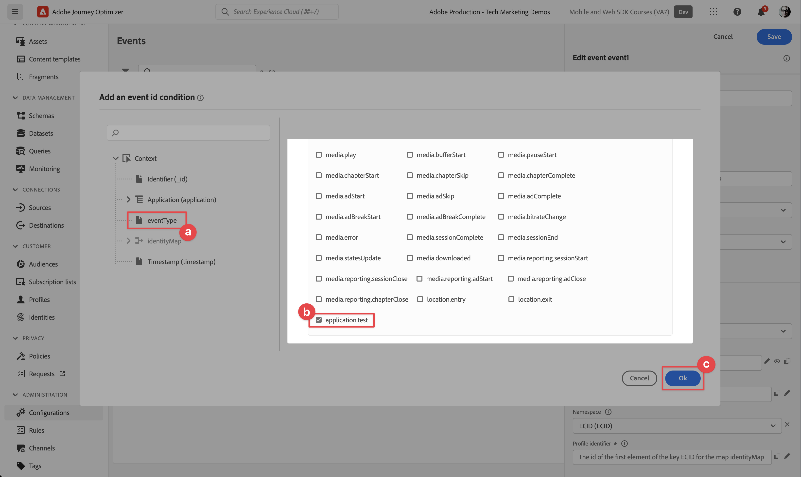{zoomable="yes"}

   1. Select **[!UICONTROL ECID (ECID)]** from the **[!UICONTROL Namespace]** list. Automatically the **[!UICONTROL Profile identifier]** field is populated with **[!UICONTROL The id of the first element of the key ECID for the map identityMap]**. 
   1. Select **[!UICONTROL Save]**.
      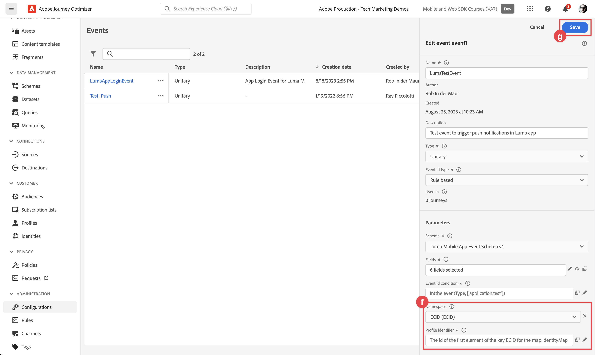{zoomable="yes"} 

You just created an event configuration that is based on the mobile app experience events schema you created earlier as part of this tutorial. This event configuration will filter incoming experience events using your specific event type (`application.test`), so only events with that specific type, initiated from your mobile app, will trigger the journey you build in the next step. In a real-world scenario, you might want to send push notifications from an external service. However, the same concepts apply: from the external application send an experience event into Experience Platform that has specific fields you can use to apply conditions on before these events trigger a journey.

### Create the journey

Your next step is to create the journey that triggers the sending of the push notification when receiving the appropriate event.

1. In the Journey Optimizer UI, select **[!UICONTROL Journeys]** from the left rail.
1. Select **[!UICONTROL Create Journey]**.
1. In the **[!UICONTROL Journey Properties]** panel:
   
   1. Enter a **[!UICONTROL Name]** for the journey, for example `Luma - Test Push Notification Journey`.
   1. Enter a **[!UICONTROL Description]** for the journey, for example `Journey for test push notifications in Luma mobile app`.
   1. Ensure **[!UICONTROL Allow re-entrance]** is selected and set **[!UICONTROL Re-entrance wait period]** to **[!UICONTROL 30]** **[!UICONTROL Seconds]**.
   1. Select **[!UICONTROL Ok]**.
      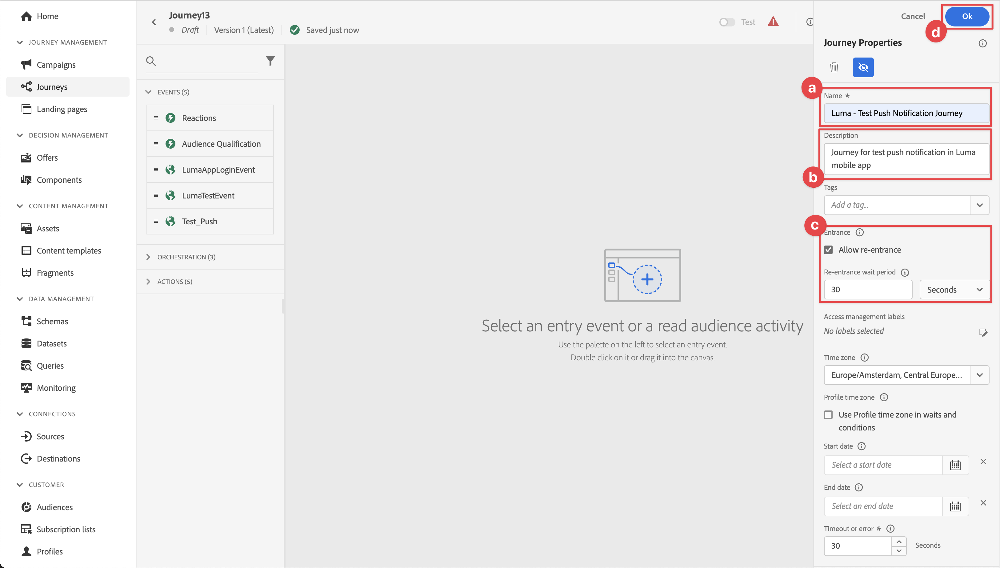{zoomable="yes"}

1. Back at the journey canvas, from the **[!UICONTROL EVENTS]**, drag and drop your  **[!DNL LumaTestEvent]** on the canvas where it shows **[!UICONTROL Select an entry event or a read audience activity]**.

    * In the **[!UICONTROL Events: LumaTestEvent]** panel, enter a **[!UICONTROL Label]**, for example `Luma Test Event`.

1. From the **[!UICONTROL ACTIONS]** dropdown, drag and drop  **[!UICONTROL Push]** on the  appearing to the right of your **[!DNL LumaTestEvent]** activity. In the **[!UICONTROL Actions: Push]** pane:
   
    1. Provide a **[!UICONTROL Label]**, for example `Luma Test Push Notification`, provide a **[!UICONTROL Description]**, for example `Test push notification for Luma mobile app`, select **[!UICONTROL Transactional]** from the **[!UICONTROL Category]** list and select **[!DNL Luma]** from the **[!UICONTROL Push surface]**.
    1. Select  **[!UICONTROL Edit content]** to start editing the actual push notification.
   
       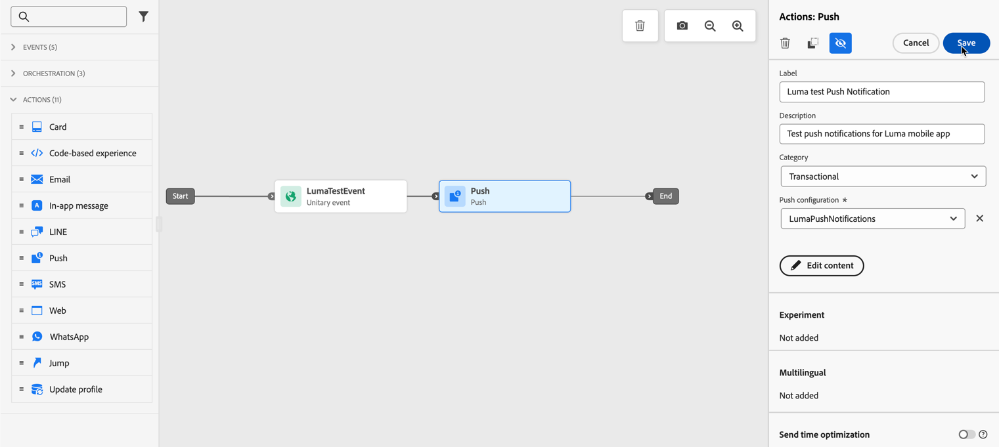{zoomable="yes"}

       In the **[!UICONTROL Push Notification]** editor:

       1. Enter a **[!UICONTROL Title]**, for example `Luma Test Push Notification` and enter a **[!UICONTROL Body]**, for example `Test push notification for Luma mobile app`.
       1. Optionally, you can enter a link to an image (.png or .jpg) in **[!UICONTROL Add media]**. If you do so, the image is part of the push notification. Note that if you do, you need to take care of properly handling the image in your mobile app.
       1. To save and leave the editor, select .
   
          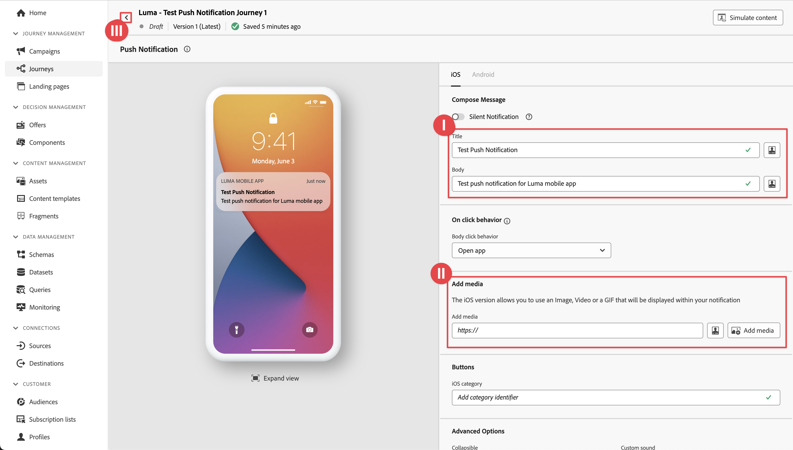{zoomable="yes"}

    1. To save and finish the push notification definition, select **[!UICONTROL Ok]**.

1. Your journey should look like below. Select **[!UICONTROL Publish]** to publish and activate your journey.
   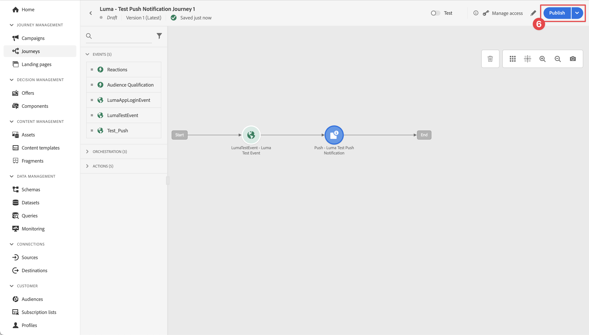{zoomable="yes"} 


## Trigger the push notification

You have all the ingredients in place to send a push notification. What remains is how to trigger this push notification. In essence, it is the same as you have seen before: simply send an experience event with the proper payload (as in [Events](events.md)).

This time the experience event you are about to send is not constructed building a simple XDM dictionary. You are going to use a `struct` representing a push notification payload. Defining a dedicated data type is an alternative way of how to implement constructing experience event payloads in your application.

Be aware that solely for illustration purposes you send a push notification from within the app. A more typical scenario is that you send the experience event (that triggers the push notification journey) from another application or service.

>[!BEGINTABS]

>[!TAB iOS]

1. Navigate to **[!DNL Luma]** > **[!DNL Luma]** > **[!UICONTROL Model]** > **[!UICONTROL XDM]** > **[!UICONTROL TestPushPayload]** in the Xcode Project navigator and inspect the code.

   ```swift
   import Foundation

   // MARK: - TestPush
   struct TestPushPayload: Codable {
      let application: Application
      let eventType: String
   }

   // MARK: - Application
   struct Application: Codable {
      let id: String
   }
   ```

   The code is a representation of the following simple payload that you are going to send to trigger your test push notification journey.

   ```json
   {
      "eventType": string,
      "application" : [
          "id": string
      ]
   }
   ```

1. Navigate to **[!DNL Luma]** > **[!DNL Luma]** > **[!DNL Utils]** > **[!UICONTROL MobileSDK]** in the Xcode Project navigator and add the following code to `func sendTestPushEvent(applicationId: String, eventType: String)`:

    ```swift
    // Create payload and send experience event
    Task {
        let testPushPayload = TestPushPayload(
            application: Application(
                id: applicationId
            ),
            eventType: eventType
        )
        // send the final experience event
        await sendExperienceEvent(
            xdm: testPushPayload.asDictionary() ?? [:]
        )
    }
    ```

    This code creates a `testPushPayload` instance using the parameters provided to the function (`applicationId` and `eventType`) and then calls `sendExperienceEvent` while converting the payload to a dictionary. This code also takes the asynchronous aspects of calling the Adobe Experience Platform SDK into account through the use of Swift's concurrency model, based on `await` and `async`.

1. Navigate to **[!DNL Luma]** > **[!DNL Luma]** > **[!DNL Views]** > **[!DNL General]** > **[!UICONTROL ConfigView]** in the Xcode Project navigator. In the Push Notification Button definition, add the following code to send the test push notification experience event payload to trigger your journey whenever that button is tapped.

    ```swift
    // Setting parameters and calling function to send push notification
    Task {
        let eventType = testPushEventType
        let applicationId = Bundle.main.bundleIdentifier ?? "No bundle id found"
        await MobileSDK.shared.sendTestPushEvent(applicationId: applicationId, eventType: eventType)
    }
    ```

>[!TAB Android]

1. Navigate to **[!UICONTROL Android]**  > **[!DNL app]** > **[!DNL kotlin+java]** > **[!UICONTROL com.adobe.luma.tutorial.android]** > **[!UICONTROL xdm]** > **[!UICONTROL TestPushPayload.kt]** in the Android Studio navigator and inspect the code.

   ```kotlin
   import com.google.gson.annotations.SerializedName

   data class TestPushPayload(
      @SerializedName("application") val application: Application,
      @SerializedName("eventType") val eventType: String
   ) {
      fun asMap(): Map<String, Any> {
         return mapOf(
               "application" to application.asMap(),
               "eventType" to eventType
         )
      }
   }

   data class Application(
      @SerializedName("id") val id: String
   ) {
      fun asMap(): Map<String, Any> {
         return mapOf(
               "id" to id
         )
      }
   }
   ```

   The code is a representation of the following simple payload that you are going to send to trigger your test push notification journey.

   ```json
   {
      "eventType": string,
      "application" : [
          "id": string
      ]
   }
   ```

1. Navigate to **[!UICONTROL Android]**  > **[!DNL app]** > **[!DNL kotlin+java]** > **[!DNL com.adobe.luma.tutorial.android]** > **[!UICONTROL models]** > **[!UICONTROL MobileSDK]** in the Android Studio navigator and add the following code to `func sendTestPushEvent(applicationId: String, eventType: String)`:

   ```kotlin
   // Create payload and send experience event
   val testPushPayload = TestPushPayload(
      Application(applicationId),
      eventType
   )
   sendExperienceEvent(testPushPayload.asMap())
   ```

   This code creates a `testPushPayload` instance using the parameters provided to the function (`applicationId` and `eventType`) and then calls `sendExperienceEvent` while converting the payload to a map.

1. Navigate to **[!UICONTROL Android]**  > **[!DNL app]** > **[!DNL kotlin+java]** > **[!DNL com.adobe.luma.android.tutorial]** > **[!DNL views]** > **[!UICONTROL ConfigView.kt]** in the Android Studio navigator. In the Push Notification Button definition, add the following code to send the test push notification experience event payload to trigger your journey whenever that button is tapped.

   ```kotlin
   // Setting parameters and calling function to send push notification
   val eventType = testPushEventType
   val applicationId = context.packageName
   scope.launch {
         MobileSDK.shared.sendTestPushEvent(
            applicationId,
            eventType
         )
   }
   ```


>[!ENDTABS]

## Validate using your app

To validate the push notification event and journey:

>[!BEGINTABS]

>[!TAB iOS]

1. Rebuild and run the app in the simulator or on a physical device from Xcode, using .

1. Go to the **[!UICONTROL Settings]** tab.

1. Tap **[!UICONTROL Push Notification]**. 
   

   You see the push notification appear on top of the app.
   
   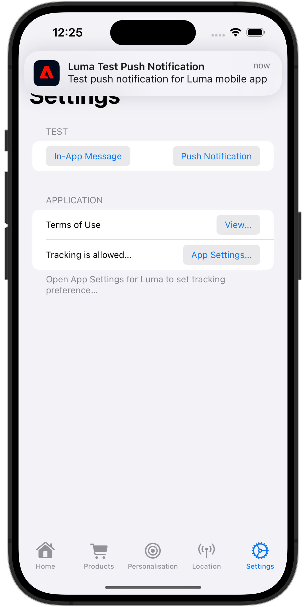

>[!TAB Android]

1. Rebuild and run the app in the simulator or on a physical device from Android Studio, using .

1. Go to the **[!UICONTROL Settings]** tab.

1. Tap **[!UICONTROL Push Notification]**. 

   You see the push notification appear on top of the app.

   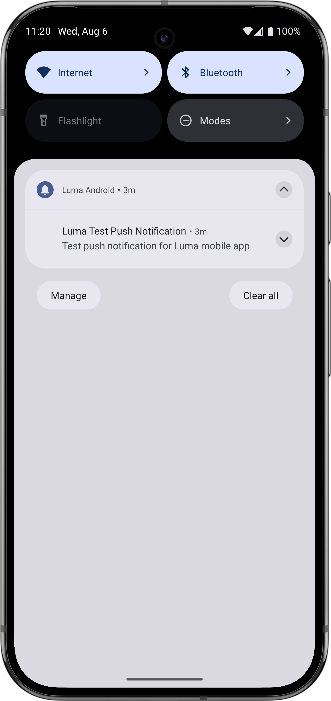

>[!ENDTABS]

How to handle and display the push notification in the app itself is beyond the topic of this section. Each platform implements handling and displays notification in a specific way. See for more information:

* For iOS: [User Notifications](https://developer.apple.com/documentation/usernotifications)
* For Android: [Cloud Messaging](https://firebase.google.com/docs/cloud-messaging)

## Next steps

You should now have all the tools to handle push notifications in your app. For example, you could build a journey in Journey Optimizer that sends a welcome push notification when a user of the app logs in. Or a confirmation push notification when a user purchases a product in the app. Or enters the geofence of a location (as you see in the [Places](places.md) lesson).

>[!SUCCESS]
>
>You have now enabled the app for push notification using Journey Optimizer and the Journey Optimizer extension for the Experience Platform Mobile SDK.
>
>Thank you for investing your time in learning about Adobe Experience Platform Mobile SDK. If you have questions, want to share general feedback, or have suggestions on future content, share them on this [Experience League Community discussion post](https://experienceleaguecommunities.adobe.com/t5/adobe-experience-platform-data/tutorial-discussion-implement-adobe-experience-cloud-in-mobile/td-p/443796).

Next: **[Create and send in-app messages](journey-optimizer-inapp.md)**
