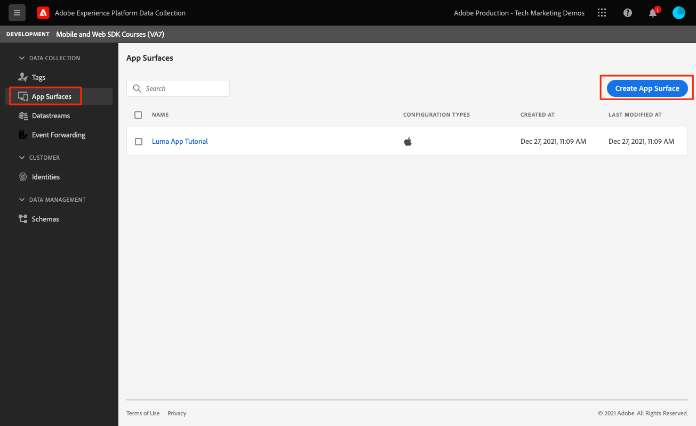
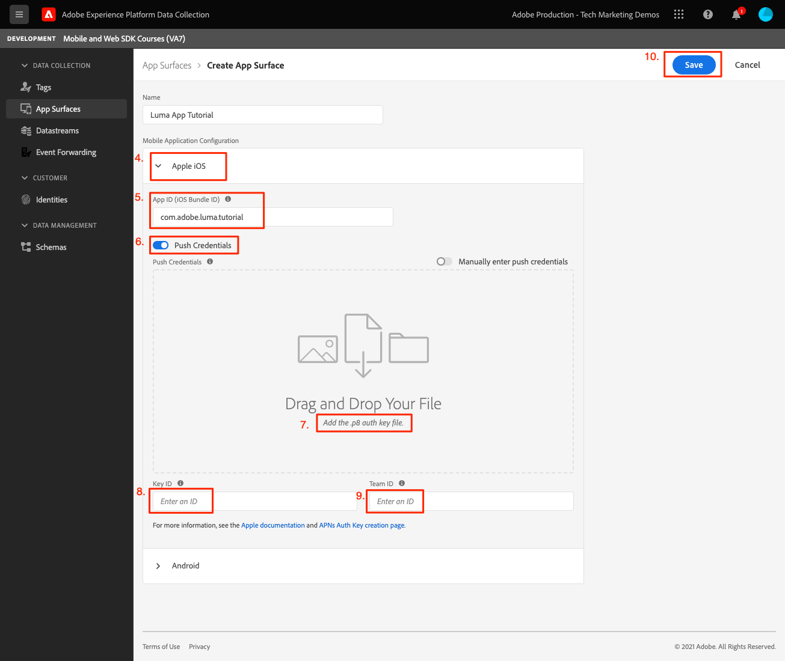
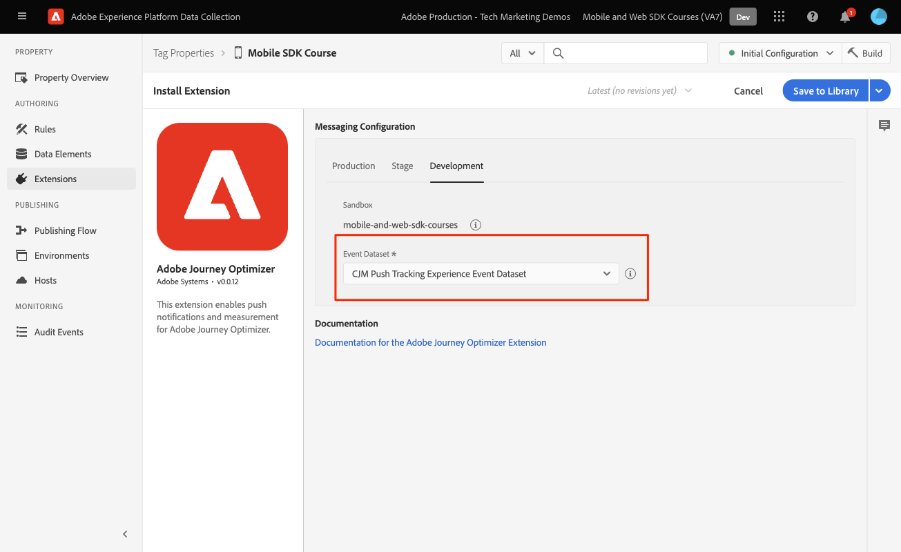
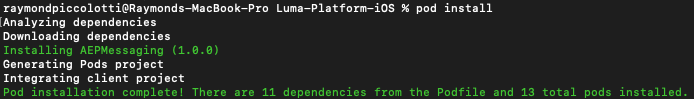
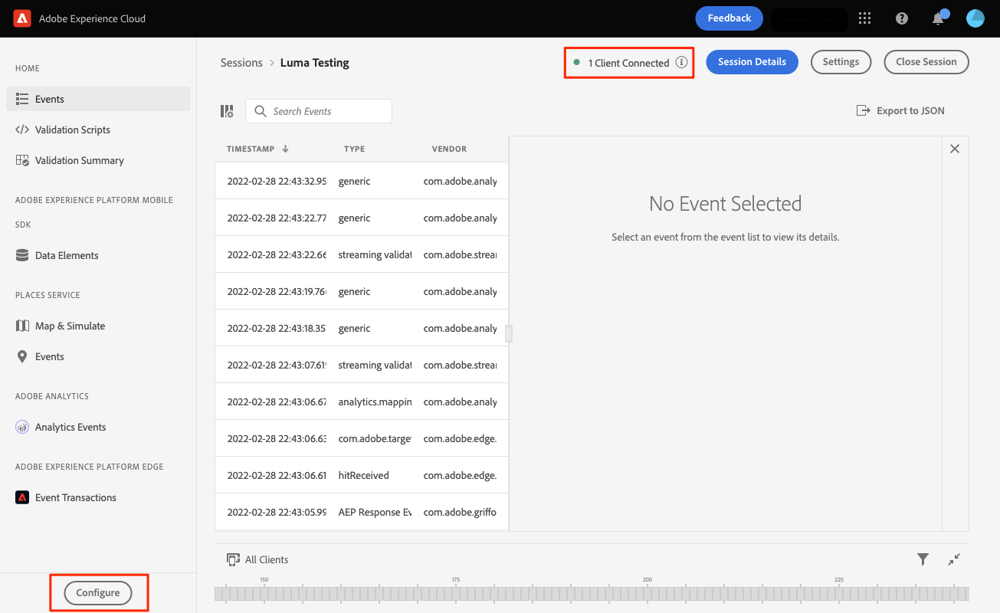
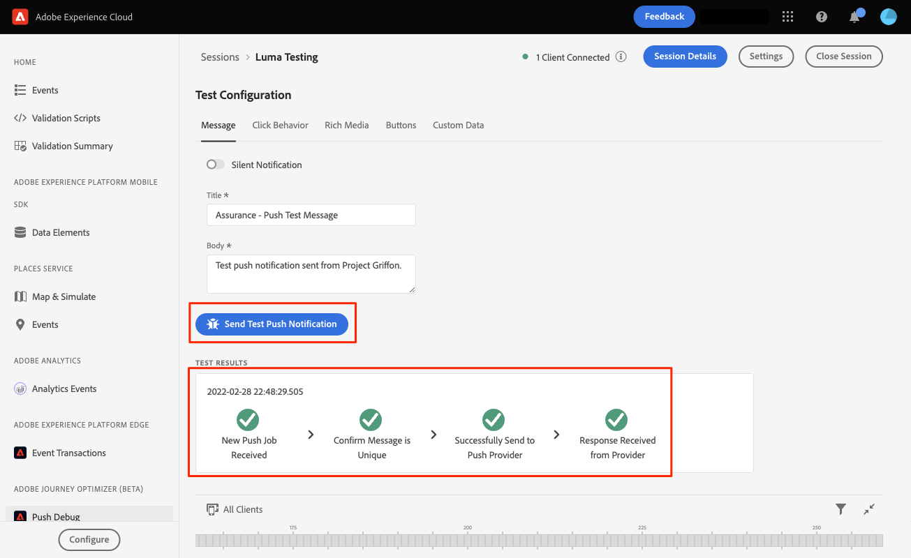

# Adobe Journey Optimizer push messaging

Learn how to create push messages for mobile apps with Platform Mobile SDK and Adobe Journey Optimizer.

Journey Optimizer allows you to create your journeys and send messages to targeted audiences. Before you send push notifications with Journey Optimizer, you must ensure that the proper configurations and integrations are in place. To understand the Push Notifications data flow in Adobe Journey Optimizer, please refer to [the documentation](https://experienceleague.adobe.com/docs/journey-optimizer/using/configuration/configuration-message/push-config/push-gs.html).

>[!NOTE]
>
>This lesson is optional and only applies to Adobe Journey Optimizer users looking to send push messages. 


## Prerequisites

* Successfully built and run app with SDKs installed and configured.
* Access to Adobe Journey Optimizer and sufficient permissions as described [here](https://experienceleague.adobe.com/docs/journey-optimizer/using/configuration/configuration-message/push-config/push-configuration.html?lang=en). Also you need sufficient permissions to the following Adobe Journey Optimizer features.
  * Create an app surface. 
  * Create a journey
  * Create a message.
  * Create message presets.
* Paid Apple developer account with sufficient access to create certificates, identifiers, and keys.
* Physical iOS device for testing.

## Learning objectives

In this lesson, you will:

* Register App ID with Apple Push Notification service (APN).
* Create an **[!UICONTROL App Surface]** in AJO.
* Update your **[!UICONTROL schema]** to include push messaging fields.
* Install & configure the **[!UICONTROL Adobe Journey Optimizer]** tag extension.
* Update your app to include the AJO tag extension.
* Validate setup in Assurance.
* Send a test message.


## Register App ID with APN

The following steps are not Adobe Experience Cloud-specific and are designed to guide you through APN configuration.

### Create a `.p8` private key

1. In the Apple developer portal, navigate to **[!UICONTROL Keys]**.
1. Select the + icon to create a key.


1. Provide a **[!UICONTROL Key Name]**.
1. Select the **[!UICONTROL APN]** checkbox.
1. Select **[!UICONTROL Continue]**.

1. Review configuration and select **[!UICONTROL Register]**.
1. Download the `.p8` private key. It is used in the App Surface configuration.
1. Make note of the **[!UICONTROL Key ID]**. It is used in the App Surface configuration.

Additional documentation can be [found here](https://help.apple.com/developer-account/#/devcdfbb56a3).

### Retrieve your Apple developer Team ID

1. In the Apple developer portal, navigate to **[!UICONTROL Membership]**. 
1. Your **[!UICONTROL Team ID]** is listed alongside your other membership information. It is used in the App Surface configuration.

## Add your app push credentials in Data Collection

1. From the [Data Collection interface](https://experience.adobe.com/data-collection/), select the App Surfaces tab in the left-hand panel.
1. Select **[!UICONTROL Create App Surfaces]** to create a configuration.

1. Enter a **[!UICONTROL Name]** for the configuration, for example `Luma App Tutorial`  .
1. From Mobile Application Configuration, select **[!UICONTROL Apple iOS]**.
1. Enter the mobile app Bundle Id in the App ID (iOS Bundle ID) field. If you are following along with the Luma app that value is `com.adobe.luma.tutorial`. 
1. Switch on the **[!UICONTROL Push Credentials]** button to add your credentials.
1. Drag and drop your `.p8` **Apple Push Notification Authentication Key** file.
1. Provide the Key ID, a 10-character string assigned during the creation of `p8` auth key. It can be found under Keys tab in **Certificates, Identifiers and Profiles** page.
1. Provide the Team ID. This is a string value which can be found under the **Membership** tab.
1. Select **[!UICONTROL Save]**.


## Install Adobe Journey Optimizer tags extension

1. Navigate to [!UICONTROL Tags] > [!UICONTROL Extensions] > [!UICONTROL Catalog], and find the **[!UICONTROL Adobe Journey Optimizer]** extension.
1. Install the extension.

1. Select `CJM Push Tracking Experience Event Dataset` the Adobe Experience Platform dataset.

1. Select **[!UICONTROL Save to Library and Build]**.

>[!NOTE]
>If you don't see "CJM Push Tracking Experience Event Dataset" as an option, please contact customer care.
>

## Implement the Adobe Journey Optimizer in the app

As discussed in previous lessons, installing a mobile tag extension only provides the configuration. Next you must install and register the messaging SDK. If these steps aren't clear, please review the [Install SDKs](install-sdks.md) section.

>[!NOTE]
>
>If you completed the [Install SDKs](install-sdks.md) section, then the SDK is already installed and you can skip to step #7.

1. Open your `Podfile` and add the following line and save the file.

    `pod 'AEPMessaging', '~>1'`
1. Open your terminal and navigate to the folder containing your `Podfile`.
1. Install the SDK by executing the command `pod install`. 

1. Open XCode and navigate to `AppDelegate.swift`.
1. Add the following to your list of imports.

    `import AEPMessaging`
1. Add `Messaging.self` to the array of extensions that you are registering.
1. Add the following function to the file.

    ```swift
    func application(_: UIApplication, didRegisterForRemoteNotificationsWithDeviceToken deviceToken: Data) {
        MobileCore.setPushIdentifier(deviceToken)
    }
    ```

    This function retrieves the device token unique to the device that the app is installed on and send to Adobe/Apple for push message delivery.

## Validate by sending a test push message

1. Review the [setup instructions](assurance.md) section.
1. Install the app on your physical device.
1. Launch the app using the Assurance generated URL.
1. Send the app to the background.
1. In the Assurance UI, select **[!UICONTROL Configure]**.
    
1. Select the **[!UICONTROL +]** button next to **[!UICONTROL Push Debug]**.
1. Select **[!UICONTROL Save]**.
    
1. Select **[!UICONTROL Push Debug]** from the left navigation.
1. Select your device from the **[!UICONTROL Client list]**.
1. Confirm that you aren't getting any errors.
    
1. Scroll down and select **[!UICONTROL Send Test Push Notification]**.
1. Confirm that you don't receive and errors and that you receive the message on your device. 
    

Next: **[Conclusion and next steps](conclusion.md)**

>[!NOTE]
>
>Thank you for investing your time in learning about Adobe Experience Platform Mobile SDK. If you have questions, want to share general feedback, or have suggestions on future content, share them on this [Experience League Community discussion post](https://experienceleaguecommunities.adobe.com/t5/adobe-experience-platform-data/tutorial-discussion-implement-adobe-experience-cloud-in-mobile/td-p/443796)