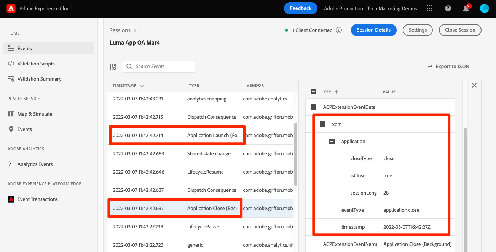

# Lifecycle data

Learn how to collect lifecycle data in a mobile app.

The Adobe Experience Platform Mobile SDK Lifecycle extension enables the collection  lifecycle data from your mobile app. The Adobe Experience Platform Edge Network extension sends this lifecycle data to the Platform Edge Network where it is then  forwarded to other applications and services according to your datastream configuration. Learn more about the [Lifecycle extension](https://developer.adobe.com/client-sdks/documentation/lifecycle-for-edge-network/) in the product documentation.


## Prerequisites

* Successfully built and run app with SDKs installed and configured.
* Imported the Assurance SDK.

    ```swift
    import AEPAssurance
    ```

* Registered the Assurance extension as described in the [previous lesson](install-sdks.md).

## Learning objectives

In this lesson, you will:

* Add lifecycle field group to the schema.
* Enable accurate lifecycle metrics by correctly starting/pausing as the app moves between foreground and background.
* Send data from the app to Platform Edge Network.
* Validate in Assurance.

## Add lifecycle field group to schema

The Consumer Experience Event field group you added in the [previous lesson](create-schema.md) already contains the lifecycle fields, so you can skip this step. If you don't use Consumer Experience Event field group in your own app, you can add the lifecycle fields by doing the following:

1. Navigate to the schema interface as described in the [previous lesson](create-schema.md).
1. Open the "Luma App" schema and select **[!UICONTROL Add]**.
    
1. In the search bar, enter "lifecycle".
1. Select the checkbox next to **[!UICONTROL AEP Mobile Lifecycle Details]**.
1. Select **[!UICONTROL Add field groups]**.
    
1. Select **[!UICONTROL Save]**.
    


## Implementation changes

Now you can update `AppDelegate.swift` to register the lifecycle events:

1. When launched, if your app is resuming from a background state, iOS might call your `applicationWillEnterForeground:` delegate method. Add `lifecycleStart:`
 
    ```swift
    MobileCore.lifecycleStart(additionalContextData: nil)
    ```

1. When the app enters the background, pause Lifecycle data collection from your app's `applicationDidEnterBackground:` delegate method.

    ```swift
    MobileCore.lifecyclePause()
    ```

>[!NOTE]
>
>For iOS 13 and later, please review the [documentation](https://developer.adobe.com/client-sdks/documentation/mobile-core/lifecycle/#register-lifecycle-with-mobile-core-and-add-appropriate-startpause-calls) for slightly different code.

## Validate with Assurance

1. Review the [setup instructions](assurance.md) section and connect your simulator or device to Assurance.
1. Launch the app.
1. Send the app to the background. Check for `LifecyclePause`.
1. Bring app to the foreground. Check for `LifecycleResume`.


## Forward data to Platform Edge Network

The previous exercise dispatches the foreground and background events to Mobile SDK. To send these events to Platform Edge Network, follow the steps listed [here](https://developer.adobe.com/client-sdks/documentation/lifecycle-for-edge-network/#configure-a-rule-to-forward-lifecycle-metrics-to-platform). Once the events are sent to Platform Edge Network, they will be forwarded to other applications and services according to your datastream configuration.

Once you have added the rule to send the lifecyle events to Platform Edge Network, you should see `Application Close (Background)` and `Application Launch (Foreground)` events containing XDM data in Assurance.




Next: **[Track events](events.md)**

>[!NOTE]
>
>Thank you for investing your time in learning about Adobe Experience Platform Mobile SDK. If you have questions, want to share general feedback, or have suggestions on future content, share them on this [Experience League Community discussion post](https://experienceleaguecommunities.adobe.com/t5/adobe-experience-platform-data/tutorial-discussion-implement-adobe-experience-cloud-in-mobile/td-p/443796)