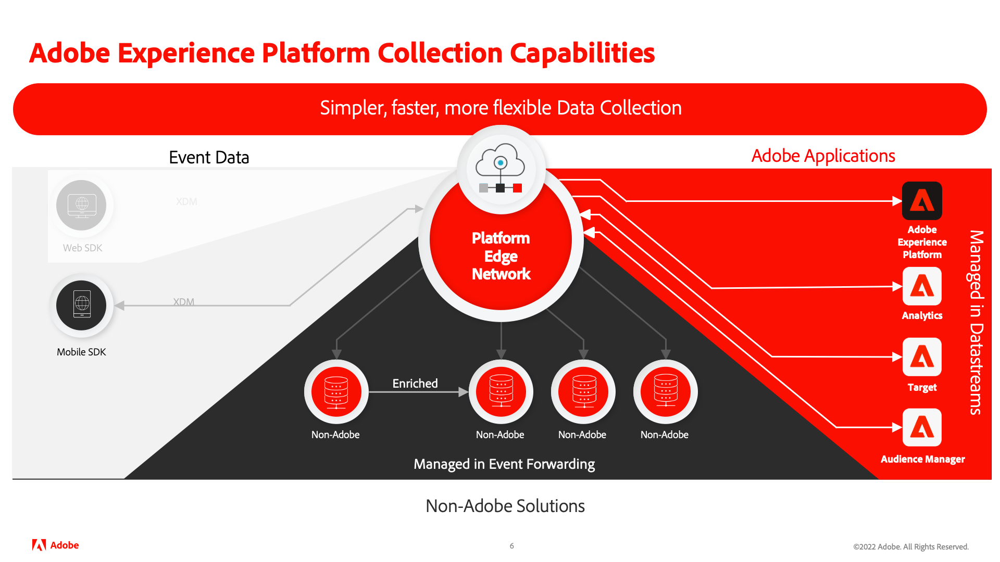

# Implement Adobe Experience Cloud in mobile apps tutorial

Learn how to implement Adobe Experience Cloud applications in your mobile app using Adobe Experience Platform Mobile SDK.

Experience Platform Mobile SDK is a client-side SDK that allows customers of Adobe Experience Cloud to interact with both Adobe applications and third-party services through the Adobe Experience Platform Edge Network. See the [Adobe Experience Platform Mobile SDK documentation](https://aep-sdks.gitbook.io/docs/) for more detailed information.

  

This tutorial guides you through the implementation of the Platform Mobile SDK in a sample retail app called Luma. The [Luma app](https://github.com/Adobe-Marketing-Cloud/Luma-iOS-Mobile-App) has functionality that lets you build a realistic implementation. After completing this tutorial, you should be ready to start implementing all of your marketing solutions through Platform Mobile SDK in your own mobile apps.

The lessons are designed for iOS and written in Swift, but many of the concepts also apply to Android&trade;.

After completing this tutorial, you will be able to:

* Create a schema using standard and custom field groups.
* Set up a datastream.
* Configure a mobile tag property.
* Set up an Experience Platform dataset (optional).
* Install and implement tag extensions in an app.
* Add the following Adobe Experience Cloud applications/extensions:
  * [Adobe Experience Platform Edge (XDM)](events.md)
  * [Lifecycle data collection](lifecycle-data.md)
  * [Adobe Analytics via XDM](analytics.md)
  * [Consent](consent.md)
  * [Identity](identity.md)
  * [Profile](profile.md)
  * [Adobe Experience Platform](platform.md)
  * [Push messaging with Journey Optimizer](journey-optimizer-push.md)
* Correctly pass Experience Cloud parameters to a [webview](web-views.md).
* Validate the implementation using [Adobe Experience Platform Assurance](assurance.md).

>[!NOTE]
>
>A similar multi-solution tutorial is available for [Web SDK](../tutorial-web-sdk/overview.md).

## Prerequisites

In these lessons, it is assumed that you have an Adobe Id and the required permissions to complete the exercises. If not, you should reach out to your Adobe Administrator to request access.

* In Data Collection, you must have:
  * **[!UICONTROL Platforms]**&mdash;permission item **[!UICONTROL Mobile]**
  * **[!UICONTROL Property Rights]**&mdash;permission items to **[!UICONTROL Develop]**, **[!UICONTROL Approve]**, **[!UICONTROL Publish]**, **[!UICONTROL Manage Extensions]**, and **[!UICONTROL Manage Environments]**.
  * **[!UICONTROL Company Rights]**&mdash;permission items to **[!UICONTROL Manage Properties]** and, if completing the optional push messaging lesson, **[!UICONTROL Manage App Configurations]**
  
    For more information on tag permissions, see [User permissions for tags](https://experienceleague.adobe.com/docs/experience-platform/tags/admin/user-permissions.html?lang=en){target="_blank"} in the product documentation.
* In Experience Platform, you must have:
  * **[!UICONTROL Data Modeling]**&mdash;permission items to manage and view schemas.
  * **[!UICONTROL Identity Management]**&mdash;permission items to manage and view identity namespaces.
  * **[!UICONTROL Data Collection]**&mdash;permission items to manage and view datastreams.

  * If you are the customer of a Platform-based application like Real-time CDP, Journey Optimizer, or Customer Journey Analytics, you should also have:
    * **[!UICONTROL Data Management]**&mdash;permission items to manage and view datasets to complete the _optional Platform exercises_ (requires a license for a Platform-based application ).
    * A development **sandbox** which you can use for this tutorial.
* For Adobe Analytics, you must know which **report suites** you can use to complete this tutorial.

All Experience Cloud customers should have access to the required features needed to deploy Mobile SDK.

Also, it is assumed that you are familiar with [!DNL Swift]. You do not need to be an expert to complete the lessons, but you will get more out of them if you can comfortably read and understand code.

## Download the Luma app

Two versions of the sample app are available for download. 

1. [Empty](https://github.com/Adobe-Marketing-Cloud/Luma-iOS-Mobile-App){target="_blank"} - version without any Experience Cloud code to complete the hands-on exercises in this tutorial
1. [Full Implemented](https://github.com/Adobe-Marketing-Cloud/Luma-iOS-Mobile-App){target="_blank"} – version with full Experience Cloud implementation for reference.

Let's get started!

Next: **[Create an XDM schema](create-schema.md)**

>[!NOTE]
>
>Thank you for investing your time in learning about Adobe Experience Platform Mobile SDK. If you have questions, want to share general feedback, or have suggestions on future content, please share them on this [Experience League Community discussion post](https://experienceleaguecommunities.adobe.com/t5/adobe-experience-platform-launch/tutorial-discussion-implement-adobe-experience-cloud-in-mobile/td-p/443796)