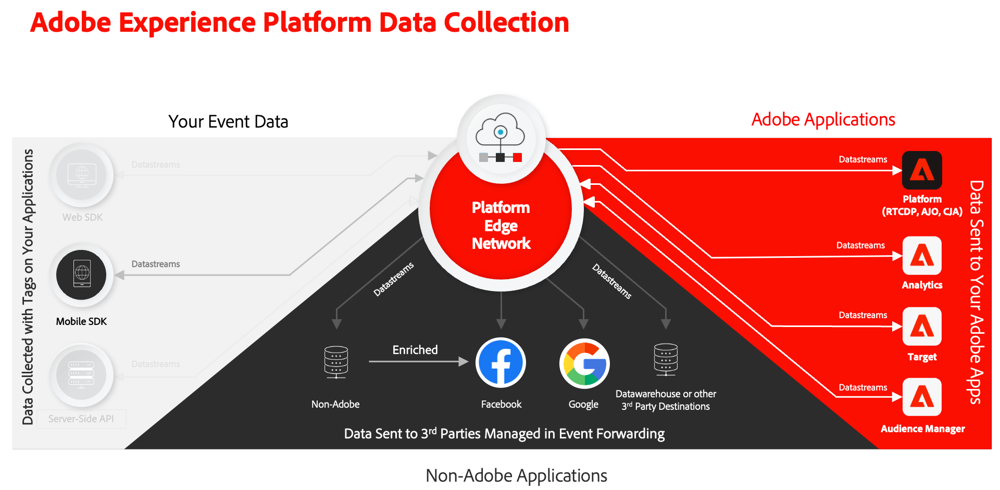

# Implement Adobe Experience Cloud in mobile apps tutorial

Learn how to implement Adobe Experience Cloud applications in your mobile app using the Adobe Experience Platform Mobile SDK.

Experience Platform Mobile SDK is a client-side SDK that allows customers of Adobe Experience Cloud to interact with both Adobe applications and third-party services through the Adobe Experience Platform Edge Network. See the [Adobe Experience Platform Mobile SDK documentation](https://developer.adobe.com/client-sdks/home/) for more detailed information.

{zoomable="yes"}

This tutorial guides you through the implementation of the Platform Mobile SDK in a sample app called Luma. The Luma app has functionality that lets you build a realistic implementation. After you have completed this tutorial, you should be ready to start implementing all of your marketing solutions through Experience Platform Mobile SDK in your own mobile apps.

The lessons are designed for:

* iOS, using the Swift programming language and the SwiftUI framework.
* Android, using the Kotlin and Java programming language and the JetPack Compose framework.

After completing this tutorial, you will be able to:

* Create a schema using standard and custom field groups.
* Set up a datastream.
* Configure a mobile tag property.
* Set up an Experience Platform dataset (optional).
* Install and implement tag extensions in an app.
* Correctly pass Experience Cloud parameters to a [webview](web-views.md).
* Validate the implementation using [Adobe Experience Platform Assurance](assurance.md).
* Add the following Adobe Experience Cloud applications or extensions:
  * [Adobe Experience Platform Edge (XDM)](events.md)
  * [Lifecycle data collection](lifecycle-data.md)
  * [Consent](consent.md)
  * [Identity](identity.md)
  * [Profile](profile.md)
  * [Places](places.md)
  * [Analytics](analytics.md)
  * [Experience Platform](platform.md)
  * [Push messaging with Journey Optimizer](journey-optimizer-push.md)
  * [In-app messaging with Journey Optimizer](journey-optimizer-inapp.md)
  * [Decision management with Journey Optimizer](journey-optimizer-offers.md)
  * [Target](target.md)

>[!NOTE]
>
>A similar multi-solution tutorial is available for [Web SDK](../tutorial-web-sdk/overview.md).

## Permissions

In these lessons, it is assumed that you have an Adobe Id and the required user-level permissions to complete the exercises. If not, you should reach out to your Adobe Administrator to request access.

* In Data Collection, you must have:
  * **[!UICONTROL Platforms]**&mdash;permission item **[!UICONTROL Mobile]**
  * **[!UICONTROL Property Rights]**&mdash;permission items to **[!UICONTROL Develop]**, **[!UICONTROL Approve]**, **[!UICONTROL Publish]**, **[!UICONTROL Manage Extensions]**, and **[!UICONTROL Manage Environments]**.
  * **[!UICONTROL Company Rights]**&mdash;permission items to **[!UICONTROL Manage Properties]**
  
    For more information on tag permissions, see [User permissions for tags](https://experienceleague.adobe.com/en/docs/experience-platform/tags/admin/user-permissions){target="_blank"} in the product documentation.
* In Experience Platform, you must have:
  * **[!UICONTROL Data Modeling]**&mdash;permission items to manage and view schemas.
  * **[!UICONTROL Identity Management]**&mdash;permission items to manage and view identity namespaces.
  * **[!UICONTROL Data Collection]**&mdash;permission items to manage and view datastreams.

  * If you are the customer of a Platform-based application like Real-Time CDP, Journey Optimizer, or Customer Journey Analytics, and plan to do the related lessons you should also have:
    * **[!UICONTROL Data Management]**&mdash;permission items to manage and view datasets.
    * A development **sandbox** which you can use for this tutorial.
  
  * For the Journey Optimizer lessons, you need permissions to configure the **push notification service** and to create an **app surface**, a **journey**, a **message**, and **message presets**. Additionally, for Decision Management, you need the proper permissions to **manage offers** and **decisions**, as described in [Permission levels](https://experienceleague.adobe.com/en/docs/journey-optimizer/using/access-control/high-low-permissions).

* For Adobe Analytics, you must know which **report suites** you can use to complete this tutorial.

* For Adobe Target, you must have permission to create and activate activities.

>[!NOTE]
>
>As part of this tutorial, you create schemas, datasets, identities, and so on. If multiple people are going through this tutorial in a single sandbox, consider appending or prepending an identification as part of your naming conventions when creating these objects. For example, add ` - <your name or initials>` to the name of the object you are instructed to create.

## Version history

* September 9, 2025: 
  * Android version of the app with accompanying instructions.
  * Updates for changes in app surface and campaign functionality in Journey Optimizer.
* Nov. 29, 2023: Major overhaul with new sample app and new lessons for in-app messaging, decision management, and Adobe Target.
* Mar. 9, 2022: First publish

## Download the Luma app

>[!BEGINTABS]

>[!TAB iOS]

Two versions of the sample app are available for download. Both versions can be downloaded / cloned from [GitHub](https://github.com/Adobe-Marketing-Cloud/Luma-iOS-Mobile-App). You find two folders:

1. [Start](https://github.com/Adobe-Marketing-Cloud/Luma-iOS-Mobile-App){target="_blank"}: a project without code or with placeholder code for most of the Experience Platform Mobile SDK code you need to use to complete the hands-on exercises in this tutorial.
1. [Finish](https://github.com/Adobe-Marketing-Cloud/Luma-iOS-Mobile-App){target="_blank"}: a version with the full implementation for reference.

You use iOS as the platform, [!DNL Swift] as the programming language, [!DNL SwiftUI] as the UI framework and [!DNL Xcode] as the integrated development environment (IDE). However, many of the implementation concepts explained are similar for other development platforms. Many have already successfully completed this tutorial with little to no previous iOS and Swift(UI) development experience. You do not need to be an expert to complete the lessons, but you get more out of the lessons if you can comfortably read and understand code.

You can download the final productized version of the app from the App Store.

>[!TAB Android]

Two versions of the sample app are available for download. Both versions can be downloaded or cloned from [GitHub](https://github.com/adobe/Luma-Android). You find two folders:

1. [Start](https://github.com/adobe/Luma-Android){target="_blank"}: a project without code or with placeholder code for most of the Experience Platform Mobile SDK code you need to use to complete the hands-on exercises in this tutorial.
1. [Finish](https://github.com/adobe/Luma-Android){target="_blank"}: a version with the full implementation for reference.

You use Android as the platform, [!DNL Kotlin]+[!DNL Java] as the programming language, [!DNL JetPack Compose] as the UI framework and [!DNL Android Studio] as the integrated development environment (IDE). However, many of the implementation concepts explained are similar for other development platforms. Many have already successfully completed this tutorial with little to no previous Android / Kotlin+Java / JetPack Compose experience. You do not need to be an expert to complete the lessons, but you get more out of the lessons if you can comfortably read and understand code.

If you prefer, you can [join a test for a productized version](https://play.google.com/apps/internaltest/4700642199234438150) of the app from Google Play.

>[!ENDTABS]

Let's get started!

>[!SUCCESS]
>
>Thank you for investing your time in learning about Adobe Experience Platform Mobile SDK. If you have questions, want to share general feedback, or have suggestions on future content, share them on this [Experience League Community discussion post](https://experienceleaguecommunities.adobe.com/t5/adobe-experience-platform-data/tutorial-discussion-implement-adobe-experience-cloud-in-mobile/td-p/443796).

Next: **[Create an XDM schema](create-schema.md)**
