# Use Places

Learn how to use the Places geolocation service in your app.

The Adobe Experience Platform Data Collection Places Service is a geolocation service that enables mobile apps with location awareness to understand the location context. The service is using rich and easy-to-use SDK interfaces accompanied by a flexible database of points of interests (POIs).

## Prerequisites

* All package dependencies are in place in the Xcode project.
* Registered extensions in AppDelegate.
* Configured MobileCore to use your development appId.
* Imported SDKs.
* Successfully built and run the app with the above changes.

## Learning objectives

In this lesson, you will

* Understand how to define points of interest in the Places service.
* Update your tag property with the Places extension.
* Update your schema to capture geolocation events.
* Validate setup in Assurance.
* Update your app to register the Places extension.
* Implement geolocation tracking from the Places service in your app.


## Setup

For the Places service to work within your app and within the Mobile SDK, you have to do some setup.

### Define Places

You define some points of interest in the Places service.

1. In the Data Collection UI, select **[!UICONTROL Places]**.
1. Select .
1. From the context menu, select **[!UICONTROL Manage Libraries]**.
   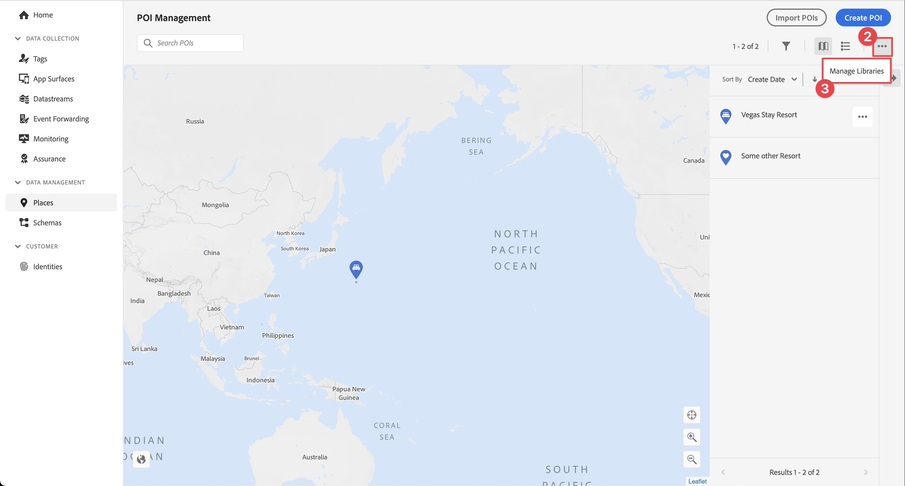{zoomable="yes"} 
1. In the **[!UICONTROL Manage Libraries]** dialog, select **[!UICONTROL New]**.
1. In the **[!UICONTROL Create Library]** dialog enter a **[!UICONTROL Name]**, for example `Luma`.
1. Select **[!UICONTROL Confirm]**.
   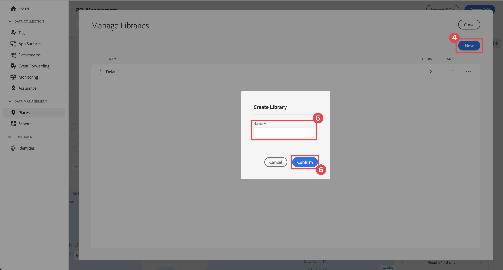{zoomable="yes"}
1. To close the **[!UICONTROL Manage Libraries]** dialog, select **[!UICONTROL Close]**.
1. Back in **[!UICONTROL POI Management]**, select **[!UICONTROL Import POIs]**.
1. Select **[!UICONTROL Start]** in the **[!UICONTROL Import Places]** dialog.
1. Select **[!DNL Luma]** from the list of libraries,
1. Select **[!UICONTROL Next]**.
    {zoomable="yes"}
1. Download the [Luma POIs ZIP file](assets/luma_pois.csv.zip) and extract it to a location on your computer.
1. In the **[!UICONTROL Import Places]** dialog, drag and drop the extracted `luma_pois.csv` file on to **[!UICONTROL Choose CSV File - Drag and Drop your File]**. You should see **[!UICONTROL Validation Success]** - **[!UICONTROL Successfully validated the CSV file]**.
1. Select **[!UICONTROL Begin Import]**. You should see **[!UICONTROL Success]** - **[!UICONTROL Successfully added 6 new POIs]**.
1. Select **[!UICONTROL Done]**.
1. In **[!UICONTROL POI Management]**, you should see that six new Luma stores are added to the list. You can toggle between  list and  map view.
   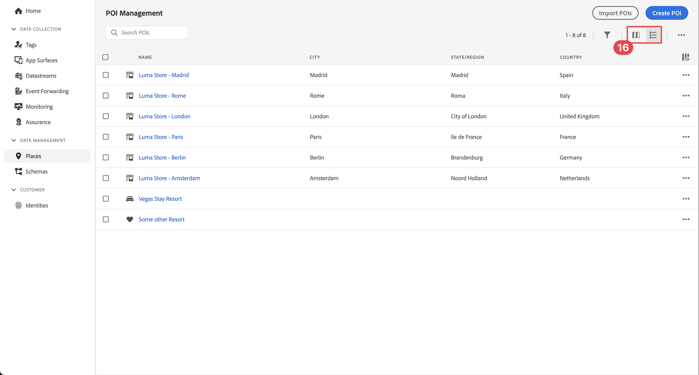{zoomable="yes"}. 


### Install Places extension

1. Navigate to **[!UICONTROL Tags]** and find your mobile tag property and open the property.
1. Select **[!UICONTROL Extensions]**.
1. Select **[!UICONTROL Catalog]**.
1. Search for the **[!UICONTROL Places]** extension.
1. Install the extension.

    

1. In the **[!UICONTROL Install Extension]** dialog:
   1. Select **[!DNL Luma]** from the **[!UICONTROL Select a Library]** list.
   1. Ensure you have picked your working library, for example **[!UICONTROL Initial Build]**.
   1. Select **[!UICONTROL Save to Library and Build]** from **[!UICONTROL Save to Library]**.
      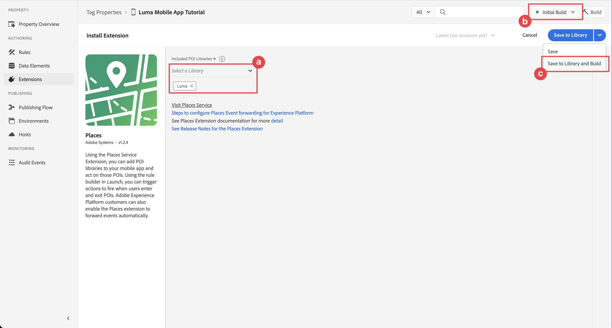{zoomable="yes"}. 

1. Your library is rebuilt.


### Verify your schema

Verify whether your schema, as defined in [Create schema](create-schema.md), incorporates the necessary field groups and classes to collect POI and geolocation data.

1. Navigate to Data Collection interface and select **[!UICONTROL Schemas]** from the left rail.
1. Select **[!UICONTROL Browse]** from the top bar.
1. Select your schema to open it.
1. In the schema editor, select **[!UICONTROL Consumer Experience Event]**.
1. You see a **[!UICONTROL placeContext]** object with object and fields to capture POI interaction and geolocation data.
   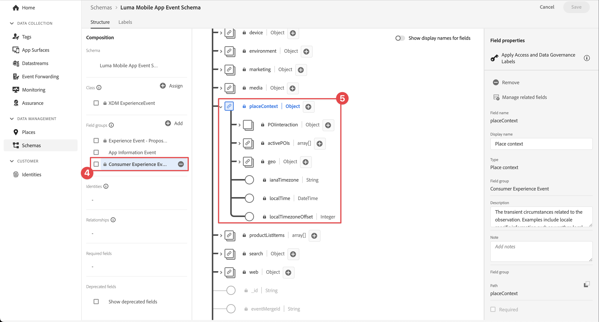{zoomable="yes"}. 


### Update your tag property

The Places extension for Tags provides functionality to monitor geolocation events and allows you to trigger actions based on these events. You can use this functionality to minimize the API coding you have to implement in the app.

**Data Elements**

You first create several data elements.

1. Go to your tag property in the Data Collection UI.
1. Select **[!UICONTROL Data Elements]** from the left rail.
1. Select **[!UICONTROL Add Data Element]**.
1. In the **[!UICONTROL Create Data Element]** screen, enter a name, for example `Name - Entered`.
1. Select **[!UICONTROL Places]** from the **[!UICONTROL Extension]** list.
1. Select **[!UICONTROL Name]** from the **[!UICONTROL Data Element Type]** list.
1. Select **[!UICONTROL Current POI]** underneath **[!UICONTROL TARGET]**.
1. Select **[!UICONTROL Save to Library]**.
   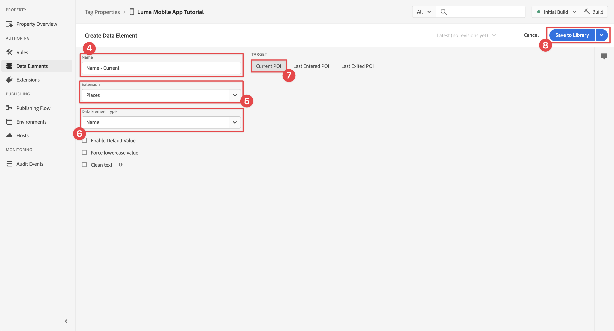{zoomable="yes"} 

1. Repeat steps 4 - 8 using the information from the table below, to create additional data elements.
   
   | Name | Extension | Data Element Type | TARGET |
   |---|---|---|---|
   | `Name - Exited` | Places | Name | Last Exited POI |
   | `Category - Current` | Places | Category | Current POI |
   | `Category - Exited` | Places | Category | Last Exited POI |
   | `City - Current` | Places | City | Current POI |
   | `City - Exited` | Places | City | Last Exited POI |

   You should have the following list of Data Elements.

   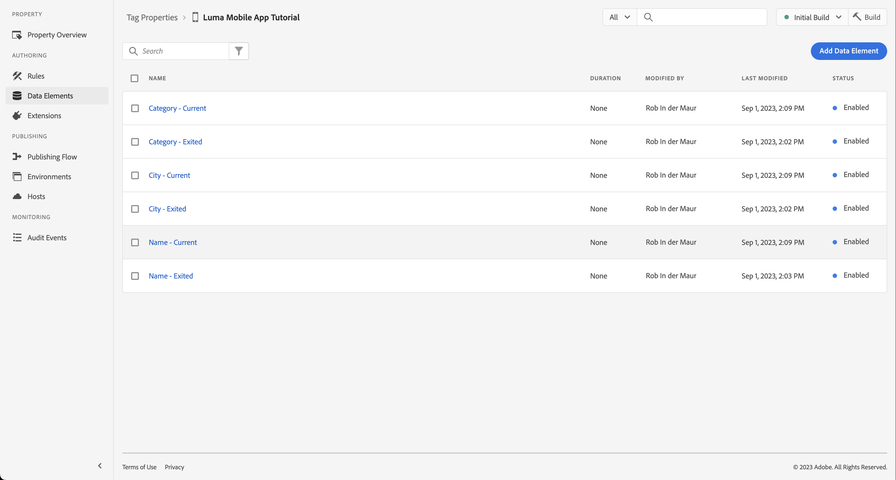{zoomable="yes"}

**Rules** 

Next, you are going to define rules to work with these data elements. 

1. In your tag property, select **[!UICONTROL Rules]** from the left rail.
1. Select **[!UICONTROL Add Rule]**.
1. In the **[!UICONTROL Create Rule]** screen, enter a name for the rule, for example `POI - Entry`.
1. Select  underneath **[!UICONTROL EVENTS]**.
   1. Select **[!UICONTROL Places]** from the **[!UICONTROL Extension]** list and select **[!UICONTROL Enter POI]** from the **[!UICONTROL Event Type]** list.
   1. Select **[!UICONTROL Keep Changes]**.
      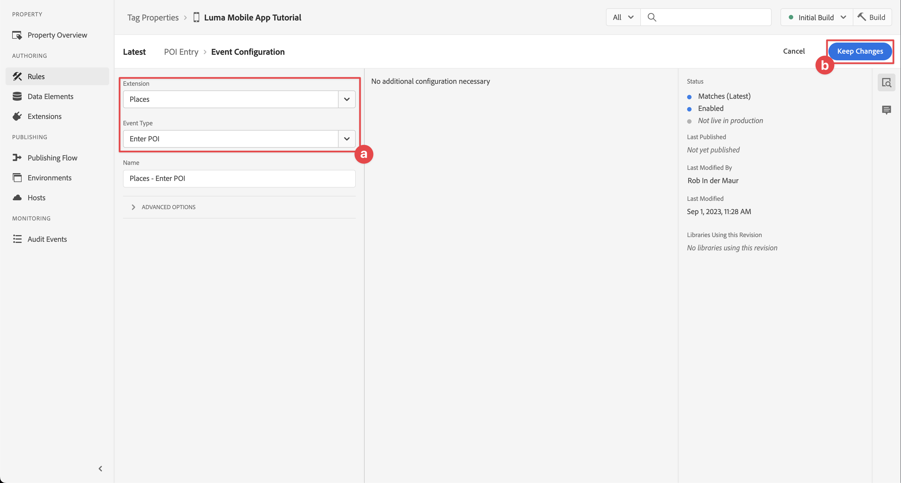. 
1. Select  underneath **[!UICONTROL ACTIONS]**.
   1. Select **[!UICONTROL Mobile Core]** from the **[!UICONTROL Extension]** list, select **[!UICONTROL Attach Data]** from **[!UICONTROL Action Type]** the list. This action attaches payload data.
   1. In the **[!UICONTROL JSON Payload]**, paste the following payload:

        ```json
        {
            "xdm": {
                "eventType": "location.entry",
                "placeContext": {
                    "geo": {
                        "city": "{%%City - Current%%}"
                    },
                    "POIinteraction": {
                        "poiDetail": {
                            "name": "{%%Name - Current%%}",
                            "category": "{%%Category - Current%%}"
                        },
                        "poiEntries": {
                            "value": 1
                        }
                    }
                }
            }
        }
        ```

       You can also insert `{%% ... %%}` data element placeholder values in the JSON by selecting the . A popup dialog allows you to pick any data element you created.

   1. Select **[!UICONTROL Keep Changes]**.
        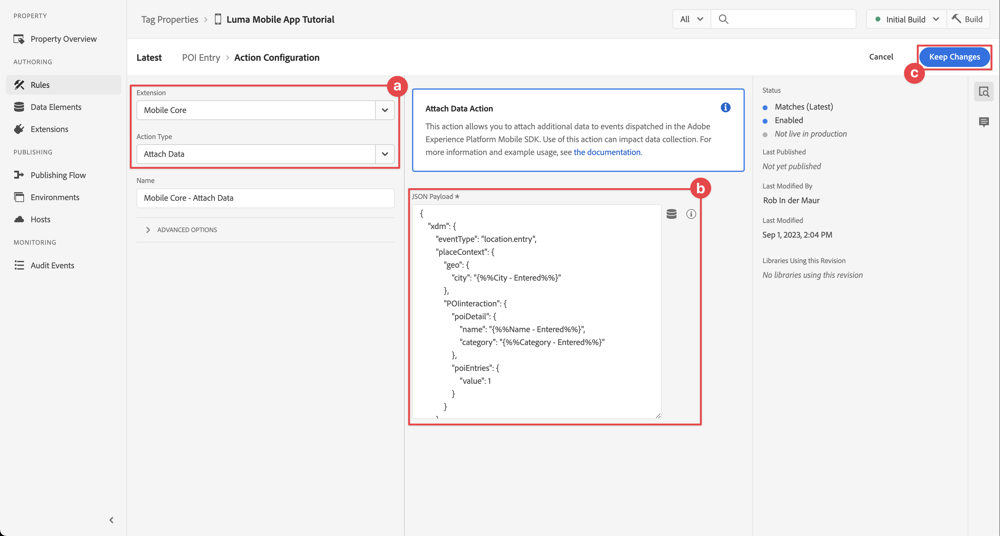{zoomable="yes"}

1. Select  next to the **[!UICONTROL Mobile Core - Attach Data]** action.
   1. Select **[!UICONTROL Adobe Experience Platform Edge Network]** from the **[!UICONTROL Extension]** list and select **[!UICONTROL Forward event to Edge Network]**. This action ensures that the event and additional payload data are forwarded to Platform Edge Network.
   1. Select **[!UICONTROL Keep Changes]**.

1. To save the rule, select **[!UICONTROL Save to Library]**.

    {zoomable="yes"}

Let's create another rule

1. In the **[!UICONTROL Create Rule]** screen, enter a name for the rule, for example `POI - Exit`.
1. Select  underneath **[!UICONTROL EVENTS]**.
   1. Select **[!UICONTROL Places]** from the **[!UICONTROL Extension]** list and select **[!UICONTROL Exit POI]** from the **[!UICONTROL Event Type]** list.
   1. Select **[!UICONTROL Keep Changes]**. 
1. Select  underneath **[!UICONTROL ACTIONS]**.
   1. Select **[!UICONTROL Mobile Core]** from **[!UICONTROL Extension]** list, select **[!UICONTROL Attach Data]** from **[!UICONTROL Action Type]** list.
   1. In the **[!UICONTROL JSON Payload]**, paste the following payload:

        ```json
        {
            "xdm": {
                "eventType": "location.exit",
                "placeContext": {
                    "geo": {
                        "city": "{%%City - Exited%%}"
                    },
                    "POIinteraction": {
                        "poiExits": {
                            "value": 1
                        },
                        "poiDetail": {
                            "name": "{%%Name - Exited%%}",
                            "category": "{%%Category - Exited%%}"
                        }
                    }
                }
            }
        }
        ```

   1. Select **[!UICONTROL Keep Changes]**.

1. Select  next to the **[!UICONTROL Mobile Core - Attach Data]** action.
   1. Select **[!UICONTROL Adobe Experience Platform Edge Network]** from the **[!UICONTROL Extension]** list and select **[!UICONTROL Forward event to Edge Network]**.
   1. Select **[!UICONTROL Keep Changes]**.

1. To save the rule, select **[!UICONTROL Save to Library]**.

    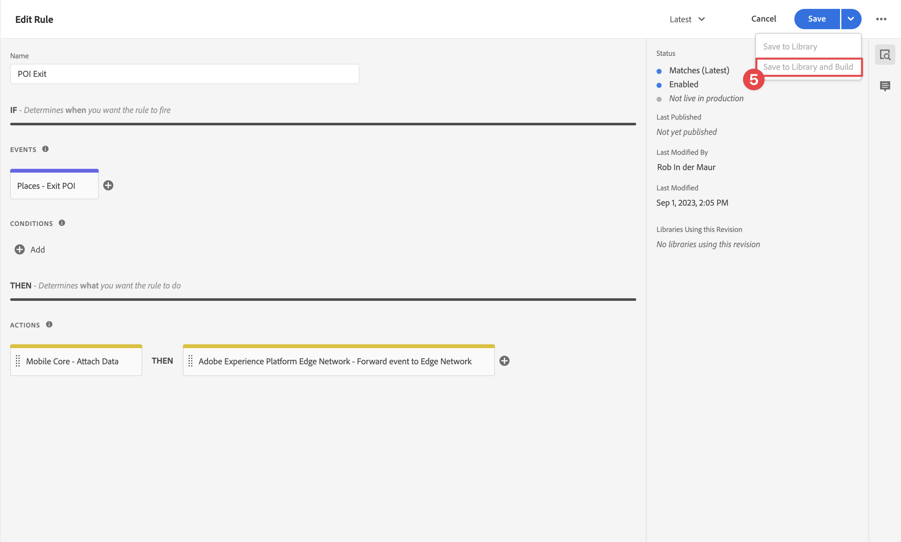{zoomable="yes"}


To ensure all changes in your tag are published

 1. Select **[!UICONTROL Initial Build]** as the library to build.
 1. Select **[!UICONTROL Build]**.
    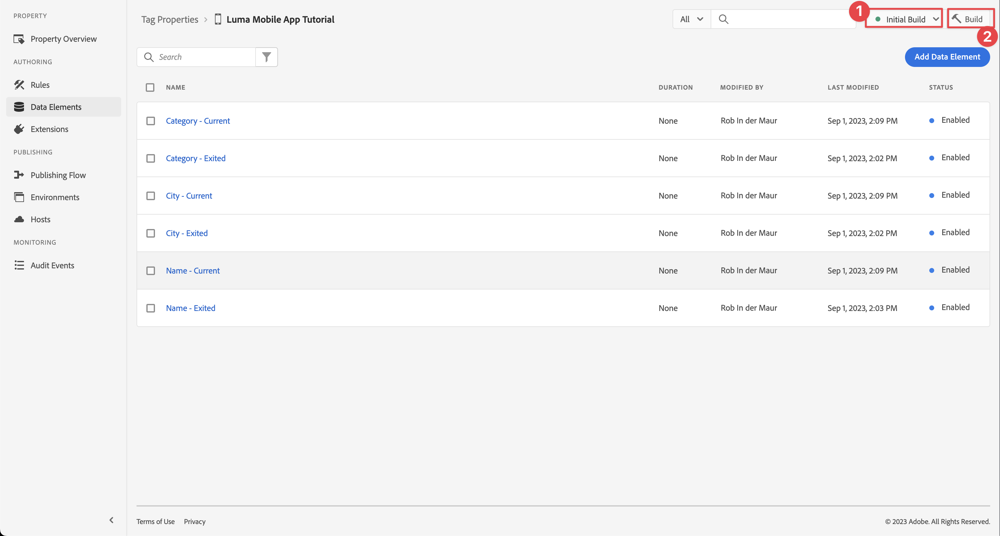{zoomable="yes"}

   


## Validate setup in Assurance

To validate your setup in Assurance:

1. Go to the Assurance UI.
1. If not already available in the left rail, select **[!UICONTROL Configure]** in left rail and select  next to **[!UICONTROL Events]** and **[!UICONTROL Map & Simulate]** underneath **[!UICONTROL PLACES SERVICE]**.
1. Select **[!UICONTROL Save]**.
1. Select **[!UICONTROL Map & Simulate]** in the left rail.
1. Move the map to a location of one of your POI's.
1. Select  Simulate Load POIs. Your POI is identified using a circle and pin.
1. Select your POI.
1. From the popup, select  **[!UICONTROL Simulate Entry Event]**.
   
   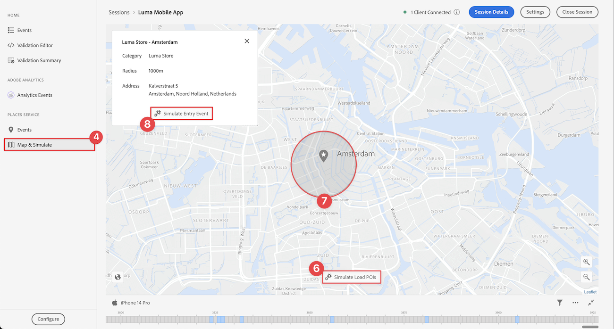{zoomable="yes"}

1. Select **[!UICONTROL Events]** from the left rail, and you should see the events that you simulated.
   
   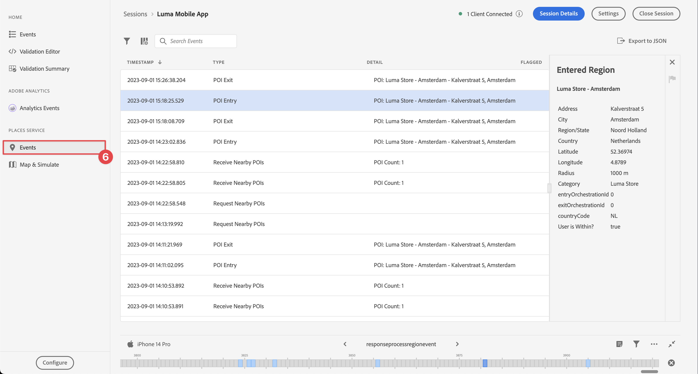{zoomable="yes"}


## Implement Places in your app

As discussed in previous lessons, installing a mobile tag extension only provides the configuration. Next you must install and register the Places SDK. If these steps aren't clear, review the [Install SDKs](install-sdks.md) section.

>[!NOTE]
>
>If you completed the [Install SDKs](install-sdks.md) section, then the Places SDK is already installed and you can skip this step.
>

>[!IMPORTANT]
>
>Setting up the Maps SDK for Android in your app requires you to setup billing as your incur costs with the usage. You can limit the costs using your unique application id and a SHA-1 key. For more details, see [Map SDK for Android](https://developers.google.com/maps/documentation/android-sdk/overview). If you do not want to set up billing or incur costs, skip this lesson.

>[!BEGINTABS]

>[!TAB iOS]

1. In Xcode, ensure that [AEP Places](https://github.com/adobe/aepsdk-places-ios) is added to the list of packages in Package Dependencies. See [Swift Package Manager](install-sdks.md#swift-package-manager).
1. Navigate to **[!DNL Luma]** > **[!DNL Luma]** > **[!DNL AppDelegate]** in the Xcode Project navigator.
1. Ensure `AEPPlaces` is part of your list of imports.

    ```swift
    import AEPPlaces
    ```

1. Ensure `Places.self` is part of the array of extensions that you are registering.

    ```swift
    let extensions = [
        AEPIdentity.Identity.self,
        Lifecycle.self,
        Signal.self,
        Edge.self,
        AEPEdgeIdentity.Identity.self,
        Consent.self,
        UserProfile.self,
        Places.self,
        Messaging.self,
        Optimize.self,
        Assurance.self
    ]
    ```

1. Navigate to **[!DNL Luma]** > **[!DNL Luma]** > **[!DNL Utils]** > **[!UICONTROL MobileSDK]** in the Xcode Project navigator and find the `func processRegionEvent(regionEvent: PlacesRegionEvent, forRegion region: CLRegion) async` function. Add the following code:

    ```swift
    // Process geolocation event
    Places.processRegionEvent(regionEvent, forRegion: region)
    ```   

    This [`Places.processRegionEvent`](https://developer.adobe.com/client-sdks/documentation/places/api-reference/#processregionevent) API communicates the geolocation information to the Places service.

1. Navigate to **[!DNL Luma]** > **[!DNL Luma]** > **[!DNL Views]** > **[!DNL Location]** > **[!DNL GeofenceSheet]** in Xcode's Project navigator. 
   
   1. For the Entry button, enter the following code

    ```swift
    // Simulate geofence entry event
    Task {
        await MobileSDK.shared.processRegionEvent(regionEvent: .entry, forRegion: region)
    }
    ```  

   1. For the Exit button, enter the following code

    ```swift
    // Simulate geofence exit event
    Task {
        await MobileSDK.shared.processRegionEvent(regionEvent: .exit, forRegion: region)
    }
    ```  

## Validate using your app

To validate the geolocation features in your app:

>[!BEGINTABS]

>[!TAB iOS]

1. Open your app on a device or in the simulator.

1. Go to the **[!UICONTROL Location]** tab.

1. Move (drag) the map around to ensure that the blue middle circle is on above of one of your POI's, for example London.

1. Tap  until you see the category and name appear in the label at the red location with the pin.
   
1. Tap the label of the POI, which opens up the **[!UICONTROL Nearby POI]** sheet. 
   
   

1. Press the **[!UICONTROL Entry]** or **[!UICONTROL Exit]** buttons to simulate geofence entry and geofence exit events from the app.

   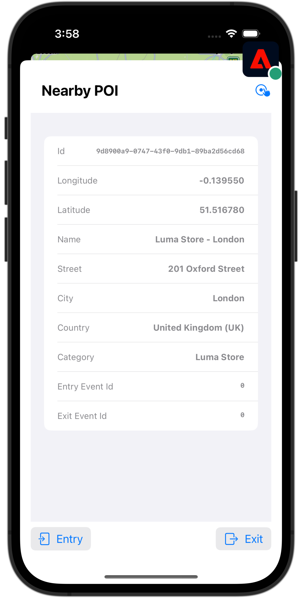

1. You should see the events in the Assurance UI. Both in the general Events and in the Places Service Events.

>[!TAB Android]

1. Go to the **[!UICONTROL Location]** tab.

1. Select **[!UICONTROL Use and/or Simulate Geofences]**.

1. Tap somewhere within the red circle that appears.

   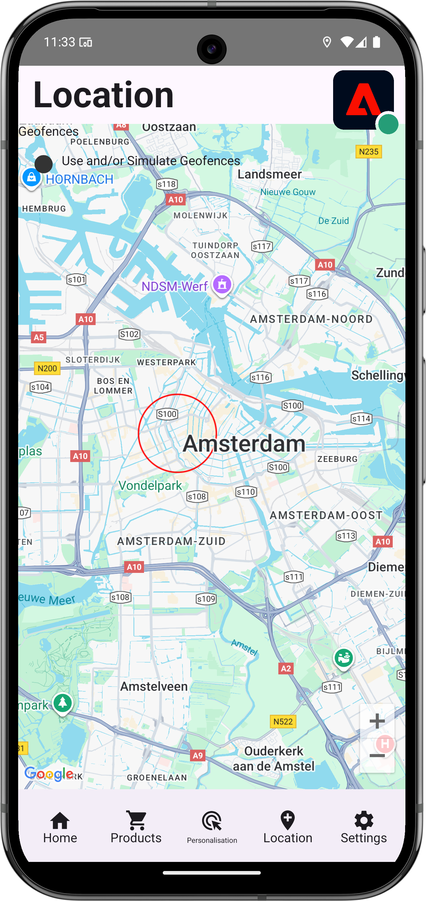


1. Press the **[!UICONTROL Entry]** or **[!UICONTROL Exit]** buttons to simulate geofence entry and geofence exit events from the app.

   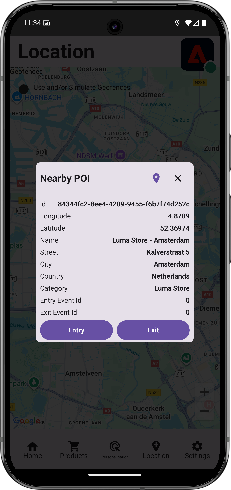

1. You should see the events in the Assurance UI.

Be aware that the Android Places API calls do not interact with the Mobile SDK Eventhub, so the POI - Enty and POI - Exit rules you have defined are not automatically triggered. You can work around by sending an explicit experience event with all details required for a geofence event.

>[!ENDTABS]


## Next steps

You should now have all the tools to start adding more functionality to your geolocation functionality in the app. As you have forwarded the events to the Edge Network, once you have set up the app for [Experience Platform](platform.md), you should see the experience events appearing for the profile used in the app. 

In the Journey Optimizer section of this tutorial, you will see that experience events can be used to trigger journeys (see [push notification](journey-optimizer-inapp.md) and [in-app messaging](journey-optimizer-push.md) with Journey Optimizer). For example, the usual example of sending your app user a push notification with some product promotion when that user enters the geofence of a physical store.

You have seen an implementation of functionality for your app, mostly driven by the Places service and data elements and rules you defined in your tag property. As such, minimizing the code in your app. Alternatively, you can implement the same functionality directly in your app using the [`Edge.sendEvent`](https://developer.adobe.com/client-sdks/documentation/edge-network/api-reference/#sendevent) API (see [Events](events.md) for more information) with an XDM payload containing a populated `placeContext` object.

>[!SUCCESS]
>
>You have now enabled the app for geolocation services using the Places extension in the Experience Platform Mobile SDK.
>
>Thank you for investing your time in learning about Adobe Experience Platform Mobile SDK. If you have questions, want to share general feedback, or have suggestions on future content, share them on this [Experience League Community discussion post](https://experienceleaguecommunities.adobe.com/t5/adobe-experience-platform-data/tutorial-discussion-implement-adobe-experience-cloud-in-mobile/td-p/443796).

Next: **[Map data to Adobe Analytics](analytics.md)**
