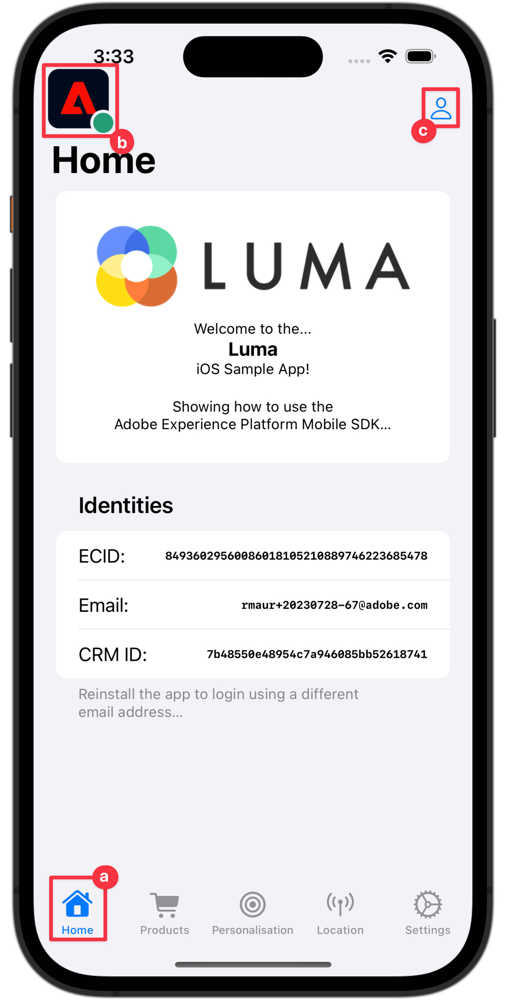
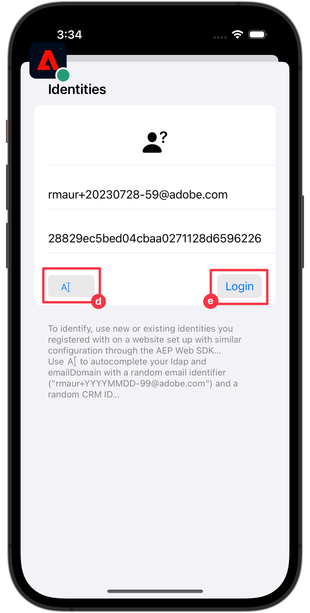
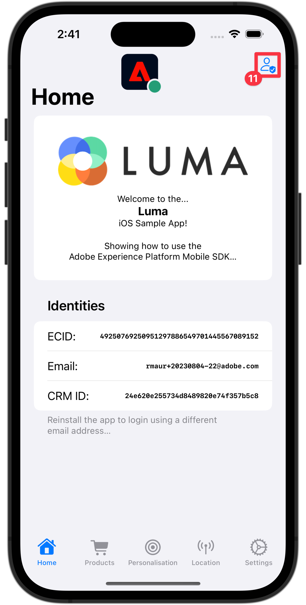
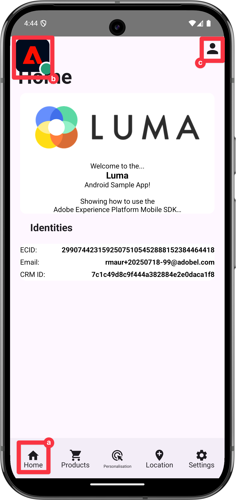
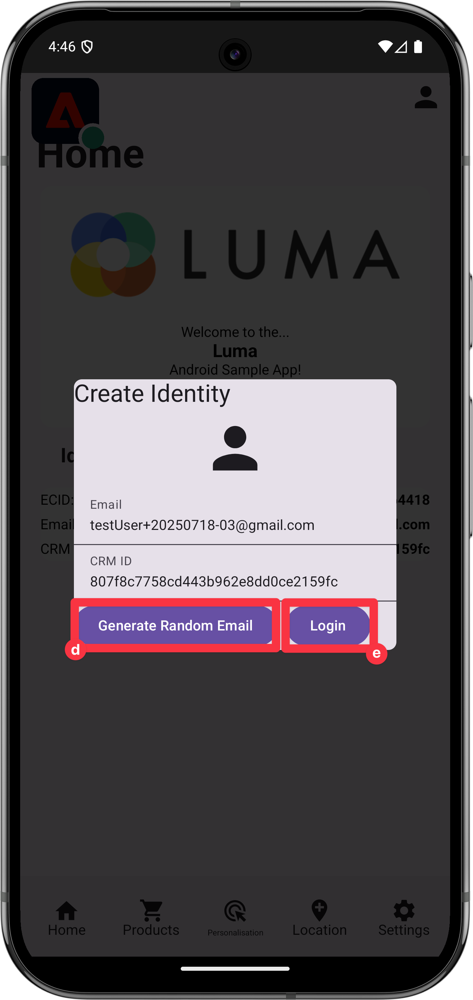
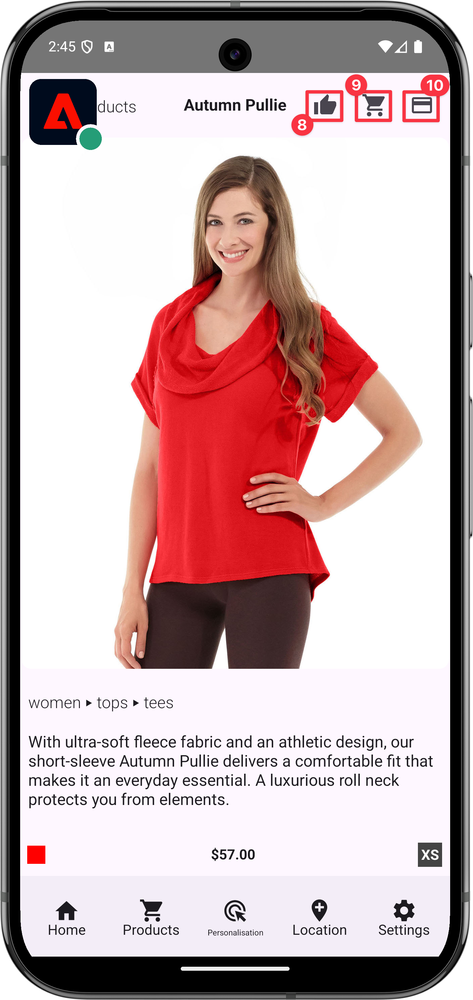
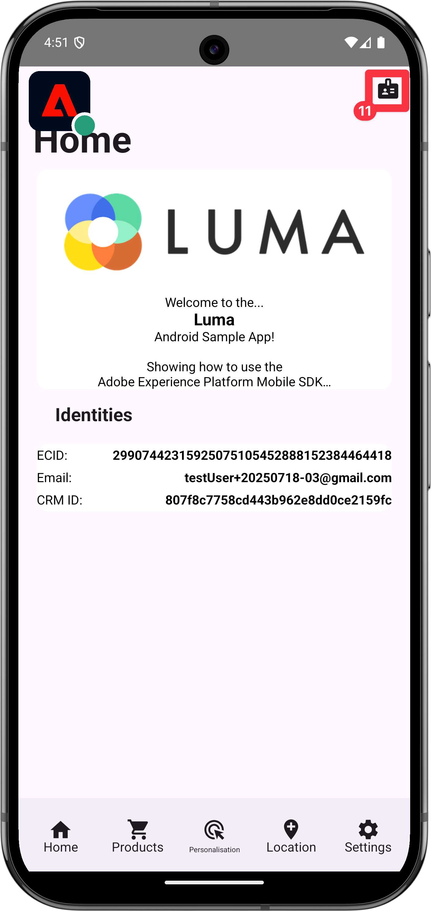

# Collect profile data

Learn how to collect profile data in a mobile app.

You can use the Profile extension to store attributes about your user on the client. This information can be used later to target and personalize messages during online or offline scenarios, without having to connect to a server for optimal performance. The Profile extension manages the Client-Side Operation Profile (CSOP), provides a way to react to APIs, updates user profile attributes, and shares the user profile attributes with the rest of the system as a generated event.

The Profile data is used by other extensions to perform profile-related actions. An example is the Rules Engine extension that consumes the profile data and runs rules based on the profile data. Learn more about the [Profile extension](https://developer.adobe.com/client-sdks/documentation/profile/) in the documentation

>[!IMPORTANT]
>
>The Profile functionality described in this lesson is separate from the Real-Time Customer Profile functionality in Adobe Experience Platform and Platform-based applications.


## Prerequisites

* Successfully built and run app with SDKs installed and configured.

## Learning objectives

In this lesson, you will:

* Set or update user attributes.
* Retrieve user attributes.


## Set and update user attributes

It would be helpful for targeting and / or personalization in the app to quickly know if a user has made a purchase in the past or recently. Let's set that up in the Luma app.

>[!BEGINTABS]

>[!TAB iOS]

1. Navigate to **[!DNL Luma]** > **[!DNL Luma]** > **[!DNL Utils]** >  **[!DNL MobileSDK]** in the Xcode Project navigator and find the `func updateUserAttribute(attributeName: String, attributeValue: String)` function. Add the following code:

    ```swift
    // Create a profile map, add attributes to the map and update profile using the map
    var profileMap = [String: Any]()
    profileMap[attributeName] = attributeValue
    UserProfile.updateUserAttributes(attributeDict: profileMap)
    ```

    This code:

    1. Sets up an empty dictionary named `profileMap`.

    1. Adds an element to the dictionary using `attributeName` (for example `isPaidUser`), and `attributeValue` (for example `yes`).

    1. Uses the `profileMap` dictionary as a value to the `attributeDict` parameter of the [`UserProfile.updateUserAttributes`](https://developer.adobe.com/client-sdks/documentation/profile/api-reference/#updateuserattributes) API call.

1. Navigate to **[!DNL Luma]** > **[!DNL Luma]** > **[!DNL Views]** > **[!DNL Products]** > **[!DNL ProductView]** in the Xcode Project navigator and find the call to `updateUserAttributes` (within the code for the Purchases  button). Add the following code:

    ```swift
    // Update attributes
    MobileSDK.shared.updateUserAttribute(attributeName: "isPaidUser", attributeValue: "yes")
    ```

>[!TAB Android]

1. Navigate to **[!UICONTROL Android]**  > **[!DNL app]** > **[!DNL kotlin+java]** > **[!DNL com.adobe.luma.tutorial.android]** > **[!UICONTROL models]** > **[!UICONTROL MobileSDK]** in the Android Studio navigator and find the `func updateUserAttribute(attributeName: String, attributeValue: String)` function. Add the following code:

    ```kotlin
    // Create a profile map, add attributes to the map and update profile using the map
    val profileMap = mapOf(attributeName to attributeValue)
    UserProfile.updateUserAttributes(profileMap)
    ```

    This code:

    1. Sets up an empty map named `profileMap`.

    1. Adds an element to the map using `attributeName` (for example `isPaidUser`), and `attributeValue` (for example `yes`).

    1. Uses the `profileMap` map as a value to the `attributeDict` parameter of the [`UserProfile.updateUserAttributes`](https://developer.adobe.com/client-sdks/documentation/profile/api-reference/#updateuserattributes) API call.

1. Navigate to **[!UICONTROL Android]**  > **[!DNL app]** > **[!DNL kotlin+java]** > **[!DNL com.adobe.luma.tutorial.android]** > **[!UICONTROL views]** > **[!UICONTROL ProductView.kt]** and find the call to `updateUserAttributes` (within the code for the Purchases  button). Add the following code:

    ```kotlin
    // Update attributes
    MobileSDK.shared.updateUserAttribute("isPaidUser", "yes")
    ```

>[!ENDTABS]

## Get user attributes

Once you have updated a user's attribute, it is available to other Adobe SDKs but you can also retrieve attributes explicitly, to let your app behave the way you want.

>[!BEGINTABS]

>[!TAB iOS]

1. Navigate to **[!DNL Luma]** > **[!DNL Luma]** > **[!DNL Views]** > **[!DNL General]** > **[!DNL HomeView]** in the Xcode Project navigator and find the `.onAppear` modifier. Add the following code:

    ```swift
    // Get attributes
    UserProfile.getUserAttributes(attributeNames: ["isPaidUser"]) { attributes, error in
        if attributes?.count ?? 0 > 0 {
            if attributes?["isPaidUser"] as? String == "yes" {
                showBadgeForUser = true
            }
            else {
                showBadgeForUser = false
            }
        }
    }
    ```

    This code:
    
    1. Calls the [`UserProfile.getUserAttributes`](https://developer.adobe.com/client-sdks/documentation/profile/api-reference/#getuserattributes) API with the `isPaidUser` attribute name as single element in the `attributeNames` array.
    1. Then checks for the value of the `isPaidUser` attribute and when `yes`, places a badge on the  icon in the toolbar at the top right.

>[!TAB Android]

1. Navigate to **[!UICONTROL Android]**  > **[!DNL app]** > **[!DNL kotlin+java]** > **[!DNL com.adobe.luma.tutorial.androi]** > **[!DNL views]** > **[!DNL HomeView.kt]** in the Android Studio project navigator and find the `.onAppear` modifier. Add the following code:

    ```kotlin
    // Get attributes
    UserProfile.getUserAttributes(listOf("isPaidUser")) { attributes ->
        showBadgeForUser = attributes?.get("isPaidUser") == "yes"
    }
    ```

    This code:
    
    1. Calls the [`UserProfile.getUserAttributes`](https://developer.adobe.com/client-sdks/documentation/profile/api-reference/#getuserattributes) API with the `isPaidUser` attribute name as single element in the `attributeNames` array.
    1. Then checks for the value of the `isPaidUser` attribute and when `yes`, replaces the person icon with a  a badge on the  icon in the toolbar at the top right.

>[!ENDTABS]

See the [API reference](https://developer.adobe.com/client-sdks/documentation/profile/api-reference/#getuserattributes) for more information.

## Validate with Assurance

1. Review the [setup instructions](assurance.md#connecting-to-a-session) section to connect your simulator or device to Assurance.
1. Run the app to log in and interact with a product.

   >[!BEGINTABS]

   >[!TAB iOS]

   1. Select **[!UICONTROL Home]** in the tab bar.
   1. Move the Assurance icon to the left.
   1. To open the Login sheet, select the  button.
      
       

   1. To insert a random email and customer id, select the  button .
   1. Select **[!UICONTROL Login]**.
  
       

   1. Select **[!DNL Products]** in the tab bar.
   1. Select one product.
   1. Select .
   1. Select .
   1. Select .
   
       

   1. Return back to **[!UICONTROL Home]** screen. You should see that a badge has been added .
       
       

    
    >[!TAB Android]

   1. Select **[!UICONTROL Home]** in the tab bar.
   1. Move the Assurance icon to the left.
   1. To open the Login sheet, select the  button.
      
       

   1. To insert a random email and customer id, select the  button .
   1. Select **[!UICONTROL Login]**.
  
       

   1. Select **[!DNL Products]** in the tab bar.
   1. Select one product.
   1. Select.
   1. Select .
   1. Select .
   
       

   1. Return back to **[!UICONTROL Home]** screen. You should see that the person icon is updated.
       
       

    >[!ENDTABS]

     

1. In the Assurance UI, you should see a **[!UICONTROL UserProfileUpdate]** and **[!UICONTROL getUserAttributes]** events with the updated `profileMap` value.
   {zoomable="yes"}

>[!SUCCESS]
>
>You have now set up your app to update attributes of profiles in the Edge Network and (when set up) with Adobe Experience Platform.
>
>Thank you for investing your time in learning about Adobe Experience Platform Mobile SDK. If you have questions, want to share general feedback, or have suggestions on future content, share them on this [Experience League Community discussion post](https://experienceleaguecommunities.adobe.com/t5/adobe-experience-platform-data/tutorial-discussion-implement-adobe-experience-cloud-in-mobile/td-p/443796).

Next: **[Use Places](places.md)**
