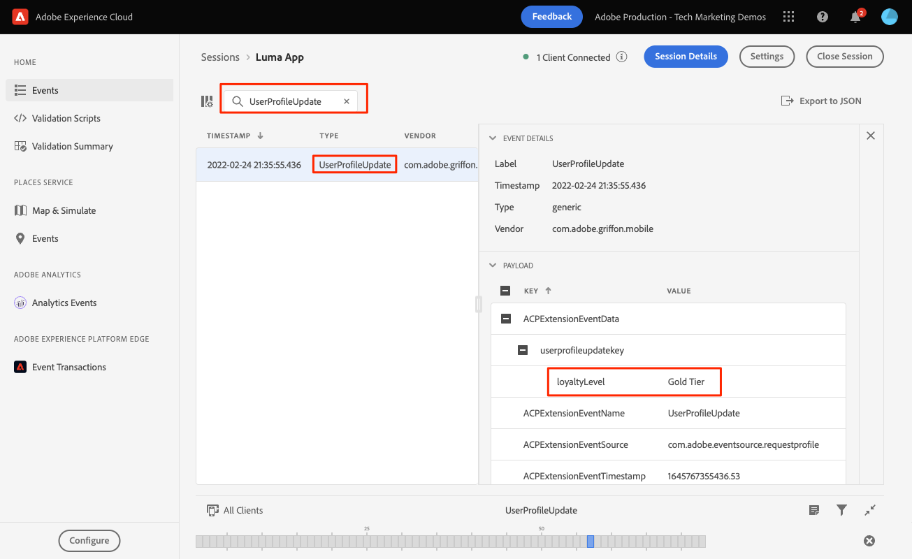

# Profile

Learn how to collect profile data in a mobile app.

You can use the Profile extension to store attributes about your user on the client. This information can be used later to target and personalize messages during online or offline scenarios, without having to connect to a server for optimal performance. The Profile extension manages the Client-Side Operation Profile (CSOP), provides a way to react to APIs, updates user profile attributes, and shares the user profile attributes with the rest of the system as a generated event.

The Profile data is used by other extensions to perform profile-related actions. An example is the Rules Engine extension that consumes the profile data and runs rules based on the profile data. Learn more about the [Profile extension](https://aep-sdks.gitbook.io/docs/foundation-extensions/profile) in the documentation

>[!IMPORTANT]
>
>The Profile functionality described in this lesson is separate from the Real-Time Customer Profile functionality in Adobe Experience Platform and Platform-based applications.


## Prerequisites

* Successfully built and run app with SDKs installed and configured.
* Imported the Profile SDK.

    ```swift
    import AEPUserProfile
    ```

## Learning objectives

In this lesson, you will:

* Set or update user attributes.
* Retrieve user attributes.


## Set & update

It would be helpful for targeting and/or personalization to quickly know if a user has made purchase in the app before. Let's set that up in the Luma app.

1. Navigate to `Cart.swift`

1. Add the below code to the `processOrder() `function.

    ```swift
    var profileMap = [String: Any]()
    profileMap["isPaidUser"] = "yes"
    UserProfile.updateUserAttributes(attributeDict: profileMap)
    ```

The personalization team might also want to target based on the user's loyalty level. Let's set that up in the Luma app.

1. Navigate to `Account.swift`

1. Add the below code to the `showUserInfo()` function.

    ```swift
    var profileMap = [String: Any]()
    profileMap["loyaltyLevel"] = loyaltyLevel
    UserProfile.updateUserAttributes(attributeDict: profileMap)
    ```

Additional `updateUserAttributes` documentation can be found [here](https://aep-sdks.gitbook.io/docs/foundation-extensions/profile/profile-api-references#update-user-attributes).

## Get

Once you have updated a user's attribute, it will be available to other Adobe SDKs but you can also retrieve attributes explicitly.

```swift
UserProfile.getUserAttributes(attributeNames: ["isPaidUser","loyaltyLevel"]){
    attributes, error in
    print("Profile: getUserAttributes: ",attributes as Any)
}
```

Additional `getUserAttributes` documentation can be found [here](https://aep-sdks.gitbook.io/docs/foundation-extensions/profile/profile-api-references#get-user-attributes).

## Validate with Assurance

1. Review the [setup instructions](assurance.md) section.
1. Install the app.
1. Launch the app using the Assurance generated URL.
1. Select the Account icon and then select Login. Note: you don't have provide any credentials.
1. Close the login menus and then select the Account icon again. This brings you to the account details screen where `loyaltyLevel` is set.
1. You should see a **[!UICONTROL UserProfileUpdate]** event in the Assurance UI with the updated `profileMap` value.


Next: **[Map data to Adobe Analytics](analytics.md)**

>[!NOTE]
>
>Thank you for investing your time in learning about Adobe Experience Platform Mobile SDK. If you have questions, want to share general feedback, or have suggestions on future content, please share them on this [Experience League Community discussion post](https://experienceleaguecommunities.adobe.com/t5/adobe-experience-platform-launch/tutorial-discussion-implement-adobe-experience-cloud-in-mobile/td-p/443796)