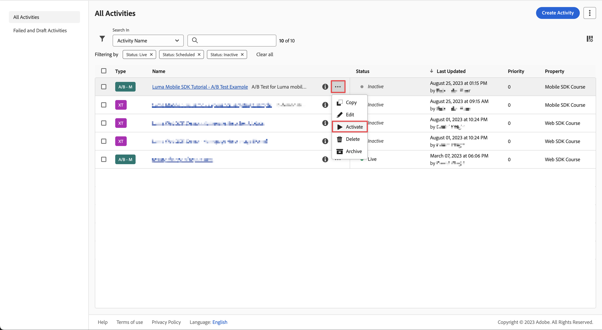

# Optimize and personalize with Adobe Target

Learn how to optimize and personalize the experiences in your mobile apps with Platform Mobile SDK and Adobe Target.

Target provides everything that you must tailor and personalize your customers' experiences. Target helps you maximize revenue on your web and mobile sites, apps, social media, and other digital channels. Target can perform A/B tests, multivariate tests, recommend products and content, target content, auto-personalize content with AI, and much more. The focus in this lesson is on the A/B test functionality of Target. See the [A/B Test overview](https://experienceleague.adobe.com/docs/target/using/activities/abtest/test-ab.html?lang=en) for more information. 

{zoomable="yes"}

Before you can perform A/B tests with Target, you must ensure that the proper configurations and integrations are in place.

>[!NOTE]
>
>This lesson is optional and only applies to Adobe Target users looking to perform A/B tests. 


## Prerequisites

* Successfully built and run app with SDKs installed and configured.
* Access to Adobe Target with [permissions, properly configured roles, workspaces, and properties](https://experienceleague.adobe.com/docs/target/using/administer/manage-users/enterprise/property-channel.html?lang=en).


## Learning objectives

In this lesson, you will:

* Update your datastream for Target integration.
* Update your tag property with the Journey Optimizer - Decisioning extension.
* Update your schema to capture propositon events.
* Validate setup in Assurance.
* Create a simple A/B test in Target.
* Update your app to register the Optimizer extension.
* Implement the A/B test in your app.
* Validate implementation in Assurance.


## Setup

>[!TIP]
>
>If you have set up your app already as part of the [Journey Optimizer offers](journey-optimizer-offers.md) lesson, you might already have performed some of the steps in this setup section.

### Update datastream configuration

#### Adobe Target

To ensure data send from your mobile app to Experience Platform Edge Network is forwarded to Adobe Target, you must update you datastream configuration.

1. In the Data Collection UI, select **[!UICONTROL Datastreams]**, and select your datastream, for example **[!DNL Luma Mobile App]**.
1. Select **[!UICONTROL Add Service]** and select **[!UICONTROL Adobe Target]** from the **[!UICONTROL Service]** list.
1. If you are a Target Premium customer and would like to use property tokens, enter the Target **[!UICONTROL Property Token]** value that you want to use for this integration. Target Standard users can skip this step. 

   You can find your properties in the Target UI, in **[!UICONTROL Administration]** > **[!UICONTROL Properties]**. Select  to reveal the property token for the property you want to use. The property token has a format like `"at_property": "xxxxxxxx-xxxx-xxxxx-xxxx-xxxxxxxxxxxx"`; you must only enter the value `xxxxxxxx-xxxx-xxxxx-xxxx-xxxxxxxxxxxx`.

   Optionally, you can specify a Target Environment ID. Target uses environments to organize your sites and pre-production environments for easy management and separate reporting. The preset environments include Production, Staging, and Development. See [Environments](https://experienceleague.adobe.com/docs/target/using/administer/environments.html?lang=en) and [Target Environment ID](https://experienceleague.adobe.com/docs/platform-learn/implement-web-sdk/applications-setup/setup-target.html?lang=en#target-environment-id) for more information.

   Optionally, you can specify a Target third-party ID namespace to support profile syncing on an identity namespace (for example CRM ID). See [Target Third Party ID namespace](https://experienceleague.adobe.com/docs/platform-learn/implement-web-sdk/applications-setup/setup-target.html?lang=en#target-third-party-id-namespace) for more information.

1. Select **[!UICONTROL Save]**.

    {zoomable="yes"}


#### Adobe Journey Optimizer

To ensure data send from your mobile app to the Edge Network is forwarded to Journey Optimizer - Decision Management, update your datastream configuration.

1. In the Data Collection UI, select **[!UICONTROL Datastreams]**, and select your datastream, for example **[!DNL Luma Mobile App]**.
1. Select  for **[!UICONTROL Experience Platform]** and select  **[!UICONTROL Edit]** from the context menu.
1. In the **[!UICONTROL Datastreams]** >  >  **[!UICONTROL Adobe Experience Platform]** screen, ensure that **[!UICONTROL Offer Decisioning]**, **[!UICONTROL Edge Segmentation]**, and **[!UICONTROL Personalization Destinations]** are selected. If you also follow the Journey Optimizer lessons, you select **[!UICONTROL Adobe Journey Optimizer]**. See [Adobe Experience Platform settings](https://experienceleague.adobe.com/docs/experience-platform/datastreams/configure.html?lang=en#aep) for more information.
1. To save your datastream configuration, select **[!UICONTROL Save]** .

   {zoomable="yes"}


### Install Adobe Journey Optimizer - Decisioning tags extension

Although this lesson is about A/B tests in Target, the result of the tests are seen as an offer and are implemented in the Adobe infrastructure using the Adobe Journey Optimizer - Decisioning tags extension. That extension handles both offers served by Journey Optimizer and Target.

1. Navigate to **[!UICONTROL Tags]**, find your mobile tag property, and open the property.
1. Select **[!UICONTROL Extensions]**.
1. Select **[!UICONTROL Catalog]**.
1. Search for the **[!UICONTROL Adobe Journey Optimizer - Decisioning]** extension.
1. Install the extension. The extension does not require additional configuration.

    {zoomable="yes"}


### Update your schema

1. Navigate to Data Collection interface and select **[!UICONTROL Schemas]** from the left rail.
1. Select **[!UICONTROL Browse]** from the top bar.
1. Select your schema to open it.
1. In the schema editor, select  **[!UICONTROL Add]** next to **[!UICONTROL Field groups]**.
1. In the **[!UICONTROL Add field groups]** dialog, search for `proposition`, select **[!UICONTROL Experience Event - Proposition Interactions]** and select **[!UICONTROL Add field groups]**.
   {zoomable="yes"}
1. To save the changes to your schema, select **[!UICONTROL Save]**.


### Validate setup in Assurance

To validate your setup in Assurance:

1. Go to the Assurance UI.
1. Select **[!UICONTROL Configure]** in left rail and select  next to **[!UICONTROL Validate Setup]** underneath **[!UICONTROL ADOBE JOURNEY OPTIMIZER DECISIONING]**.
1. Select **[!UICONTROL Save]**.
1. Select **[!UICONTROL Validate Setup]** in the left rail. Both datastream setup is validated and the SDK setup in your application.
   {zoomable="yes"} 

## Create an A/B Test

There are many types of activities you can create in Adobe Target and implement in a mobile app, as mentioned in the introduction. For this lesson, you will implement an A/B test.

1. In the Target UI, select **[!UICONTROL Activities]** from the top bar.
1. Select **[!UICONTROL Create Activity]** and **[!UICONTROL A/B Test]** from the context menu.
1. In the **[!UICONTROL Create A/B Test Activity]** dialog, select **[!UICONTROL Mobile]** as the **[!UICONTROL Type]**, select a workspace from the **[!UICONTROL Choose Workspace]** list, and select your property from the **[!UICONTROL Choose property]** list if you are a Target Premium customer and specified a property token in the datastream. 
1. Select **[!UICONTROL Create]**.
   {zoomable="yes"}

1. In the **[!UICONTROL Untitled Activity]** screen, at the **[!UICONTROL Experiences]** step:

   1. Enter `luma-mobileapp-abtest` in **[!UICONTROL Select Location]** underneath **[!UICONTROL Location 1]**. This location name (often referred to as an mbox) is used later in the app implementation.
   1. Select  next to **[!UICONTROL Content]** and select **[!UICONTROL Create JSON Offer]** from the context menu.
   1. In the **[!UICONTROL Create JSON Offer]** dialog, paste the following JSON.

        ```json
        { 
            "title": "Luma Anaolog Watch",
            "text": "Designed to stand up to your active lifestyle, this women's Luma Analog Watch features a tasteful brushed chrome finish and a stainless steel, water-resistant construction for lasting durability.", 
            "image": "https://luma.enablementadobe.com/content/dam/luma/en/products/gear/watches/Luma_Analog_Watch.jpg" 
        }
        ```

        {zoomable="yes"}

        Select **[!UICONTROL Create]**.

   1. Select **[!UICONTROL +]** next to **[!UICONTROL Experiences]** to add **[!UICONTROL Experience B]**.
   
       

   1. Repeat step b and c for experience Experience B, but instead use `Aim Analog Watch` as the title and paste the following JSON:

        ```json
        { 
            "title": "Aim Analog Watch",
            "text": "The flexible, rubberized strap is contoured to conform to the shape of your wrist for a comfortable all-day fit. The face features three illuminated hands, a digital read-out of the current time, and stopwatch functions.", 
            "image": "https://luma.enablementadobe.com/content/dam/luma/en/products/gear/watches/Aim_Watch.jpg" 
        }

        ```


1. In the **[!DNL Targeting]** step, review the setup of your A/B test. By default, both offers are allocated equally across all visitors. Select **[!UICONTROL Next]** to continue.

   {zoomable="yes"}

1. In the **[!UICONTROL Goals & Settings]** step:

    1. Rename your Untitled Activity, for example  to `Luma Mobile SDK Tutorial - A/B Test Example`.
    1. Enter an **[!UICONTROL Objective]** for your A/B test, for example `A/B Test for Luma mobile app tutorial`.
    1. Select **[!UICONTROL Conversion]**, **[!UICONTROL Viewed an mbox]** in the **[!UICONTROL Goal Metric]** > **[!UICONTROL MY PRIMARY GOAL]** tile and enter your location (mbox) name, for example `luma-mobileapp-abtest`.
    1. Select **[!UICONTROL Save & Close]**.

       {zoomable="yes"}

1. Back in the **[!UICONTROL All Activities]** screen:

    1. Select  at your activity.
    1. Select  **[!UICONTROL Activate]** to activate your A/B test.

    {zoomable="yes"}


## Implement Target in your app

As discussed in previous lessons, installing a mobile tag extension only provides the configuration. Next you must install and register the Optimize SDK. If these steps aren't clear, review the [Install SDKs](install-sdks.md) section.

>[!NOTE]
>
>If you completed the [Install SDKs](install-sdks.md) section, then the SDK is already installed and you can skip this step.
>

>[!BEGINTABS]

>[!TAB iOS]

1. In Xcode, ensure that [AEP Optimize](https://github.com/adobe/aepsdk-messaging-ios) is added to the list of packages in Package Dependencies. See [Swift Package Manager](install-sdks.md#swift-package-manager).
1. Navigate to **[!DNL Luma]** > **[!DNL Luma]** > **[!DNL AppDelegate]** in the Xcode Project navigator.
1. Ensure `AEPOptimize` is part of your list of imports.

    `import AEPOptimize`

1. Ensure `Optimize.self` is part of the array of extensions that you are registering.

    ```swift
    let extensions = [
        AEPIdentity.Identity.self,
        Lifecycle.self,
        Signal.self,
        Edge.self,
        AEPEdgeIdentity.Identity.self,
        Consent.self,
        UserProfile.self,
        Places.self,
        Messaging.self,
        Optimize.self,
        Assurance.self
    ]
    ```

1. Navigate to **[!DNL Luma]** > **[!DNL Luma]** > **[!DNL Utils]** > **[!DNL MobileSDK]** in the Xcode Project navigator. Find the ` func updatePropositionAT(ecid: String, location: String) async` function. Add the following code:

    ```swift
    // set up the XDM dictionary, define decision scope and call update proposition API
    Task {
        let ecid = ["ECID" : ["id" : ecid, "primary" : true] as [String : Any]]
        let identityMap = ["identityMap" : ecid]
        let xdmData = ["xdm" : identityMap]
        let decisionScope = DecisionScope(name: location)
        Optimize.clearCachedPropositions()
        Optimize.updatePropositions(for: [decisionScope], withXdm: xdmData) { data, error in
            if let error = error {
                Logger.aepMobileSDK.error("MobileSDK - updatePropositionsAT: Error updating propositions: \(error.localizedDescription)")
            }
        }
    }
    ```

    This function:  

      * sets up an XDM dictionary `xdmData`, containing the ECID to identify the profile for which you have to present the A/B test, and 
      * defines a `decisionScope`, an array of locations on where to present the A/B test. 

    Then the function calls two API's: [`Optimize.clearCachedPropositions`](https://developer.adobe.com/client-sdks/documentation/adobe-journey-optimizer-decisioning/api-reference/#clearpropositions) and [`Optimize.updatePropositions`](https://developer.adobe.com/client-sdks/documentation/adobe-journey-optimizer-decisioning/api-reference/#updatepropositions). These functions clear any cached propositions and update the propositions for this profile. A proposition in this context is the experience (offer) that is selected from the Target activity (your A/B test) and which you defined in [Create an A/B test](#create-an-ab-test).

1. Navigate to **[!DNL Luma]** > **[!DNL Luma]** > **[!DNL Views]** > **[!DNL Personalization]** > **[!DNL TargetOffersView]** in the Xcode Project navigator. Find the `func onPropositionsUpdateAT(location: String) async {` function and inspect the code of this function. The most important part of this function is the  [`Optimize.onPropositionsUpdate`](https://developer.adobe.com/client-sdks/documentation/adobe-journey-optimizer-decisioning/api-reference/#onpropositionsupdate) API call, which: 
   * retrieves the propositions for the current profile based on the decision scope (which is the location you have defined in the A/B Test),
   * retrieves the offer from the proposition,
   * unwraps the content of the offer so it can be displayed properly in the app, and
   * triggers the `displayed()` action on the offer which sends an event back to Platform Edge Network informing the offer is displayed. 

1. Still in **[!DNL TargetOffersView]**, add the following code to the `.onFirstAppear` modifier. This code ensures the callback for updating the offers is registered only once.

    ```swift
    // Invoke callback for offer updates
    Task {
        await self.onPropositionsUpdateAT(location: location)
    }
    ```

1. Still in **[!DNL TargetOffersView]**, add the following code to the `.task` modifier. This code updates the offers when the view is refreshed.

    ```swift
    // Clear and update offers
    await self.updatePropositionsAT(ecid: currentEcid, location: location)
    ```

>[!TAB Android]

1. In Android Studio, ensure that [aepsdk-optimize-android](https://github.com/adobe/aepsdk-optimize-android) is part of the depencencies in **[!UICONTROL build.gradle.kts]** in **[!UICONTROL Android]**  > **[!UICONTROL Gradle Scripts]**. See [Gradle](install-sdks.md#gradle).
1. Navigate to **[!DNL app]** > **[!DNL kotlin+java]** > **[!UICONTROL com.adobe.luma.tutorial.android]** > **[!UICONTROL MainActivity]** in the Android Studio navigator.
1. Ensure `Optimize` is part of your list of imports.

   ```kotlin
   import com.adobe.marketing.mobile.optimize.Optimize
   ```
   
1. Ensure `Optimize.EXTENSION` is part of the array of extensions that you are registering.

   ```kotlin
   val extensions = listOf(
      Identity.EXTENSION,
      Lifecycle.EXTENSION,
      Signal.EXTENSION,
      Edge.EXTENSION,
      Consent.EXTENSION,
      UserProfile.EXTENSION,
      Places.EXTENSION,
      Messaging.EXTENSION,
      Optimize.EXTENSION,
      Assurance.EXTENSION
   )
   ```

1. Navigate to **[!UICONTROL Android]**  > **[!DNL app]** > **[!DNL kotlin+java]** > **[!DNL com.adobe.luma.tutorial.android]** > **[!DNL models]** > **[!UICONTROL MobileSDK]** in the Android Studio navigator. Find the ` suspend fun updatePropositionsAT(ecid: String, location: String)` function. Add the following code:

    ```kotlin
    // set up the XDM dictionary, define decision scope and call update proposition API
    withContext(Dispatchers.IO) {
        val ecidMap = mapOf("ECID" to mapOf("id" to ecid, "primary" to true))
        val identityMap = mapOf("identityMap" to ecidMap)
        val xdmData = mapOf("xdm" to identityMap)
        val decisionScope = DecisionScope(location)
        Optimize.clearCachedPropositions()
        Optimize.updatePropositions(listOf(decisionScope), xdmData, null, object :
            AdobeCallbackWithOptimizeError<MutableMap<DecisionScope?, OptimizeProposition?>?> {
            override fun fail(optimizeError: AEPOptimizeError?) {
                val responseError = optimizeError
                Log.i("MobileSDK", "updatePropositionsAT error: ${responseError}")
            }
            override fun call(propositionsMap: MutableMap<DecisionScope?, OptimizeProposition?>?) {
                val responseMap = propositionsMap
                Log.i("MobileSDK", "updatePropositionsOD call: ${responseMap}")
            }
        })
    }
    ```

    This function:  

      * sets up an XDM dictionary `xdmData`, containing the ECID to identify the profile for which you have to present the A/B test, and 
      * defines a `decisionScope`, an array of locations on where to present the A/B test. 

    Then the function calls two API's: [`Optimize.clearCachedPropositions`](https://developer.adobe.com/client-sdks/documentation/adobe-journey-optimizer-decisioning/api-reference/#clearpropositions) and [`Optimize.updatePropositions`](https://developer.adobe.com/client-sdks/documentation/adobe-journey-optimizer-decisioning/api-reference/#updatepropositions). These functions clear any cached propositions and update the propositions for this profile. A proposition in this context is the experience (offer) that is selected from the Target activity (your A/B test) and which you defined in [Create an A/B test](#create-an-ab-test).

1. Navigate to **[!DNL app]** > **[!DNL kotlin+java]** > **[!DNL com.adobe.luma.tutorial.android]** > **[!DNL views]** > **[!DNL TargetOffers.kt]** in the Android Studio navigator. Find the `fun onPropositionsUpdateAT(location: String): List<OfferItem>` function and inspect the code of this function. The most important part of this function is the  [`Optimize.onPropositionsUpdate`](https://developer.adobe.com/client-sdks/documentation/adobe-journey-optimizer-decisioning/api-reference/#onpropositionsupdate) API call, which: 
   * retrieves the propositions for the current profile based on the decision scope (which is the location you have defined in the A/B Test),
   * retrieves the offer from the proposition,
   * unwraps the content of the offer so it can be displayed properly in the app, and
   * returns the offer.

1. Still in **[!DNL TargetOffers.kt]**, add the `LaunchedEffect` function to ensure offers are refreshed upon launching the Personalization tab.

    ```kotlin
    // recompose the view when the number of received offers changes
    LaunchedEffect(offersAT.count()) {
        updatePropositionsAT(currentEcid, MobileSDK.shared.targetLocation.value)
        offersAT = onPropositionsUpdateAT(MobileSDK.shared.targetLocation.value)
    }
    ```

>[!ENDTABS]

You can send additional Target parameters (like mbox, profile, product, or order parameters) in a personalization query request to the Experience Edge network, by adding them in a data dictionary when calling the [`Optimize.updatePropositions`](https://developer.adobe.com/client-sdks/documentation/adobe-journey-optimizer-decisioning/api-reference/#updatepropositions) API. See for more information [Target Parameters](https://developer.adobe.com/client-sdks/documentation/adobe-journey-optimizer-decisioning/#target-parameters).


## Validate using the app

>[!BEGINTABS]

>[!TAB iOS]

1. Rebuild and run the app in the simulator or on a physical device from Xcode, using .

1. Go to the **[!UICONTROL Personalisation]** tab.

1. Scroll down to the bottom, and you see one of the two offers that you have defined in your A/B test displayed in the **[!UICONTROL TARGET]** tile.

    


>[!TAB Android]

1. Rebuild and run the app in the simulator or on a physical device from Android Studio, using .

1. Go to the **[!DNL Personalisation]** tab.

1. You see one of the two offers that you have defined in your A/B test displayed in the bottom  box, in the **[!UICONTROL TARGET]** tile.

    


>[!ENDTABS]

## Validate implementation in Assurance

To validate the A/B test in Assurance:

1. Review the [setup instructions](assurance.md#connecting-to-a-session) section to connect your simulator or device to Assurance.
1. Select **[!UICONTROL Configure]** in left rail and select  next to **[!UICONTROL Review & Simulate]** underneath **[!UICONTROL ADOBE JOURNEY OPTIMIZER DECISIONING]**.
1. Select **[!UICONTROL Save]**.
1. Select **[!UICONTROL Review & Simulate]** in the left rail. Both datastream setup is validated and the SDK setup in your application.
1. Select **[!UICONTROL Requests]** at the top bar. You see your **[!DNL Target]** requests.
   {zoomable="yes"}

1. You can explore **[!UICONTROL Simulate]** and **[!UICONTROL Event List]** tabs for further functionality checking your setup for Target offers.

## Next steps

You should now have all the tools to start adding more A/B tests or other Target activities (such as Experience Targeting, Multivariate Test), where relevant and applicable, to your app. There is more in-depth information available in the [GitHub repo for the Optimize extension](https://github.com/adobe/aepsdk-optimize-ios) where you can also find a link to a dedicated [tutorial](https://opensource.adobe.com/aepsdk-optimize-ios/#/tutorials/README) on how to track Adobe Target offers.

>[!SUCCESS]
>
>You have enabled the app for A/B tests and displayed the results of an A/B test with Adobe Target and the Adobe Journey Optimizer - Decisioning extension for the Adobe Experience Platform Mobile SDK.
>
>Thank you for investing your time in learning about Adobe Experience Platform Mobile SDK. If you have questions, want to share general feedback, or have suggestions on future content, share them on this [Experience League Community discussion post](https://experienceleaguecommunities.adobe.com/t5/adobe-experience-platform-data/tutorial-discussion-implement-adobe-experience-cloud-in-mobile/td-p/443796).

Next: **[Conclusion and next steps](conclusion.md)**
