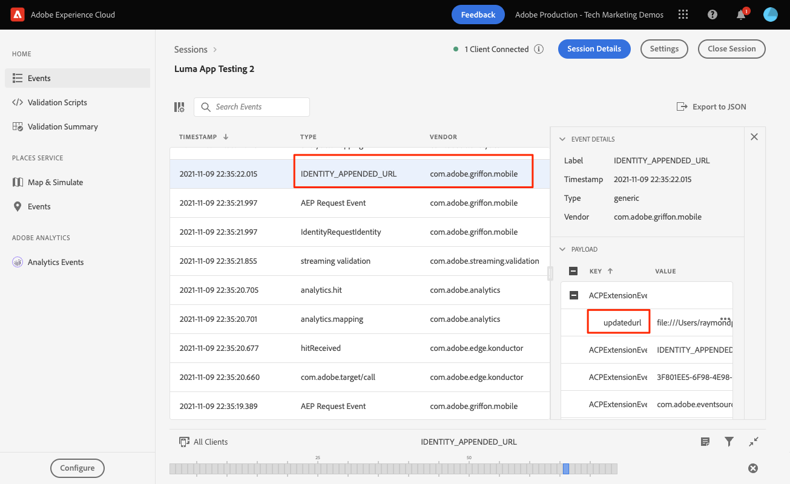

# Handle WebViews

Learn how to handle data collection with WebViews in a mobile app.

## Prerequisites

* Successfully built and run app with SDKs installed and configured.

## Learning objectives

In this lesson, you will:

* Understand why you must take special considerations for WebViews.
* Understand the code required to prevent tracking issues.

## Potential tracking issues

If you send data from the native portion of the app and a WebView, each generates their own Experience Cloud ID (ECID). This results in disconnected hits and inflated visit/visitor data. More information about the ECID can be found in the [ECID overview](https://experienceleague.adobe.com/docs/experience-platform/identity/ecid.html?lang=en).

To solve for that undesirable situation, it's important to pass the user's ECID from the native portion to the WebView.

The Experience Cloud ID Service JavaScript extension in the WebView extracts the ECID from the URL instead of sending a request to Adobe for a new ID. The ID service uses this ECID to track the visitor.

## Implementation

In the Luma sample app, find the `TermsOfService.swift` file (in the `Intro-Login_SignUp` folder), and locate the following code:

```swift
// Show tou.html
let url = Bundle.main.url(forResource: "tou", withExtension: "html")
let myRequest = URLRequest(url: url!)
self.webView.load(myRequest)
```

This is a simple way to load a WebView. In this case, it's a local file but the same concepts apply to remote pages.

Refactor the webview code as shown below:

```swift
let url = Bundle.main.url(forResource: "tou", withExtension: "html")
if var urlString = url?.absoluteString {
    // Adobe Experience Platform - Handle Web View
    AEPEdgeIdentity.Identity.getUrlVariables {(urlVariables, error) in
        if let error = error {
            self.simpleAlert("\(error.localizedDescription)")
            return;
        }

        if let urlVariables: String = urlVariables {
            urlString.append("?" + urlVariables)
        }

        DispatchQueue.main.async {
            self.webView.load(URLRequest(url: URL(string: urlString)!))
        }
        print("Successfully retrieved urlVariables for WebView, final URL: \(urlString)")
    }
} else {
    self.simpleAlert("Failed to create URL for webView")
}
```

You can learn more about the `Identity.getUrlVariables` API in the [Identity for Edge Network extension API reference guide](https://developer.adobe.com/client-sdks/documentation/identity-for-edge-network/api-reference/#geturlvariables).

## Validation

After reviewing the [setup instructions](assurance.md) section and connecting your simulator or device to Assurance, load the WebView and look for the `Edge Identity Response URL Variables` event from the `com.adobe.griffon.mobile` vendor. 

To load the WebView, go to the home screen of the Luma app, select the "account" icon, followed by the "Terms of Use" in the footer.

After loading the WebView, select the event and review the `urlvariables` field in the `ACPExtensionEventData` object, confirming the following parameters are present in the URL: `adobe_mc`, `mcmid`, and `mcorgid`.



A sample `urvariables` field can be seen below:

```html
// Original (with escaped characters)
adobe_mc=TS%3D1636526122%7CMCMID%3D79076670946787530005526183384271520749%7CMCORGID%3D7ABB3E6A5A7491460A495D61%40AdobeOrg

// Beautified
adobe_mc=TS=1636526122|MCMID=79076670946787530005526183384271520749|MCORGID=7ABB3E6A5A7491460A495D61@AdobeOrg
```

>[!NOTE]
>
>Visitor stitching via these URL parameters is currently supported in the Platform Web SDK (versions 2.11.0 or later) and `VisitorAPI.js`.


Next: **[Identity](identity.md)**

>[!NOTE]
>
>Thank you for investing your time in learning about Adobe Experience Platform Mobile SDK. If you have questions, want to share general feedback, or have suggestions on future content, please share them on this [Experience League Community discussion post](https://experienceleaguecommunities.adobe.com/t5/adobe-experience-platform-launch/tutorial-discussion-implement-adobe-experience-cloud-in-mobile/td-p/443796)