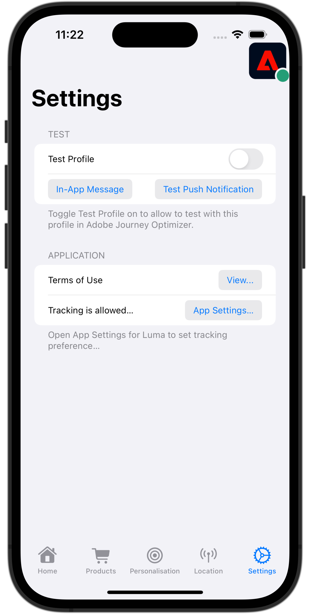
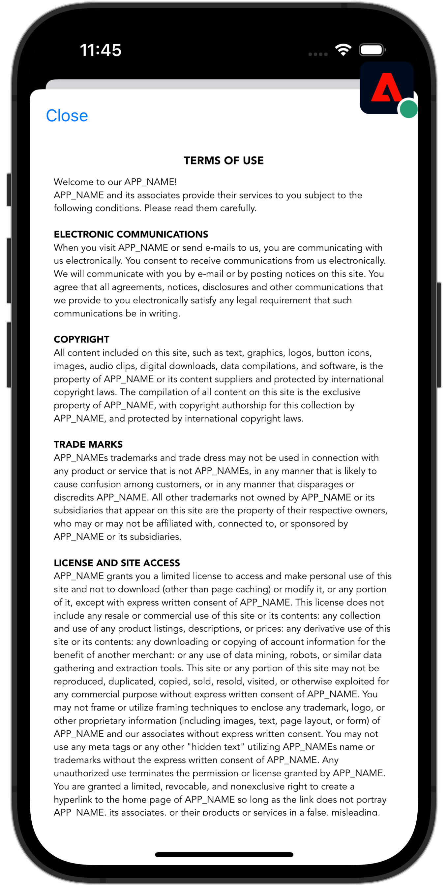
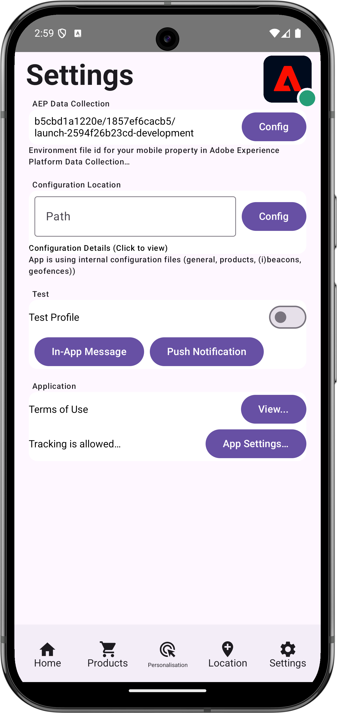
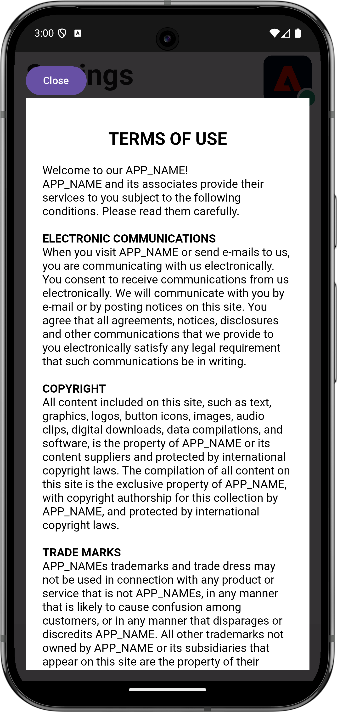
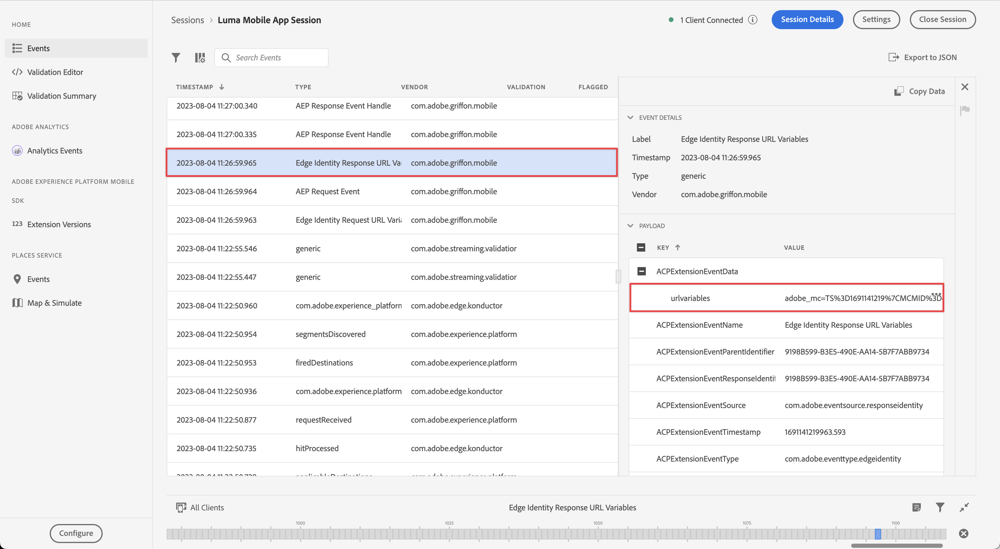

# Handle WebViews

Learn how to handle data collection with WebViews in a mobile app.

## Prerequisites

* Successfully built and run app with SDKs installed and configured.

## Learning objectives

In this lesson, you will:

* Understand why you must take special consideration for WebViews in your app.
* Understand the code required to prevent tracking issues.

## Potential tracking issues

Separate (Experience Cloud Identity) ECIDs are generated when you send data from the native portion of your app and from a WebView within the app. These separate ECIDs result in disconnected hits and inflated visit and visitor data. More information about the ECID can be found in the [ECID overview](https://experienceleague.adobe.com/en/docs/experience-platform/identity/features/ecid).

To solve the disconnected hits and inflated data, you need to pass the user's ECID from the native portion of your app to a WebView that you might want to use in your app.

The AEP Edge Identity extension used within the WebView collects the current ECID and adds it to the URL instead of sending a request to Adobe for a new ID. The implementation then uses this ECID to request the URL.

## Implementation

To implement the web view:

>[!BEGINTABS]

>[!TAB iOS]

Navigate to **[!DNL Luma]** > **[!DNL Luma]** > **[!DNL Views]** > **[!DNL Info]** > **[!DNL TermsOfServiceSheet]**, and locate the `func loadUrl()` function in the `final class SwiftUIWebViewModel: ObservableObject` class. Add the following call to handle the web view:

```swift
// Handle web view
AEPEdgeIdentity.Identity.getUrlVariables {(urlVariables, error) in
    if let error = error {
        print("Error with Webview", error)
        return;
    }
    
    if let urlVariables: String = urlVariables {
        urlString.append("?" + urlVariables)
        guard let url = URL(string: urlString) else {
            return
        }
        DispatchQueue.main.async {
            self.webView.load(URLRequest(url: url))
        }
    }
    Logger.aepMobileSDK.info("Successfully retrieved urlVariables for WebView, final URL: \(urlString)")
}
```

The [`AEPEdgeIdentity.Identity.getUrlVariables`](https://developer.adobe.com/client-sdks/documentation/identity-for-edge-network/api-reference/#geturlvariables) API sets up the variables for the URL to contain all relevant information, like ECID, and more. In the example, you are using a local file but the same concepts apply to remote pages.

You can learn more about the `Identity.getUrlVariables` API in the [Identity for Edge Network extension API reference guide](https://developer.adobe.com/client-sdks/documentation/identity-for-edge-network/api-reference/#geturlvariables).


>[!TAB Android]

Navigate to **[!UICONTROL Android]**  > **[!DNL app]** > **[!DNL kotlin+java]** > **[!DNL com.adobe.luma.tutorial.android]** > **[!DNL views]** > **[!DNL WebViewModel]**, and locate the `fun loadUrl()` function in the `class WebViewModel: ViewModel()`. Add the following call to handle the web view:

```kotlin
// Handle web view
Identity.getUrlVariables {
    urlVariables = it
    val baseUrl = getHtmlFileUrl("tou.html")

    val finalUrl = if (urlVariables.isNotEmpty()) {
        "$baseUrl?$urlVariables"
    } else {
        baseUrl
    }

    Handler(Looper.getMainLooper()).post {
        webView.loadUrl(finalUrl)
    }
    MobileSDK.shared.logInfo("TermsOfServiceSheet - loadUrl: Successfully loaded WebView with URL: $finalUrl")
}
```

The [`Identity.getUrlVariables`](https://developer.adobe.com/client-sdks/documentation/identity-for-edge-network/api-reference/#geturlvariables) API sets up the variables for the URL to contain all relevant information, like ECID, and more. In the example, you are using a local file but the same concepts apply to remote pages.

You can learn more about the `Identity.getUrlVariables` API in the [Identity for Edge Network extension API reference guide](https://developer.adobe.com/client-sdks/documentation/identity-for-edge-network/api-reference/#geturlvariables).

>[!ENDTABS]

## Validate in the app

To execute the code:

1. Review the [setup instructions](assurance.md#connecting-to-a-session) section to connect your simulator or device to Assurance.
1. Go to the **[!UICONTROL Settings]** in the app
1. Tap the **[!DNL View...]** button to show the **[!DNL Terms of Use]**.

>[!BEGINTABS]

>[!TAB iOS]

  

>[!TAB Android]

 

>[!ENDTABS]


## Validate with Assurance

1. In the Assurance UI, look for the **[!UICONTROL Edge Identity Response URL Variables]** event from the **[!UICONTROL com.adobe.griffon.mobile]** vendor. 
1. Select the event and review the **[!UICONTROL urlvariable]** field in the **[!UICONTROL ACPExtensionEventData]** object, confirming the following parameters are present in the URL: `adobe_mc`, `mcmid`, and `mcorgid`.

    {zoomable="yes"}

    A sample `urvariables` field can be seen below:

    * Original (with escaped characters)

      ```html
      adobe_mc=TS%3D1636526122%7CMCMID%3D79076670946787530005526183384271520749%7CMCORGID%3D7ABB3E6A5A7491460A495D61%40AdobeOrg
      ```

    * Beautified

      ```html
      adobe_mc=TS=1636526122|MCMID=79076670946787530005526183384271520749|MCORGID=7ABB3E6A5A7491460A495D61@AdobeOrg
      ```

Unfortunately, debugging the web session is limited. For example, you can't use the Adobe Experience Platform Debugger in your browser to continue debugging the webview session.

>[!NOTE]
>
>Visitor stitching via these URL parameters is supported in the Platform Web SDK (versions 2.11.0 or later) and when using `VisitorAPI.js`.


>[!SUCCESS]
>
>You have now set up your app to show content based on a URL in a webview using the same ECID as the ECID already issued by the Adobe Experience Platform Mobile SDK.
>
>Thank you for investing your time in learning about Adobe Experience Platform Mobile SDK. If you have questions, want to share general feedback, or have suggestions on future content, share them on this [Experience League Community discussion post](https://experienceleaguecommunities.adobe.com/t5/adobe-experience-platform-data/tutorial-discussion-implement-adobe-experience-cloud-in-mobile/td-p/443796)

Next: **[Identity](identity.md)**
