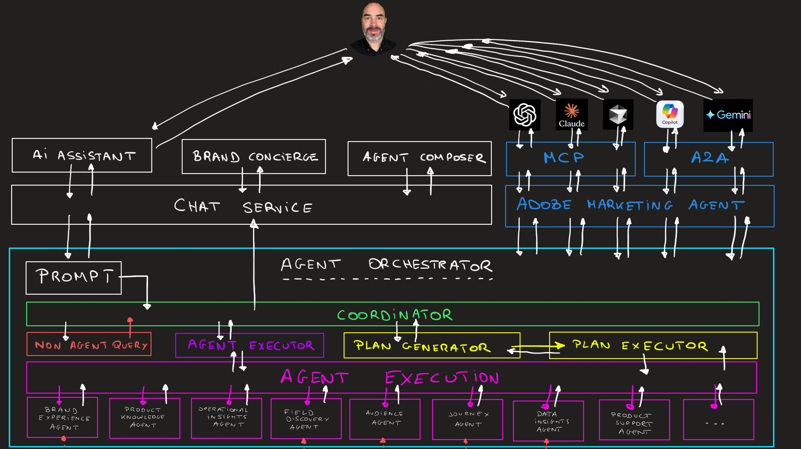

# Overview - Agentic AI Tech Labs

{width="50px" align="left"}

## Agentic AI Architecture

In this video, you'll learn about the architecture behind the Agentic AI part of the One Adobe tutorial.

>[!VIDEO](https://video.tv.adobe.com/v/3481416?quality=12&learn=on)

Download the architecture overview image below:

### Getting Started

[Getting started](./modules/getting-started/gettingstarted/getting-started.md){target="_blank"}

In this foundational module, you will prepare everything so that you can access and use the demo environment.

### Agentic AI Tech Labs

[1.1 Agent Orchestrator](./modules/agents/module1.1/agentorchestrator.md)

**Goal** 

Learn how to use Adobe Experience Platform Agents and Agent Orchestrator to: 

- Analyze purchase trends
- Identify high-propensity audiences
- Validate journey performance
- Create a new journey for the CitiSignal Fiber Max rollout

[1.4 Brand Concierge](./modules/agents/module1.4/brandconcierge.md)

**Goal**

Brand Concierge is an AI-powered digital companion that transforms the way brands engage with their website visitors. Unlike generic chatbots, Brand Concierge delivers personalized, conversational experiences tailored to each visitor’s intent. It helps visitors discover products, compare options, get instant answers, and receive guided recommendations in real time. The platform serves both B2C and B2B and it acts as an intelligent extension of your brand on any digital channel, while preserving your brand voice, content integrity, and compliance.

In this exercise you'll learn how to:

- Configure your Brand Concierge instance in your Adobe Experience Platform sandbox
- Implement your Brand Concierge on your AEM CS/EDS website 

[1.5 Analytics & Agents](./modules/agents/module1.5/analyticsagents.md)

**Goal**

As a Data Analyst, AI Developer or AI Application Architect, you'll learn how to automate reporting tasks like report creation, scheduling analysis using external agents. You'll learn how to pull fresh campaign data, audience data or performance data into your agentic workflows.

In this exercise you'll learn how to:

- Connect ChatGPT and/or Claude.ai to **Customer Journey Analytics** and perform data analysis tasks
- Connect ChatGPT and/or Claude.ai to **Adobe Analytics** and perform data analysis tasks

[1.6 AEM & Agents](./modules/agents/module1.6/aemagents.md){target="_blank"}

**Goal**

Adobe Experience Manager now includes several purpose-built agents, each designed to take on work that has historically required tons of manual effort. These are not generic AI assistants, they are domain-trained agents that understand AEM deeply and operate across content, code, assets, governance, and optimization.

- **Experience Production Agent**, which accelerates updates, content changes, and even full site migrations. 
- **Governance Agent**, enforces brand, rights, and compliance rules automatically. 
- **Discovery Agent**, prepares content for AI-native discovery and acts as an intelligent strategist. 
- **Content Optimization Agent**, instantly creates performance-ready, channel-specific asset variations. 
- **Development Agent**, accelerates developers with AI-assisted troubleshooting and performance tuning.

In this exercise you'll learn how to use these agents using both AI Assistant and Cursor through custom MCP server setup.

[1.7 Intelligent Developer Tools for Adobe Commerce](./modules/agents/module1.7/aiassisteddev.md)

**Goal**

In this module you'll use intelligent developer tools such as Cursor to develop an extension to your Adobe Commerce as a Cloud Service environment. The goal of that extension is to forward incoming order events to a 3rd party endpoint. Event forwarding in Adobe Commerce as a Cloud Service relies on Adobe I/O App Builder, Adobe I/O Events and Adobe I/O Runtime. The configuration of all these services will be assisted by Cursor.

{width="50px" align="left"}

>[!NOTE]
>
>If you have questions, want to share general feedback of have suggestions on future content, please contact Tech Insiders directly, by sending an email to **techinsiders@adobe.com**.
