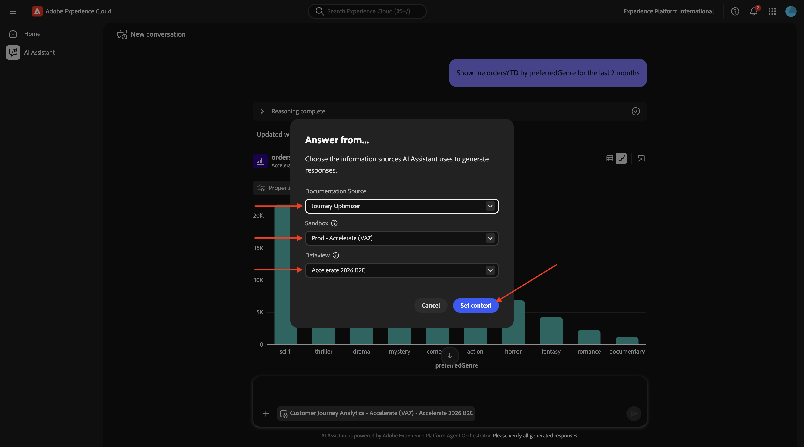

# 1.1.1 Getting started with Agent Orchestrator

## 1.1.1.1 Set Context in Agent Orchestrator 

Go to [https://experience.adobe.com/#/@experienceplatform/ai-assistant/chat](https://experience.adobe.com/#/@experienceplatform/ai-assistant/chat).

You should then see this. Make sure you're in the org **Experience Platform International**.


Click the **context** window.


Set the context to:

- **Documentation Source**: **Customer Journey Analytics**
- **Sandbox**: **Accelerate**
- **Dataview**: **Accelerate 2026 B2C**

Click **Set context**.


>[!NOTE]
>
>In this lab, you'll be switching context when moving between analysis and orchestration.

## 1.1.1.2 Start with overall purchase trends to anchor context and zoom into fiber 

**Intent**: Get a toplevel pulse on category demand—Mobile, Landline, Internet, TV, Fiber—specifically for the most recent 60 days. This sets baselines for seasonality, promo effects, and regional variance after the NY rollout. 

**Thinking**: 

“Is Fiber gaining share postNY? Are we seeing cannibalization of Copper/DSL Internet? What’s the mix shift vs TV bundles?” 

“This will help me size the addressable audience for Vienna and set realistic targets.” 

**Actionable readouts the marketer expects**: 

A stacked bar/line chart of Purchases by mainCategory (daily/weekly grain). 

Percent share of purchases by category vs prior period. 

Notable spikes correlating with promotional dates. 

Enter the following **Prompt** and click the **generate** button.

```javascript
Show me purchases by mainCategory over the last 2 months.
```


You should then see this:

>[!NOTE]
>
>Keep an eye on lagging attribution—Fiber orders may be captured under “Internet” in some legacy schemas. If so, reconcile taxonomy before decisions. 


Enter the following **Prompt** and click the **generate** button.

`Show me purchases by mainCategory = Fiber over the last 2 months per week`


You should then see this, which drills down into Fiber-specific trends. 

**Action**: Note the growth curve and regional spikes. 


## 1.1.1.3 Correlate Orders with Content Preferences 

**Intent**: Test the hypothesis that content preference (e.g., SciFi, Sports, Drama) predicts broadband upgrade behavior—especially for highbandwidth needs. 

**Thinking**

“SciFi fans often watch 4K and stream from multiple devices; likely to value low latency.” 

“Let’s quantify if SciFi (and maybe Sports) correlate with recent orders.” 

**Expected outputs**

A pivot of Orders (YTD filter applied) broken out by preferred genre, limited to last 2 months. 

Rank genres by order conversion rate and AOV (average order value). 

Decision: If SciFi shows a strong signal, this becomes a primary creative pillar for Vienna’s Fiber Max launch (e.g., “never buffer again” messaging, premium bundles). 

**Intention**

Analyze conversion by genre (e.g., Sci-Fi, Sports). 

**Goal** Validate if Sci-Fi fans over-index for Fiber upgrades. 

Enter the following **Prompt** and click the **generate** button.

```javascript
Show me ordersYTD by preferredGenre for the last 2 months
```


You should then see this:


## 1.1.1.4 Identify Existing Fiber Journeys 

Click the **context** window.


Set the context to:

- **Documentation Source**: **Adobe Journey Optimizer**
- **Sandbox**: **Accelerate**
- **Dataview**: **Accelerate 2026 B2C**



**Intent** Discover which active or recently concluded journeys include “Fiber” in the title—e.g., “Fiber Upgrade NYC – Sept”, “Fiber Trial – Streaming Bundle”. 

**Thinking**

“Which of these journeys performed well, and what were their triggers?” 

“Can I reuse the winning orchestration logic for Vienna?” 

**Expected outputs**

List of journeys with status (active, paused, ended), date ranges, target segments, KPIs (open rate, CTR, conversion). 

Next move: Shortlist one or two successful fiber journeys for cloning/adaptation. 

Enter the following **Prompt** and click the **generate** button.

```javascript
What journeys exist? 
```


You should then see this:


List active or past journeys with Fiber messaging. 

Action: Shortlist high-performing journeys for cloning.

Enter the following **Prompt** and click the **generate** button.

```javascript
Which of these journeys has 'Fiber' in its name?
```


You should then see this:


## 1.1.1.5 Check the seed

**Intent**:

Understand the seed definition of the “CitiSignal - Fiber Max Launch Promotion” journey—what traits drove targeting (e.g., “SciFi Genre Preference,” “4+ devices,” “stream ≥ 300GB/month”). 

**Thinking**

“I want to combine proven SciFi creative with Fiber Max performance messaging.” 

“If the audience overlaps with heavy downloaders, we can stack the propensity.” 

**Expected outputs** 

Audience criteria (inclusion/exclusion), audience size, region filters, recency, frequency thresholds. 

>[!NOTE]
>
>Change context to CJA 

From this point, the marketer switches into analytics mode to ensure proper reporting. 

Enter the following **Prompt** and click the **generate** button.

```javascript
What was the initial audience in the journey named 'CitiSignal - Fiber Max Launch Promotion'?
```


Review audience criteria (streaming habits, device count). 

**Goal**: Understand traits for high-bandwidth needs. 

## 1.1.1.6 Validate journey performance via fallout analysis 

Enter the following **Prompt** and click the **generate** button.

```javascript
Create a fall-out report on the "CitiSignal - Fiber Max Launch Promotion" journey
``` 

>[!NOTE]
>
>Change context to CJA) 

**Intent**:

Build a stepwise funnel in Customer Journey Analytics

Delivered → Opened → Clicked → Landed → Product View → Add to Cart → Checkout → Order Complete 

Include Fiber-related SKU views as a branch. 

**Thinking**: 

“Where are we losing people—email open, landing page load, PDPs, checkout friction?” 

“Do SciFi users bounce more or less than average on Fiber PDP?” 

**Expected outputs**: 

A fallout visualization with dropoff rates at each step. 

Segment overlays (SciFi vs Sports vs Other). 

Device/browser breakdown for technical friction. 

**Decisions**: 

If checkout dropoff is high, coordinate with product/UX to fix payment flow. 

If PDP exit is high, rework claim clarity (speeds, installation times, bundle value). 

>[!NOTE]
>
>Change context to JO 

Now the marketer moves into Adobe Journey Optimizer for orchestration and audience ops. 

Enter the following **Prompt** and click the **generate** button.

```javascript
Create a fall-out report on the "CitiSignal - Fiber Max Launch Promotion" journey 
```

Build funnel visualization: Delivered → Opened → Clicked → Checkout → Order. 

**Action**: Identify drop-off points and optimize messaging or UX. 

## 1.1.1.7 Find existing audiences aligned to high usage 

Enter the following **Prompt** and click the **generate** button.

```javascript
Is there an audience that has "heavy downloaders" in the title?
```

>[!NOTE]
>
>Change context to Adobe Journey Optimizer

**Intent**: 

Locate any JO audience named with “heavy downloaders”—likely defined by monthly data usage thresholds, streaming hours, or device concurrency. 

**Thinking**: 

“If an audience like Heavy Downloaders exists, it’s perfect for Fiber Max positioning: speed, reliability, unlimited tiers.” 

**Expected outputs**: 

Audience metadata: definition criteria, size, last refresh, governance tags, region availability. 

Locate audiences with high data usage. 

**Goal**: Combine with Sci-Fi preference for Fiber Max targeting. 

## 1.1.1.8 Determine whether those audiences are already in use 

**Intent**: 

Check audience-to-journey linkage—ensure we don’t doublemessage or collide with current programs. 

**Thinking**: 

“If Heavy Downloaders is already in a retention journey, we need suppression logic or frequency capping to avoid fatigue.” 

**Expected outputs**: 

Mappings: audience → journey name, status, contact policy, last send, performance. 

**Decision**: 

If in use, create exclusions or shared suppression for Vienna launch. 

If not in use, greenlight for new journey. 

Enter the following **Prompt** and click the **generate** button.

```javascript
Which of the above are used in a journey? 
```

Ensure no overlap with active campaigns. 

**Action**: Apply suppression if needed. 

## 1.1.1.9 Create New Journey for Fiber Max Launch 

**Intent**: 

Build a new journey targeting the compound audience: 

Heavy Downloaders ∩ SciFi Preference (kbaa_5207bf audience key). 

**Thinking**: 

“This is the sweet spot for Fiber Max: high propensity + creative relevance.” 

“We’ll orchestrate a multitouch experience tied to Vienna availability.” 

**Journey design (JO)**: 

Entry Criteria: 

Audience: Heavy Downloaders - Sci-Fi Preference_kbaa_5207bf 

Geography: Vienna metro (ZIP/postcode list or geo polygon) 

Eligibility: Not in active “Fiber Upgrade NYC – Sept” campaign; not a current Fiber subscriber. 

Trigger & Timing: 

T14 days before Vienna launch (Jan 2026): Preview email—“Fiber Max is coming.” 

Launch week: Primary email + inapp banner + paid media sync (via CDP destination). 

T+3 days: Behavior split—if no click, SMS nudge; if clicked but didn’t order, retarget with an installer availability CTA. 

T+10 days: Offer test—free install vs 1st month discount (A/B). 

Personalization: 

Dynamic copy for SciFi lovers (latency/4K streaming hooks). 

Speed/latency claims tailored to device mix (gaming consoles, streaming boxes). 

Bundle recommendation: Fiber Max + premium TV scifi content pack. 

Governance: 

Frequency cap: max 3 touches per 10 days. 

Suppress if current Fiber subscriber or if ticket exists for install. 

Respect optout preferences. 

Measurement Plan (CJA): 

Track: Delivery, open, click, PDP view, checkout start, order completion. 

KPIs: Conversion rate to Fiber Max, uplift vs control, timetoinstall. 

Diagnostics: Fallout report by device/genre segment. 

Shape 

How this all fits together (the marketer’s mental model) 

Diagnose demand (overall categories → Fiber specifically). 

Prove content toconversion signal (orders by genre). 

Mine successful journeys (find Fibernamed journeys and the SciFi promo audience). 

Validate friction points (CJA fallout on SciFi journey). 

Activate against highpropensity segments (Heavy Downloaders ∩ SciFi). 

Enter the following **Prompt** and click the **generate** button.

```javascript
Create a  journey towards the audience Heavy Downloaders - Sci-Fi Preference_kbaa_5207bf. The journey is for the rollout of fiber broadband. There will 2 versions of an email  based on  a split of the audience based on who is in the "Eligble for Fiber upgrade" audience.  After 3 days, profiles from both email treatments who have not purchased fibre max will be sent a follow up email. 
```

Go Back to [Agent Orchestrator](./agentorchestrator.md){target="_blank"}

[Go Back to All Modules](./../../../overview.md){target="_blank"}