# 1.1.2 Adobe Marketing Agent for ChatGPT Enterprise

## Video

In this video, you'll get an explanation and demonstration of all the steps involved in this exercise.

>[!VIDEO](https://video.tv.adobe.com/v/3478410?quality=12&learn=on)

## 1.1.2.1 Create custom app in ChatGPT Enterprise for Adobe Marketing Agent 

>[!NOTE]
>
>Using Adobe Marketing Agent in ChatGPT requires the following:
>- a paid version of OpenAI's ChatGPT Enterprise
>- using the ChatGPT Enterprise web client

Go to [https://chatgpt.com/](https://chatgpt.com/){target="_blank"} and log in using your account details. Once you're logged in, you should see this. Go to **Apps**.

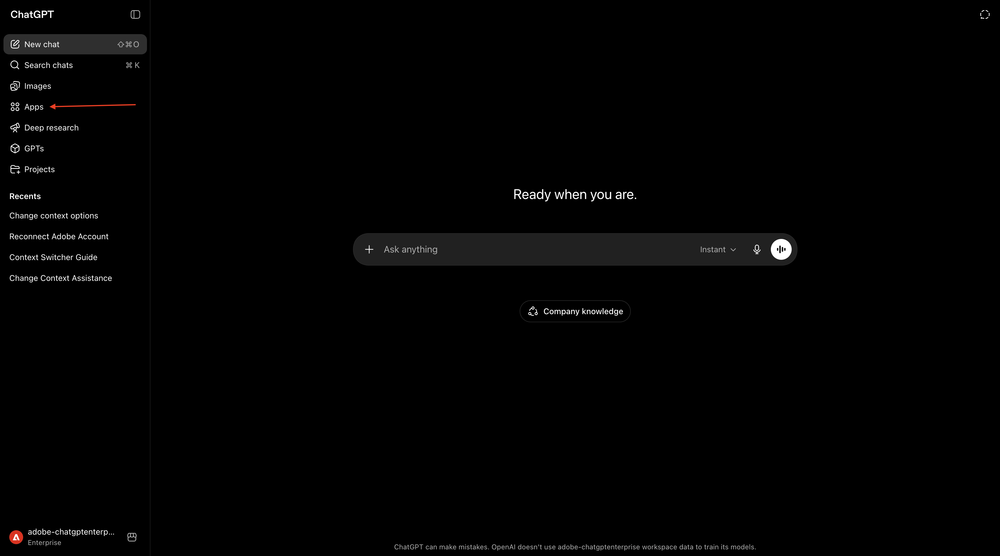

Search for **Adobe Marketing Agent** and then click **Adobe Marketing Agent**.

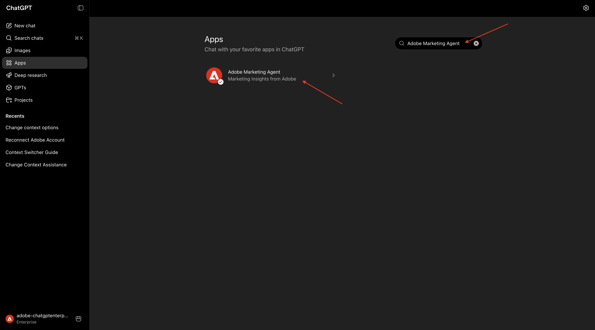

Click **Connect**.

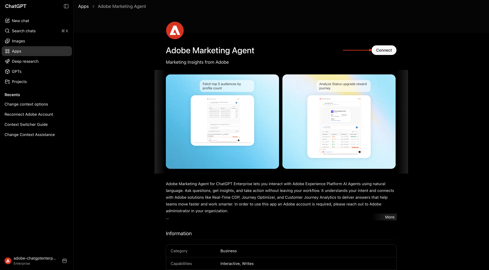

Click **Sign in with Adobe Marketing Agent**.

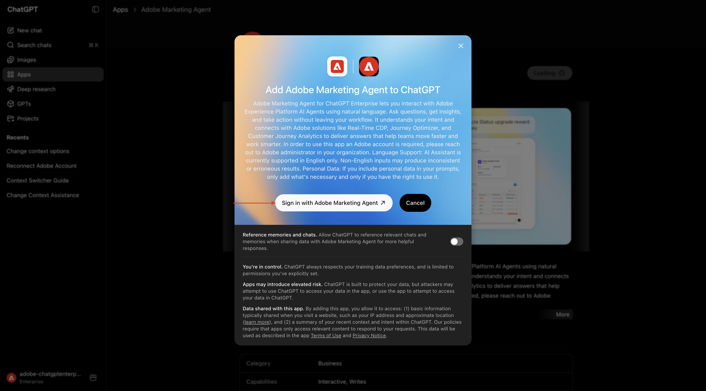

ChatGPT will now attempt to connect to your Adobe account. Select **Allow Access** and then you'll have to log in with your Adobe account.

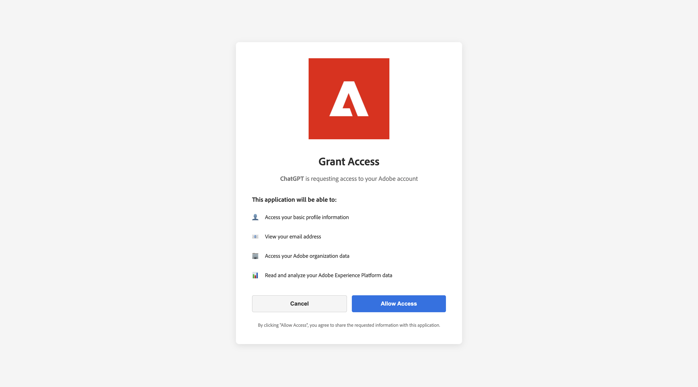

Once you've logged in successfully, you should see that your Adobe Marketing Agent is now connected successfully. Click **Start chat**.

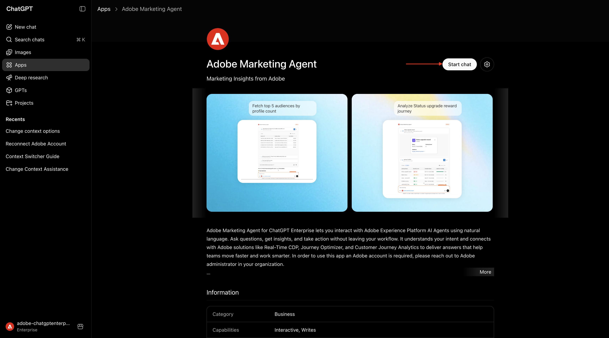

## 1.1.2.2 Set context in Adobe Marketing Agentd

Before interacting further with Adobe Marketing Agent through ChatGPT, the context needs to be set.

For this exercise, the context needs to be set to use:

- **IMS Org**: `--aepImsOrgName--`.

- **Sandbox**: **Prod - One Adobe**

The Sandbox setting helps to identify which sandbox ChatGPT should look at when asking questions.

- **Dataview**: **AdobeOne - Unified Customer Data View**

The Dataview setting helps to identify which dataview ChatGPT should look at when asking questions.

Enter the following **Prompt** and click the **send** button.

```
change context
```

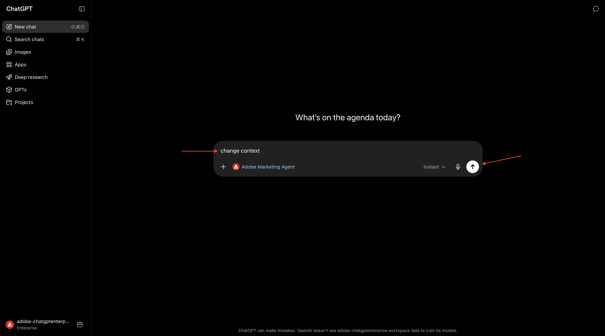

You should then see a similar window, showing the current organization, sandbox and dataview selection. Change these fields to the correct organization, sandbox and dataview based on the above information.

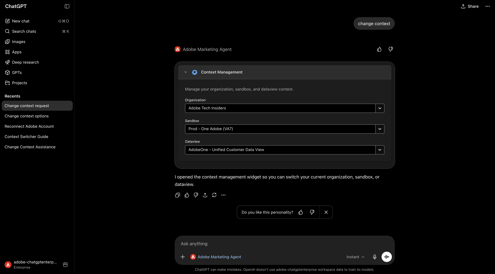

Your context is now properly set, so you can start sending specific prompts next.

## 1.1.2.3 Start with overall purchase trends to anchor context and zoom into fiber 

**Intent**

Get a toplevel pulse on category demand—Mobile, Landline, Internet, TV, Fiber—specifically for the most recent 60 days. This sets baselines for seasonality, promo effects, and regional variance after the New York rollout. 

Enter the following **Prompt** and click the **send** button.

```
Show me purchases by mainCategory over the last 2 months.
```


You should then see this:


Enter the following **Prompt** and click the **send** button.

```
Show me purchases by mainCategory = Fiber over the last 2 months per week
```


You should then see this, which drills down into Fiber-specific trends. 


## 1.1.2.4 Correlate Orders with Content Preferences 

**Intent**

Test the hypothesis that a preference for a specific genre (e.g., SciFi, Sports, Drama) predicts broadband upgrade behavior—especially for high bandwidth needs. 

First, you need to find out which field is used to store the genre preference.

Enter the following **Prompt** and click the **send** button.

```
Which field is used to store the preferred genre?
```

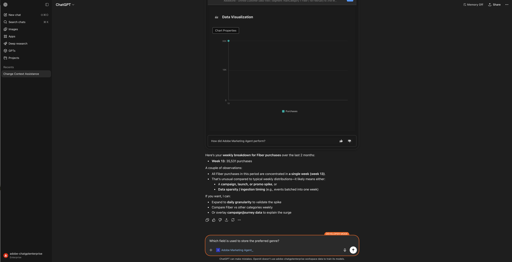

You should then see this, which shows that the field used for genre is **`--aepTenantId--.individualCharacteristics.telco.mediaPreferences.favouriteGenre`**.

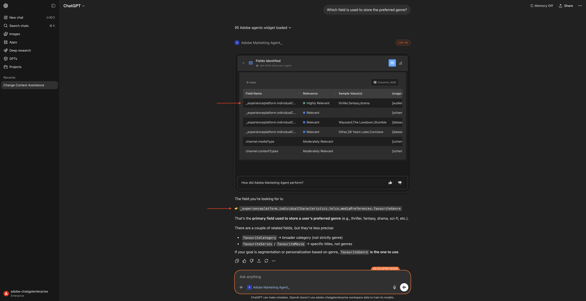

With that information, you can start drilling down in the purchase data.

Enter the following **Prompt** and click the **send** button.

```
Show me purchases by favouriteGenre for the last 2 months
```


You should then see this.

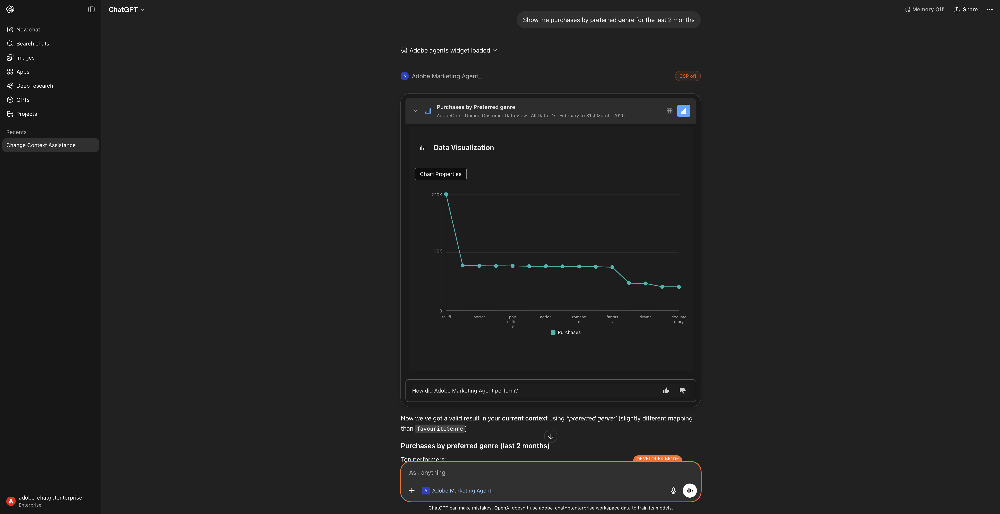

## 1.1.2.5 Identify Existing Fiber Journeys

**Intent** 

Discover which active or recently concluded journeys include “Fiber” in the title—e.g., “Fiber Upgrade NYC – Sept”, “Fiber Trial – Streaming Bundle”. 

Enter the following **Prompt** and click the **send** button.

```
What journeys exist? 
```


You should then see this.


Enter the following **Prompt** and click the **send** button.

```
Which of these journeys has 'Fiber' in its name?
```

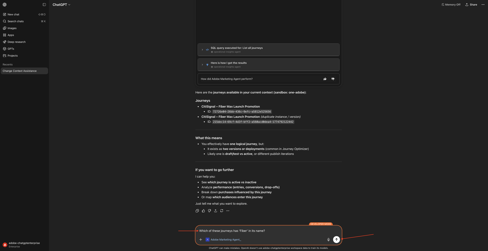

You should then see this.


Enter the following **Prompt** and click the **send** button.

```
show me the details of the journey 'CitiSignal - Fiber Max Launch Promotion'
```


You should then see this.


## 1.1.2.6 Validate journey performance via fallout analysis 

**Intent**

You want to understand journey performance fallout to know if there are any nodes or conditions within the journey that are experiencing a large percentage of profiles being dropped. This is helpful in understanding if additional adjustments are needed in the journey.

Enter the following **Prompt** and click the **send** button.

```
Create a fall-out report on the "CitiSignal - Fiber Max Launch Promotion" journey
```

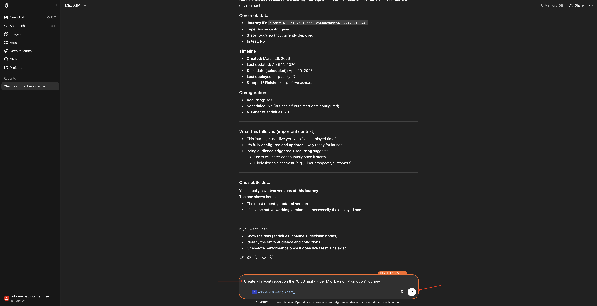

You should then see this.


Scroll down a little bit. You can now review the table by inspecting each node and its respective enter numbers, fallout numbers, and fallout rate. 


Scroll down a little bit more to see observations and recommendations. 

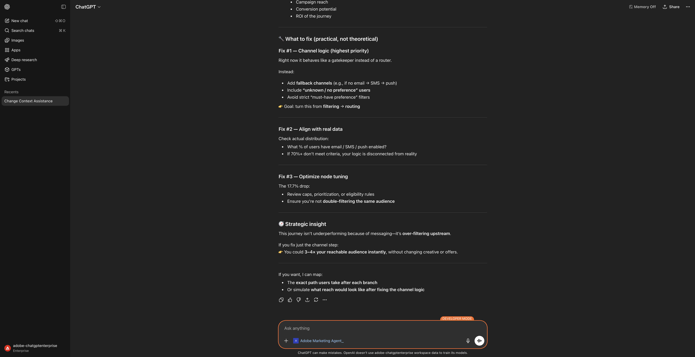

You've now completed this lab.

## Next Steps

Go to [Adobe Marketing Agent for Microsoft 365 Copilot](./ex3.md){target="_blank"}

Go back to [Agent Orchestrator](./agentorchestrator.md){target="_blank"}

[Go Back to All Modules](./../../../overview.md){target="_blank"}
