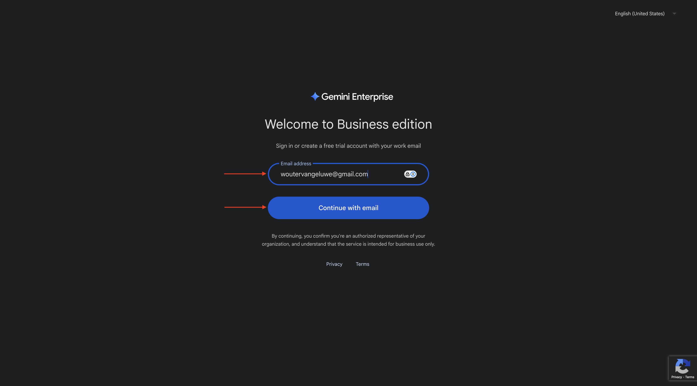
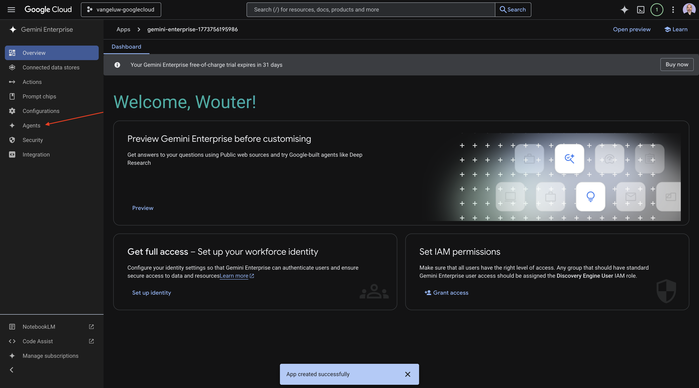
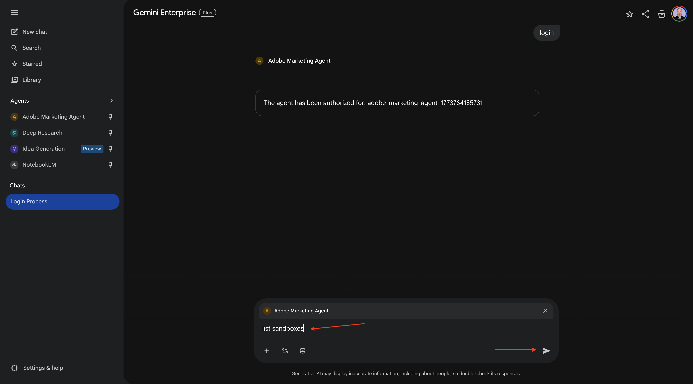
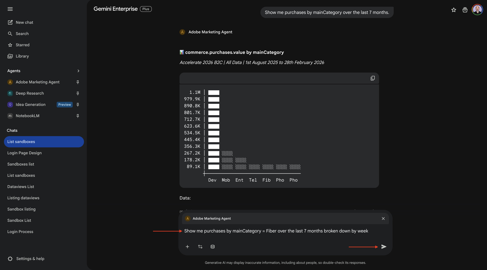
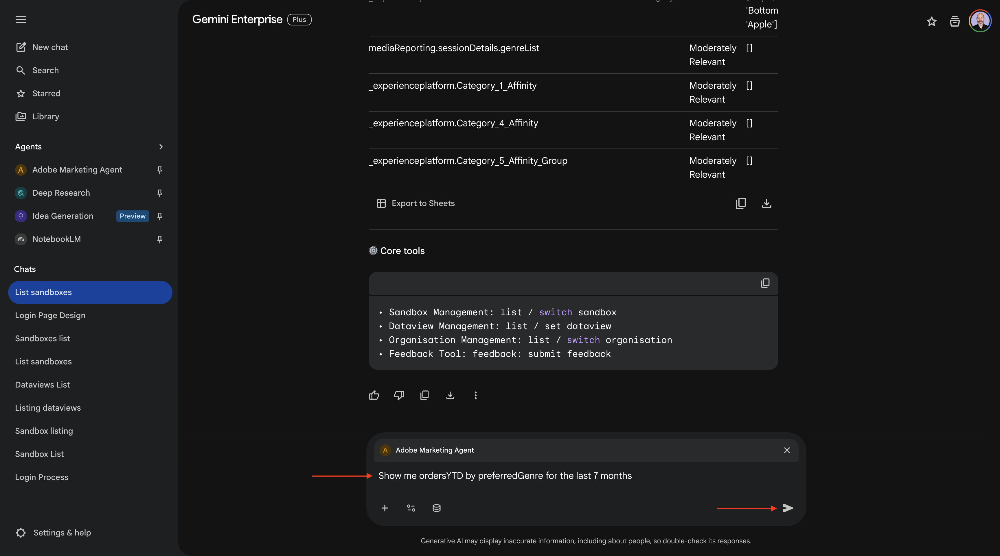

# 1.1.4 Adobe Marketing Agent for Google Gemini Enterprise

[!BADGE Beta]

+++Beta Details
By using the Adobe Marketing Agent with Google Gemini Enterprise Beta, You hereby acknowledge that the Beta is provided “as is” without warranty of any kind. Adobe shall have no obligation to maintain, correct, update, change, modify or otherwise support the Beta. You are advised to use caution and not to rely in any way on the correct functioning or performance of such Beta and/or accompanying materials. The Beta is considered Confidential Information of Adobe.  Any “Feedback” (information regarding the Beta including but not limited to problems or defects you encounter while using the Beta, suggestions, improvements, and recommendations) provided by You to Adobe is hereby assigned to Adobe including all rights, title, and interest in and to such Feedback.

+++

## Prerequisites

In order to follow the steps in this lab as documented below, the following access is required:

- Access to Real-Time CDP, Journey Optimizer and Customer Journey Analytics
- Access to AI Assistant in Adobe Experience Cloud
- Access to AEP Agent Orchestrator
- Access to Google Gemini Enterprise

## Video

In this video, you'll get an explanation and demonstration of all the steps involved in this exercise.

>[!VIDEO](https://video.tv.adobe.com/v/3481322?quality=12&learn=on)

## 1.1.4.1 Access to Google Gemini Enterprise

Go to [https://cloud.google.com/gemini-enterprise](https://cloud.google.com/gemini-enterprise). Click **Start 30-day free trial**.


Enter your Google account's email address and click **Continue with email**.



Provide your first and last name and then click **Agree & get started**.


Click **I'll do this later**.


You should then see this.


Go to [https://cloud.google.com/gemini-enterprise](https://cloud.google.com/gemini-enterprise).

You should then see something like this. You may also have to first create your billing account, to then select it here afterwards.


Click **Start 30-day cost-free trial**.


Click **Continue and activate the API**.


Click **Create**.


You should then see this.


## 1.1.4.2 Create your custom agent using A2A

Go to [https://console.cloud.google.com/gemini-enterprise](https://console.cloud.google.com/gemini-enterprise). Click **Agents**.



Click **+Add agent**.


Select **Custom agent via A2A**.


Paste the **Agent Card JSON**.

>[!NOTE]
>
>Check with your Adobe representative to get the **Agent Card JSON** information.


After pasting the **Agent Card JSON**, click **Preview agent details**.


You should then see something like this. Scroll down and click **Next**.


You should then see something like this. 


Fill out the fields for your instance.

- **Client ID**:

```
--aepImsOrgId--
```

- **Client Secret**:

```
AdobeMarketingAgent
```

- **Authorization URL**:

```
https://XXX.adobe.io/authorize
```

- **Token URL**:

```
https://XXX.adobe.io/token
```

- **Scopes**:

```
openid email profile
```

Click **Finish**.


You should then see this.


## 1.1.4.3 Login to Adobe Marketing Agent

Go to **Overview** and then click **Preview**.


Click **Get Started**


Go to **Agents**. You should see **Adobe Marketing Agent** there.


Click the 3 dots **...** and then select **Pin**.


Go to **New chat** and enter the symbol **@** in the chat. Click **Adobe Marketing Agent**.


Enter the command `login` and then click **Send**.


You should then see this. Click **Authorize**.


Click **Allow Access** and complete the login using your Adobe ID, and select the instance `--aepImsOrgName--` when prompted.


You should then see this.


## 1.1.4.4 Set context in Adobe Marketing Agent 

Before interacting further with Adobe Marketing Agent through Copilot, the context needs to be set.

For this exercise, the context needs to be set to use:

- **Sandbox**: **Prod - Accelerate (VA7)**

  The sandbox setting helps to identify which sandbox AI Assistant should look at when asking questions.

- **Dataview**: **Accelerate 2026 B2C**
  
The dataview setting helps to identify which dataview AI Assistant should look at when asking questions.

To change the sandbox, enter the following command and click the **send** button.

```javascript
list sandboxes
```



You should then see something similar to this. Enter the command `switch to sandbox accelerate` and click the **Send** button.


You should then see this. To change the dataview, enter the following command and click the **send** button.

```javascript
list dataviews
```


You should then see something similar to this. Enter the command `switch dataview to Accelerate 2026 B2C` and click the **Send** button.


You should then see this. The context is now set correctly so you can start sending specific prompts next.


## 1.1.4.5 Start with overall purchase trends to anchor context and zoom into fiber 

**Intent**

Get a toplevel pulse on category demand—Mobile, Landline, Internet, TV, Fiber—specifically for the most recent 60 days. This sets baselines for seasonality, promo effects, and regional variance after the New York rollout. 

Enter the following **Prompt** and click the **send** button.

```javascript
Show me purchases by mainCategory over the last 7 months.
```


You should then see this:


Enter the following **Prompt** and click the **send** button.

```javascript
Show me purchases by mainCategory = Fiber over the last 7 months broken down by week
```



You should then see this, which drills down into Fiber-specific trends. 


## 1.1.4.6 Correlate Orders with Content Preferences 

**Intent**

Test the hypothesis that a preference for a specific genre (e.g., SciFi, Sports, Drama) predicts broadband upgrade behavior—especially for high bandwidth needs. 

First, you need to find out which field is used to store the genre preference.

Enter the following **Prompt** and click the **send** button.

```javascript
Which field is used to store the preferred genre
```


You should then see this, which shows that the field used for genre is **_experienceplatform.individualCharacteristics.preferences.preferredGenre**.


With that information, you can start drilling down in the purchase data.

Enter the following **Prompt** and click the **send** button.

```javascript
Show me ordersYTD by preferredGenre for the last 7 months
```



You should then see this. 


## 1.1.4.7 Identify Existing Fiber Journeys

**Intent** 

Discover which active or recently concluded journeys include “Fiber” in the title—e.g., “Fiber Upgrade NYC – Sept”, “Fiber Trial – Streaming Bundle”. 

Enter the following **Prompt** and click the **send** button.

```javascript
What journeys exist? 
```


You should then see a list of journeys.


Enter the following **Prompt** and click the **send** button.

```javascript
Which of these journeys has 'Fiber' in its name?
```


You should then see this.


Enter the following **Prompt** and click the **send** button.

```javascript
Show me the details of the journey 'CitiSignal - Fiber Max Launch Promotion'
```


You should then see this.


## 1.1.4.8 Validate journey performance via fallout analysis 

**Intent**

You want to understand journey performance fallout to know if there are any nodes or conditions within the journey that are experiencing a large percentage of profiles being dropped. This is helpful in understanding if additional adjustments are needed in the journey.

Enter the following **Prompt** and click the **send** button.

```javascript
Create a fall-out report on the "CitiSignal - Fiber Max Launch Promotion" journey
```


You should then see this.


You've now completed this lab.

## Next Steps

Go to [1.1.5 Adobe Marketing Agent for Claude](./ex5.md){target="_blank"}

Go back to [Agent Orchestrator](./agentorchestrator.md){target="_blank"}

[Go Back to All Modules](./../../../overview.md){target="_blank"}
