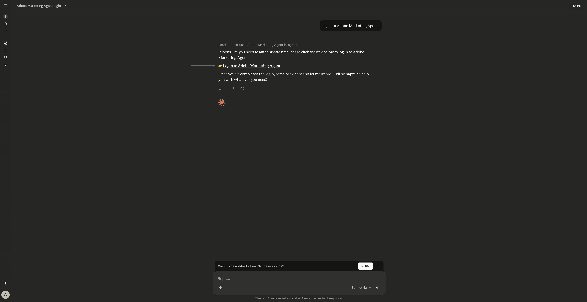
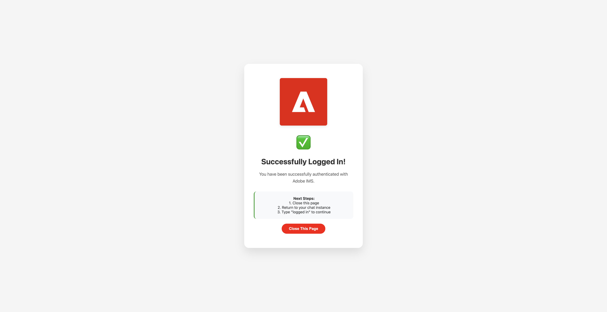

# 1.1.5 Adobe Marketing Agent for Claude

[!BADGE Beta]

+++Beta Details
By using the Adobe Marketing Agent with Claude Beta, You hereby acknowledge that the Beta is provided “as is” without warranty of any kind. Adobe shall have no obligation to maintain, correct, update, change, modify or otherwise support the Beta. You are advised to use caution and not to rely in any way on the correct functioning or performance of such Beta and/or accompanying materials. The Beta is considered Confidential Information of Adobe.  Any “Feedback” (information regarding the Beta including but not limited to problems or defects you encounter while using the Beta, suggestions, improvements, and recommendations) provided by You to Adobe is hereby assigned to Adobe including all rights, title, and interest in and to such Feedback.

+++

## Prerequisites

In order to follow the steps in this lab as documented below, the following access is required:

- Access to Real-Time CDP, Journey Optimizer and Customer Journey Analytics
- Access to AI Assistant in Adobe Experience Cloud
- Access to AEP Agent Orchestrator
- Access to Claude

## Video

In this video, you'll get an explanation and demonstration of all the steps involved in this exercise.

>[!VIDEO](https://video.tv.adobe.com/v/3482212?quality=12&learn=on)

This lab is in development.

## 1.1.5.1 Create custom app in Claude.ai for CJA 

>[!NOTE]
>
>Using Adobe Marketing Agent in Claude.ai requires the following:
>- a paid version of Claude.ai

Go to [https://claude.ai/](https://claude.ai/){target="_blank"} and log in using your account details. Once you're logged in, you should see this. 


Click to open your account and then select **Settings**.


Go to **Connectors** and then click **Go to Customize**.


Click **+** and then select **Add custom connector**.


Fill out the fields like this:

- **Name**: `Adobe Marketing Agent`
- **MCP Server URL**: ask your Adobe representative

Click **Add**.


You should then see this. Click **+** to start a new chat.


Click the **+** icon, go to **Connectors** and make sure **Adobe Marketing Agent** is enabled.


## 1.1.5.2 Authenticate & set context

Before interacting further with Adobe Marketing Agent through Claude.ai, you need to login and set the context.

Enter the following prompt and click **send**.

```
login to Adobe Marketing Agent
```


Select **Always allow**.


Click the link to log in to Adobe Marketing agent**.



Click **Open link**.


Click **Allow Access**.


After authenticating successfully, you should see this. Go back to Claude.



Enter the following command and click **send**.

```javascript
logged in
```


You're now logged in successfully. The next step is to set the context. Enter the following prompt and click **send**.


```javascript
change context
```


Select **Organization**. You can also repeat this command to change sandbox and dataview later.


Enter the name of your instance and click **send**.


Select **Always allow**.


You should then see something like this.


If the sandbox isn't set properly yet, you can use the following command to change to the sandbox you need to use. Click **send**. Alternatively, you can use the above command `change context` and then select **sandbox**

```javascript
change sandbox to --aepSandboxName--
```


If the dataview isn't set properly yet, you can use the following command to change to the sandbox you need to use (replace XXX in the below command by the name of your dataview). Click **send**. Alternatively, you can use the above command `change context` and then select **dataview**

```javascript
change dataview to XXX
```


Once the **Organization**, **Sandbox** and **Dataview** are set properly, you're ready to start asking questions to Adobe Marketing Agent.

## Next Steps

Go back to [Agent Orchestrator](./agentorchestrator.md){target="_blank"}

[Go Back to All Modules](./../../../overview.md){target="_blank"}
