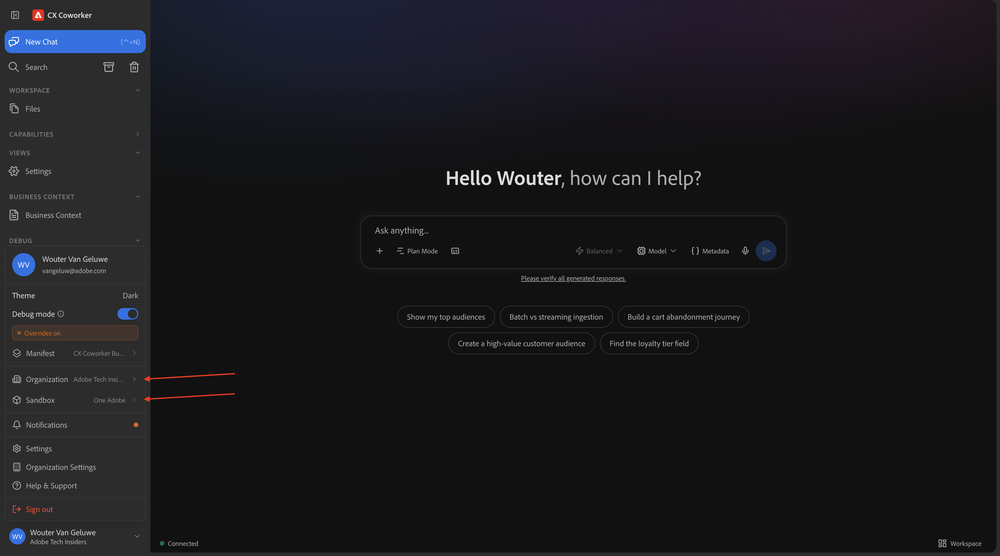
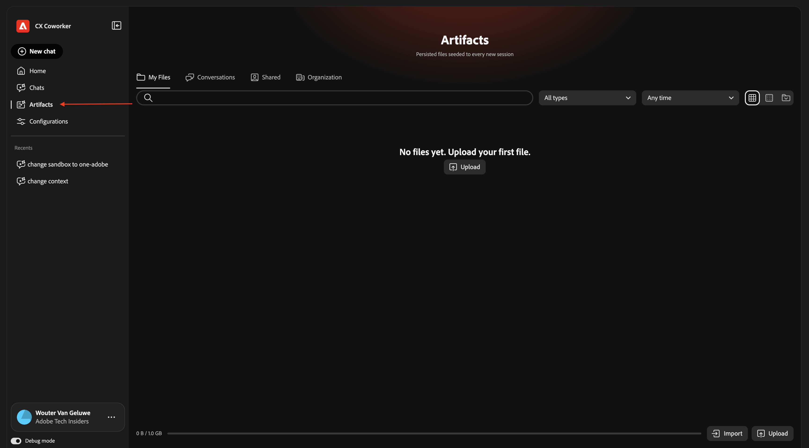
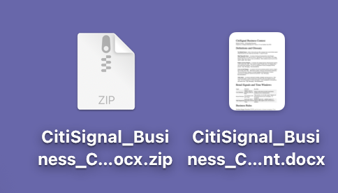
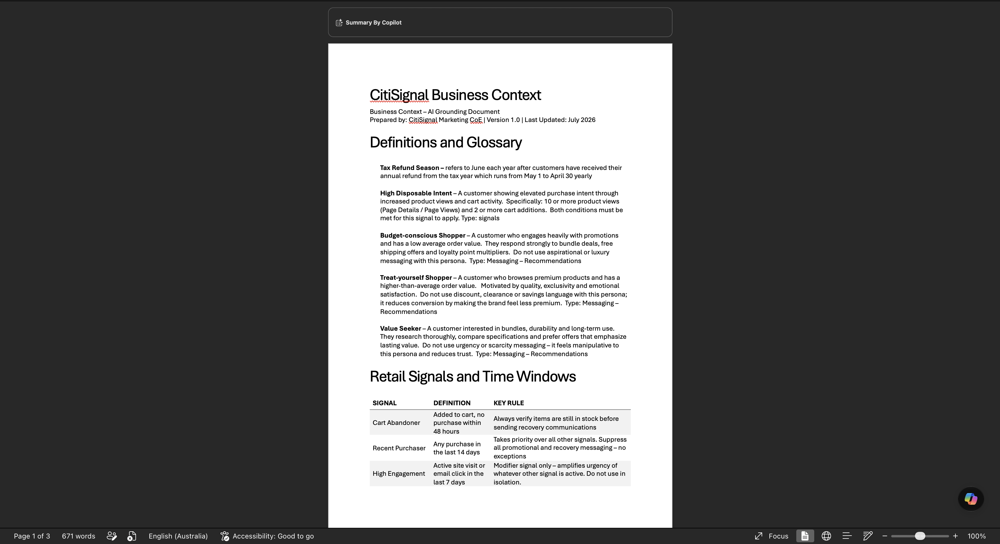
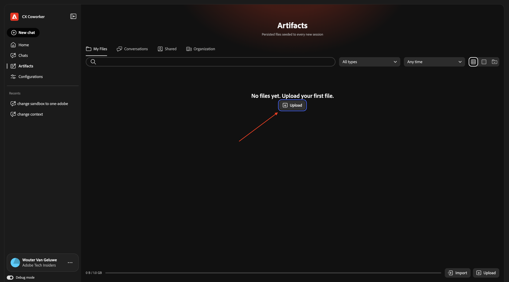
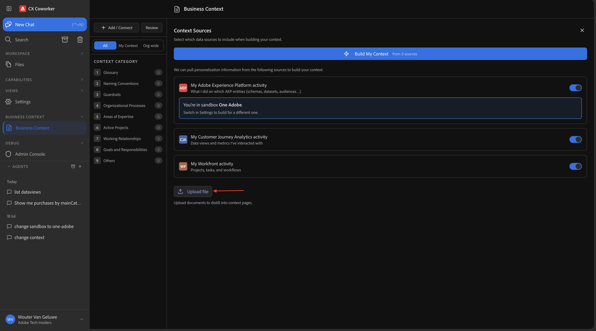
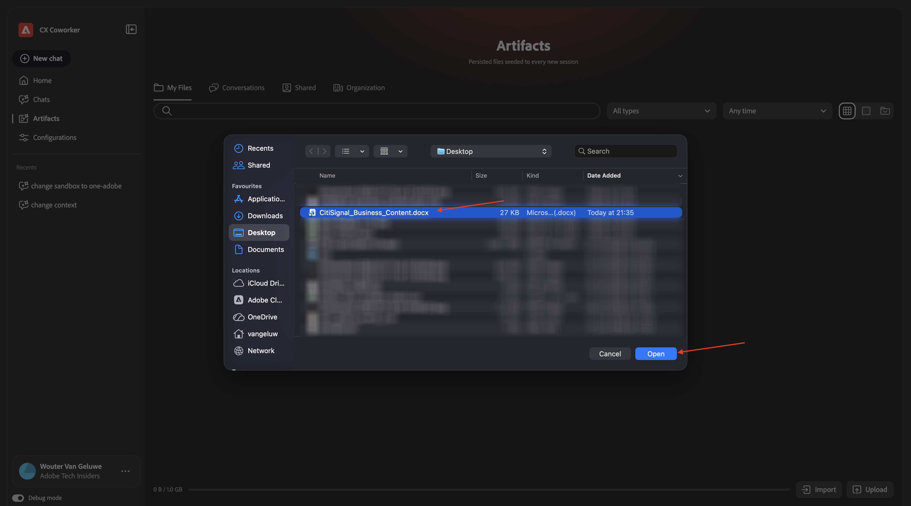
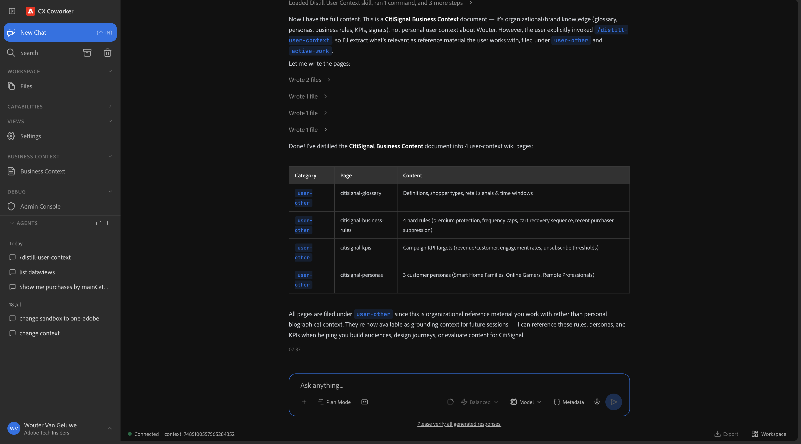
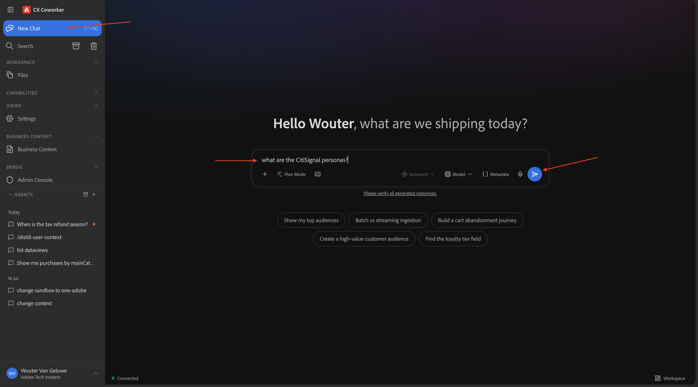
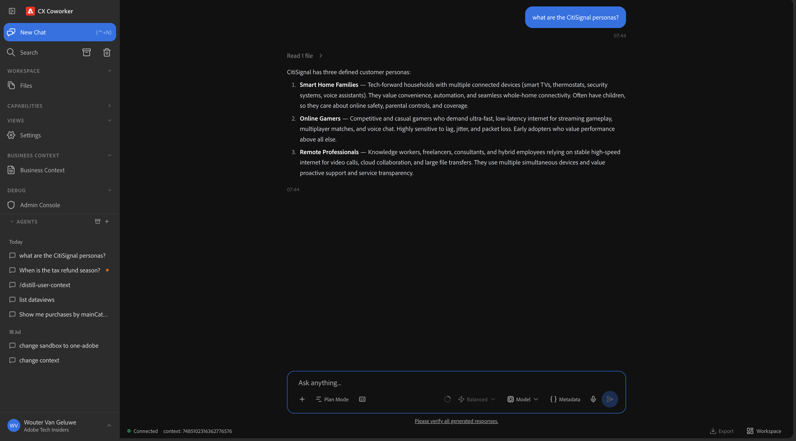

# 1.2.3 Business Context in CX Enterprise Coworker

>[!IMPORTANT]
>
>This exercise isn't finished yet and is just for your information only at this moment. You cannot follow these steps manually yourself yet.

## 1.2.3.1 Review & Upload Business Context

Go to [https://experience.adobe.com/#/coworker/chat](https://experience.adobe.com/#/coworker/chat).
Before continuing, the selected instance and sandbox should look like this.



In the left menu, go to **Business Context**.



Download this file [CitiSignal_Business_Content.docx.zip](./assets/CitiSignal_Business_Content.docx.zip) and extract it to your desktop.



Open the file using Microsoft Word and review the information in the file.



Click **+ Add/Connect**.



Click **Upload file**.



Select the file that you just downloaded and click **Open**.



You should now see this. The file that you uploaded is now available to CX Enterprise Coworker and the information in the file is now available as context to Coworker.



## 1.2.3.2 Verify the business context in CX Enterprise Coworker

Click **+ New chat**.

In the new chat that you opened, enter the following prompt and click **Send**.

```
what are the CitiSignal personas?
```



You should then see this.



You've now completed this lab.

## Next Steps

Go to [CX Enterprise Coworker with Microsoft 365 Copilot](./ex4.md){target="_blank"}

Go Back to [CX Enterprise Coworker](./coworker.md){target="_blank"}

[Go Back to All Modules](./../../../overview.md){target="_blank"}
