# 1.2.3 Business Context in CX Enterprise Coworker

[!BADGE Beta]

+++Beta Details
By using Business Context in CX Enterprise Coworker, You hereby acknowledge that the Beta is provided "as is" without warranty of any kind. Adobe shall have no obligation to maintain, correct, update, change, modify or otherwise support the Beta. You are advised to use caution and not to rely in any way on the correct functioning or performance of such Beta and/or accompanying materials. The Beta is considered Confidential Information of Adobe.  Any "Feedback" (information regarding the Beta including but not limited to problems or defects you encounter while using the Beta, suggestions, improvements, and recommendations) provided by You to Adobe is hereby assigned to Adobe including all rights, title, and interest in and to such Feedback.

+++

## 1.2.3.1 Review & Upload Business Context

Go to [https://experience.adobe.com/#/home](https://experience.adobe.com/#/home). Verify that you're logged in to the right organization, which should be `--aepImsOrgName--`. Click to open **Coworker**.

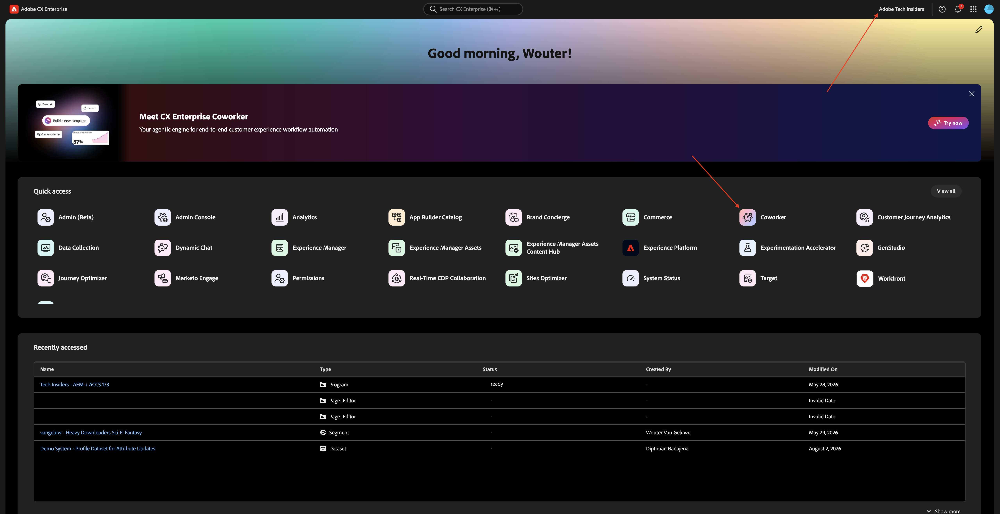

You should then see this. Verify that you've selected the right sandbox, which should be `--aepSandboxName--`.

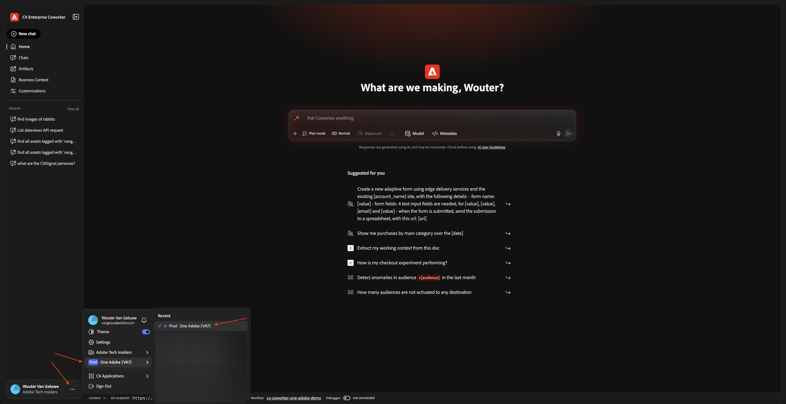

In the left menu, go to **Business Context**.

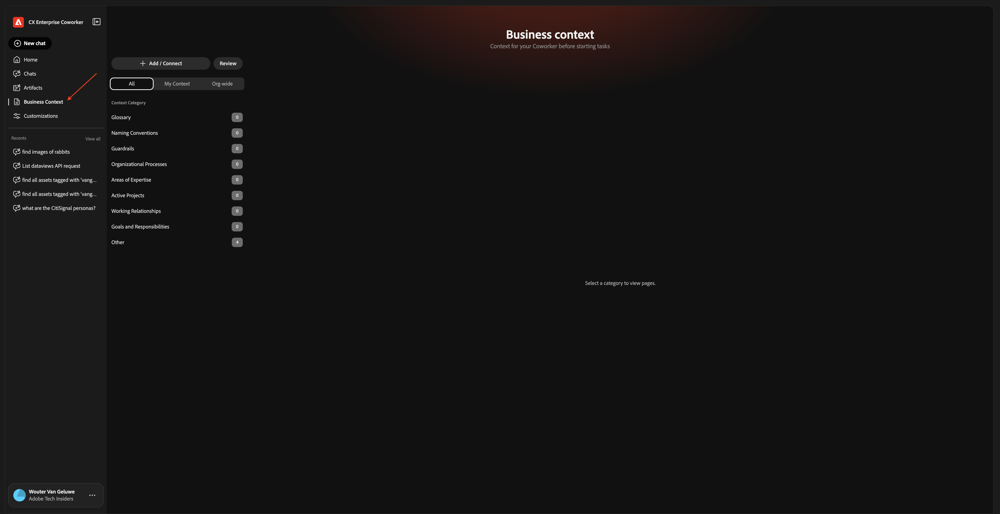

Download this file [CitiSignal_Business_Content.docx.zip](./assets/CitiSignal_Business_Content.docx.zip) and extract it to your desktop.

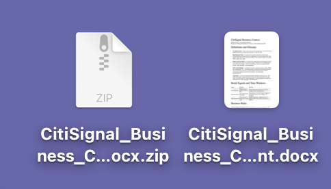

Open the file using Microsoft Word and review the information in the file.

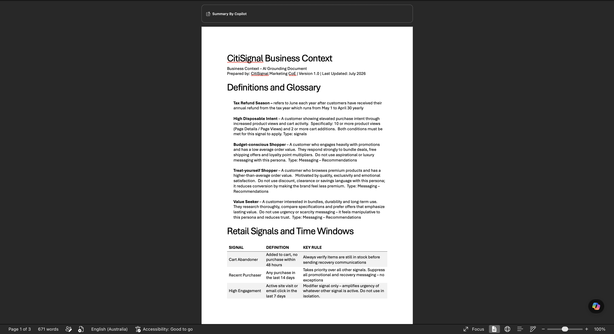

Click **+ Add/Connect**.

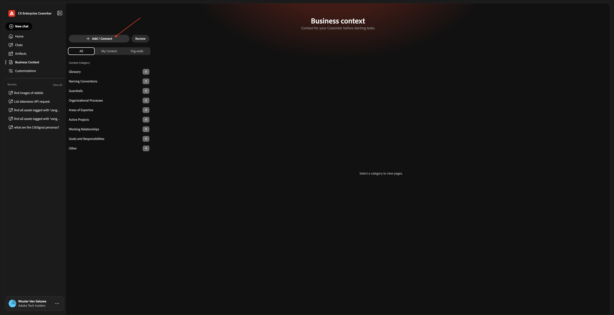

Click **Upload file**.

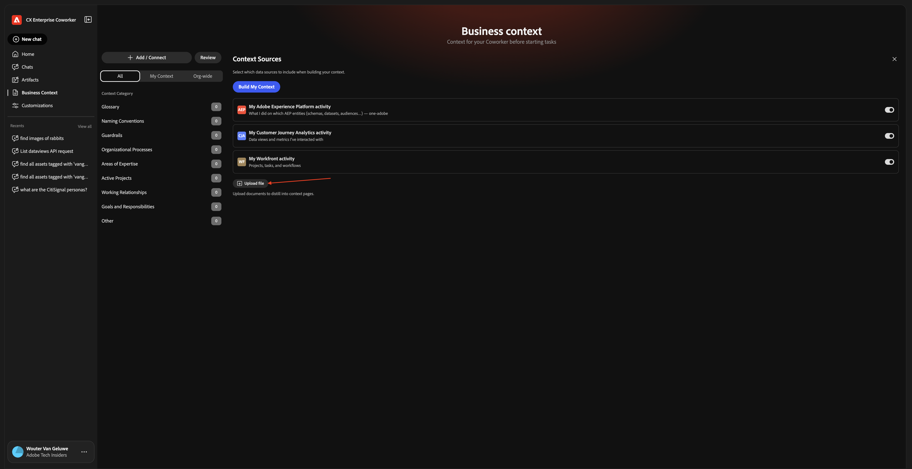

Select the file that you just downloaded and click **Open**.

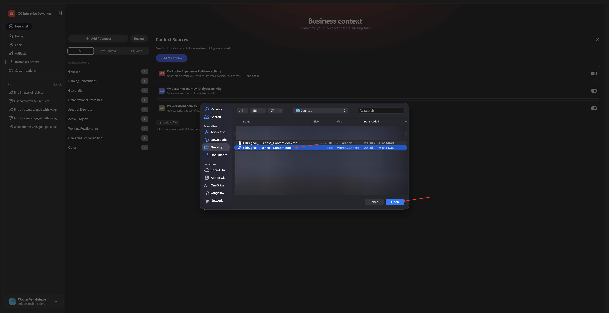

You should now see this. The file that you uploaded is now available to CX Enterprise Coworker and the information in the file is now available as context to Coworker.

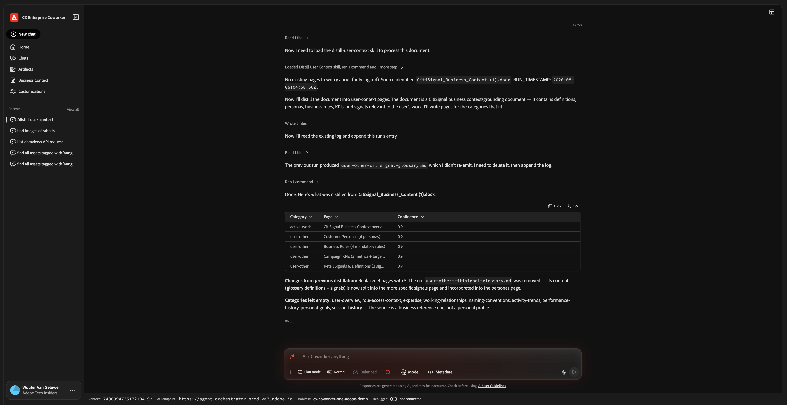

## 1.2.3.2 Verify the business context in CX Enterprise Coworker

Click **+ New chat**.

In the new chat that you opened, enter the following prompt and click **Send**.

```
what are the CitiSignal personas?
```

>[!NOTE]
>
>The information about CitiSignal personas is loaded from the Business Context that you uploaded before.

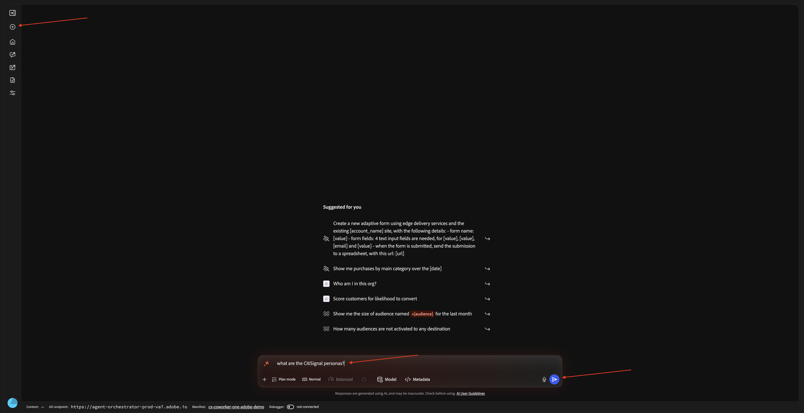

You should then see this.

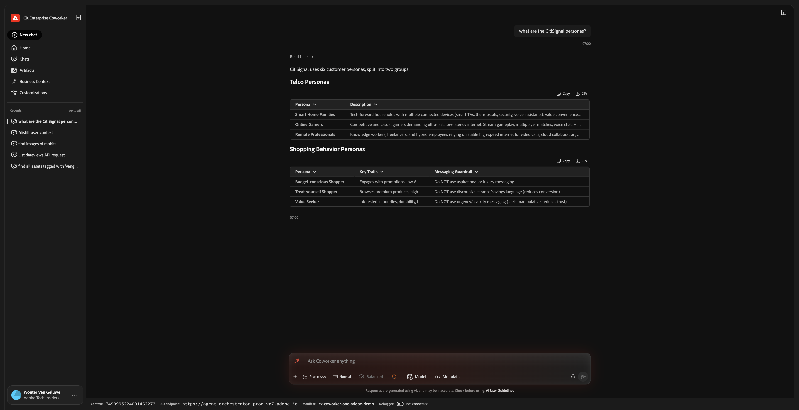

Enter the following prompt and click **Send**.

```
when is CitiSignal's Tax Refund season?
```

>[!NOTE]
>
>The information about CitiSigna's Tax Refund season is loaded from the Business Context that you uploaded before.

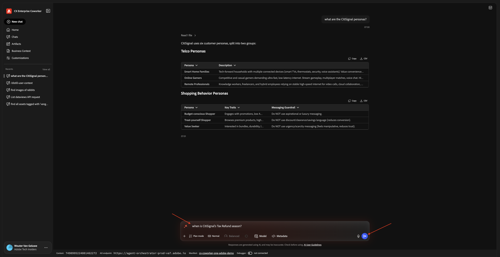

You should then see this.

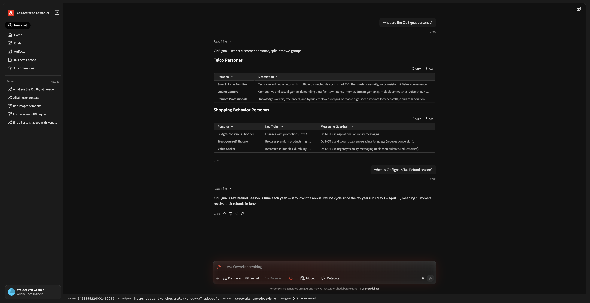

Enter the following prompt and click **Send**.

```
How did my website activity change during tax season this year?
```

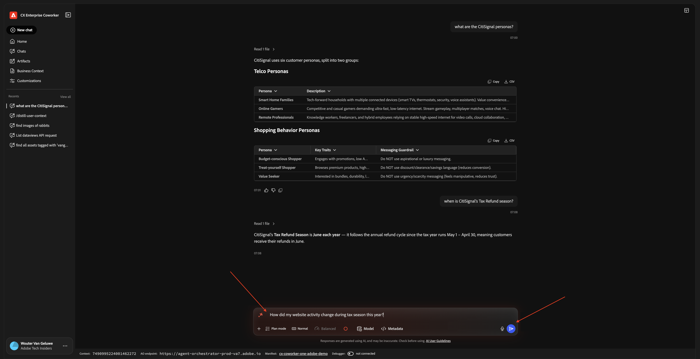

You should then see this.


Enter the following prompt and click **Send**.

```
Create an audience of customers who have high disposable intent in the last 30 days.
```

>[!NOTE]
>
>The information about CitiSigna's defintion ofd high disposable intent is loaded from the Business Context that you uploaded before.

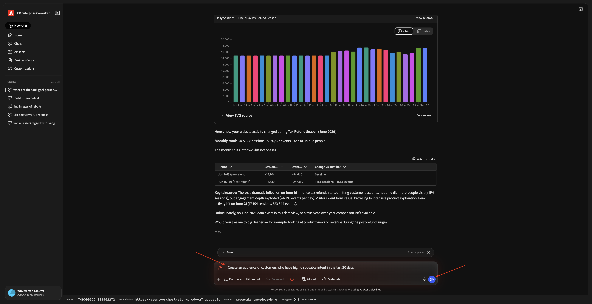

You should then see this. Enter the following prompt and click **Send**.

```
yes
```

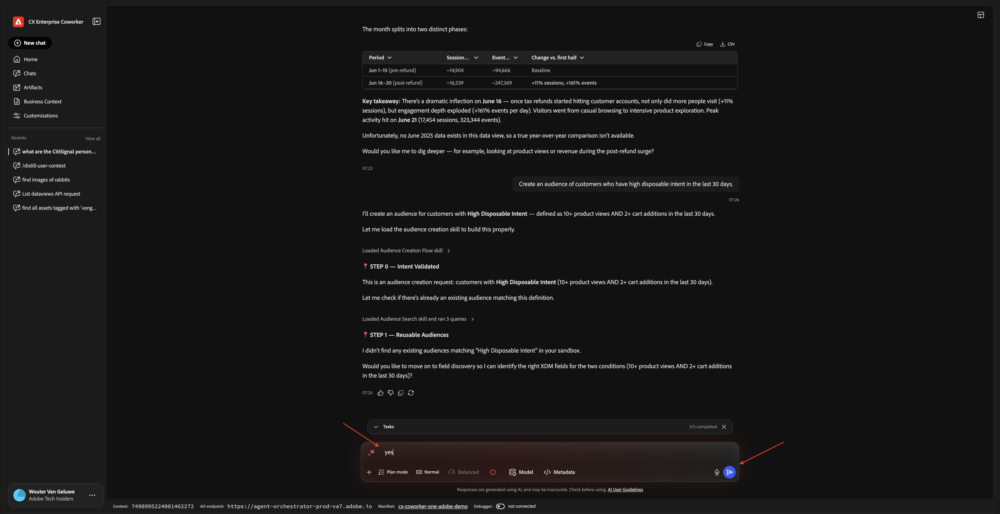

You should then see this. Enter the following prompt and click **Send**.

```
yes
```

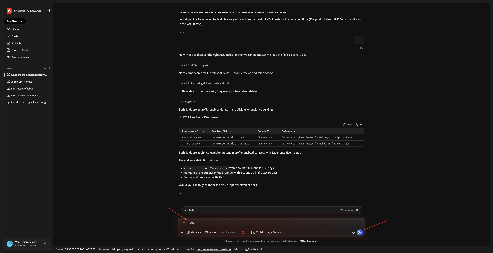

You should then see this. Enter the following prompt and click **Send**.

```
change the name to --aepUserLdap-- - High Disposable Intent - Last 30 Days and publish the audience
```

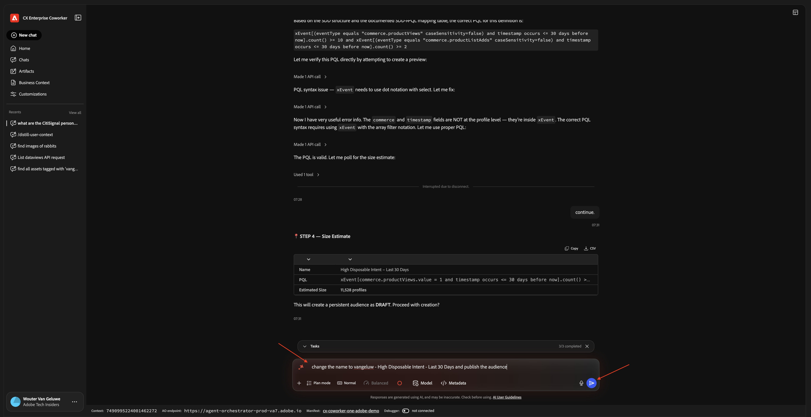

Provide the required approval, you may get this question a couple of times.

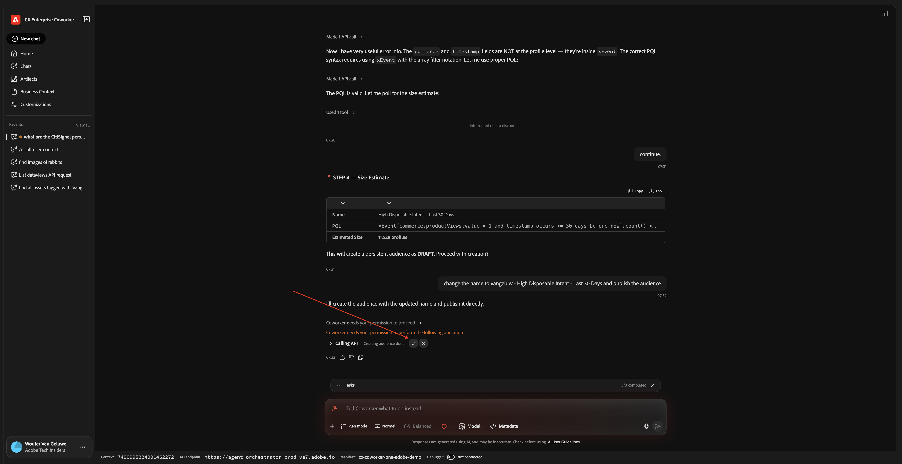

Your audience is now created.

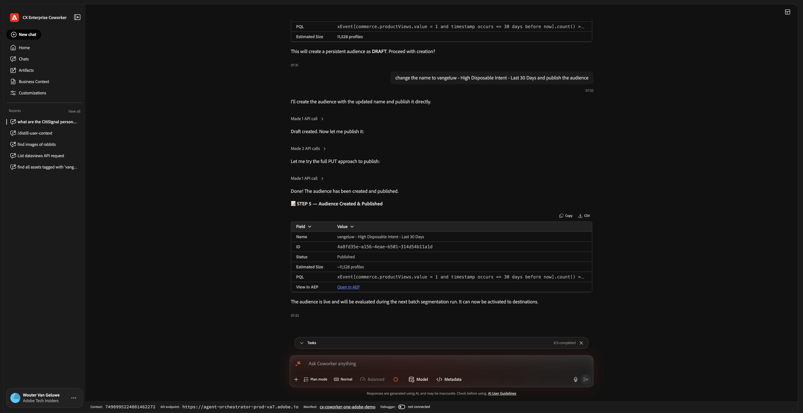

You've now completed this lab.

## Next Steps

Go to [CX Enterprise Coworker with Microsoft 365 Copilot](./ex4.md){target="_blank"}

Go Back to [CX Enterprise Coworker](./coworker.md){target="_blank"}

[Go Back to All Modules](./../../../overview.md){target="_blank"}
