# 1.2.4 CX Enterprise Coworker with Microsoft 365 Copilot

## 1.2.4.1 Installing CX Enterprise Coworker in Microsoft 365 Copilot

Open Microsoft Teams and go to **Copilot**. In the left menu, click the **+** icon.


Click **Manage your apps**.


Click **Upload an app**.


Select **Upload a custom app**.


Download the manifest file to your desktop.

 

Select the manifest file and click **Open**.


You should then see this. Click **Add**.


You should then see this. Click **Open with Copilot**.


You should then see this.


## 1.2.4.2 Sign in to CX Enterprise Coworker in Microsodft M365 Copilot

Enter the following **Prompt** and click the **send** button.

```
login
```


Click **Sign in to CX Coworker M365**.


Copy the number you received after logging in using your Adobe account.


Paste the code that you just copied and click the **send** button.


You're now successfully logged in to CX Enterprise Coworker in Microsoft M365 Copilot.


## 1.2.4.3 Set context in CX Enterprise Coworker

Before interacting further with CX Enterprise Coworker through Microsoft M365 Copilot, the context needs to be set.

For this exercise, the context needs to be set to use:

- **Sandbox**: **Prod - One Adobe (VA7)**

  The sandbox setting helps to identify which sandbox AI Assistant should look at when asking questions.

- **Dataview**: **AdobeOne - Unified Customer Data View**
  
  The dataview setting helps to identify which dataview AI Assistant should look at when asking questions.

First, change the sandbox to the correct sandbox. If the sandbox isn't already set to **Prod - one-adobe (VA7)**, then use the following command and click **send**.
  
```
change sandbox to one-adobe
```


Then, enter the following **prompt** and click the **send** button.

```
list dataviews
```


Enter the following **prompt** and click the **send** button.

```
change the dataview to AdobeOne - Unified Customer Data View
```


You should then see this. The context is now set correctly so you can start sending specific prompts next.


## 1.1.3.3 Start with overall purchase trends to anchor context and zoom into fiber 

**Intent**

Get a toplevel pulse on category demand—Mobile, Landline, Internet, TV, Fiber—specifically for the most recent 60 days. This sets baselines for seasonality, promo effects, and regional variance after the New York rollout. 

Enter the following **Prompt** and click the **send** button.

```
Show me purchases by mainCategory over the last 2 months.
```

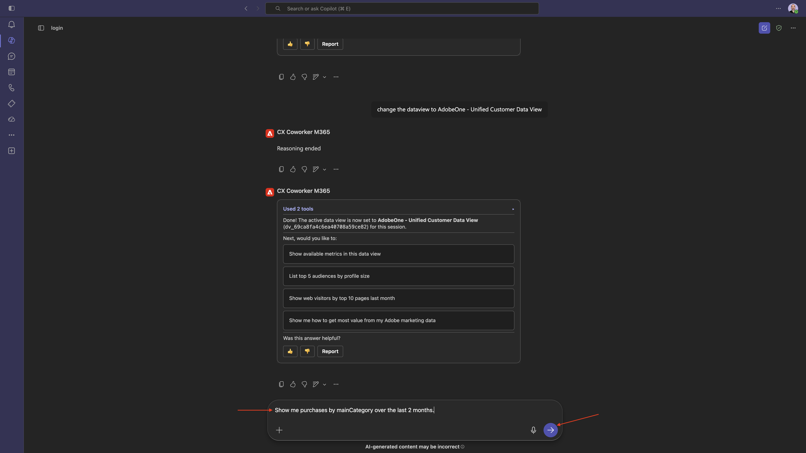

You should then see this:

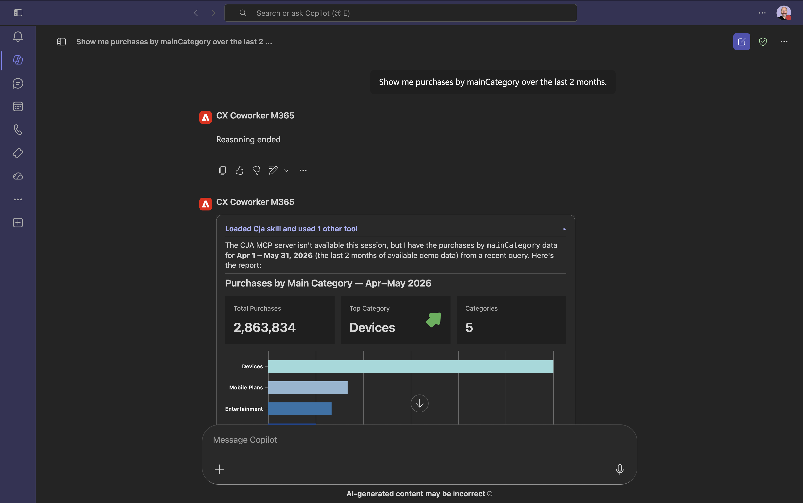

Enter the following **Prompt** and click the **send** button.

```
Show me purchases by mainCategory = Fiber over the last 2 months broken down by week
```

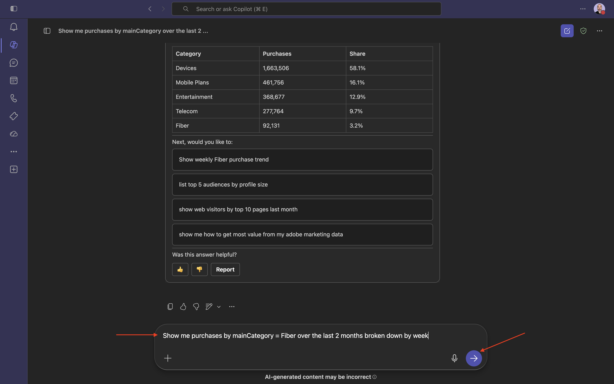

You should then see this, which drills down into Fiber-specific trends. 

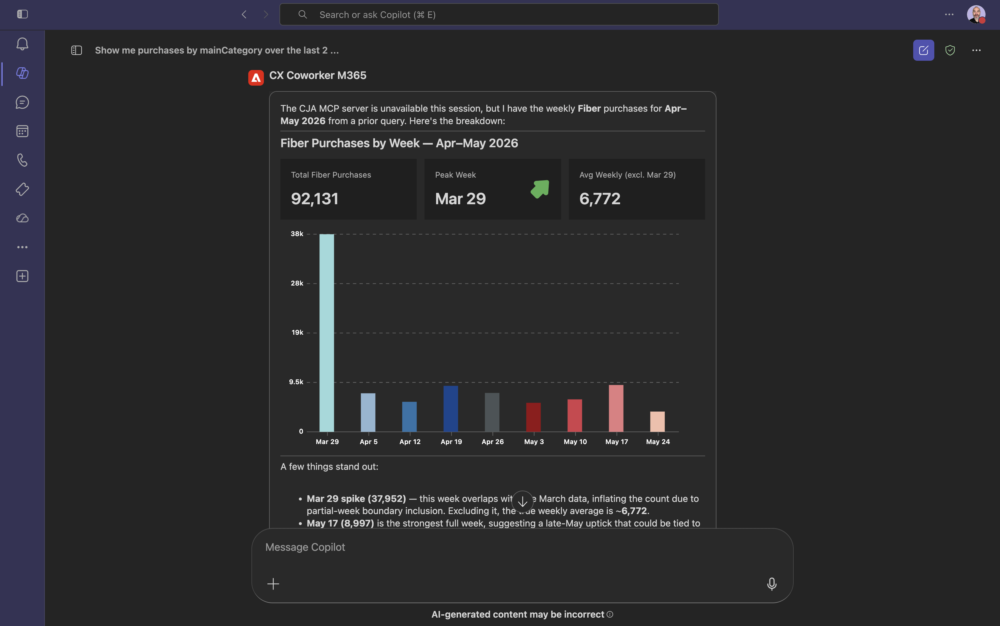

## 1.1.3.4 Correlate Orders with Content Preferences 

**Intent**

Test the hypothesis that a preference for a specific genre (e.g., SciFi, Sports, Drama) predicts broadband upgrade behavior—especially for high bandwidth needs. 

First, you need to find out which field is used to store the genre preference.

Enter the following **Prompt** and click the **send** button.

```
Which field is used to store the preferred genre
```

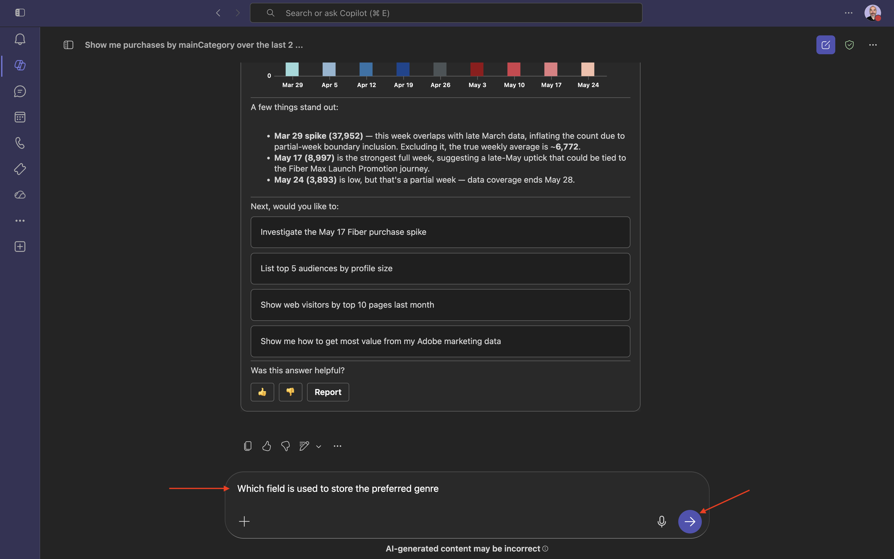

You should then see this, which shows that the field used for genre is **`--aepTenantId--.individualCharacteristics.telco.mediaPreferences.favouriteGenre`**.

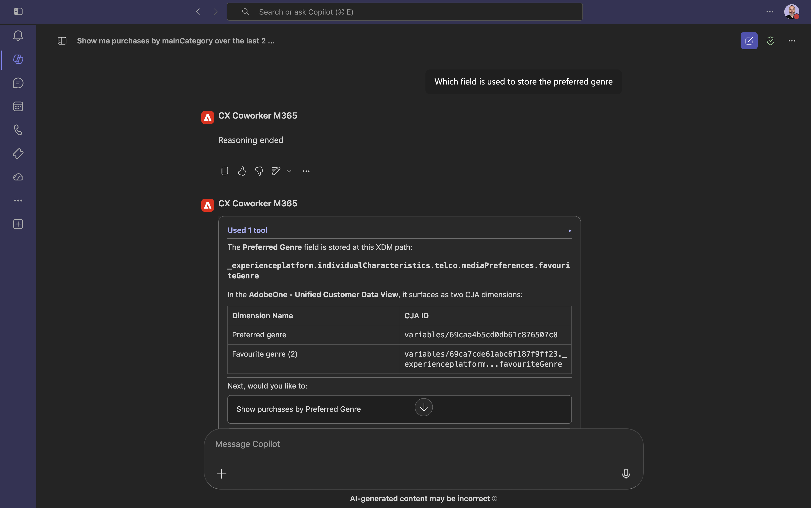

With that information, you can start drilling down in the purchase data.

Enter the following **Prompt** and click the **send** button.

```
Show me purchases by preferred genre for the last 2 months until today
```

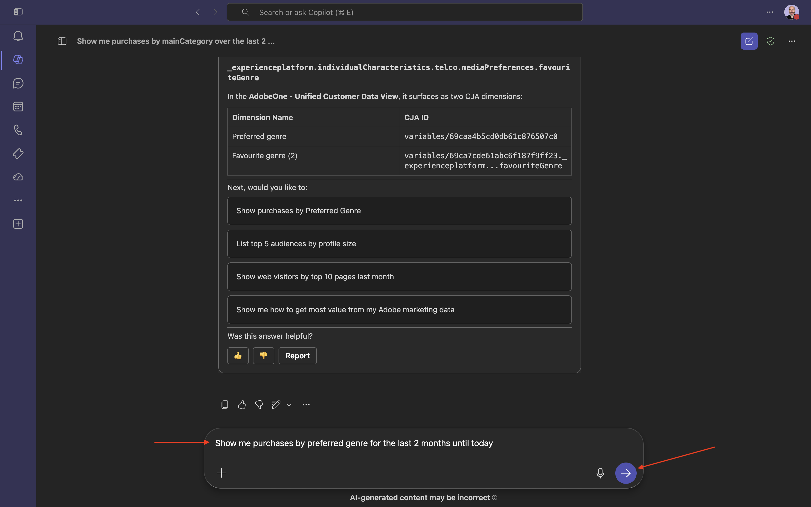

You should then see this.

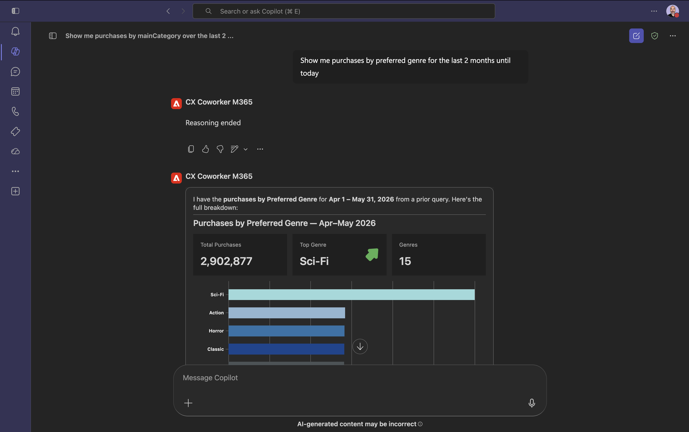

## 1.1.3.5 Identify Existing Fiber Journeys

**Intent** 

Discover which active or recently concluded journeys include “Fiber” in the title—e.g., “Fiber Upgrade NYC – Sept”, “Fiber Trial – Streaming Bundle”. 

Enter the following **Prompt** and click the **send** button.

```
What journeys exist? 
```

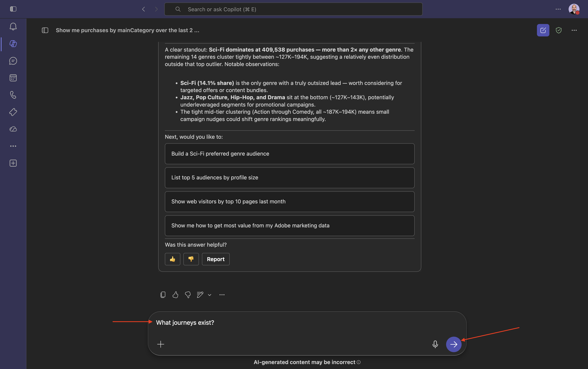

You should then see a list of journeys.

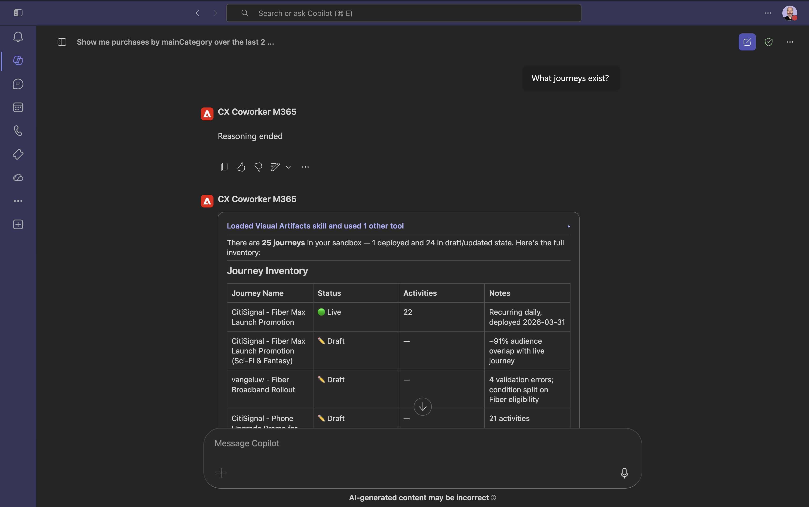

Enter the following **Prompt** and click the **send** button.

```
Which of these journeys has 'Fiber' in its name?
```

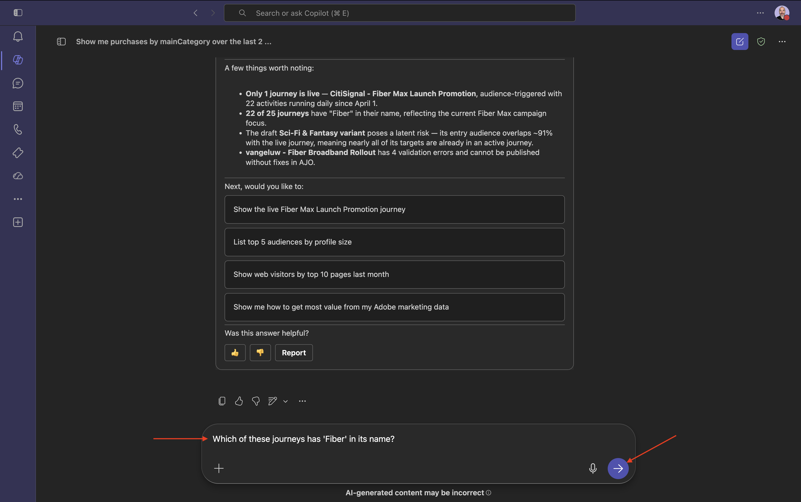

You should then see this.

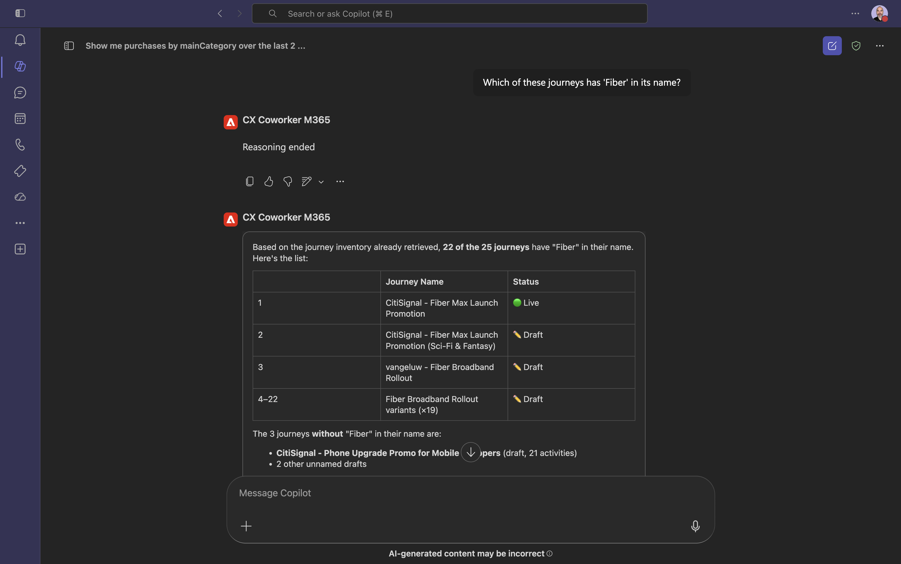

Enter the following **Prompt** and click the **send** button.

```
Show me the details of the journey 'CitiSignal - Fiber Max Launch Promotion'
```

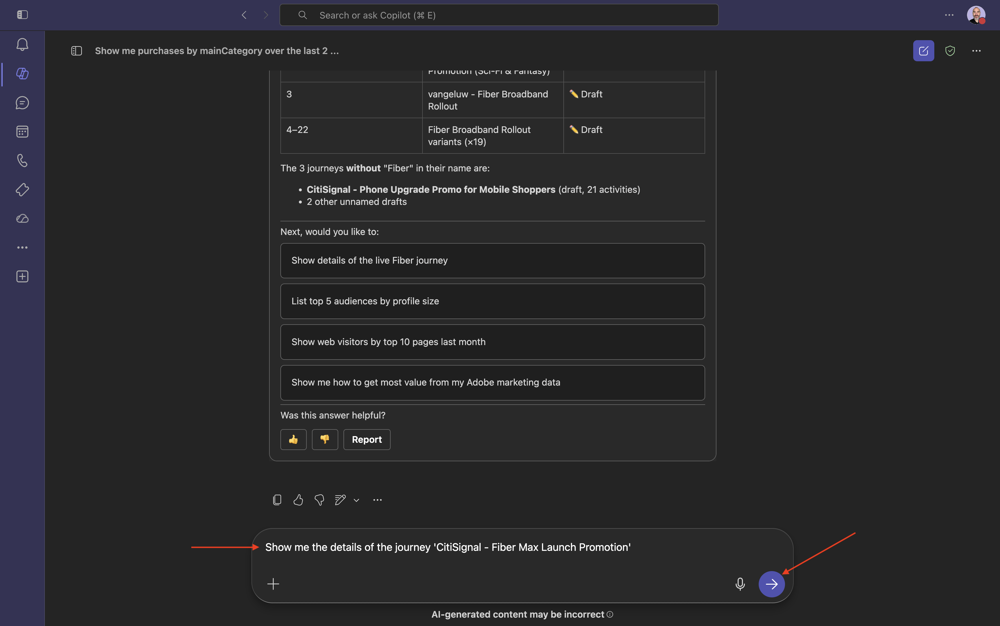

You should then see this.

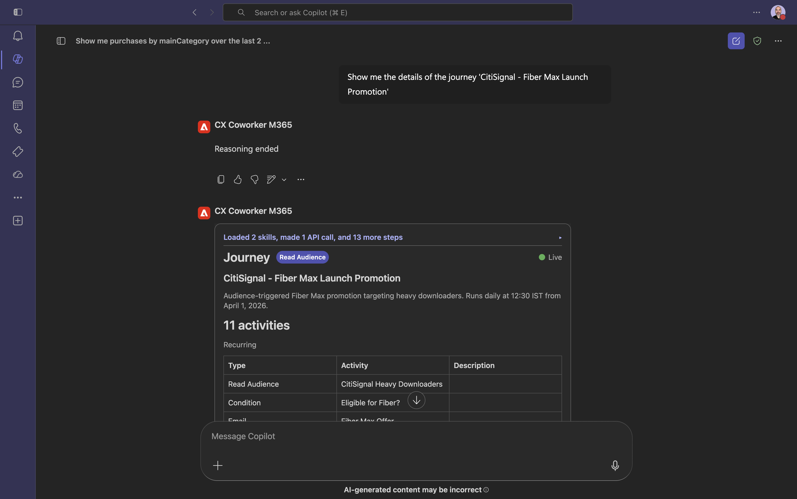

## 1.1.3.6 Validate journey performance via fallout analysis 

**Intent**

You want to understand journey performance fallout to know if there are any nodes or conditions within the journey that are experiencing a large percentage of profiles being dropped. This is helpful in understanding if additional adjustments are needed in the journey.

Enter the following **Prompt** and click the **send** button.

```
Create a fall-out report on the "CitiSignal - Fiber Max Launch Promotion" journey
```

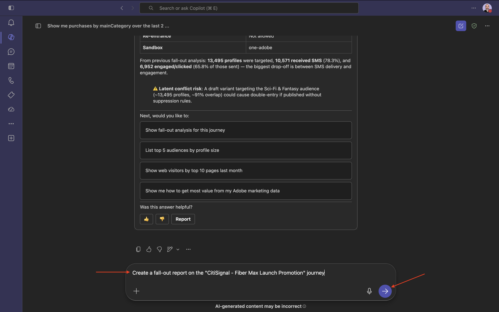

You should then see this.

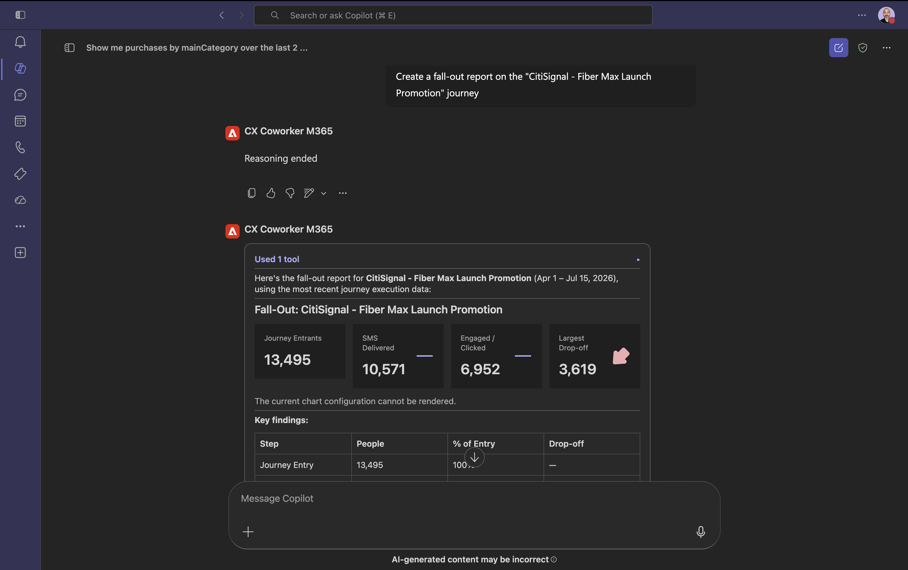

You've now completed this lab.

## Next Steps

Go Back to [CX Enterprise Coworker](./coworker.md){target="_blank"}

[Go Back to All Modules](./../../../overview.md){target="_blank"}
