# 1.2.4 CX Enterprise Coworker with Microsoft 365 Copilot

## 1.2.4.1 Installing CX Enterprise Coworker in Microsoft 365 Copilot

Open Microsoft Teams and go to **Copilot**. In the left menu, click the **+** icon.

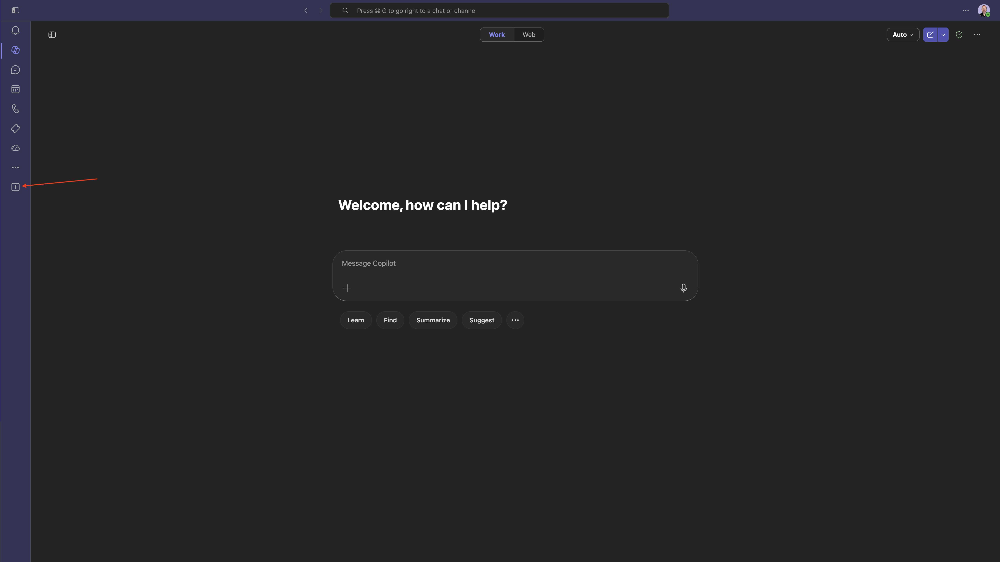

Click **Manage your apps**.

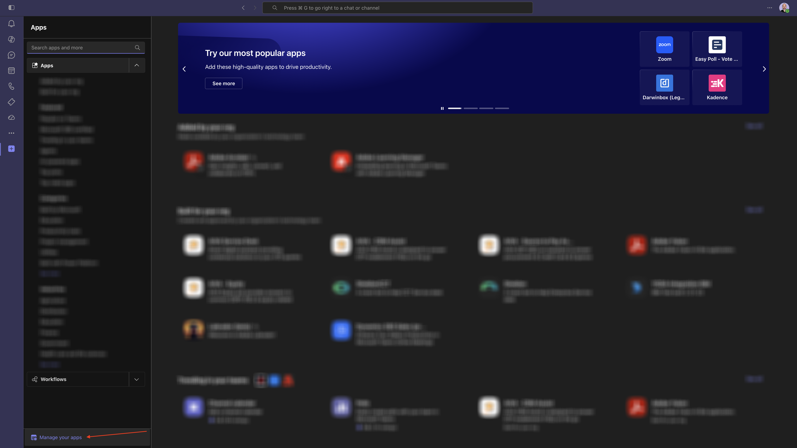

Click **Upload an app**.

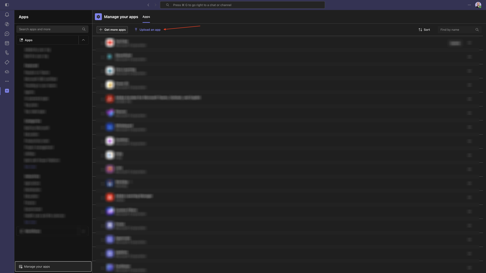

Select **Upload a custom app**.

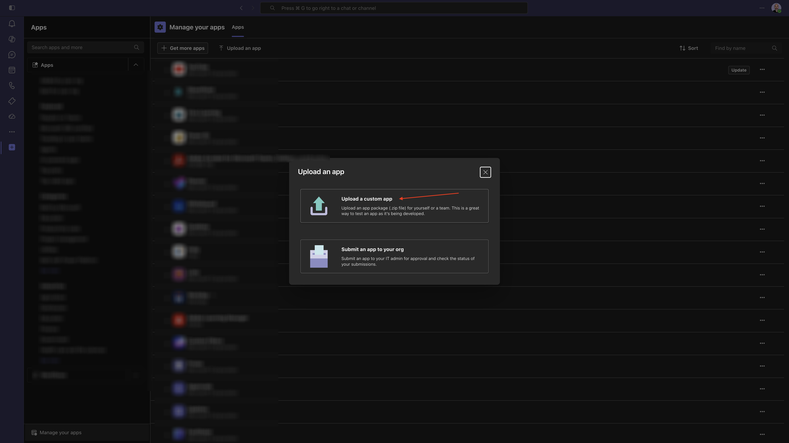

Download the manifest file to your desktop.

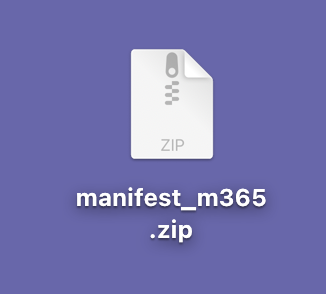 

Select the manifest file and click **Open**.

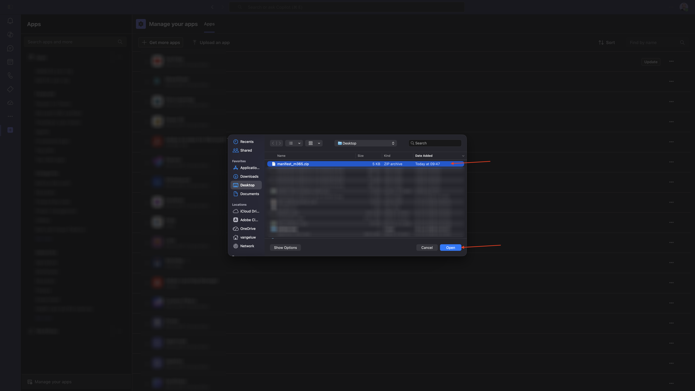

You should then see this. Click **Add**.

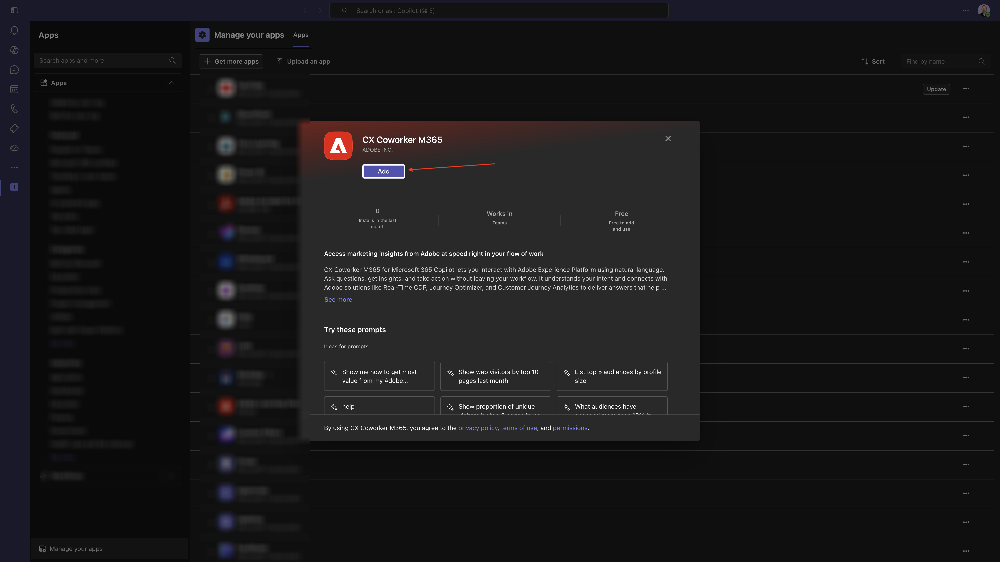

You should then see this. Click **Open with Copilot**.

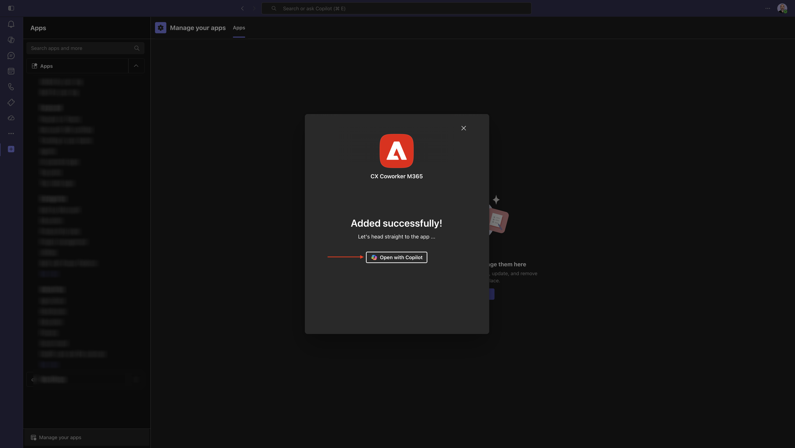

You should then see this.

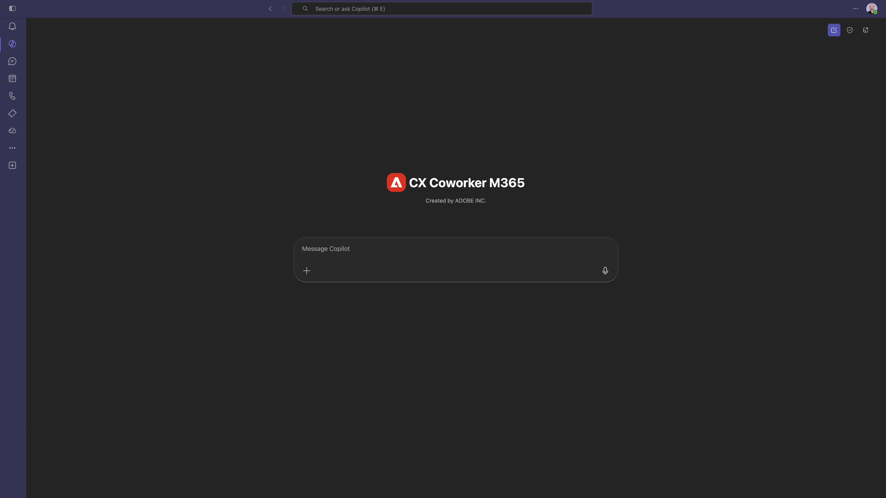

## 1.2.4.2 Sign in to CX Enterprise Coworker in Microsodft M365 Copilot

Enter the following **Prompt** and click the **send** button.

```
login
```

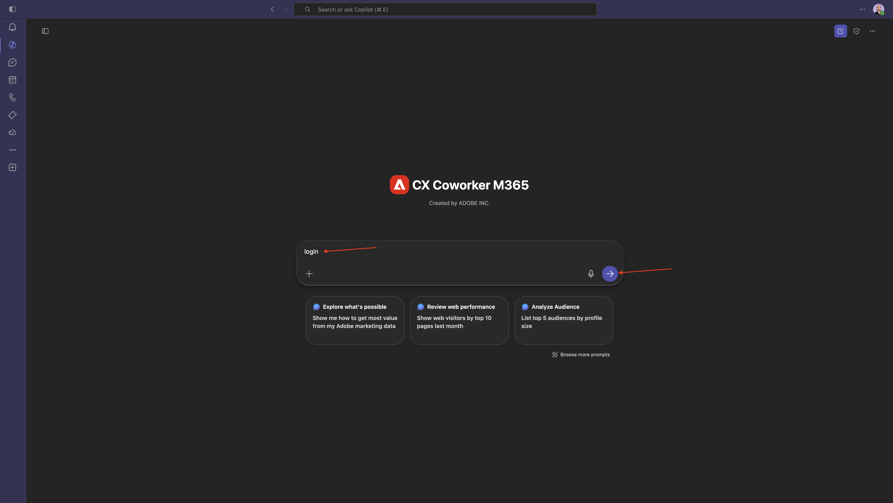

Click **Sign in to CX Coworker M365**.

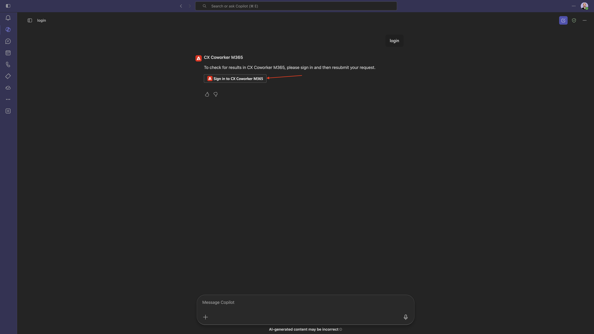

Copy the number you received after logging in using your Adobe account.


Paste the code that you just copied and click the **send** button.

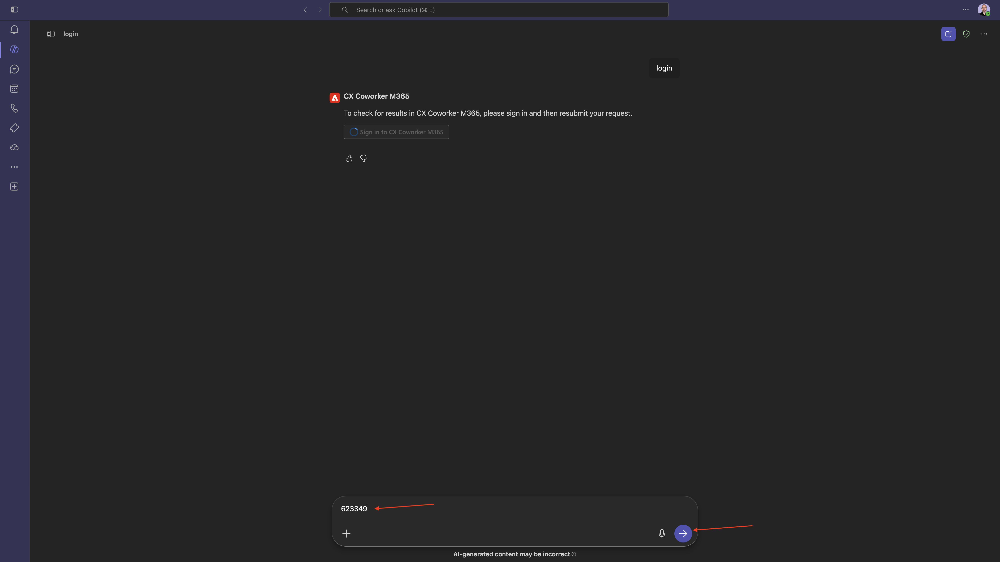

You're now successfully logged in to CX Enterprise Coworker in Microsoft M365 Copilot.

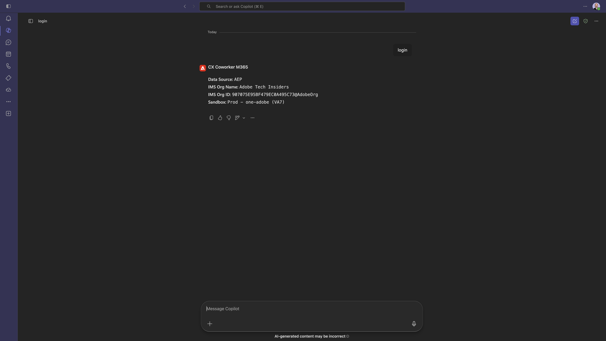

## 1.2.4.3 Set context in CX Enterprise Coworker

Before interacting further with CX Enterprise Coworker through Microsoft M365 Copilot, the context needs to be set.

For this exercise, the context needs to be set to use:

- **Sandbox**: **Prod - One Adobe (VA7)**

  The sandbox setting helps to identify which sandbox AI Assistant should look at when asking questions.

- **Dataview**: **AdobeOne - Unified Customer Data View**
  
  The dataview setting helps to identify which dataview AI Assistant should look at when asking questions.

First, change the sandbox to the correct sandbox. If the sandbox isn't already set to **Prod - one-adobe (VA7)**, then use the following command and click **send**.
  
```
change sandbox to one-adobe
```

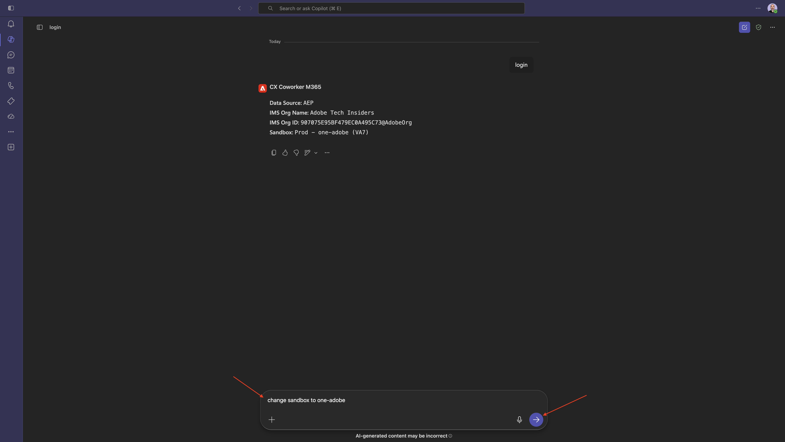

Then, enter the following **prompt** and click the **send** button.

```
list dataviews
```

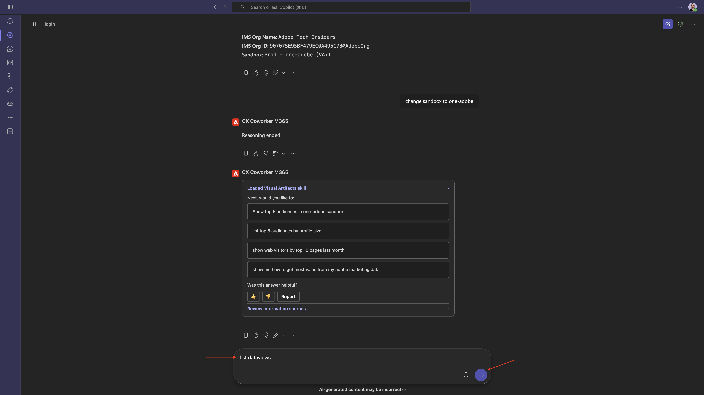

Enter the following **prompt** and click the **send** button.

```
change the dataview to AdobeOne - Unified Customer Data View
```

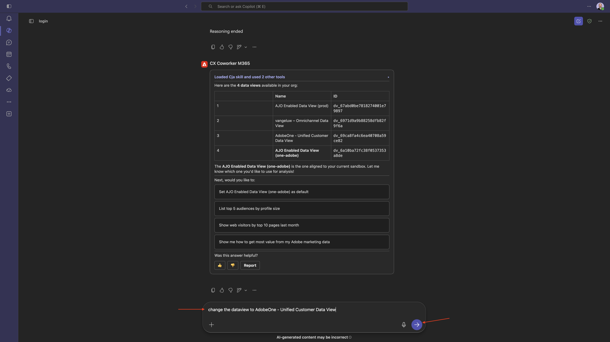

You should then see this. The context is now set correctly so you can start sending specific prompts next.

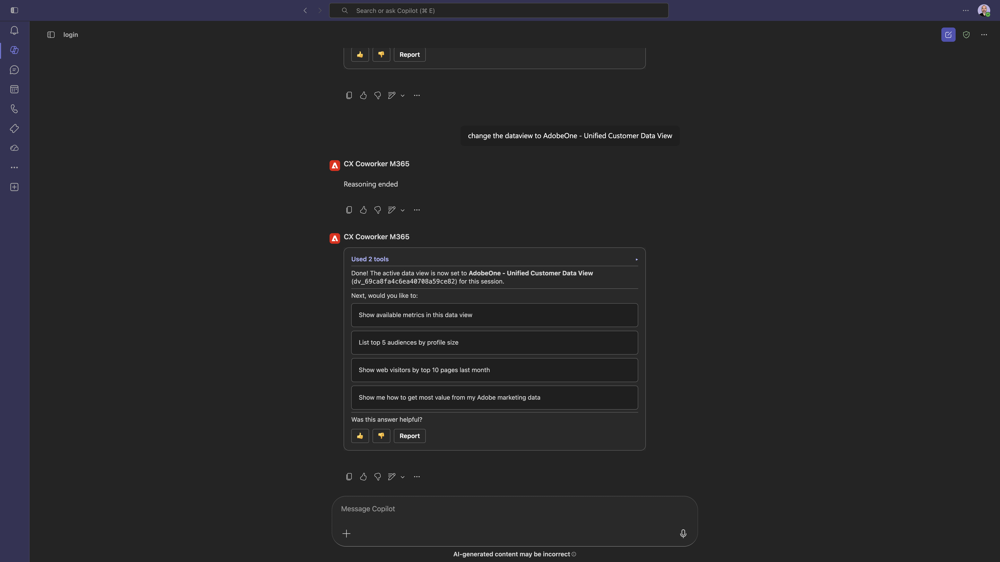

You've now completed this lab.

## Next Steps

Go Back to [CX Enterprise Coworker](./coworker.md){target="_blank"}

[Go Back to All Modules](./../../../overview.md){target="_blank"}
