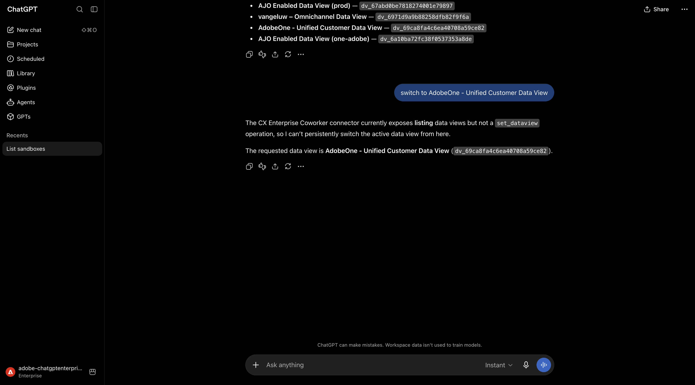
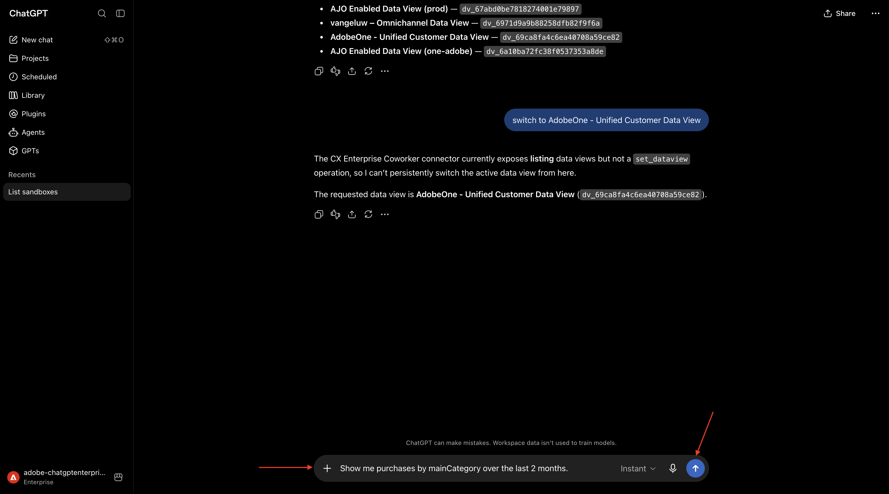

# 1.2.5 CX Enterprise Coworker with ChatGPT Enterprise

>[!IMPORTANT]
>
>Before you begin, read the below instructions!

## Instructions for in-person workshops

For this exercise, you need to use:

- **Instance**: **Adobe Tech Insiders**
- **Sandbox**: **One Adobe**
- **Dataview**: **AdobeOne - Unified Customer Data View**
- **Username**: **adobetechinsiders-XXX@adobeeventlab.com** and replace XXX by the number that was assigned to you
- **Password**: use the password that was shared with you

## 1.2.5.1 Install the custom MCP server for CX Enterprise Coworker

>[!NOTE]
>
>Using CX Enterprise Coworker in ChatGPT requires the following:
>- a paid version of OpenAI's ChatGPT Enterprise
>- using the ChatGPT Enterprise web client

Go to [https://chatgpt.com/](https://chatgpt.com/) and log in using your account details. Once you're logged in, you should see this. Go to **Plugins**.


Click the **+** icon and then select **Create app**.


Enter the following information:

- **Name**: `--aepUserLdap-- CX Enterprise Coworker`
- **Connection**: enter the URL provided to you by your Adobe contact
- **Authentication**: select `OAuth`
- check the box in front of **I understand and want to continue**

Click **Create**.


Click **Sign in with CX Enterprise Coworker**.


After logging in, you should then see this. CLick **Refresh**.


You should then see this. Close this window and open a new chat.


## 1.2.5.2 Set context in CX Enterprise Coworker

Before interacting further with CX Enterprise Coworker through ChatGPT, the context needs to be set.

For this exercise, the context needs to be set to use:

- **IMS Org**: `--aepImsOrgName--`.

- **Sandbox**: **Prod - One Adobe**

The Sandbox setting helps to identify which sandbox ChatGPT should look at when asking questions.

- **Dataview**: **AdobeOne - Unified Customer Data View**

The Dataview setting helps to identify which dataview ChatGPT should look at when asking questions.

Open a new chat. Enter the following **Prompt** and click the **send** button.

```
using --aepUserLdap-- CX Enterprise Coworker, list sandboxes
```


You should then see this. Enter the following **Prompt** and click the **send** button.

```
change sandbox to one-adobe
```


You should then see this. Enter the following **Prompt** and click the **send** button.

```
list dataviews
```


You should then see this. Enter the following **Prompt** and click the **send** button.

```
switch to AdobeOne - Unified Customer Data View
```


You should then see this. The context is now set correctly so you can start sending specific prompts next.




## 1.2.5.3 Start with overall purchase trends to anchor context and zoom into fiber 

**Intent**

Get a toplevel pulse on category demand—Mobile, Landline, Internet, TV, Fiber—specifically for the most recent 60 days. This sets baselines for seasonality, promo effects, and regional variance after the New York rollout. 

Enter the following **Prompt** and click the **send** button.

```
Show me purchases by mainCategory over the last 2 months.
```



You should then see this:


Enter the following **Prompt** and click the **send** button.

```
Show me purchases by mainCategory = Fiber over the last 2 months broken down by week
```


You should then see this, which drills down into Fiber-specific trends. 


## 1.2.5.4 Correlate Orders with Content Preferences 

**Intent**

Test the hypothesis that a preference for a specific genre (e.g., SciFi, Sports, Drama) predicts broadband upgrade behavior—especially for high bandwidth needs. 

First, you need to find out which field is used to store the genre preference.

Enter the following **Prompt** and click the **send** button.

```
Which field is used to store the preferred genre
```


You should then see this, which shows that the field used for genre is **`--aepTenantId--.individualCharacteristics.telco.mediaPreferences.favouriteGenre`**.


With that information, you can start drilling down in the purchase data.

Enter the following **Prompt** and click the **send** button.

```
Show me purchases by preferred genre for the last 2 months until today
```


You should then see this.


## 1.2.5.5 Create a new audience

**Intent**

Based on the above findings and research, there's a correlation between customers that consume a lot of data and that have a preferred genre of sci-fi or fantasy. You will now combine these attributes in an audience.

Enter the following **Prompt** and click the **send** button.

```javascript
Create an audience with the name --aepUserLdap-- - Heavy Downloaders - Sci-Fi or Fantasy (Copilot M365) that combines people with an average download usage per month of over 2000 GB and a preferred genre of sci-fi or fantasy.
```


If similar, already existing audiences are already available, you should see a similar message. Enter the following **Prompt** and click the **send** button.

```javascript
create a new one
```


Your audience has now been created.


## 1.2.5.6 Activate audience to destination

Enter the following **Prompt** and click the **send** button.

```javascript
Which destinations exist?
```


You should then see this.


Enter the following **Prompt** and click the **send** button.

```javascript
Activate the audience I just created to the Meta destination and set the field customer_file_source to USER_PROVIDED_ONLY.
```


You should then see this.


## 1.2.5.7 Identify Existing Fiber Journeys

**Intent** 

Discover which active or recently concluded journeys include “Fiber” in the title—e.g., “Fiber Upgrade NYC – Sept”, “Fiber Trial – Streaming Bundle”. 

Enter the following **Prompt** and click the **send** button.

```
What journeys exist?
```


You should then see a list of journeys.


Enter the following **Prompt** and click the **send** button.

```
Show me the details of the journey 'CitiSignal - Fiber Max Launch Promotion'
```


You should then see this.


## 1.2.5.8 Validate journey performance via fallout analysis 

**Intent**

You want to understand journey performance fallout to know if there are any nodes or conditions within the journey that are experiencing a large percentage of profiles being dropped. This is helpful in understanding if additional adjustments are needed in the journey.

Enter the following **Prompt** and click the **send** button.

```
Create a fall-out report on the "CitiSignal - Fiber Max Launch Promotion" journey
```


You should then see this.


You've now completed this lab.

## Next Steps

Go to [CX Enterprise Coworker and AEM](./ex6.md){target="_blank"}

Go Back to [CX Enterprise Coworker](./coworker.md){target="_blank"}

[Go Back to All Modules](./../../../overview.md){target="_blank"}