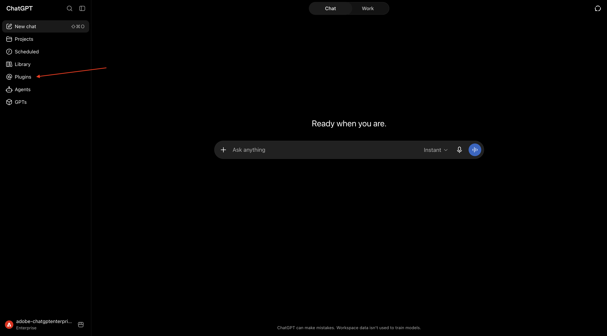
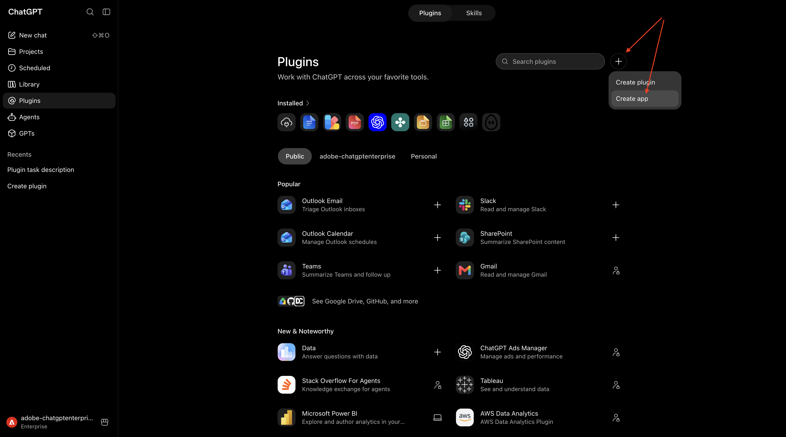
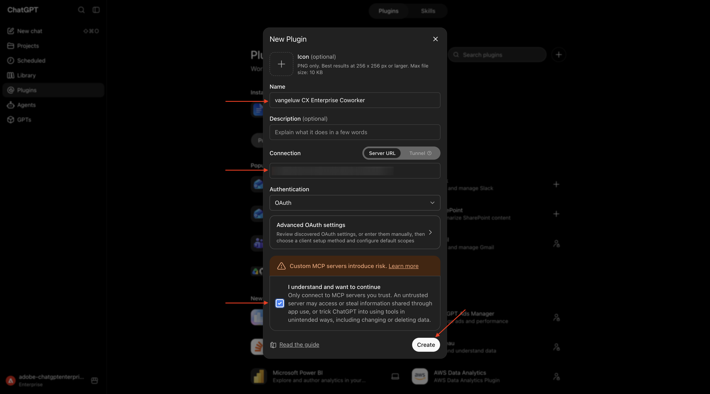
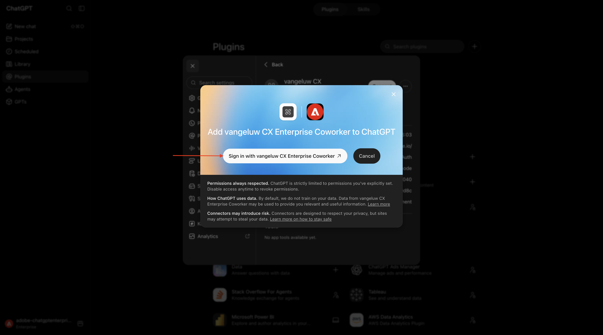
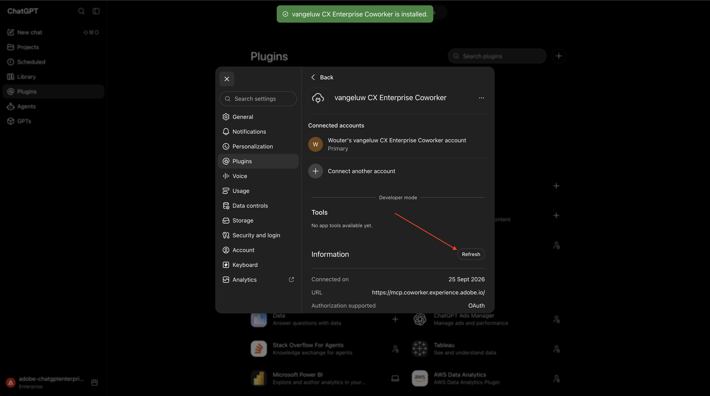
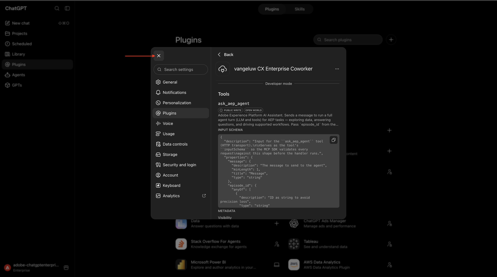
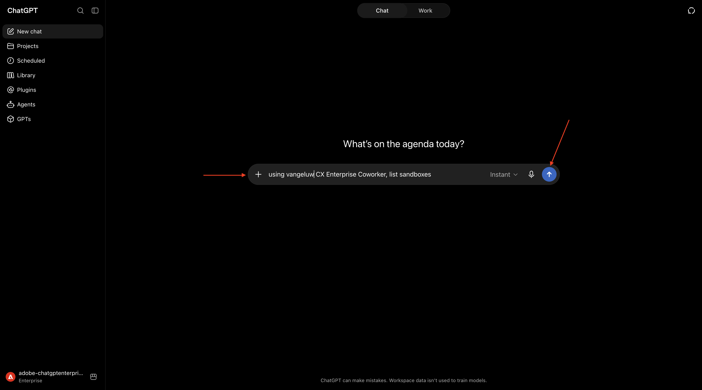
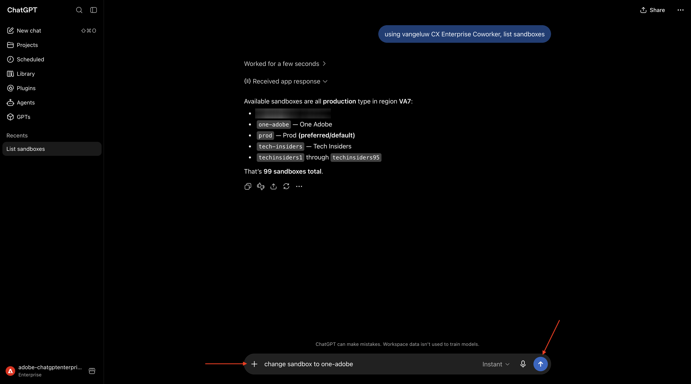
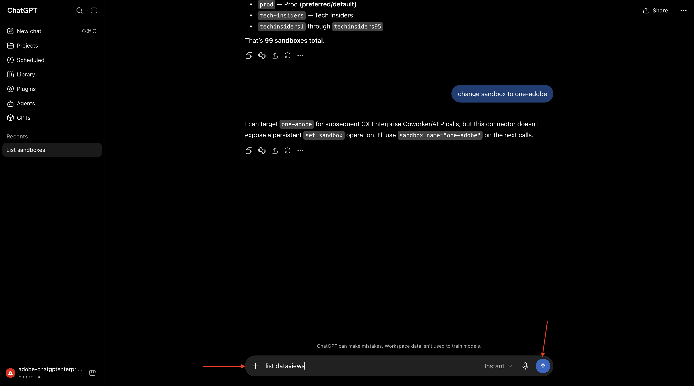
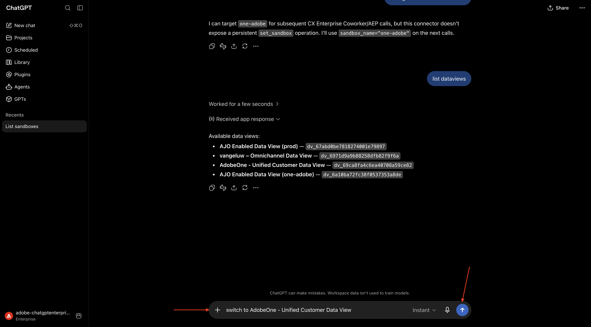

# 1.2.5 CX Enterprise Coworker with ChatGPT Enterprise

[!BADGE Beta]

+++Beta Details
By using the CX Enterprise Coworker with ChatGPT Enterprise Beta, You hereby acknowledge that the Beta is provided "as is" without warranty of any kind. Adobe shall have no obligation to maintain, correct, update, change, modify or otherwise support the Beta. You are advised to use caution and not to rely in any way on the correct functioning or performance of such Beta and/or accompanying materials. The Beta is considered Confidential Information of Adobe.  Any "Feedback" (information regarding the Beta including but not limited to problems or defects you encounter while using the Beta, suggestions, improvements, and recommendations) provided by You to Adobe is hereby assigned to Adobe including all rights, title, and interest in and to such Feedback.

+++


>[!IMPORTANT]
>
>Before you begin, read the below instructions!

## Instructions for in-person workshops

For this exercise, you need to use:

- **Instance**: **Adobe Tech Insiders**
- **Sandbox**: **One Adobe**
- **Dataview**: **AdobeOne - Unified Customer Data View**
- **Username**: **adobetechinsiders-XXX@adobeeventlab.com** and replace XXX by the number that was assigned to you
- **Password**: use the password that was shared with you

## 1.2.5.1 Install the custom MCP server for CX Enterprise Coworker

>[!NOTE]
>
>Using CX Enterprise Coworker in ChatGPT requires the following:
>- a paid version of OpenAI's ChatGPT Enterprise
>- using the ChatGPT Enterprise web client

Go to [https://chatgpt.com/](https://chatgpt.com/) and log in using your account details. Once you're logged in, you should see this. Go to **Plugins**.



Click the **+** icon.



Enter the following information:

- **Name**: `CX Enterprise Coworker`
- **Connection**: enter the URL provided to you by your Adobe contact
- **Authentication**: select `OAuth`
- check the box in front of **I understand and want to continue**

Click **Create**.



Click **Sign in with CX Enterprise Coworker**.



ChatGPT will now attempt to connect to your Adobe account. After successfully logging in with your Adobe account, you should see this. Click **Refresh**.



You should then see this. Close this window and open a new chat.



## 1.2.5.2 Set context in CX Enterprise Coworker

Before interacting further with Adobe Marketing Agent through ChatGPT, the context needs to be set.

For this exercise, the context needs to be set to use:

- **IMS Org**: `--aepImsOrgName--`.

- **Sandbox**: **Prod - One Adobe**

The Sandbox setting helps to identify which sandbox ChatGPT should look at when asking questions.

- **Dataview**: **AdobeOne - Unified Customer Data View**

The Dataview setting helps to identify which dataview ChatGPT should look at when asking questions.

Open a new chat. Enter the following **Prompt** and click the **send** button.

```
using CX Enterprise Coworker, change organization to Adobe Tech Insiders 
```



You should then see this. Enter the following **Prompt** and click the **send** button.

```
change sandbox to One Adobe
```



You should then see this. Enter the following **Prompt** and click the **send** button.

```
list dataviews
```



You should then see this. Enter the following **Prompt** and click the **send** button.

```
switch to AdobeOne - Unified Customer Data View
```



Your context is now properly set, so you can start sending specific prompts next.

You've now completed this lab.

## Next Steps

Go to [CX Enterprise Coworker and AEM](./ex6.md){target="_blank"}

Go Back to [CX Enterprise Coworker](./coworker.md){target="_blank"}

[Go Back to All Modules](./../../../overview.md){target="_blank"}