# 1.4.1 Getting started with Brand Concierge

## Video

In this video, you'll get an explanation and demonstration of all the steps involved in this exercise.

## 1.4.1.1 Brand Concierge overview

While configuring Brand Concierge, the 2 main elements you'll be using are:

- **Agent Composer (Configuration Layer)**
  
  Purpose: The primary UI platform used to build and configure conversational AI experiences.

  Key Responsibilities:

  - Define and manage data sources and knowledge bases
  - Set brand expression (tone, style, guardrails)
  - Setup the meeting booking agent

- **Agent Orchestrator (Execution Engine)**

  Purpose: The reasoning and orchestration engine that interprets user requests and executes the appropriate agent actions.

  Key Responsibilities:

  - Interpret natural language user intents
  - Generate and execute multi-step reasoning plans
  - Select and invoke appropriate operators/tools
  - Enforce brand context, compliance, and guardrails
  - Coordinate multi-agent workflows
  - Aggregate and compose responses from multiple data sources

- **Brand Concierge Conversation Runtime (Service Layer)**

  Purpose: The customer-facing conversational service layer that manages chat sessions, context, and client interactions.

  Key Components:

  - Web Agent (Client): Browser or mobile chat UI integrated using the Web SDK
  - Conversation Service (Backend): Manages session state and acts as the orchestration gateway

  Key Responsibilities:

  - Manage user sessions and conversation transcripts
  - Handle user authentication and profiles
  - Route messages between the client and the Agent Orchestrator
  - Persist conversation context
  - Log behavioral and operational events to AEP for analytics
  - Apply surface-specific configurations

## 1.4.1.2 Brand Concierge instance configuration

To start creating your own Brand Concierge instance, follow the below steps.

Go to [https://experience.adobe.com/](https://experience.adobe.com/){target="_blank"}. Open **Brand Concierge**.

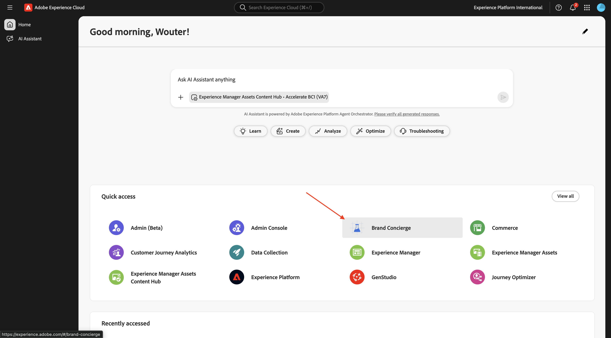

You should then see this. Click the **sandbox selection** menu.

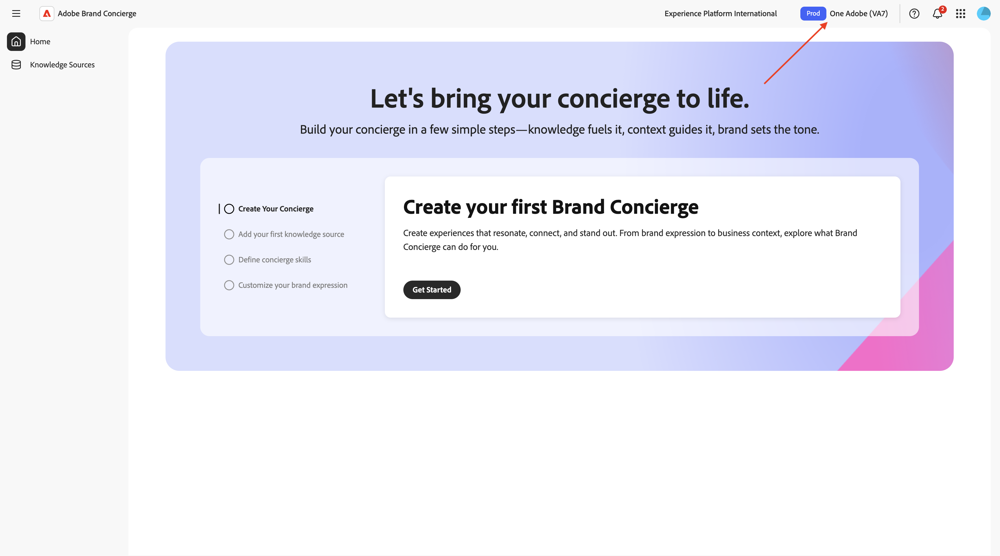

Choose the sandbox that has been assigned to you. That sandbox should be named `--aepUserLdap--`.

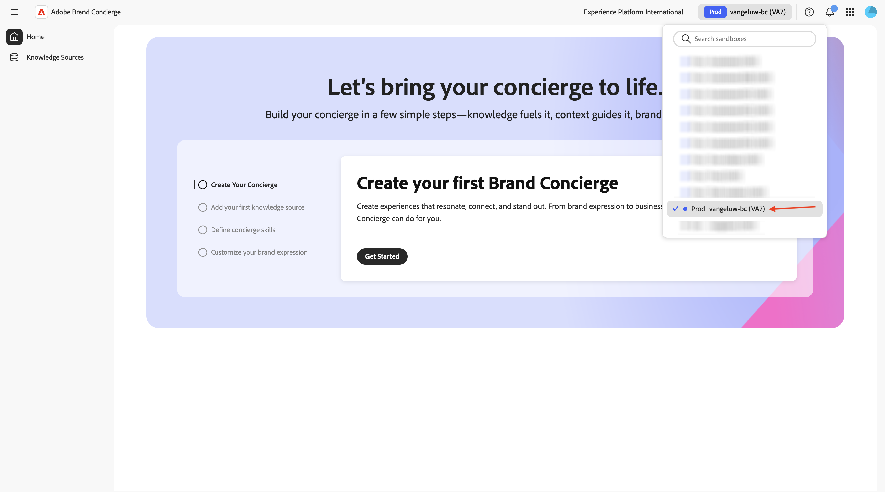

Click **Get Started**.

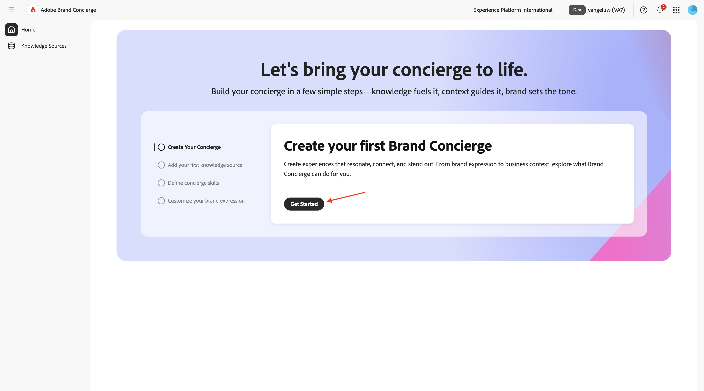

For the name of your Brand Concierge instance, use: `--aepUserLdap-- - CitiSignal Brand Concierge`.

Enter the following text under **What would you like the concierge to do?**.

```javascript
Brand Concierge should help customers find their best device, plan or entertainment deal. Brand Concierge should help users discover internet plans, entertainment deals,  and help find the best available packages. Brand Concierge should also answer questions about devices such as phones and watches.
```

Click **Create**.

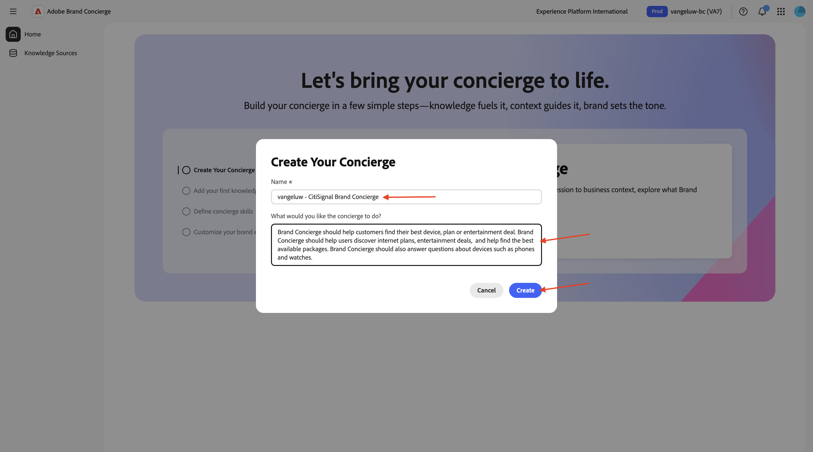

You should then see this. Click **Get Started** to add a knowledge source.

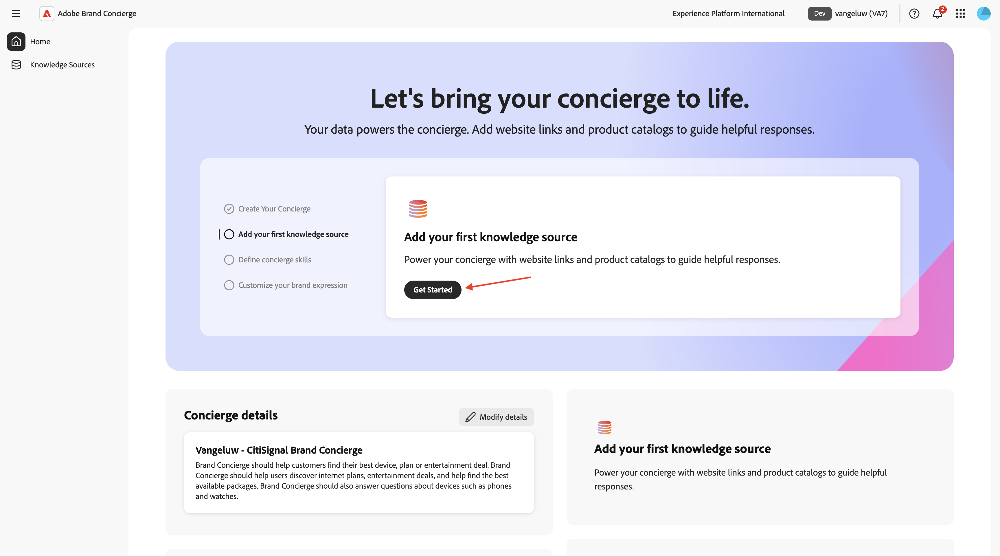

Select **Website Links** and click **Continue**.

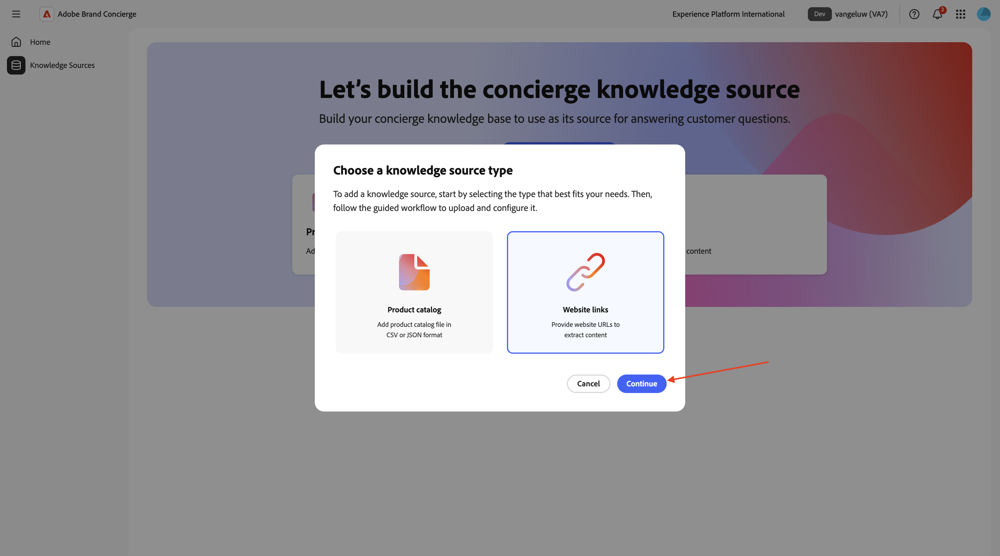

You should then see this. Enter `CitiSignal website` as name for your knowledge source. 

You now need to upload a csv file that contains the links of your website. Download [CitiSignal website links CSV file](./assets/citisignal-website-links.csv) to your desktop.

Click **Browse Files**.

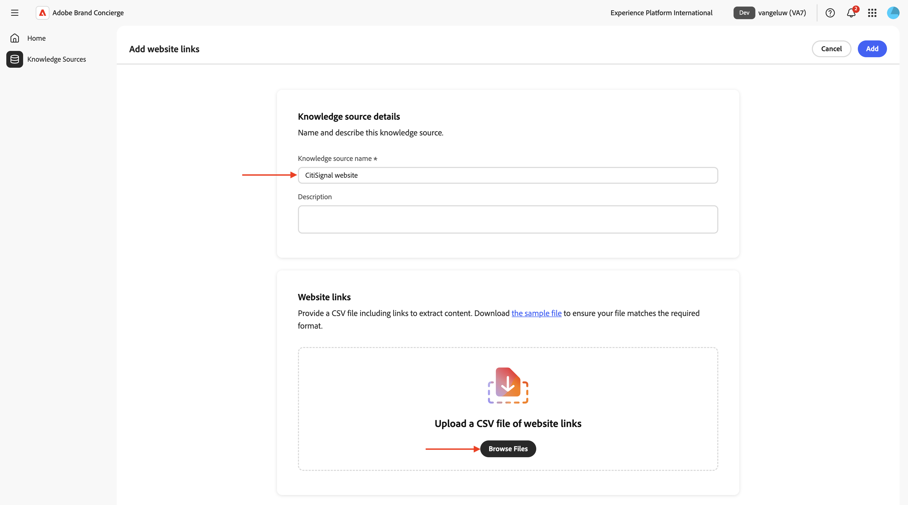

Open the file **citisignal-website-links.csv** and update the links to point to your own CitiSignal website.

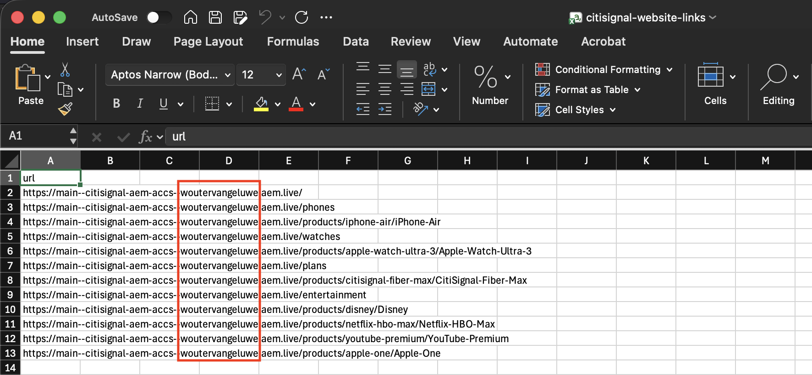

Select the file **citisignal-website-links.csv** that you just downloaded and edited. Click **Open**.

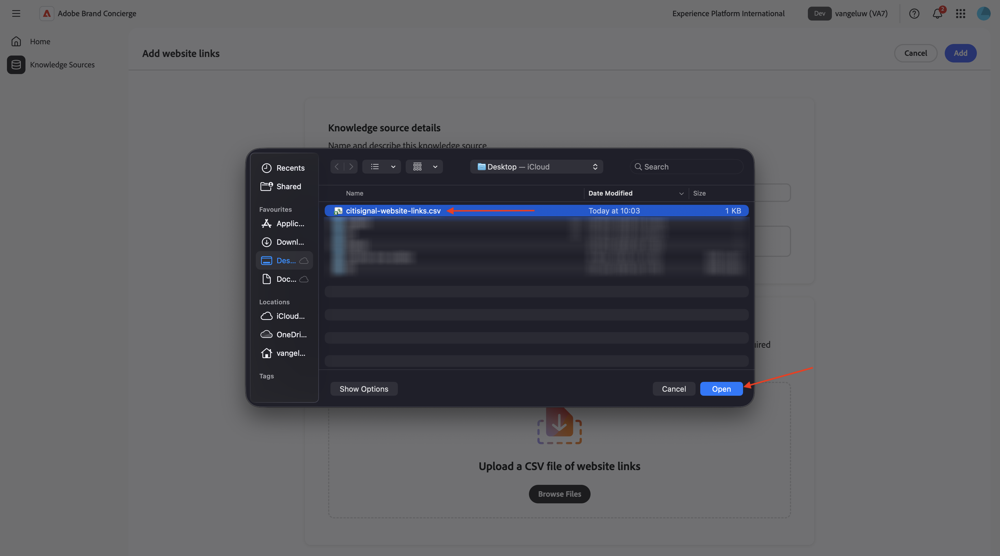

Your file is now added to this knowledge source. Click **Add**.

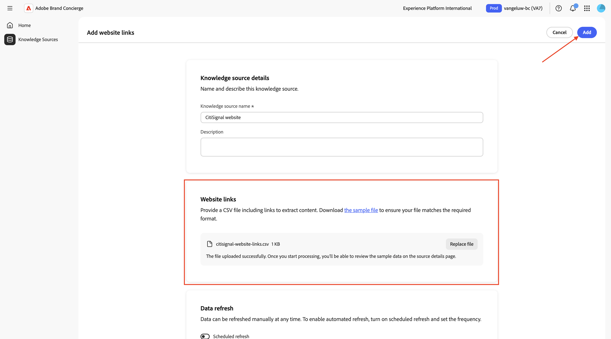

You should then see this. Click **Take me home**.

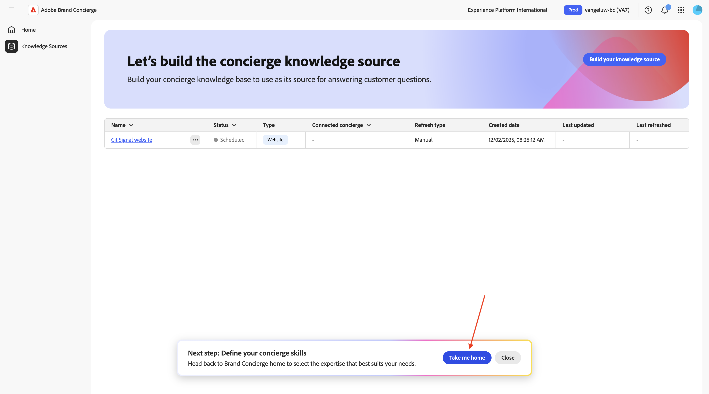

You should then see this. Click **Get Started** on the **Product advisory for consumers** card.

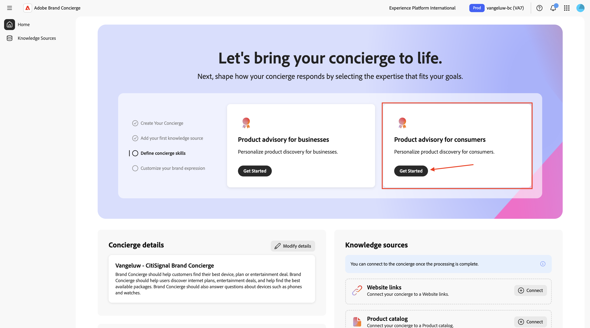


```
CitiSignal is a telecommunications company that sells devices such as phones and watches and that sells internet services such as their lead product CitiSignal Fiber Max. On top of that, CitiSignal sells entertainment services that offer premium streaming services at a discounted price. CitiSignal is targeting these 3 personas primarily: Smart Home Families, Online Gamers and Remote Professionals.
```

```
Prioritize positioning the CitiSignal Fiber Max offering.
```

```
Competitor pricing, competitor products
```

Your updates are automatically saved. Click the **arrow** to go back to the previous screen.

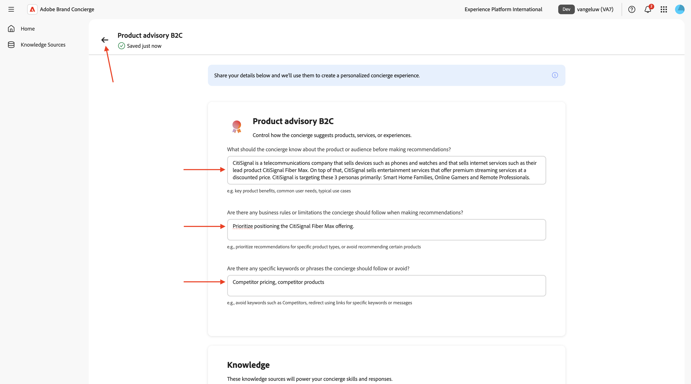

You should then see this. Click **Get Started** to customize your brand expression.

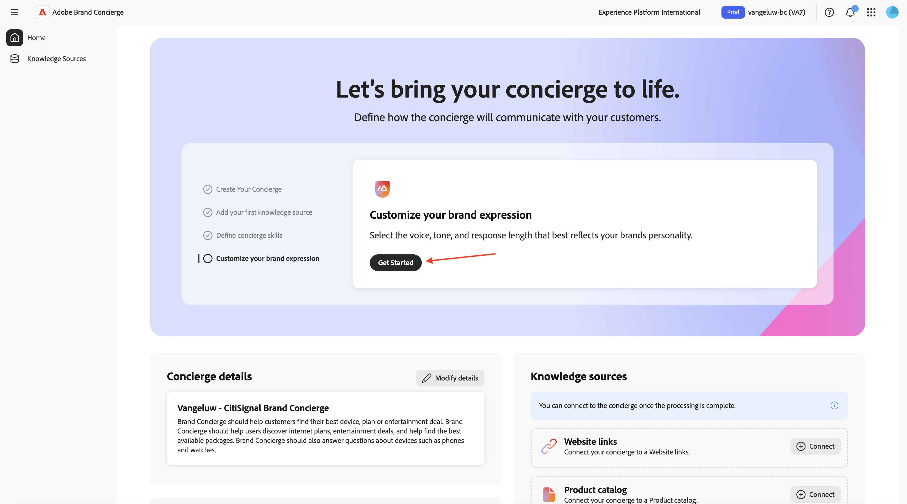

You can make your own choices on the **Brand expression** page.

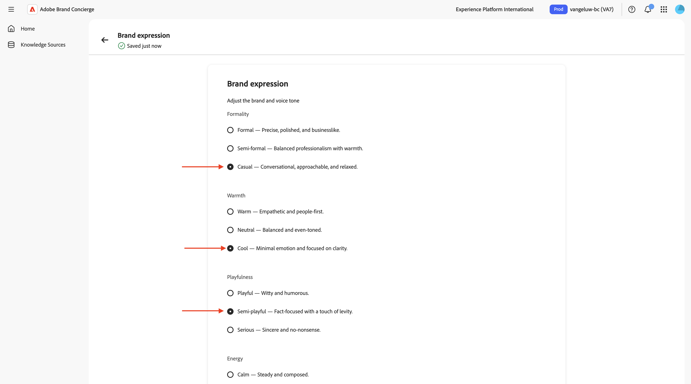

Scroll down and select any setting for the field **Response length**.

Your updates are automatically saved. 

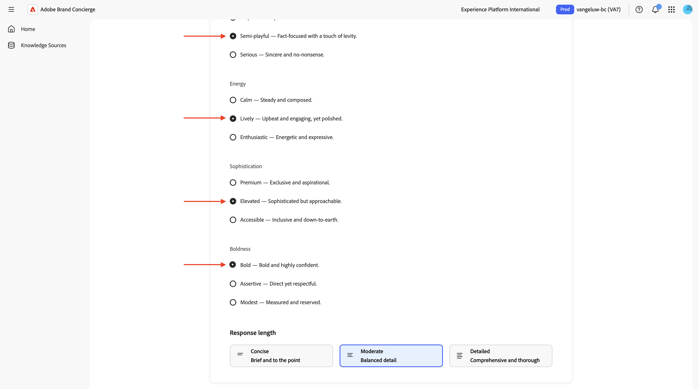

Scroll up and click the **arrow** to go back to the previous screen.

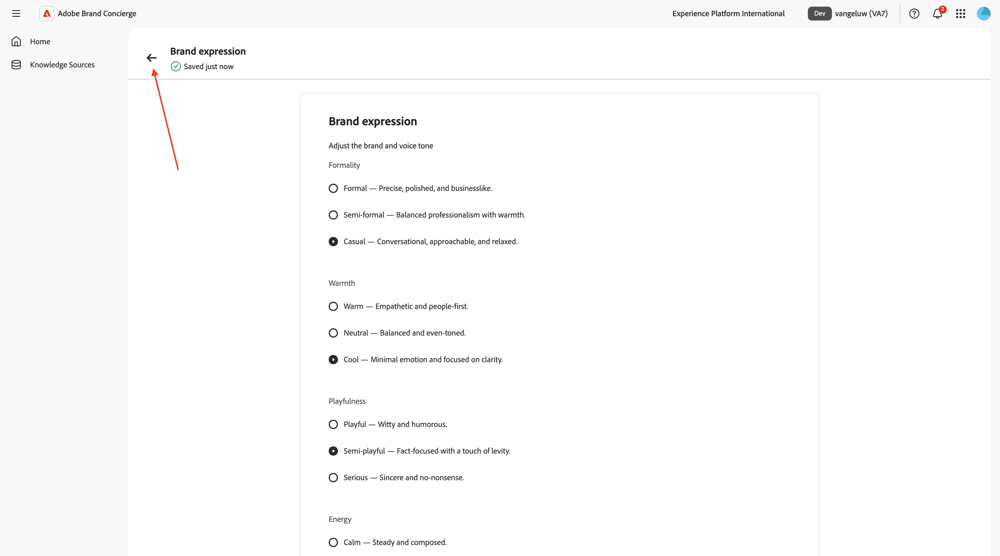


Go Back to [Brand Concierge](./brandconcierge.md){target="_blank"}

[Go Back to All Modules](./../../../overview.md){target="_blank"}