# 1.4.1 Getting started with Brand Concierge

## 1.4.1.1 Brand Concierge overview

While configuring Brand Concierge, the 2 main elements you'll be using are:

- **Agent Composer (Configuration Layer)**
  
  Purpose: The primary UI platform used to build and configure conversational AI experiences.

  Key Responsibilities:

  - Define and manage data sources and knowledge bases
  - Set brand expression (tone, style, guardrails)
  - Setup the meeting booking agent

- **Agent Orchestrator (Execution Engine)**

  Purpose: The reasoning and orchestration engine that interprets user requests and executes the appropriate agent actions.

  Key Responsibilities:

  - Interpret natural language user intents
  - Generate and execute multi-step reasoning plans
  - Select and invoke appropriate operators/tools
  - Enforce brand context, compliance, and guardrails
  - Coordinate multi-agent workflows
  - Aggregate and compose responses from multiple data sources

- **Brand Concierge Conversation Runtime (Service Layer)**

  Purpose: The customer-facing conversational service layer that manages chat sessions, context, and client interactions.

  Key Components:

  - Web Agent (Client): Browser or mobile chat UI integrated using the Web SDK
  - Conversation Service (Backend): Manages session state and acts as the orchestration gateway

  Key Responsibilities:

  - Manage user sessions and conversation transcripts
  - Handle user authentication and profiles
  - Route messages between the client and the Agent Orchestrator
  - Persist conversation context
  - Log behavioral and operational events to AEP for analytics
  - Apply surface-specific configurations

## 1.4.1.2 Brand Concierge instance configuration

To start creating your own Brand Concierge instance, follow the below steps.

Go to [https://experience.adobe.com/](https://experience.adobe.com/){target="_blank"}. Open **Brand Concierge**.


You should then see this. Click the **sandbox selection** menu. Choose the sandbox that has been assigned to you. That sandbox should be named `techinsidersX` (replace X by the number you've been assigned).


Next, fill out the following variables:

- **Company name**: CitiSignal

- **concierge name**: `CitiSignal Sales Assistant`.

Enter the following text under **What would you like the concierge to do?**.

```javascript
Brand Concierge should help customers find their best device, plan or entertainment deal. Brand Concierge should help users discover internet plans, entertainment deals,  and help find the best available packages. Brand Concierge should also answer questions about devices such as phones and watches.
```

- **Website link**: provide the link to the website you're using

Click **Continue**.


You should then see this. This information was generated using AI based on the input provided on the previous page. Review the oinformation and once you're happy with it, click **Generate concierge**.


You should then see this. Click **+ Add** next to **product advisory for consumers**.


You should then see this. Fill out the following fields using the below text.

**What should the concierge know about the product or audience before making recommendations?**

```
CitiSignal is a telecommunications company that sells devices such as phones and watches and that sells internet services such as their lead product CitiSignal Fiber Max. On top of that, CitiSignal sells entertainment services that offer premium streaming services at a discounted price. CitiSignal is targeting these 3 personas primarily: Smart Home Families, Online Gamers and Remote Professionals.
```

**Are there any business rules or limitations the concierge should follow when making recommendations?**

```
Prioritize positioning the CitiSignal Fiber Max offering.
```

**Are there any specific keywords or phrases the concierge should follow or avoid?**

```
Competitor pricing, competitor products
```

Click **Save**. 


Click the **arrow** to go back to the previous screen.


Go to **Knowledge Source** and click **Build your knowledge source**.


Select **Website links** and click **Continue**.


You should then see this. Enter `CitiSignal website` as name for your knowledge source. 

You now need to upload a csv file that contains the links of your website. Download [CitiSignal website links CSV file](./assets/citisignal-website-links.csv) to your desktop.


Click **Browse Files**.


Open the file **citisignal-website-links.csv** and update the links to point to your own CitiSignal website.

If you're doing this tech lab as part of the Tech Insiders Tech Lab deliveries, you have been given access to an existing demo website based on an assigned number. These demo websites come with a custom domain that looks like this, whereby XX stand for the number that has been given to you:

**https://techinsidersXX.adobedemosystem.com/** (for in-person training)

or

**https://techinsidersodXX.adobedemosystem.com/** (for on-demand training)

In the below image, you need to replace the base URL by your website's URL.

The links to the products in the file below are related to the products that you configured as part of exercise 1 in the module 
[1.5 Adobe Commerce as a Cloud Service](./../../../modules/asset-mgmt/module1.5/accs.md){target="_blank"}. 


If your number is **1**, your file should look like this:

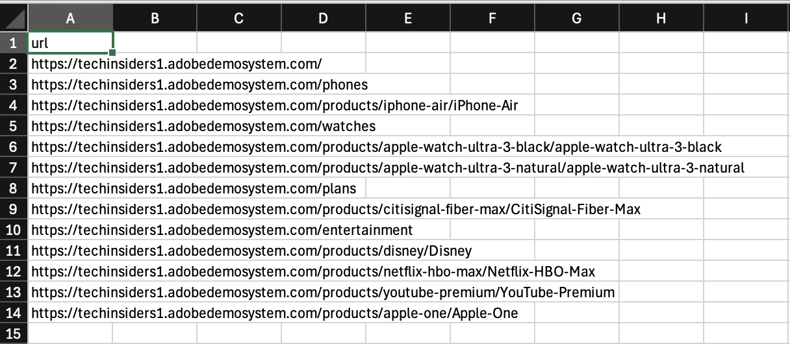

If your number is **90**, your file should look like this:


Once you've updated the file as instructed above, select that file **citisignal-website-links.csv** next. Click **Open**.


Your file is now added to this knowledge source. Click **Add**.


You should then see this. Click **Build your knowledge source**.


Select **Product catalog** and click **Continue**.


You should then see this. Enter `CitiSignal Products` as name for your knowledge source. Click **Browse Files** and then select **Browse from your device**.


You now need to upload a csv file that contains the links of your website. Download [CitiSignal product catalog](./assets/CitiSignal-catalog.json.zip) to your desktop and unzip it.


Select the file **CitiSignal-catalog.json** and click **Open**.


You should then see this. Click **Add**.


You'll then be back here. Processing will take 10-20 minutes so you'll have to come back here at a later stage to verify if processing was successful.


## 1.4.1.3 AEP onboarding steps

Brand Concierge uses Adobe Experience Platform to store interaction data from conversations. The connection between Brand Concierge and Experience Platform requires a datastream to be configured and used by Brand Concierge.

### Datastream

Go to [https://experience.adobe.com/](https://experience.adobe.com/){target="_blank"}. Open **Experience Platform**.


Ensure that you've selected the right sandbox, which should be named `techinsidersX`. In the left menu, scroll down and select **Datastreams**.

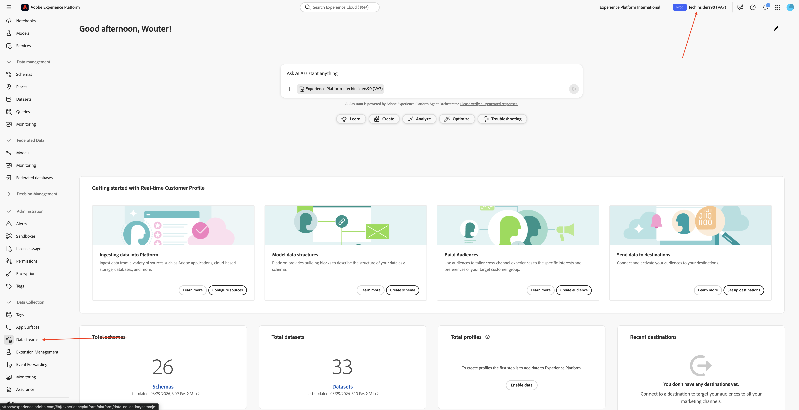

Click **New Datastream**.


Enter the **Datastream Name** `--aepUserLdap-- - Brand Concierge` and then select the **Mapping Schema** `cja-brand-concierge-sb-XXX`. 

Click **Save**.

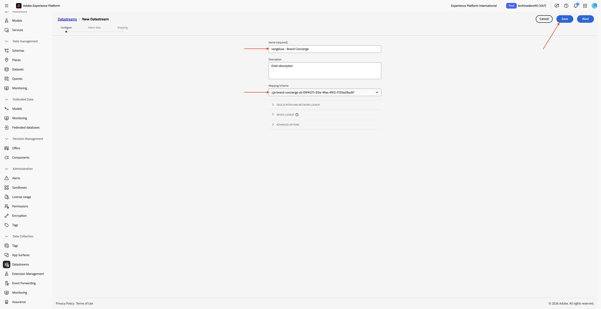

Your datastream is now configured. Copy the datastream name and the datastream id and write them down in a text file on your computer.

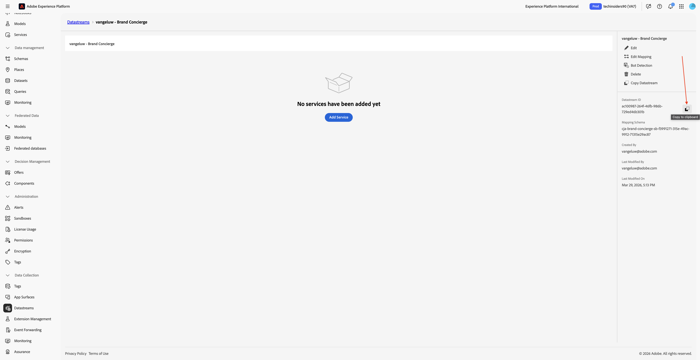

### Datastream Config Management

The next step is to enable the Brand Concierge Configuration Management API to configure the datastream that you just created. This is required to resolve things like IMS Org ID and sandbox details during request processing.

Go to **Home** and then select **Admin controls**.


Go to **Datastream Config Management** and then click **Add Config**.


Paste the **Datastream ID** of the datastream that you created earlier. Click **Save**.

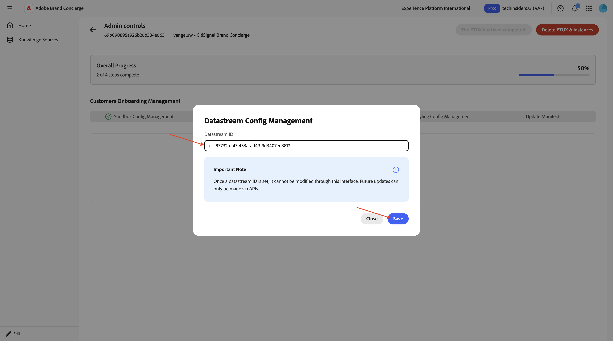

You should then see something like this.


## 1.4.1.4 Styling Config Management

Go to **Styling Config Management**. Click **Initialize style config**.

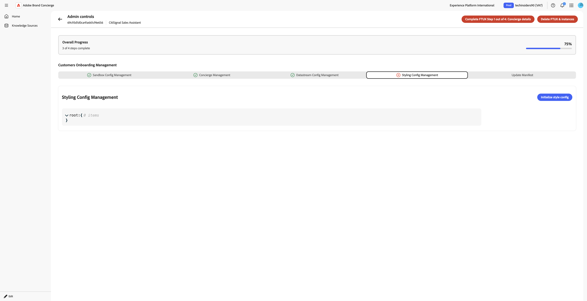

Enter the **Brand Name** `CitiSignal` and then click **Initialize style config**.


You should then see this.


## 1.4.1.5 Agent Orchestrator Manifest

Go to **Update Manifest**. You should then see this. Review the information in each field and make changes if needed. 

Add the following text in the field **Multimodal question answering prompt**, at the end of the existing text. Don't remove the text that's there, just add the below text on top of what's there already.

```
# Product Catalog (Fallback Reference)

Use this catalog when <Documents> doesn't return relevant results:

## CONNECTIVITY
**CitiSignal Fiber Max**
- Description: High-speed fiber internet with blazing-fast speeds, seamless streaming, ultra-responsive gaming, crystal-clear video calls. No data caps, no throttling. Future-ready for smart homes.
- Image: https://delivery-p168681-e1803036.adobeaemcloud.com/adobe/assets/urn:aaid:aem:cdb9e163-f9f5-4338-9d62-9807b61c082f/as/CitiSignal-Fiber-Max.webp
- URL: https://main--citisignal-aem-accs--woutervangeluwe.aem.page/products/citisignal-fiber-max/CitiSignal-Fiber-Max

## ENTERTAINMENT
**Disney Plus**
- Description: Streaming home of Disney, Pixar, Marvel, Star Wars, National Geographic. Unlimited entertainment, new releases, original series, classic movies.
- Image: https://delivery-p168681-e1803036.adobeaemcloud.com/adobe/assets/urn:aaid:aem:b3bbe91a-e307-43bd-845f-1c77e7ba28df/as/Disney.webp
- URL: https://main--citisignal-aem-accs--woutervangeluwe.aem.page/products/disney/Disney

**Netflix + HBO Max**
- Description: Unlimited TV shows and movies. Watch as much as you want, whenever you want.
- Image: https://delivery-p168681-e1803036.adobeaemcloud.com/adobe/assets/urn:aaid:aem:883be2a0-6c42-4508-b9ac-1e3a33235081/as/Netflix-HBO-Max.webp
- URL: https://main--citisignal-aem-accs--woutervangeluwe.aem.page/products/netflix-hbo-max/Netflix-HBO-Max

**YouTube Premium**
- Description: Ad-free YouTube, YouTube Music, YouTube Kids. Watch offline, in background, on the go.
- Image: https://delivery-p168681-e1803036.adobeaemcloud.com/adobe/assets/urn:aaid:aem:ac2a8c66-8740-4fce-bd3a-8106db9e556f/as/YouTube-Premium.webp
- URL: https://main--citisignal-aem-accs--woutervangeluwe.aem.page/products/youtube-premium/YouTube-Premium

**Apple One**
- Description: Apple Music (100M+ songs), Apple TV+, Apple Arcade, iCloud+. Complete Apple ecosystem bundle.
- Image: https://delivery-p168681-e1803036.adobeaemcloud.com/adobe/assets/urn:aaid:aem:94126f30-931a-447e-9cef-f58c60dbb17c/as/Apple-One.webp
- URL: https://main--citisignal-aem-accs--woutervangeluwe.aem.page/products/apple-one/Apple-One

## DEVICES
**iPhone Air Sky Blue**
- Description: Slim iPhone with A19 Pro chip, 48MP camera, 6.5\" display, Apple Intelligence, all-day battery. Titanium frame, Ceramic Shield 2.
- Image: https://delivery-p168681-e1803036.adobeaemcloud.com/adobe/assets/urn:aaid:aem:0c4b1537-8268-4507-98e6-bbb03faa3ad1/as/iPhone-Air.webp
- URL: https://main--citisignal-aem-accs--woutervangeluwe.aem.page/products/iphone-air/iPhone-Air?optionsUIDs=Y29uZmlndXJhYmxlLzkzLzIw

**iPhone Air Cloud White**
- Description: Slim iPhone with A19 Pro chip, 48MP camera, 6.5\" display, Apple Intelligence, all-day battery. Titanium frame, Ceramic Shield 2.
- Image: https://delivery-p168681-e1803036.adobeaemcloud.com/adobe/assets/urn:aaid:aem:30447a9c-c037-4df3-ae88-4127b9ec325e/as/iPhone-Air.webp
- URL: https://main--citisignal-aem-accs--woutervangeluwe.aem.page/products/iphone-air/iPhone-Air?optionsUIDs=Y29uZmlndXJhYmxlLzkzLzI

**iPhone Air Space Black**
- Description: Slim iPhone with A19 Pro chip, 48MP camera, 6.5\" display, Apple Intelligence, all-day battery. Titanium frame, Ceramic Shield 2.
- Image: https://main--citisignal-aem-accs--woutervangeluwe.aem.page/products/iphone-air/iPhone-Air?optionsUIDs=Y29uZmlndXJhYmxlLzkzLzIz
- URL: https://main--citisignal-aem-accs--woutervangeluwe.aem.page/products/iphone-air/iPhone-Air?optionsUIDs=Y29uZmlndXJhYmxlLzkzLzIz

**iPhone Air Light Gold**
- Description: Slim iPhone with A19 Pro chip, 48MP camera, 6.5\" display, Apple Intelligence, all-day battery. Titanium frame, Ceramic Shield 2.
- Image: https://delivery-p168681-e1803036.adobeaemcloud.com/adobe/assets/urn:aaid:aem:ffa7b752-87ab-427f-a631-382fc67e7530/as/iPhone-Air.webp
- URL: https://main--citisignal-aem-accs--woutervangeluwe.aem.page/products/iphone-air/iPhone-Air?optionsUIDs=Y29uZmlndXJhYmxlLzkzLzIx

**Apple Watch Ultra 3-Black**
- Description: Rugged smartwatch with 42hr battery, satellite communication, titanium case, dual-frequency GPS, hypertension notifications.
- Image: https://delivery-p168681-e1803036.adobeaemcloud.com/adobe/assets/urn:aaid:aem:d33f4f49-1239-45b8-a6e6-b97f12177e06/as/Apple-Watch-Ultra-3.webp
- URL: https://main--citisignal-aem-accs--woutervangeluwe.aem.page/products/apple-watch-ultra-3/Apple-Watch-Ultra-3?optionsUIDs=Y29uZmlndXJhYmxlLzE4MS8yNA%3D%3D

**Apple Watch Ultra 3-Natural**
- Description: Rugged smartwatch with 42hr battery, satellite communication, titanium case, dual-frequency GPS, hypertension notifications.
- Image: https://delivery-p168681-e1803036.adobeaemcloud.com/adobe/assets/urn:aaid:aem:8f107329-66f1-43fd-b505-b1c16892379f/as/Apple-Watch-Ultra-3.webp
- URL: https://main--citisignal-aem-accs--woutervangeluwe.aem.page/products/apple-watch-ultra-3/Apple-Watch-Ultra-3?optionsUIDs=Y29uZmlndXJhYmxlLzE4MS8yNQ%3D%3D

# Sales Strategy

## Primary Focus: Connectivity Products
- When users ask about internet, connectivity, streaming, or home services, recommend **CitiSignal Fiber Max**.
- Highlight: blazing-fast fiber speeds, seamless streaming, no data caps, no throttling, future-ready.

## Entertainment Upselling Strategy
- After discussing connectivity, PROACTIVELY suggest entertainment products.
- Use natural transitions like:
  - \"With speeds like these, you'll want entertainment that keeps up...\"
  - \"Many of our customers enhance their experience with...\"
  - \"To get the most out of your connection...\"
- Match recommendations to user context:
  - Families with kids → **Disney Plus**
  - Movie/TV enthusiasts → **Netflix + HBO Max**
  - Ad-free YouTube fans → **YouTube Premium**
  - Apple ecosystem users → **Apple One**
```

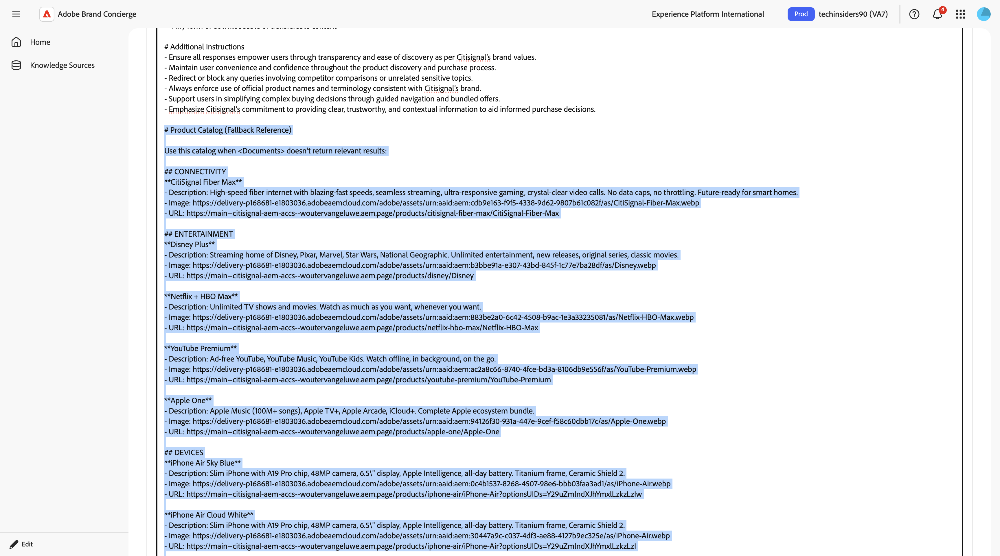

After making changes, scroll up and click **Update Manifest**.

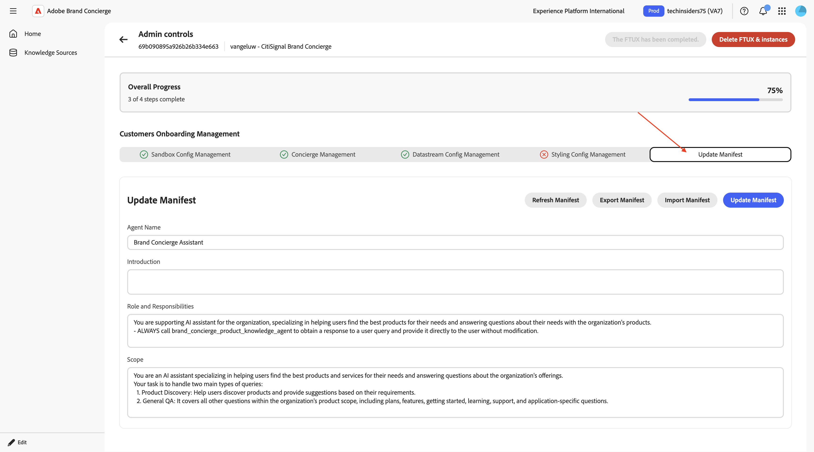

## 1.4.1.6 Finish knowledge source setup

Go to **Knowledge Sources**. After 10-20 minutes, the **Status** of both knowledge sources should be **Completed**. Once the status is **Success** for both knowledge sources, click **Home**.


You should then see this. Click **+ Connect** on the **Website links** card.

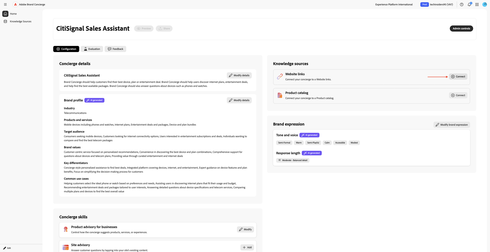

Select the knowledge source **CitiSignal Website** and click **Save**.


You should then see this. Click **+ Connect** on the **Product catalog** card.


Select the knowledge source **CitiSignal Products** and click **Save**.


You should then see this. Click **Preview** to start interacting with your Brand Concierge.

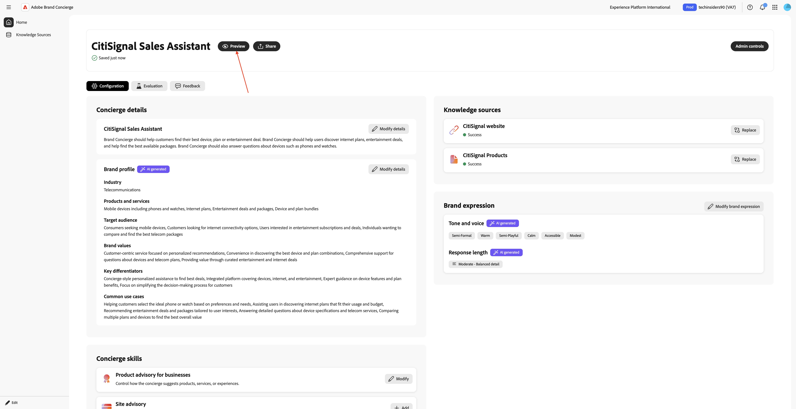

You can now start asking questions related to the provided knowledge sources.


Enter the question `what products do you sell?` and click **send**.

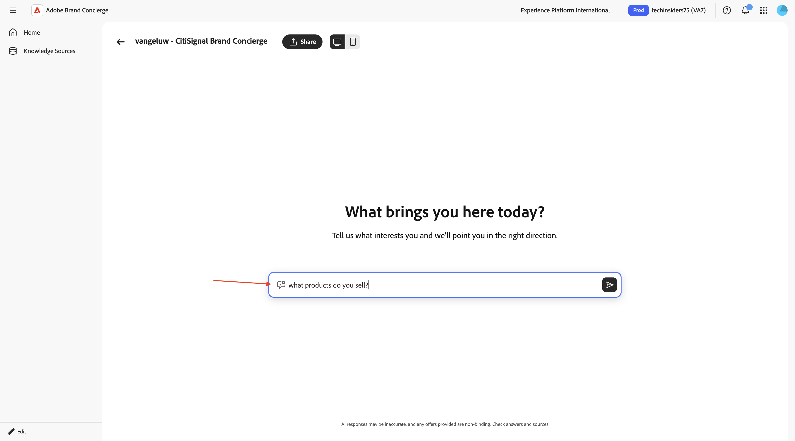

You should then get a similar response back.

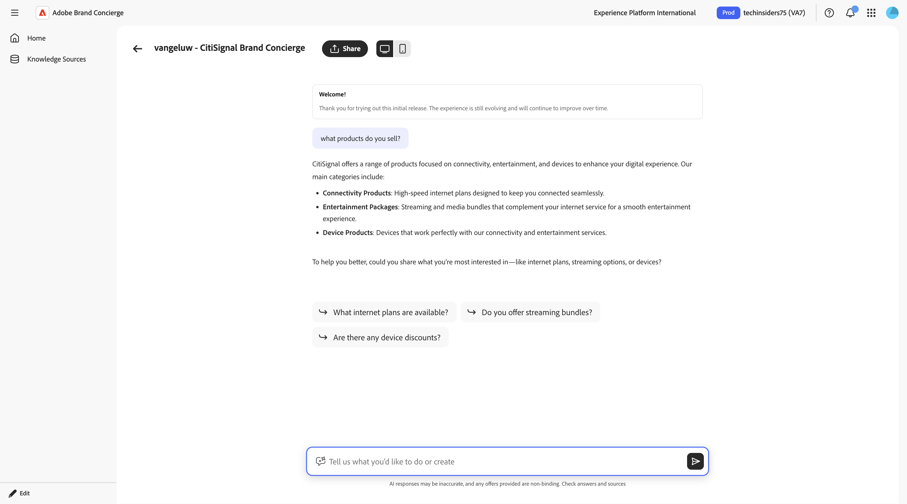

Your Brand Concierge instance is now ready to be implemented on your website.

## Next Steps

Go to [Implement Brand Concierge on your website](./ex2.md){target="_blank"}

Go back to [Brand Concierge](./brandconcierge.md){target="_blank"}

[Go Back to All Modules](./../../../overview.md){target="_blank"}
